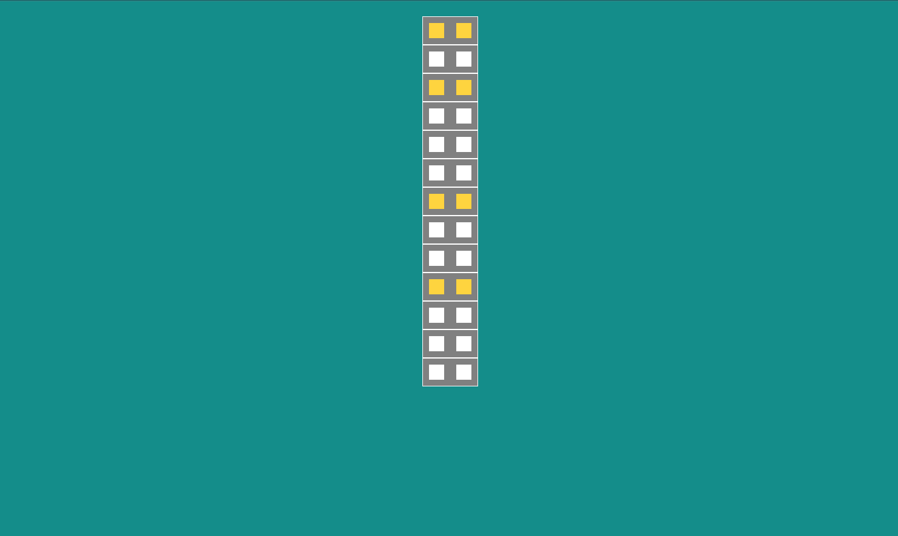

## Objectif

En CSS l'essentiel du positionnement ce gère avec les propriétés flexbox (`display: flex;`, `justify-content`, `align-items`, `flex-direction` ...).
Ces propriétés sont relativement simples mais demandent pas mal de pratique pour être bien comprises et maitrisées.
C'est l'objectif de ces gammes d'exercices. Un peu dans l'esprit d'un musicien qui doit réviser ses gammes, ces taches
vous feront réalisés des séries d'exercices pour pratiquer.

## Cours associés

II - 1/ Positionnement

## Definition of Done

_Une tache est considérée comme complétée lorsque chacune des sous-taches de cette section ont été complétées._

Pour **chacune** des maquettes:

- [ ] La maquette est bien reproduite

SHORTCODE-CODE-QUALITY

## Q&A

_Cette section sera complétée par votre formateur lors de la review des taches._
