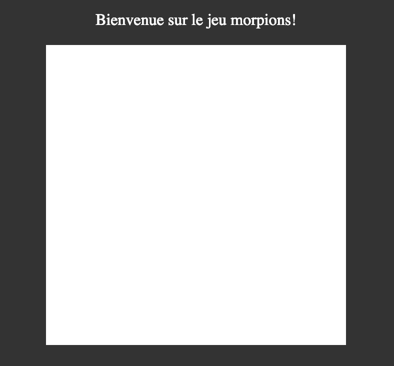
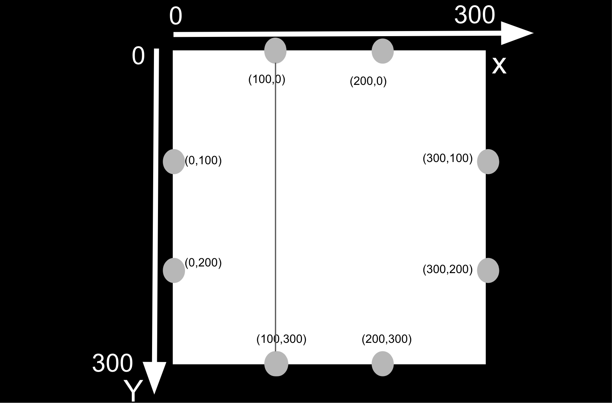
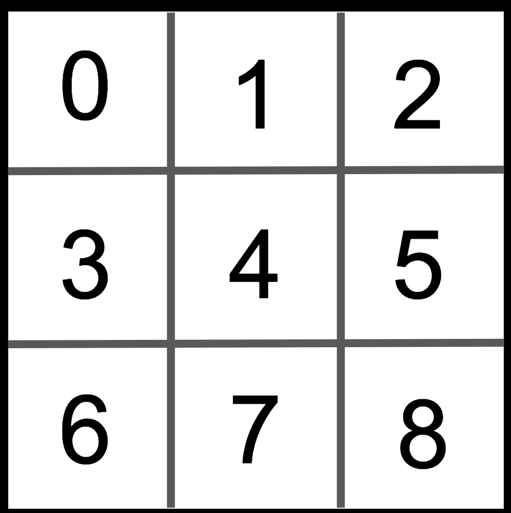

# Les Canvas


Nous allons découvrir ensemble comment manier l'élément HTML `<canvas>` en créant une grille de jeu de morpions. 

`<canvas>` est une zone dans laquelle il va être possible de dessiner au moyen du JavaScript. Cet élément fait son apparition dans la spécification HTML5, mais existe depuis plusieurs années déjà. Il a été développé par Apple pour son navigateur Safari. Firefox a été un des premiers navigateurs à l'implémenter, suivi par Opera et Chrome. Les dernières versions d'Internet Explorer supportent également cet élément.


## Le tutoriel

### 1) Affichage de l'élément `canvas` 

`<canvas>` est un nouvel élément HTML qui peut être utilisé pour dessiner des éléments graphiques à l'aide de scripts (habituellement JavaScript).

Un élément canvas basique délimite une zone sur la page dans laquelle nous allons pouvoir dessiner pour créer notre jeu de morpions.

```html
//exemple classique de canvas
<canvas width="300" height="300"></canvas>
```

L'élément canvas est défini par deux attributs:
- la largeur: *width*
- la hauteur: *height* 

Ces deux élément définissent la taille que va prendre l'élément canvas sur l'écran. L'unité utilisé est le pixel. Dans notre précédent exemple le canvas aura donc une longueur de 300 pixels et une hauteur de 300 pixels.

Essayons d'afficher notre élément canvas dans un navigateur. Nous allons créer un dossier `tutoriel morpion` dans lequel nous allons créer un fichier `index.html` qui contiendra le code HTML de notre jeu de morpions.


```html
<!-- index.html -->
<!doctype html>
<html lang="en">
    <head>
        <meta charset="utf-8">
        <title>Jeu de morpions</title>
        <style>
        body {
            background-color: black;
            color: white;
            text-align: center;
        }
        #morpions {
            background-color: white;
            margin-left: auto;
            margin-right: auto;
            display: block;
        }
        </style>
    </head>
    <body>
        <p id="message">Bienvenue sur le jeu morpions!</p>
        <canvas id="morpions" width="300" height="300"></canvas>
    </body>
</html>
```


On ajoute un id à notre canvas pour pouvoir manier l'élément avec plus de facilité dans notre code javascript par la suite. On ajoute aussi un petit message au dessus du canvas.
A l'intérieur de la balise `<head>` on ajoute du css dans une balise `<style>`
On commence par rendre la page noire avec `'background-color: black'` puis on rend toutes les écritures blanches avec `'color: white'`
Pour centrer notre élément canvas on va le traiter comme un block ('display: block'), en utilisant des marges automatique. On rend aussi l'élément canvas blanc pour qu'on puisse le voir à l'écran.

En ouvrant le fichier `index.html` depuis notre navigateur voici ce que nous devrions voir.




> Le texte alternatif, pour l'élément `<canvas>` se place entre les deux balises et ne sera affiché que si le navigateur sait afficher cet élément. Afin de rendre votre site accessible, n'oubliez pas de renseigner ce texte alternatif !


### 2) Affichage de la grille sur notre élément canvas

Pour afficher notre grille dans notre élément canvas nous allons utiliser du javascript. C'est à l'aide du code javascript que nous allons "dessiner" dans le canvas.

On va donc créer un fichier morpions.js

```javascript
//morpions.js
let canvas = document.getElementById('morpions');
let contexteCanvas = canvas.getContext('2d');
```


Nous utilisons `let`pour déclarer une variable. C'est globalement le même comportement que `var`. 

>*Remarque:*
>Nous utilisons la convention "Camel case". C'est à dire que nous n'utilisons pas d'espaces et que le début des mots (excepté le premier) sont en majuscule. Dans notre cas pour dire "contexte du canvas" nous ecrivons "contexteCanvas".

Reprenons notre code javascript, la première ligne stocke dans la variable "canvas" l'élément du DOM canvas. On utilise getElementById pour chercher l'élément avec l'id "morpions". C'est à dire notre élément canvas dans notre HTML.

Dans la deuxième ligne on utilise la *méthode* `getContext()` qui va créer l'objet qui représente la surface du canvas sur laquelle nous allons pouvoir dessiner. On précise à la méthode que nous allons travailler en 2d en lui précisant en *argument* `2d`. Cet objet est rectangulaire et possède plusieurs méthodes qui vont nous permettre de :

- Tracer des traits
- Tracer des courbes
- Ecrire du texte
- Ajouter des images
- Créer des gradients de couleur


Nous allons commencer par tracer les lignes permettant de dessiner la grille. Pour cela nous allons utiliser plusieurs méthodes à la suite: 

- la méthode `beginpath()` sur notre objet `contexteCanvas`. Cette méthode permet de dessiner une nouvelle ligne. On l'utilisera à chaque fois que l'on veut tracer une nouvelle ligne. 
- On utilise ensuite la méthode `moveTo()` pour initier la ligne en lui disant où elle doit commencer. 
- La méthode `lineTo()` pour lui dire ou elle doit finir
- la méthode `stroke()` pour lui dire de s'arreter

Pour tester cela dessinons une première ligne grace à la fonction dessinerGrille() que nous allons créer dans notre fichier morpions.js:

```js
let canvas = document.getElementById('morpions');
let contexteCanvas = canvas.getContext('2d');

dessinerGrille();

function dessinerGrille () {
    contexteCanvas.beginPath();
    contexteCanvas.moveTo(100, 0 );
    contexteCanvas.lineTo(100, 300);
    contexteCanvas.stroke();
}
```
 Une fois cette première ligne tracée regardons les arguments que nous avons donnés aux méthodes
 `moveTo()` et `lineTo()`. On donne en premier argument l'abscisse "x" et en second argument l'ordonnée
 "y".

 

On va donc tracer trois autres lignes pour faire notre grille. Nous voulons que notre grille puisse s'adapter si l'on change la largeur ou la longueur du canvas (Nous avons pour l'instant défini à 300 pixels les deux dans notre fichier html). Pour cela définissons deux nouvelles variables `hauteurCellule` et `largeurCellule`. Nous voulons que ces deux variables soient respectivement égales au tier de la hauteur et de la largeur de notre élément canvas.

La largeur et la longeur de l'élement canvas sont donnée par deux propriétés: `canvas.width`et `canvas.height`.

Ensuite nous allons utiliser nos deux nouvelles variables dans les argument des méthodes 
`moveTo()`et `lineTo()`

Nous allons également décider de la couleur de nos lignes en utilisant la propriété `strokeStyle` et en y mettant la valeur "black".  Nous allons aussi élargir nos lignes avec la propriété `lineWidth`. Nous allons y mettre la valeur "10" pour faire des lignes de 10 pixels de large.

```js
let canvas = document.getElementById('morpions');
let contexteCanvas = canvas.getContext('2d');

let largeurCellule = canvas.width/3;
let hauteurCellule = canvas.height/3;

dessinerGrille();

function dessinerGrille () {
    contexteCanvas.strokeStyle = 'black';
    contexteCanvas.lineWidth = 10;

    contexteCanvas.beginPath();
    contexteCanvas.moveTo(largeurCellule, 0 );
    contexteCanvas.lineTo(largeurCellule, 3*hauteurCellule);
    contexteCanvas.stroke();

    contexteCanvas.beginPath();
    contexteCanvas.moveTo(2*largeurCellule, 0 );
    contexteCanvas.lineTo(2*largeurCellule, 3*hauteurCellule);
    contexteCanvas.stroke();

    contexteCanvas.beginPath();
    contexteCanvas.moveTo(0, hauteurCellule );
    contexteCanvas.lineTo(3*largeurCellule, hauteurCellule);
    contexteCanvas.stroke();

    contexteCanvas.beginPath();
    contexteCanvas.moveTo(0, 2*hauteurCellule );
    contexteCanvas.lineTo( 3*largeurCellule, 2*hauteurCellule);
    contexteCanvas.stroke();
}
```


### 3) Gestion des évènements

Nous allons rajouter trois évènements dans notre fichier javascript. En effet lorsque le joueur clique il faudra lancer des fonctions pour dessiner la croix ou le rond, voir si le joueur a gagné,... 
Pour savoir sur quelle case le joueur clique nous ajoutons trois évènements. Ils vont permettre de savoir quand est-ce que le joueur clique et où est la souris. 
Nous aurons besoin de stocker l'abscisse et l'ordonnée de la position de la souris sur notre canvas. Nous utiliserons donc la variable `souris` dans laquelle nous allons stocker un objet avec deux propriétés `x`et `y`. 


```js
souris = {
    x: -1,
    y: -1,
};
```

Pour ajouter un évènement nous utilisons la méthode `addEventListener()` sur  notre élèment canvas. Nous spécifions dans le premier argument de la méthode de quel type d'argument il s'agit. Ici nous utilisons:
- `mouseout` qui est déclenché lorsque la souris est déplacée hors de l'élèment
  canvas. Lorsqu'il sera déclenché nous stockerons dans les deux propriétés de 
  l'objet souris (c'est à dire l'abscisse 'x' et l'ordonnée 'y') la valeur '-1'. 
  Comme cela quand le joueur cliquera et que l'objet souris ressemblera à
  `{x: -1, y:-1}` nous saurons que le joueur a cliqué en dehors de la grille et qu'il
  n'y a donc rien à faire.

  

- `mousemove`  qui est déclenché quand la souris est déplacé dans l'élément canvas. On stockera la aussi
  les coordonnées dans l'objet `souris`. Pour calculer les coordonnées de la position de la souris 
  dans le canvas nous utilisons les propriétés `pageX` et `pageY` qui nous donne les 
  coordonnées de la souris sur la page. Pour l'abscisse nous retirons la valeur 
  de la propriété `offsetLeft` du canvas qui donne le nombre de pixels à gauche du canvas. 
  Pour l'ordonnée nous retirons propriété `offsetTop` du canvas qui donne le nombre de pixels en haut du canvas.  

  

- `click` qui sera déclenché lorsque l'utilisateur cliquera. 


Nous allons créer dans les étapes qui suivent un fonction permettant de lancer un tour de jeu.

```js
canvas.addEventListener('mouseout', function () {
    souris.x = souris.y = -1;
});

canvas.addEventListener('mousemove', function (e) {
    let x = e.pageX - canvas.offsetLeft,
        y = e.pageY - canvas.offsetTop;

        souris.x = x;
        souris.y = y;
});

canvas.addEventListener('click', function (e) {
    //ici nous ajouterons la fonction que permettra de lancer un tour de jeu
});
```


### 4) Dessin de la croix et du rond lorsque le joueur clique

Nous allons maintenant commencer la fonction jouerUnTour() qui va nous permettre de lancer un tour
de jeu lorsque le joueur clique.
Nous allons lui donner en arguments la position de la souris lorsqu'il clique. Nous appelons donc la fonction lors de l'évènement "click".


```js
canvas.addEventListener('click', function (e) {
    jouerUnTour(souris);
});
```


Regardons de plus près la fonction jouerUnTour():

```js
function jouerUnTour(souris) {
    // On commence par chercher le centre de la cellule
    let centreCellule = new Object();
    //formule pour l'abscisse du centre
    centreCellule.x = Math.floor(souris.x / largeurCellule) * largeurCellule + 1/2 * largeurCellule;
    
    //formule pour l'ordonnée
    centreCellule.y = Math.floor(souris.y / hauteurCellule) * hauteurCellule + 1/2 * hauteurCellule;
    
    if (aQuiDeJouer === false){
        dessinerRond(centreCellule);
    }
    else {
        dessinerCroix(centreCellule);
    }
    aQuiDeJouer = !aQuiDeJouer;
}
```


La première chose faite est de **trouver le centre de la cellule** sur lequel a cliqué l'utilisateur. En effet pour dessiner notre cercle ou notre rond, il faut le dessiner au milieu de la cellule et non pas la où le joueur a cliqué. Pour le faire, on va créer un objet centreCellule qui va stocker les coordonnées du centre de la cellule. Pour la cellule en haut à gauche (la cellule 0), le centre est (50,50). Les Formules pour trouver le `x` et le `y` ne sont pas très importantes ici, retenez juste que l'objet centreCellule nous permet de savoir où dessiner notre cercle ou notre rond.

Lors de l'appel jouer un tour, le script doit générer une croix ou un rond en fonction de qui joue. **Pour définir qui joue on va utiliser une variable binaire qui va changer de valeur à chaque fois que l'on fait appel à jouerUnTour.** 

On va donc déclarer au début de notre fichier la variable `aQuiDeJouer`. Lorsqu'elle sera à `false`, ce sera le joueur rond qui jouera. A l'inverse lorsque `aQuiDejouer` sera égale à `true` c'est à croix de jouer. Nous décidons arbitrairement que les ronds vont commencer en initialisant la variable à `false`.

```js
let aQuiDeJouer = false;
```
A la fin de la fonction `jouerUnTour()` on change la valeur de `aQuiDeJouer` en utilisant le point d'exclamation devant la variable.

Dans la fonction `jouerUnTour()`, pour savoir si l'on dessine une croix ou un rond on va utiliser `if`. Cela nous permet de dessiner un rond avec la fonction `dessinerUnRond()` lorsque `aQuiDeJouer` est à `false`. Et de dessiner une croix avec la fonction `dessinerUneCroix()` lorsque `aQuiDeJouer` est à `true`.


La fonction `dessinerUneCroix()` utilise les mêmes méthodes que pour dessiner la grille (`beginPath`, `moveTo`, `lineTo`, `stroke`) en dessinant deux lignes qui vont créer la croix à partir des coordonnées du centre de la cellule.

```js

function dessinerCroix (centreCellule) {
    
    contexteCanvas.beginPath();
    contexteCanvas.moveTo(centreCellule.x - largeurCellule/2, centreCellule.y - hauteurCellule/2);
    contexteCanvas.lineTo(centreCellule.x + largeurCellule/2, centreCellule.y + hauteurCellule/2);
    contexteCanvas.stroke();
    
    contexteCanvas.beginPath();
    contexteCanvas.moveTo(centreCellule.x + largeurCellule/2, centreCellule.y - hauteurCellule/2);
    contexteCanvas.lineTo(centreCellule.x - largeurCellule/2, centreCellule.y + hauteurCellule/2);
    contexteCanvas.stroke();
}
```


Pour la fonction `dessinerUnRond()` on utilise la méthode `arc()`. Qui fonctionne un peu de la 
même manière que pour les lignes avec les méthodes `beginPath()`et `stroke()`.
Elle prend 5 arguments en comptes

- l'abscisse du centre de l'arc : dans notre cas il s'agit de `centrecellule.x`
- l'ordonnée du centre de l'arc : dans notre cas il s'agit de `centrecellule.y`
- le rayon de l'arc : pour avoir un cercle qui rentre correctement dans notre damier
nous allons utiliser la valeur `hauteurCellule` divisé par 2,5
- l'angle de début de l'arc : arc utilise le système de mesure en radian pour les 
angles. Du coup pour dessiner un cercle complet on doit partir de 0 pour aller 
jusqu'à 2π. Si on va jusqu'à π seulement on va dessiner un arc de cercle. On rentre
donc 0 pour cet argument.
- l'angle de la fin de l'arc : du coup, on utilise `Math.PI*2`

```js
function dessinerRond (centreCellule) {
    contexteCanvas.beginPath();
    contexteCanvas.arc(centreCellule.x, centreCellule.y, hauteurCellule / 2.5, 0, Math.PI*2 );
    contexteCanvas.stroke();
}
```

Et voilà un coup sur deux on dessine bien un rond ou une croix seulement personne ne gagne jamais et on va devoir


### 5) Déterminer le vainqueur

#### 5.1) Sur quelle case a cliqué le joueur

Pour savoir qui gagne nous devons faire en sorte que le script "se rappelle" de là où ont cliqué les deux joueurs au cours de la partie. Nous allons donc attribuer un numéro à chacune des cases. 

Ensuite pour chacune, nous allons donc créer la fonction `caseCanvasParCoordonnees` qui utilisera deux arguments `x` et `y` et qui nous renverra un nombre entre 0 et 8. 


Chacune de nos case est numérotée de 0 à 8 comme le montre l'image suivante





Maintenons que nous avons attribué un numéro à chaque cellule créons la fonction qui retourne le numéro de la cellule sur laquelle l'utilisateur a cliqué.

```js
function caseCanvasParCoordonnees (x, y) {
    return (Math.floor(x / largeurCellule) % 3) + Math.floor(y / hauteurCellule) * 3;
}
```

Pour comprendre comment marche cette fonction prenons un exemple:
>Si la souris a pour coordonées {x=50,Y=50} alors la souris est au milieu de la cellule 0. 
>
>Si nous divisons par la largeur de la cellule ici 100 nous obtenons 0,5. 
>
>La fonction math.floor() nous donne l'entier le plus proche en dessous de la valeur qu'on lui donne. Ici pour 0,5 elle nous donnera 0. 
>
>Pour deuxième partie du calcul, nous divisons notre y (ici 50) par la hauteur de la cellule (ici 100) ce qui donne 0,5. Avec la fonction math.floor() nous retrouvons 0. Le calcul donne donc "0 + 0 x 3" ce qui donne 0. Cela nous donne donc le bon numéro de cellule.
>
>Vous pouvez essayer avec d'autres coordonnées pour mieux comprendre le fonctionnement de cette fonction mais ce n'est pas fondamental ici.


A chaque tour, nous pourrons ainsi déterminer la case cliquée par l'utilisateur. 

Maintenant, créons une variable pour chaque utilisateur qui stockera les cases cliquées par chacun d'eux.

```js
let ronds = [],
    croix = [];
```


La fonction `jouerUnTour` devient alors :

```js
function jouerUnTour(souris) {
    // On commence par chercher le centre de la cellule
    let centreCellule = new Object();
    //formule pour l'abscisse du centre
    centreCellule.x = Math.floor(souris.x / largeurCellule) * largeurCellule + 1/2 * largeurCellule;
    
    //formule pour l'ordonnée
    centreCellule.y = Math.floor(souris.y / hauteurCellule) * hauteurCellule + 1/2 * hauteurCellule;
    
    if (aQuiDeJouer === false){
        dessinerRond(centreCellule);
        ronds.push(caseCanvasParCoordonnees(souris.x, souris.y));
    }
    else {
        dessinerCroix(centreCellule);
        croix.push(caseCanvasParCoordonnees(souris.x, souris.y));
    }
    aQuiDeJouer = !aQuiDeJouer;
}
```


#### 5.2) Un joueur a-t-il gagné ?

A partir de la numérotation des cases, on peut voir qu'il y a 8 trios de cases gagnants : 

```js
let triosGagnants = [
    [0,1,2], [3,4,5], [6,7,8], // lignes
    [0,3,6], [1,4,7], [2,5,8], // colonnes
    [0,4,8], [2,4,6] 		   // diagonales
]
```


Il nous faudra donc vérifier à chaque fin de tour, si l'un de ces trios se trouve parmi les cases cliquées par le joueur.

Premièrement, il nous faut créer une fonction `estUneSousListe`, capable de vérifier que les éléments d'une liste se trouvent dans une autre liste. 

Ensuite, une deuxième fonction pourra utiliser `estUneSousListe` pour déterminer si le joueur a gané ou non.

**A vous de créer ces fonctions !**


### 6) Annonce du vainqueur

Il ne nous reste plus qu'à modifier la page pour annoncer le vainqueur


## Les autres méthodes et propriétés de l'objet Context

### Les rectangles

Les rectangles sont la seule forme que sait faire directement la Canvas. Il existe 3 méthodes :

* `fillRect(x, y, largeur, hauteur)`

  Dessine un rectangle rempli.

* `strokeRect(x, y, largeur, hauteur)`

  Dessine un contour rectangulaire

* `clearRect(x, y, largeur, hauteur)`

  Efface la zone rectangulaire spécifiée, la rendant complètement transparente.


Chacune de ces trois fonctions a les mêmes paramètres. `x` et `y` indiquent la position sur le canevas (par rapport à l'origine) du coin supérieur gauche du rectangle sur le canvas. `largeur` et `hauteur` indiquent la taille du rectangle.


### Les couleurs

Pour gérer les couleurs des lignes, il suffit de modifier la propriété `strokeStyle`:

```js
contexteCanvas.strokeStyle = "blue";
```

> Vous pouvez également utiliser la notation hexadécimal, rgb ou rgba, mais toujours entre guillemets ! 


Si l'on souhaite indiqué la couleur d'un remplissage, on modifiera la valeur de la propriété `fillStyle`


### Le style des lignes

Il est possible de modifier le style des lignes que vous allez tracer.

Il y a plusieurs propriétés qui nous permettent de modifier le style des lignes.

- `lineWidth = value`

  Définit la largeur des lignes qui serons tracées.

- `lineCap = type`

  Définit l'apparence des extrémités des lignes et pourra prendre les valeurs  `butt` (par défaut), `round` et `square`. 

- `lineJoin = type`

  Définit l'apparence des «coins» où les lignes se rencontrent. Il existe trois valeurs possibles pour cette propriété : `round`, `bevel` et `miter` (par défaut)


### Ajouter du texte

Si vous souhaitez que le texte soit écrit avec remplissage (comme c'est le cas normalement), il vous faudra utiliser la méthode `fillText(text, x, y)`. 
La couleur sera alors déterminée par la valeur de `context.fillStyle` au moment de l'écriture


Si vous souhaitez par contre que seul le contour du texte soit dessiné, vous utiliserez la méthode `strokeText(text, x, y)`
La couleur sera déterminée par la valeur de `context.strokeStyle`


Dans les deux cas, vous pouvez indiquer la taille et la police que vous souhaitez avec la propriété `font`

```js
contexteCanvas.font = "40px Arial";
```


### Images

Il est possible d'insérer des images dans des Canvas. Pour être plus précis, il est possible d'insérer un élément HTML de type `img` dans un Canvas.


Il faut commencer par créer une image :

```js
var image = new Image();
image.src = "monImage.png"; 
```


Avant de lancer la méthode `drawImage`, il va falloir faire attention à un point. En effet, "monImage.png" ne commencera à être chargée qu'à l'exécution des lignes précédentes. Si l'on déclenche la méthode avant la fin du chargement, l'image ne sera pas rajouté au canvas.

Pour régler ce problème, on va utiliser l'événement `load`

```js
var image = new Image();
image.src = "monImage.png"; 

image.addEventListener("load", function () {
    // maintenant on peut dessiner l'image dans le Canvas
})
```


La méthode `drawImage` s'utilise ainsi

```js
var image = new Image();
image.src = "monImage.png"; 

image.addEventListener("load", function () {
    contexteCanvas.drawImage(image, x, y);
})
```


On pourra également préciser la largeur et la longueur que nous souhaitons pour l'image dans le Canvas en rajoutant deux arguments à cette méthode

```js
var image = new Image();
image.src = "monImage.png"; 

image.addEventListener("load", function () {
    contexteCanvas.drawImage(image, x, y, largeur, longueur);
})
```


Il existe beaucoup d'autres choses qu'il est possible de faire avec les Canvas (transformations, animations, gradients), et nous les aborderons dans un autre cours


Sources:
- https://developer.mozilla.org/fr/docs/Tutoriel_canvas
- https://github.com/GeekLaunch