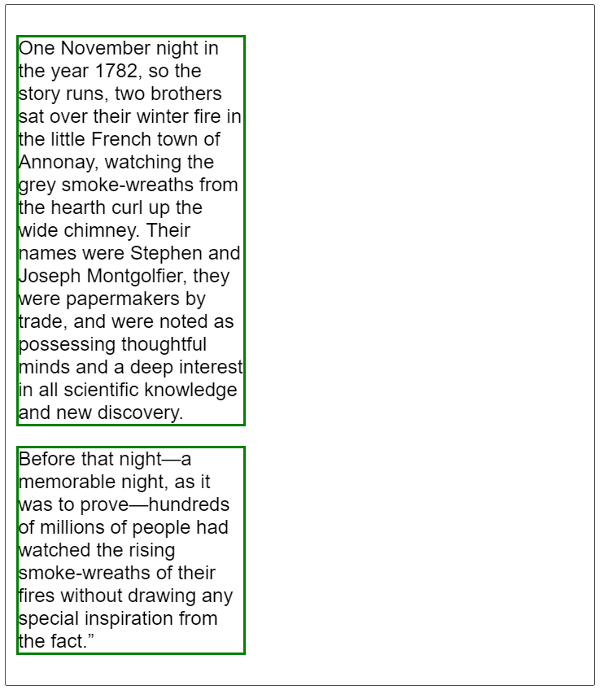
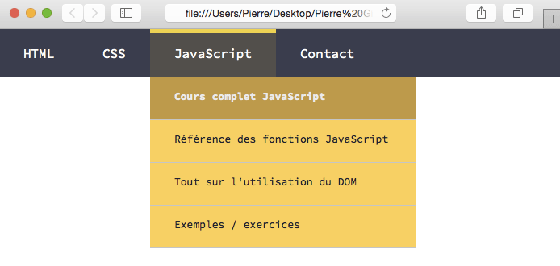

# Le positionnement des éléments


## Le flux

Le flux normal ou "disposition en flux" (Flow Layout) correspond à la façon dont les éléments de bloc et les éléments en ligne sont disposés avant tout changement apporté à leur disposition. Lorsqu'un élément est retiré du flux, il est traité indépendamment.

Avec un *flux normal*, comme on l'avait vu auparavant, les éléments en ligne (`inline` elements) sont affichés dans la direction "en incise", c'est-à-dire dans le sens dans lequel les mots sont écrits selon le mode d'écriture du document. Les éléments de bloc (`block` elements) sont affichés les uns après les autres, à la façon des paragraphes selon le mode d'écriture du document.

### Formatage de bloc
Dans un contexte de formatage de bloc, les boîtes sont disposées l'une après l'autre, verticalement, en démarrant en haut du bloc englobant. La distance verticale entre deux boîtes voisines est déterminée par les propriétés relatives aux marges. Les marges verticales fusionnent pour deux boîtes de bloc voisines au sein d'un contexte de formatage de bloc.

Dans un contexte de formatage de bloc, chaque bord gauche de chaque boîte touche le bord gauche du bloc englobant.

Par défaut, les éléments de bloc consomment tout l'espace disponible sur l'axe en ligne. Ainsi, les paragraphes « s'étalent » horizontalement autant qu'ils le peuvent au sein du bloc englobant. Si on fixait leur longueur afin que deux paragraphes puissent tenir horizontalement, ils seraient tout de même l'un au dessus de l'autre. Chaque boîte de bloc commencera au début de l'axe de bloc du bloc englobant.



**Fusion des marges**

Les marges verticales entre chaque éléments de bloc *fusionnent*. Cela signifie que si un élément avec une marge en haut suit directement un élément avec une marge en bas, plutôt que la marge résultante soit la somme des deux marges, on aura une fusion des marges et ce sera uniquement **la plus grande des marges qui sera appliquée**.

**Autres caractéristiques**

* Il peut avoir des marges et des paddings.
* Si aucune hauteur n'est définie, il prendra la hauteur de ses éléments enfants (en supposant qu'il n'y a pas de "float" ou de positionnement sur des éléments environnants).
* Il ignore la propriété `vertical-align`.

### Formatage en ligne (inline)

Dans un contexte de formatage en ligne, les boîtes sont disposées horizontalement les unes après les autres, en démarrant en haut du bloc englobant. Les marges, bordures, espaces de remplissage (`padding`) entre ces boîtes sont respectées. 


S'il n'y a pas suffisamment d'espace dans la boîte englobante, une boîte en ligne pourra être scindée pour passer à la ligne. Les lignes ainsi créées sont appelées des *boîtes de ligne*. 

La hauteur de la *boîte de ligne* est définie avec la taille de la plus grande boîte qu'elle contient. Si une balise `inline` a une taille de 300% par rapport à la taille de police du reste du texte, c'est le contenu de cette balise `inline` qui détermine la hauteur de la boîte de ligne pour cette ligne.


**Autres caractéristiques**

* Il ignore les marges top et bottom mais applique les marges left et right, ainsi que tout padding.
* Il ignore les propriétés width et height.
* S'il est flotté à gauche ou à droite, il devient automatiquement un élément de niveau block, et prend toutes ses caractéristiques.
* Il accepte la propriété vertical-align.


### Pour résumer


### Inline-Block

En fait, il existe une troisième possibilité: `inline-block`. Elle est très utilisée. Plutôt que beaucoup de mots pour expliquer, je vous propose cette image pour comprendre ce qu'est un élément `inline-block`


En gros, un élément `inline-block` est placé `inline` (c'est à dire sur la même ligne que le contenu adjacent), mais il se comporte comme un `block`


**Comment l'utiliser ?**

* Pour placer plusieurs éléments de type block sur la même ligne horizontale sans les flotter.

* Pour permettre à un élément de type inline d'avoir une hauteur et une largeur tout en conservant sa nature inline.

* Pour permettre à un élément inline d'avoir des marges ou des paddings


Il existe des éléments qui sont naturellements `inline-block`, il s'agit de ce qu'on appelle les **éléments remplacés**.

Ce sont des éléments dont l'apparence et les dimensions de base sont définies par une ressource extérieure, par exemple des images, des plugins, des éléments d'un formulaire... Ils ne sont ni blocks, ni inline, on pourrait les considérer comme plus proches d'inline, mais avec une structure proche de block...

Quelques exemples d'éléments remplacés : `img`, `object`, `input`, `select`.

## Display

La propriété CSS `display` définit la façon dont une boîte, et celles qu'elle contient, se comporte.

### Modifier l'affichage par défaut

Les navigateurs affichent les éléments en bloc ou ligne selon ce qui est pertinent pour chaque élément. Ainsi, l'élément `<strong>`, utilisé pour mettre en avant un mot (souvent alors affiché en gras), ne crée pas de nouvelle ligne pour afficher son contenu : ce n'est pas un élément en ligne mais un élément de bloc.

Si on souhaitait afficher tous les éléments `<strong>` comme des éléments de bloc (en terme d'affichage *extérieur*), il suffirait d'ajouter la règle `display: block` en ciblant les éléments `<strong>`. Cela signifie qu'on peut toujours écrire un code HTML qui soit le plus sémantique possible pour le contenu puis modifier la façon dont le document est affiché grâce à CSS.

Inversement, si l'on veut que les éléments `<li>` s'affichent comme des éléments `inline`, il suffit d'ajouter la règle `display: inline;` aux éléments `<li>` visés.


On pourra également forcer une balise à adopter l'affichage `inline-block`. 

Et comme on l'a vu, la propriété `display` nous permettra de créer des conteneurs `flex`.


## Position


La propriété `position` définit la façon dont un élément est positionné dans un document. Les propriétés `top`, `right`, `bottom` et `left` déterminent l'emplacement final de l'élément positionné.

Cette propriété a 5 valeurs possibles:

* `static`: c'est le comportement normal par défaut. L'élément est alors positionné dans le flux avec sa position. Les propriétés `top`, `right`, `bottom`, `left` et `z-index` (nous verront plus tard leur utilité) ne s'appliquent pas. On considère qu'un élément est **positionné** à partir du moment où la propriété position est différente de static

* `relative`
L'élément est positionné dans le flux normal du document puis décalé, par rapport à lui-même, selon les valeurs fournies par top, right, bottom et left. Le décalage n'a pas d'impact sur la position des autres éléments. Aussi, l'espace fourni à l'élément sur la page est le même que celui fourni avec static.

Cette valeur crée un nouveau contexte d'empilement lorsque z-index ne vaut pas auto. 


* `absolute`
L'élément est retiré du flux normal et aucun espace n'est créé pour l'élément sur la page. Il est ensuite positionné par rapport à son ancêtre le plus proche qui est positionné s'il y en a un ou par rapport au bloc englobant initial sinon. La position finale de l'élément est déterminée par les valeurs de top, right, bottom et left.
Cette valeur crée un nouveau contexte d'empilement lorsque z-index ne vaut pas auto. Les éléments positionnés de façon absolue peuvent avoir des marges, ces marges ne fusionnent pas avec les autres marges.

* `fixed`

L'élément est retiré du flux normal et aucun espace n'est laissé pour l'élément. L'élément est positionné relativement au bloc englobant initial formé par la zone d'affichage (viewport). Cela empêche le défilement lorsque la page est parcourue (ou lors de l'impression, le positionne à cette position fixe pour chaque page). La valeur finale de l'élément est déterminée par les valeurs de top, right, bottom et left.


* `sticky`

La position de la boîte est calculée en fonction du flux normal du document. Ensuite, la boîte est décalée par rapport à son ancêtre de défilement le plus proche et par rapport à son bloc englobant selon les valeurs de top, right, bottom et left. Dans tous les cas, y compris avec les éléments table, cela n'affecte pas la position des autres éléments.


### Un exemple pour comprendre

Créez un fichier HTML et insérez-y ce bloc de code:
```
<div class="container">
	<p>Dans cet exemple, nous allons voir l'effet des différentes valeurs de la propriété position sur notre boîte jaune.</p>
	
	<div class="blue"></div>
	<div class="yellow"></div>
	<div class="blue"></div>

	<p>
		Lorem ipsum dolor sit amet, consectetur adipisicing elit, sed do eiusmod
		tempor incididunt ut labore et dolore magna aliqua. Ut enim ad minim veniam,
		quis nostrud exercitation ullamco laboris nisi ut aliquip ex ea commodo
		consequat. Duis aute irure dolor in reprehenderit in voluptate velit esse
		cillum dolore eu fugiat nulla pariatur. Excepteur sint occaecat cupidatat non
		proident, sunt in culpa qui officia deserunt mollit anim id est laborum.
	</p>
</div>
```


*Petite astuce Cadeau*: Si vous commencez à taper `<lorem` sur Sublime Text, et que vous appuyez sur Entrer, Sublime vous remplira automatiquement tout un paragraphe avec du faux texte (il ne reste plus qu'à enlever le chevron de départ). 
Pratique pour tester une mise en page !


Maintenant, intégrer ce code CSS:
```
.container div {
	height: 40px;
	width: 40px;
	margin: 0 5px;
	display: inline-block;
}

.blue {
	background-color: blue;
	border: solid 2px black;
}

.yellow {
	background-color: yellow;
	border: solid 2px red;
}
```


Par défaut, la propriété position pour la boîte jaune est `static`, nous allons voir ce que cela donne avec les autres propriétés:

**Relative**

Ajoutez ces propriétés à `.yellow`
```
position: relative;
top: 40px; left: 40px;
```


**Absolute**
```
position: absolute;
top: 40px; left: 40px;
```


**Fixed**

Pour la valeur fixed, ajoutez autant de paragraphes nécessaire pour obtenir une page scrollable pouvoir découvrir son effet.

```
position: absolute;
top: 40px; left: 40px;
```

**Sticky**

Pour la valeur sticky, ajoutez autant de paragraphes nécessaire pour obtenir une page scrollable pouvoir découvrir son effet.

```
position: -webkit-sticky;
position: sticky;
top: 20px;
```


### Top, right, bottom, left

Ces propriétés n'auront pas le même comportement selon le type de positionnement

* Un élément positionné de façon relative est un élément dont la propriété de position calculée est `relative`. Dans ce cas, les propriétés `top` ou `bottom` indiquent le décalage vertical à appliquer et `left` ou `right` indiquent le décalage horizontal.

* Un élément positionné de façon absolue est un élément dont la propriété de position calculée est `absolute` ou `fixed`. Dans ce cas, les propriétés `top`, `bottom`, `right` et `left` indiquent les distances entre les bords de l'élément et les bords du bloc englobant (c'est-à-dire l'ancêtre par rapport auquel l'élément est positionné). Si l'élément possède des marges, elles sont ajoutées aux décalages.

* Un élément positionné en adhérence est un élément dont la propriété de position calculée vaut `sticky`. Un tel élément se comporte comme un élément positionné de façon relative jusqu'à ce que son bloc englobant dépasse un seuil donné (par exemple fourni par la valeur de `top`) au sein du conteneur puis il se comporte ensuite comme un élément fixe jusqu'à atteindre le bord opposé du bloc englobant.


*A savoir*:
* Si top et bottom sont tous les deux définis (enfin, s'ils ne valent pas auto), c'est top qui aura la priorité
* Si left et right sont tous les deux définis, c'est left qui aura la priorité .


### Z-Index


**Pour les boîtes positionnées** (celles pour lesquelles position est différent de static), la propriété z-index définit :

1. Le niveau de la boîte dans la pile par rapport au contexte d'empilement courant
2. Si la boîte crée un contexte d'empilement local.

Un exemple valant mieux qui mille mots, insérer ce code dans un fichier HTML

```
<div id="default-example" class="default-example container">
    <div id="example-element" style="z-index: auto;">Change my z-index</div>
    <div class="block blue position1">z-index: 6</div>
    <div class="block blue position2">z-index: 4</div>
    <div class="block blue position3">z-index: 2</div>
    <div class="block red  position4">z-index: auto</div>
    <div class="block red  position5">z-index: auto</div>
    <div class="block red  position6">z-index: auto</div>
</div>
```

et ce code CSS

```
#example-element {
    top: 15px;
    left: 15px;
    width: 180px;
    height: 230px;
    position: absolute;
    line-height: 215px;
    font-family: monospace;
    background-color: #fcfbe5;
    border: solid 5px #e3e0a1;
    z-index: auto
}

.container {
    display: inline-block;
    width: 250px;
    position: relative;
    text-align: center;
}

.block {
    width: 150px;
    height: 50px;
    position: absolute;
    font-family: monospace
}

.blue {
    background-color: #e5e8fc;
    border: solid 5px #112382;
    line-height: 55px
}

.red {
    background-color: #fce5e7;
    border: solid 5px #e3a1a7
}

.position1 {
    top: 0;
    left: 0;
    z-index: 6
}

.position2 {
    top: 30px;
    left: 30px;
    z-index: 4
}

.position3 {
    top: 60px;
    left: 60px;
    z-index: 2
}

.position4 {
    top: 150px;
    left: 0;
    z-index: auto
}

.position5 {
    top: 180px;
    left: 30px;
    z-index: auto
}

.position6 {
    top: 210px;
    left: 60px;
    z-index: auto
}

```


Maintenant, testez pour le div dont l'`id` est "example-element" la valeur de z-index avec:
* auto
* 1
* 3
* 5
* et 7


**Les valeurs**

* auto : La boîte ne crée pas de nouveau contexte d'empilement. Le niveau d'empilement de la boîte dans le contexte d'empilement courant est le même que celui de la boîte parente.

* Un entier (1, 2, 3...) : L'entier fourni sera le niveau de la boîte dans la pile d'empilement pour le contexte d'empilement courant. La boîte crée un nouveau contexte d'empilement pour lequel son niveau est 0. Cela signifie que les index z des descendants ne sont pas comparés à ceux des éléments en dehors de l'élément.


**Exercice**

Grâce à la propriété `z-index`, reproduisez cet exemple:


## Exercices

Après ce cours, je vous encourage à reprendre un des premiers exercices que nous avons fait: le menu de navigation.

Désormais, nous allons reprendre ce menu et y ajouter des sous-menus pour faire un menu déroulant, comme ceci:




N'hésitez pas à rajouter quelques animations ;)