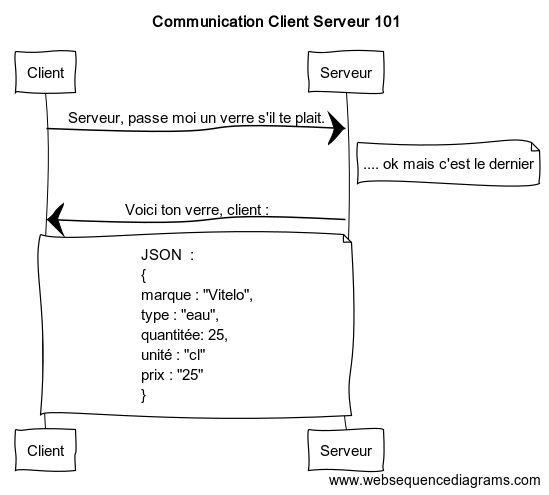

# JSON, un language de communication


Dans cette petite leçon, nous allons parler d'un language dont le but est de permettre la communication entre un client et un serveur.

Ce language est nommé le `JSON` que l'on peut prononcer (prenez un accent Texan, ça peut aider ;-) ) `Jay-son` ou `Gi-son`.

Bon je sens qu'avec ce premier paragraphe je vous ai un peu perdu avec tout ces nouveaux termes alors reprenons depuis le debut.

## C'est l'histoire d'un client et d'un serveur qui sont dans un bar.

Dans l'univers merveilleux de l'internet contemporain , nous avons deux mondes distincts : celui du `client` (l'appareil qui sert à visualiser une page web - un téléphone, un navigateur web, par exemple) et le monde du `serveur`.

Chaque monde possède son propre rôle :

- le `client` aura pour but d'afficher les données de la manière la plus présentable et agréable possible. Ceci grâce au combo CSS, JavaScript et HTML.

- le `serveur`, lui, aura pour but de manipuler les données, d'effectuer des calculs grâce à celles-ci et parfois de les stockées à l'aide d'une base de donnée par exemple.

Malheureusement, dans cet univers impitoyable, notre client et notre serveur ne savent pas communiquer ensemble.

Pour communiquer ensemble ils leur manquent deux choses : un moyen de communication (`un protocole`) et un language commun pour échanger des informations.

Internet fourni énormément de types de protocoles différents pour aider à la communication entre différentes entitées. 

Par exemple, nous utilisons le protocole `SMTP` ou `IMAP` pour l'envoi de mail, nous pouvons utiliser le protocole de communication `FTP` pour le tranfert de fichier.

Dans notre cas, le protocole le plus utilisé pour faire communiquer un client et un serveur est nommé le protocole `HTTP`.

### Hummm, http ? Cette chose me dit quelque chose ...

Et oui effectivement ! Si vous regarder le début des URL de chaque site internet elles commencent toutes par ceci `http://`. 

C'est grâce à ce préfixe que notre client indique au serveur qu'il souhaite communiquer avec lui via le protocole `http`. Super non ? :-)

## JSON, viens ici !

Cool, maintenant nous savons comment faire communiquer notre client avec notre serveur. Cependant, il nous reste à résoudre le problème du language.

### Back to the future.

Pour bien comprendre cette problématique du language entre le client et le serveur, il est important que je vous raconte un tout petit bout d'histoire de l'informatique.

Comme je vous le disais, le monde du client et le monde du serveur sont réellement deux mondes distincts ayant deux responsabilitées définies.

Historiquement, chacun de ces univers utilisaient leur(s) propre(s) language(s).

Pour le client, c'est actuellement encore simple car il ne comprend que le HTML, le CSS et le JavaScript tandis que le serveur c'est un peu plus compliqué.

En effet, un serveur peut comprendre tout un panel différent de language comme par exemple : le `PHP`, le `Go` , le `F#` et même depuis quelques années le `JavaScript`.

**Quoi il connait aussi le JavaScript, alors bingo probème résolu**

Hum...nan... pas tout à fait.

Oui effectivement, nous pouvons utiliser le JavaScript comme language de programtation coté serveur.

Cependant, en tant que développeur, nous aimons séparer des choses ayant des objectifs différents et, pour rappel, le client et le serveur ont réellement deux objectifs distincts :

L'un s'occupe de la présentation des données, tandis que l'autre va s'occuper du traitement de celles-ci.

### Donc alors quel est ce language de communication miracle ?

Et bien je vous en parle depuis le début, nous allons pouvoir utiliser le `JSON` comme language de communication entre notre serveur et notre client.

Pour illustrer un exemple de communication entre un client et un serveur imaginons cette scène illustrée ici :



Cet illustration simplfie grandement la manière dont se passe la communication client/serveur mais elle permet de se faire une première image mentale.

Pour être plus précis :

Le client et le serveur communique grâce au protocole `HTTP`. Le client addresse sa `requète`(demande) au serveur (`Serveur, passe moi un verre s'il te plait`).

Après avoir `réflechi` (cette réflexion peut pendre la forme d'une requète en base de donnée ou encore un calcul complexe pour vérifier l'état des stocks, ...), le serveur répond au client en utilisant leur language commun le `JSON`

## Une question d'extension et de syntaxe.

Tout d'abord pour créer un fichier JSON, nous devons créer un fichier ayant comme extension `.json`.

Mais attention, dans ce fichier nous ne pouvons pas écrire tout et n'importe quoi. Pour que notre fichier soit considéré comme un fichier "valide", il va falloir respecter quelques règles fondamentales.

### Règle numéro un : la délimitation.

Tout fichier JSON commence par ce caractère `{` et termine par celui-ci `}`.

Ainsi notre document aura cette forme

```json
{
    ... contenu du JSON
}
```

### Que pouvons nous mettre dans un fichier JSON ?

Le but d'un fichier JSON et de décrire quelque chose via un système de `clé` et de `valeur` par exemple si l'on reprend notre exemple illustré plus haut, nous avons utilisé des clés (`marque`,`type`,`valeur`,`prix` ) pour décrire les caractéristiques de la boisson désirée par notre client.

Pour chaque clé nous avons assigné une valeur :

```
clé -> valeur
marque -> vittelo
type -> eau
quantité -> 25
...
```

Pour créer des clés et des valeurs, nous devons respecter un syntaxe précise.

#### Pour les clés :

En JSON une clé doit OBLIGATOIREMENT être une chaîne de caractère entourée de `""`

Exemple de JSON valide :

```json
{
  "toto": "tata",
  "Hello#World": "tata",
  "ma clé": "superbe clé"
}
```

Exemple de JSON non-valide :

```json
{
  toto: "tata",
  666": "tata",
  ma clé: "superbe clé"
}
```

Ici aucune des clés n'est entourée de `""`, ainsi elles ne sont pas considérée comme valide.

Autre Petite restriction : pour que le JSON soit valide, il ne doit contenir qu'une seule fois la même clé.

De cette manière :

```json
{
  "foo": "hello",
  "bar": "du soir",
  "foo": "toto"
}
```

Ne sera pas considéré comme valide car il contient plus d'une fois la clé `foo`

#### Les valeurs :

Une valeur dans un JSON peut être de plusieur type :

- _une chaine de caractère_ : "hello", "chaine de caractère", "??? ch4n3 de c@r@ct3r !!!"
- _un chiffre_ : 123 (attention : si vous écrivez `"123"` alors la valeur considérée comme une chaine de caractère car elle est entourée de "")

- un autre objet `JSON` :

```json
{
  "toto": {
    "nom": "un bel objet JSON",
    "destinataire": "inconnu à cet adresse"
  }
}
```

Notez qu'un objet JSON peut avoir comme valeur un autre objet JSON qui lui contient aussi comme valeur un autre objet JSON qui lui aussi contient comme valeur un autre obejet JSON qui ... (vous avez compris hein :-) )

ainsi :

```JSON

{
    "toto" : {
        "nom" : "un bel objet JSON",
        "destinataire" : "inconnu à cet adresse",
        "animalFavori" : {
            "nom" : "Muscadet",
            "prenom" : "Eliott",
            "propriétaire" : {
                "nom" : "Paul",
                "prénom" : "JACOB"
            }

        }
    }
}

```

est un JSON tout à fait valide.

Un objet JSON peut aussi contenir une collection de JSON : `[]`.

Chaque collection pouvant contentir :

- des chaînes de caractère : `["hello", "world"]`
- des chaînes des chiffres : `[567, 888]`
- d'autres objects JSON :

```json
{
  "marque": "Eviano",
  "produits": ["pulco", "polo", "poule au pot"],
  "clients": [
    {
      "nom": "Richard",
      "date de naissance": 1966
    },
    {
      "nom": "Richardi",
      "date de naissance": 1989
    },
    {
      "nom": "Franz",
      "date de naissance": 2002
    }
  ]
}
```

Oups j'ai oublier de vos le dire : chaque élément de notre document JSON doit être séparé par une `,` pour être considéré comme valide.

## Petit exercice :

Maintenant que nous avons les bases suffisantes en JSON, voici un petit exercice.

Grâce à ce language JSON, je vous demanderais d'essayer de décire le premier moyen de locomation que vous ayez jamais eu ( une voiture, un vélo, un bus, un jet privé, un yacht, une soucoupe volante ???)

Pour ce faire nous aurons besoin de créer un fichier `.json` grâce à votre éditeur de texte favori. Dans ce fichier, n'hésitez pas à utiliser des tableaux, des chiffres etc...

Voici un exemple pour vous aider :

```json
{
  "`type`": "camion",
  "marque": "Mercedes",
  "longueur": {
    "valeur": 200,
    "unité": "mètre"
  },
  "prix": {
    "valeur": 100000000,
    "unité": "euro"
  },
  "pays_origine": "Allemagne",
  "propriétaires": [
    {
      "nom": "Sergio Le Camioneur",
      "date_vente": "12/12/11"
    },
    {
      "nom": "Tito Le Camioneur",
      "date_vente": "12/12/11"
    },
    {
      "nom": "Ricky Le Camioneur",
      "date_vente": "06/12/11"
    }
  ]
}
```
