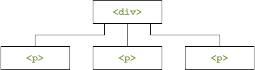

# Modifier votre page web avec JavaScript

[TOC]

## Introduction

### API

***API*** signifie *Application Programming Interface*, c'est-à-dire *interface de programmation*. Le mot le plus important est “interface”, et c’est le mot le plus simple, car nous utilisons tous des interfaces au quotidien.

Sans aller directement dans la programmation, parlons un peu des interfaces en général. Un exemple commun d’une interface est une télécommande pour votre télévision. Cette interface vous donne une manière d’interagir avec votre télévision, sans avoir besoin de plonger dans les fils et circuits de votre TV. Les choix sont déjà déterminés pour vous.

Vous avez un groupe de boutons et interrupteurs qui vous permettent de faire différentes opérations : les flèches pour changer de chaîne, un bouton rond pour changer la source d’entrée, ou encore un bouton rouge pour éteindre la télévision. Vous savez quel bouton correspond à quelle action. Par exemple, vous ne pouvez pas allumer votre TV avec le bouton de volume. Pour que cela marche, vous devez respecter l'interface et interagir avec elle de la façon qui a été prévue lors de sa conception.


Nous utilisons beaucoup d'interfaces sans nous en rendre compte. Les sites web et les applications ont besoin de la même chose pour communiquer et échanger des données. C’est là que vient le “AP” d’API : “Application Programming” Interface. Une API est une interface pour les applications, car un logiciel n’a pas de mains ni d’yeux pour interagir avec les interfaces physiques ! 

Nous prenons le temps d'expliquer ce terme, qui n'est pas primordial, car nous reparlerons d'APIs dans le futur, et qu'il s'agit d'un concept clé pour tout développeur.	


### Petit rappel sur les Objets en Javascript

On va beaucoup parler d'objets dans ce cours, donc même si on les a déjà vu dans le cours précédent, ça ne coûte rien de faire une petite piqure de rappel!

Un objet est un concept, une idée ou une chose. Un objet possède une structure qui lui permet de pouvoir fonctionner et d'interagir avec d'autres objets. Le JavaScript met à notre disposition des objets natifs, c'est-à-dire des objets directement utilisables. Vous avez déjà manipulé de tels objets sans le savoir : un nombre, une chaîne de caractères ou même un booléen.

```js
var myString = 'Ceci est une chaîne de caractères';
```

La variable `myString` contient un objet, et cet objet représente une chaîne de caractères. C'est la raison pour laquelle on dit que le JavaScript n'est pas un langage typé, car les variables contiennent toujours la même chose : un objet. Mais cet objet peut être de nature différente (un nombre, un booléen…).

Le JavaScript nous permet aussi de créer nos propres objets, avec leurs propres méthodes et propriétés.

L'intérêt est généralement une propreté de code ainsi qu'une facilité de développement. Les objets sont là pour nous faciliter la vie, mais leur création peut prendre du temps.

#### Structure

Un objet est un ensemble de propriétés et une propriété est une association entre un nom (aussi appelé *clé*) et une valeur. La valeur d'une propriété peut être une fonction, auquel cas la propriété peut être appelée « méthode ». 

Par exemple:

```js
const aurora = {
  nom: "Aurora",
  sante: 150,
  force: 25,

  // Renvoie la description du personnage
  decrire() {
    return `${this.nom} a ${this.sante} points de vie et ${this.force} en force`;
  }
};

// "Aurora a 150 points de vie et 25 en force"
console.log(aurora.decrire());
```


`aurora` est un objet avec trois propriétés (`nom`, `sante`, `force`) et une méthode (`decrire`)

Un objet JavaScript possède donc plusieurs propriétés qui lui sont associées. Une propriété peut être vue comme une variable attachée à l'objet. Les propriétés d'un objet sont des variables tout ce qu'il y a de plus classiques, exception faite qu'elle sont attachées à des objets. Les propriétés d'un objet représentent ses caractéristiques et on peut y accéder avec une notation utilisant le point « . », de la façon suivante : `monObjet.maPropriete = nouvelleValeur`.


On peut aussi définir ou accéder à des propriétés JavaScript en utilisant une notation avec les crochets . Les objets sont parfois appelés « tableaux associatifs ». Cela peut se comprendre car chaque propriété est associée avec une chaîne de caractères qui permet d'y accéder. Ainsi, par exemple, on peut accéder aux propriétés de l'objet `aurora` de la façon suivante 

```js
console.log(aurora["nom"]);
aurora["force"] = 50;
console.log(aurora["force"]);
```


Une méthode permet de définir une action pour un objet. On dit également qu'une méthode ajoute à cet objet un comportement.

Un mot-clé apparaît :  `this`  . Il est défini automatiquement par JavaScript à l'intérieur d'une méthode et représente l'objet sur lequel la méthode a été appelée.

La méthode  decrire()  ne prend plus de personnage en paramètre : elle utilise  `this`  pour accéder aux propriétés de l'objet sur lequel elle a été appelée.


### Le DOM

Le **Document Object Model** (abrégé **DOM**) est une interface de programmation pour les documents XML et HTML.

> Vous avez remarqué? Il y a les 'Objet' et 'interface de programmation' dans la phrase, et on les a vu juste avant : Comme c'est bien fait !!

Le DOM est donc une API qui s'utilise avec les documents XML et HTML, et qui va nous permettre, via le JavaScript, d'accéder au code XML et/ou HTML d'un document. C'est grâce au DOM que nous allons pouvoir modifier des éléments HTML (afficher ou masquer un`<div>`par exemple), en ajouter, en déplacer ou même en supprimer.

Petite note de vocabulaire : dans un cours sur le HTML, on parlera de balises HTML (une paire de balises en réalité : une balise ouvrante et une balise fermante). Ici, en JavaScript, on parlera d'*élément HTML*, pour la simple raison que chaque paire de balises (ouvrante et fermante) est vue comme un objet. Par commodité, et pour ne pas confondre, on parle donc d'élément HTML.


#### Petit historique

À l'origine, quand le JavaScript a été intégré dans les premiers navigateurs (Internet Explorer et Netscape Navigator), le DOM n'était pas unifié, c'est-à-dire que les deux navigateurs possédaient un DOM différent. Et donc, pour accéder à un élément HTML, la manière de faire différait d'un navigateur à l'autre, ce qui obligeait les développeurs Web à coder différemment en fonction du navigateur. En bref, c'était un peu la jungle.

Le W3C a mis de l'ordre dans tout ça, et a publié une nouvelle spécification que nous appellerons « DOM-1 » (pour DOM Level 1). Cette nouvelle spécification définit clairement ce qu'est le DOM, et surtout comment un document HTML ou XML est schématisé. Depuis lors, un document HTML ou XML est représenté sous la forme d'un arbre, ou plutôt hiérarchiquement. Ainsi, l'élément`<html>`contient deux éléments enfants :`<head>`et`<body>`, qui à leur tour contiennent d'autres éléments enfants.

Ensuite, la spécification DOM-2 a été publiée. La grande nouveauté de cette version 2 est l'introduction de la méthode`getElementById()`qui permet de récupérer un élément HTML ou XML en connaissant son ID.


### L'héritage des propriétés et des méthodes

Le JavaScript voit les éléments HTML comme étant des objets, cela veut donc dire que chaque élément HTML possède des propriétés et des méthodes. Cependant faites bien attention parce que tous ne possèdent pas les mêmes propriétés et méthodes. Certaines sont néanmoins communes à tous les éléments HTML, car tous les éléments HTML sont d'un même type : le type `Node`, qui signifie « nœud » en anglais (le document HTML lui même, les éléments HTML, les attributs HTML, le texte à l’intérieur des éléments, etc.)

Le terme « node » est un terme générique qui sert à désigner tous les objets contenus dans le DOM. En un mot : tout objet appartenant au DOM est un node, ou un nœud en français.

Ensuite, vous pouvez déjà retenir qu’il y a plusieurs types de nœuds correspondant aux différents objets HTML : le type de nœud `ELEMENT_NODE` (pour les éléments HTML), le type de nœud `TEXT_NODE` (pour le texte), etc. 


#### Notion d'héritage

Un élément `<div>` , par exemple, est un objet `HTMLDivElement`, mais un objet, en JavaScript, peut appartenir à différents groupes. Ainsi, notre `<div>` est un `HTMLDivElement`, qui est un sous-objet d'`HTMLElement`qui est lui-même un sous-objet d'`Element`. `Element`est enfin un sous-objet de `Node`. Ce schéma est plus parlant :


L'objet `Node` apporte un certain nombre de propriétés et de méthodes qui pourront être utilisées depuis un de ses sous-objets. En clair, les sous-objets *héritent* des propriétés et méthodes de leurs objets parents. Voilà donc ce que l'on appelle l'**héritage**.


### Le Document

Document est un objet qui est particulièrement utilisé. En effet, il représente la *page Web* et plus précisément la balise`<html>`. C'est grâce à cet élément-là que nous allons pouvoir accéder aux éléments HTML et les modifier. Voyons donc comment naviguer dans le document !


Comme il a été dit précédemment, le DOM pose comme concept que la page Web est vue comme un arbre, comme une hiérarchie d'éléments. On peut donc schématiser une page Web simple comme ceci :


Voici le code source de la page :

```html
<!doctype html>
<html>
<head>
    <meta charset="utf-8" />
    <title>Le titre de la page</title>
</head>
<body>
    <div>
        <p>Un peu de texte <a>et un lien</a></p>
    </div>
</body>
</html>
```


Le schéma est plutôt simple : l'élément `<html>` contient deux éléments, appelés **enfants** : `<head>` et `<body>`. Pour ces deux enfants, `<html>` est l'élément **parent**. Chaque élément est appelé **nœud** (*node* en anglais). L'élément `<head>` contient lui aussi deux enfants : `<meta>` et `<title>`. `<meta>` ne contient pas d'enfant tandis que `<title>` en contient un, qui s’appelle `#text`. Comme son nom l'indique, `#text` est un élément qui contient du texte.

Il est important de bien saisir cette notion : le texte présent dans une page Web est vu par le DOM comme un nœud de type `#text`. Dans le schéma précédent, l'exemple du paragraphe qui contient du texte et un lien illustre bien cela :

```html
<p>
    Un peu de texte
    <a>et un lien</a>
</p>
```


Si on va à la ligne après chaque nœud, on remarque clairement que l'élément `<p>` contient deux enfants : `#text` qui contient « Un peu de texte » et `<a>`, qui lui-même contient un enfant `#text` représentant « et un lien ».


## Sélectionner et accéder à un ou plusieurs éléments HTML

L'accès aux éléments HTML via le DOM est assez simple mais demeure actuellement plutôt limité. L'objet `document` possède trois méthodes principales : `getElementById()`, `getElementsByTagName()` et `getElementsByName()`.


### `getElementById()`

Cette méthode permet d'accéder à un élément en connaissant son ID qui est simplement l'attribut`id`de l'élément. Cela fonctionne de cette manière :

```html
<div id="myDiv">
    <p>Un peu de texte <a>et un lien</a></p>
</div>
<script>
    var div = document.getElementById('myDiv');
    alert(div);
</script>
```


Exécutez ce code dans votre navigateur, et observez le résultat


Il nous dit que `div` est un objet de type `HTMLDivElement`. En clair, c'est un élément HTML qui se trouve être un `<div>`, ce qui nous montre que le script fonctionne correctement.


### `getElementsByTagName()`

> Faites très **attention** dans le nom de cette méthode : il y a un « s » à `Elements`. C'est une source fréquente d'erreurs.


Cette méthode permet de récupérer, sous la forme d'un tableau, tous les éléments de la famille. Si, dans une page, on veut récupérer tous les  `<div>`, il suffit de faire comme ceci :

```js
var divs = document.getElementsByTagName('div');

for (var i = 0, c = divs.length ; i < c ; i++) {
    alert('Element n° ' + (i + 1) + ' : ' + divs[i]);
}

console.log(divs);
```


Ajoutez plusieurs `<div>` dans votre document html et exécutez ce code pour voir son effet.


La méthode retourne une collection d'éléments (utilisable de la même manière qu'un tableau). Pour accéder à chaque élément, il est nécessaire de parcourir le tableau avec une petite boucle.

Deux petites astuces :

1. Cette méthode est accessible sur n'importe quel élément HTML et pas seulement sur l'objet `document`.
2. En paramètre de cette méthode vous pouvez mettre une chaîne de caractères contenant un astérisque * qui récupérera *tous* les éléments HTML contenus dans l'élément ciblé. C'est ce qu'on appelle une *wildcard*


### `getElementsByName()`


Cette méthode est semblable à `getElementsByTagName()` et permet de ne récupérer que les éléments qui possèdent un attribut `name`que vous spécifiez. L'attribut `name` n'est utilisé qu'au sein des formulaires, et est déprécié depuis la spécification HTML5 dans tout autre élément que celui d'un formulaire. 


### Accéder aux éléments grâce aux technologies récentes

Ces dernières années, le JavaScript a beaucoup évolué pour faciliter le développement Web. Les deux méthodes que nous allons étudier sont récentes et ne sont pas supportées par les très vieilles versions des navigateurs, leur support commence à partir de la version 8 d'Internet Explorer, pour les autres navigateurs vous n'avez normalement pas de soucis à vous faire.

Ces deux méthodes sont `querySelector()` et `querySelectorAll()` et ont pour particularité de grandement simplifier la sélection d'éléments dans l'arbre DOM grâce à leur mode de fonctionnement. Ces deux méthodes prennent pour paramètre un seul argument : une chaîne de caractères !

Cette chaîne de caractères doit être un sélecteur CSS comme ceux que vous utilisez dans vos feuilles de style. Exemple :

```css
#menu .item span
```


Pour rappel, ce sélecteur CSS stipule que l'on souhaite sélectionner les balises de type `<span>` contenues dans les classes `.item` elles-mêmes contenues dans un élément dont l'identifiant est `#menu`.

Le principe est plutôt simple mais très efficace. Sachez que ces deux méthodes supportent aussi les sélecteurs CSS 3, bien plus complets ! 

Internet Explorer 8 ne supporte pas l'usage des sélecteurs CSS 3 avec ces méthodes !

Voyons maintenant les particularités de ces deux méthodes. La première, `querySelector()`, renvoie le premier élément trouvé correspondant au sélecteur CSS, tandis que `querySelectorAll()` va renvoyer *tous* les éléments (sous forme de tableau) correspondant au sélecteur CSS fourni. Prenons un exemple simple :

```html
<div id="menu">
    <div class="item">
        <span>Élément 1</span>
        <span>Élément 2</span>
    </div>
    <div class="publicite">
        <span>Élément 3</span>
        <span>Élément 4</span>
    </div>
</div>
<div id="contenu">
    <span>Introduction au contenu de la page...</span>
</div>
```


Maintenant, essayez d'accéder via JavaScript à les éléments correspondant au sélecteur CSS présenté plus haut : `#menu .item span`. Pour cela, utilisez une nouvelle propriété nommée`innerHTML`, nous l'étudierons plus tard dans ce chapitre. Dans l'immédiat, sachez seulement qu'elle permet d'accéder au contenu d'un élément HTML.


```js
var query = document.querySelector('#menu .item span'),
    queryAll = document.querySelectorAll('#menu .item span');

alert(query.innerHTML); // Affiche : "Élément 1"
alert(queryAll.length); // Affiche : "2"

alert(queryAll[0].innerHTML + ' - ' + queryAll[1].innerHTML); // Affiche : "Élément 1 - Élément 2"
```


Nous vous conseillons de bien vous rappeler ces deux méthodes. Elles sont déjà utiles sur des projets voués à tourner sur des navigateurs récents, et d'ici à quelques années elles pourraient bien devenir habituelles (le temps que les vieilles versions des navigateurs disparaissent pour de bon).


Maintenant que nous avons vu comment accéder à un élément, nous allons voir comment l'éditer. 


## Modifier un élément HTML

Les éléments HTML sont souvent composés d'attributs (l'attribut `href` d'un `<a>` par exemple), et d'un contenu, qui est de type `#text`. Le contenu peut aussi être un autre élément HTML.

Comme dit précédemment, un élément HTML est un objet qui appartient à plusieurs objets, et de ce fait, qui hérite des propriétés et méthodes de ses objets parents.

### Les attributs

#### Via l'objet`Element`

Pour interagir avec les attributs, l'objet `Element` nous fournit deux méthodes, `getAttribute()` et `setAttribute()` permettant respectivement de récupérer et d'éditer un attribut. Le premier paramètre est le nom de l'attribut, et le deuxième, dans le cas de `setAttribute()` uniquement, est la nouvelle valeur à donner à l'attribut. Petit exemple :

```html
<a id="myLink" href="http://www.un_lien_quelconque.com">Un lien modifié dynamiquement</a>
<script>
    var link = document.getElementById('myLink');
    var href = link.getAttribute('href'); // On récupère l'attribut « href »
    alert(href);
    link.setAttribute('href', 'http://www.siteduzero.com'); // On édite l'attribut « href »
</script>
```


On commence par récupérer l'élément `myLink`, et on lit son attribut `href` via `getAttribute()`. Ensuite on modifie la valeur de l'attribut `href` avec `setAttribute()`. Le lien pointe maintenant vers `http://www.siteduzero.com`.


#### Les attributs accessibles

En fait, pour la plupart des éléments courants comme `<a>`, il est possible d'accéder à un attribut via une propriété. Ainsi, si on veut modifier la destination d'un lien, on peut utiliser la propriété `href`, comme ceci :

```html
<a id="myLink" href="http://www.un_lien_quelconque.com">Un lien modifié dynamiquement</a>
<script>
    var link = document.getElementById('myLink');
    var href = link.href;
    alert(href);
    link.href = 'http://www.siteduzero.com';
</script>
```


C'est cette façon de faire que l'on utilisera majoritairement pour les formulaires : pour récupérer ou modifier la valeur d'un champ, on utilisera la propriété `value`.

Attention cependant ! Un attribut auquel on accède par le biais de la méthode `getAttribute()` renverra la valeur exacte de ce qui est écrit dans le code HTML (sauf après une éventuelle modification) tandis que l'accès par le biais de sa propriété peut entraîner quelques changements. Essayez les deux techniques avec l'exemple suivant :

```html
<a href="/">Retour à l'accueil du site</a>
```


L'accès à l'attribut `href`  avec la méthode `getAttribute()` retournera bien un simple slash tandis que l'accès à la propriété retournera une URL absolue. Si votre nom de domaine est « mon_site.com » vous obtiendrez alors « http://mon_site.com/ ».


#### La classe

On peut penser que pour modifier l'attribut `class` d'un élément HTML, il suffit d'utiliser  `element.class`. Ce n'est pas possible, car le mot-clé `class` est réservé en JavaScript, bien qu'il n'ait aucune utilité. À la place de `class`, il faudra utiliser `className`.

```html
<!doctype html>
<html>
<head>
    <meta charset="utf-8" />
    <title>Le titre de la page</title>
    <style>
        .blue {
            background: blue;
            color: white;
        }
    </style>
</head>
<body>
    <div id="myColoredDiv">
        <p>Un peu de texte <a>et un lien</a></p>
    </div>
    <script>
        document.getElementById('myColoredDiv').className = 'blue';
    </script>
</body>
</html>
```


Dans cet exemple, on définit la classe CSS `.blue` à l'élément `myColoredDiv`, ce qui fait que cet élément sera affiché avec un arrière-plan bleu et un texte blanc.

Toujours dans le même cas, le nom `for` est réservé lui aussi en JavaScript (pour les boucles). Vous ne pouvez donc pas modifier l'attribut HTML `for` d'un `<label>` en écrivant `element.for`, il faudra utiliser `element.htmlFor` à la place.

Faites attention : si votre élément comporte plusieurs classes (exemple : `<a class="external red u">`) et que vous récupérez la classe avec `className`, cette propriété ne retournera pas un tableau avec les différentes classes, mais bien la chaîne « external red u », ce qui n'est pas vraiment le comportement souhaité. Il vous faudra alors couper cette chaîne avec la méthode `split()` pour obtenir un tableau, comme ceci :

```html
<div id="myColoredDiv" class="blue centered home">
    <p>Un peu de texte <a>et un lien</a></p>
</div>
<script>
    var classes = document.getElementById('myColoredDiv').className;
    var classesNew = [];
    classes = classes.split(' ');
    for (var i = 0, c = classes.length; i < c; i++) {
        if (classes[i]) {
            classesNew.push(classes[i]);
        }
    }

    alert(classesNew);
</script>
```


Là, on récupère les classes, on découpe la chaîne, mais comme il se peut que plusieurs espaces soient présents entre chaque nom de classe, on vérifie chaque élément pour voir s'il contient quelque chose (s'il n'est pas vide). On en profite pour créer un nouveau tableau,`classesNew`, qui contiendra les noms des classes, sans « parasites ».

Si le support d'Internet Explorer avant sa version 10 vous importe peu (c'est-à-dire que vous ne considérez pas grave que les utilisateurs d'Internet Explorer avant la version 10 puissent utiliser correctement votre site ), vous pouvez aussi vous tourner vers la propriété `classList`  qui permet de consulter les classes sous forme d'un tableau et de les manipuler aisément :

```js
var div = document.querySelector('div');
// Ajoute une nouvelle classe
div.classList.add('new-class');
// Retire une classe
div.classList.remove('new-class');
// Retire une classe si elle est présente ou bien l'ajoute si elle est absente
div.classList.toggle('toggled-class');
// Indique si une classe est présente ou non
if (div.classList.contains('old-class')) {
    alert('La classe .old-class est présente !');
}

// Parcourt et affiche les classes CSS
var result = '';
for (var i = 0; i < div.classList.length; i++) {
    result += '.' + div.classList[i] + '\n';
}

alert(result);
```


### Le contenu : `innerHTML`

La propriété `innerHTML` est spéciale et demande une petite introduction. Elle a été créée par Microsoft pour les besoins d'Internet Explorer et a été normalisée au sein du HTML5. Bien que non normalisée pendant des années, elle est devenue un standard parce que tous les navigateurs la supportaient déjà, et non l'inverse comme c'est généralement le cas.

#### Récupérer du HTML

`innerHTML` permet de récupérer le code HTML enfant d'un élément sous forme de texte. Ainsi, si des balises sont présentes,`innerHTML` les retournera sous forme de texte :

```html
<div id="myDiv">
    <p>Un peu de texte <a>et un lien</a></p>
</div>
<script>
    var div = document.getElementById('myDiv');
    alert(div.innerHTML);
</script>
```


Vous devriez avoir une boîte de dialogue qui affiche le contenu de`myDiv`, sous forme de texte


#### Ajouter ou éditer du HTML

Pour éditer ou ajouter du contenu HTML, il suffit de faire l'inverse, c'est-à-dire de définir un nouveau contenu :

```js
document.getElementById('myDiv').innerHTML = '<blockquote>Je mets une citation à la place du paragraphe</blockquote>';
```


Si vous voulez ajouter du contenu, et ne pas modifier le contenu déjà en place, il suffit d’utiliser `+=` à la place de l'opérateur d'affectation :

```js
document.getElementById('myDiv').innerHTML += ' et <strong>une portion mise en emphase</strong>.';
```


> Toutefois, une petite mise en garde : il ne faut pas utiliser le **+=** dans une boucle ! En effet, `innerHTML` ralentit considérablement l'exécution du code si l'on opère de cette manière, il vaut donc mieux concaténer son texte dans une variable pour ensuite ajouter le tout via `innerHTML`. Exemple :

```js
var text = '';
while ( /* condition */ ) {
    text += 'votre_texte'; // On concatène dans la variable « text »
}

element.innerHTML = text; // Une fois la concaténation terminée, on ajoute le tout à « element » via innerHTML
```


***Attention !*** Si un jour il vous prend l'envie d'ajouter une balise `<script>` à votre page par le biais de la propriété `innerHTML` , sachez que ceci ne fonctionne pas ! Il est toutefois possible de créer cette balise par le biais de la méthode `createElement()` que nous verrons plus tard dans ce chapitre.

Penchons-nous maintenant sur deux propriétés analogues à `innerHTML` : `innerText` pour Internet Explorer et `textContent` pour les autres navigateurs.


#### `innerText`

La propriété `innerText` a aussi été introduite dans Internet Explorer, mais à la différence de sa propriété sœur `innerHTML`, elle n'a jamais été standardisée et n'est pas supportée par tous les navigateurs. Internet Explorer (pour toute version antérieure à la neuvième) ne supporte que cette propriété et non pas la version standardisée que nous verrons par la suite.

Le fonctionnement d'`innerText `est le même qu'`innerHTML` excepté le fait que seul le texte est récupéré, et non les balises. C'est pratique pour récupérer du contenu sans le balisage, petit exemple :

```html
<div id="myDiv">
    <p>Un peu de texte <a>et un lien</a></p>
</div>
<script>
    var div = document.getElementById('myDiv');
    alert(div.innerText);
</script>
```


Ce qui nous donne bien « Un peu de texte et un lien », sans les balises 


#### `textContent`

La propriété `textContent` est la version standardisée d'`innerText`; elle est reconnue par tous les navigateurs à l'exception des versions d'Internet Explorer antérieures à la 9. Le fonctionnement est évidemment le même. Maintenant une question se pose : comment faire un script qui fonctionne à la fois pour Internet Explorer et les autres navigateurs ? C'est ce que nous allons voir !


#### Tester le navigateur

Il est possible via une simple condition de tester si le navigateur prend en charge telle ou telle méthode ou propriété.


```html
<div id="myDiv">
    <p>Un peu de texte <a>et un lien</a></p>
</div>
<script>
    var div = document.getElementById('myDiv');
    var txt = '';
    if (div.textContent) { // « textContent » existe ? Alors on s'en sert !
        txt = div.textContent;
    } else if (div.innerText) { // « innerText » existe ? Alors on doit être sous IE.
        txt = div.innerText + ' [via Internet Explorer]';
    } else { // Si aucun des deux n'existe, cela est sûrement dû au fait qu'il n'y a pas de texte
        txt = ''; // On met une chaîne de caractères vide
    }
    alert(txt);
</script>
```


Il suffit donc de tester par le biais d'une condition si l'instruction fonctionne.  Si`textContent`ne fonctionne pas, pas de soucis, on prend`innerText`!


Cela dit, ce code est quand même très long et redondant. Il est possible de le raccourcir de manière considérable :

```js
txt = div.textContent || div.innerText || '';
```


#### Informations sur le noeud

`nodeType` et `nodeName` servent respectivement à vérifier le *type* d'un nœud et le *nom* d'un nœud. `nodeType` retourne un nombre, qui correspond à un type de nœud. Voici un tableau qui liste les types possibles, ainsi que leurs numéros (les types courants sont mis en gras) :

| Numéro | Type de nœud                             |
| ------ | ---------------------------------------- |
| **1**  | **Nœud élément**                         |
| **2**  | **Nœud attribut**                        |
| **3**  | **Nœud texte**                           |
| 4      | Nœud pour passage CDATA (relatif au XML) |
| 5      | Nœud pour référence d'entité             |
| 6      | Nœud pour entité                         |
| 7      | Nœud pour instruction de traitement      |
| **8**  | **Nœud pour commentaire**                |
| 9      | Nœud document                            |
| 10     | Nœud type de document                    |
| 11     | Nœud de fragment de document             |
| 12     | Nœud pour notation                       |

`nodeName`, quant à lui, retourne simplement le nom de l'élément, en majuscule. Il est toutefois conseillé d'utiliser `toLowerCase()` (ou `toUpperCase()`) pour forcer un format de casse et ainsi éviter les mauvaises surprises.

```js
var paragraph = document.querySelector('#myDiv p');

alert(paragraph.nodeType + '\n\n' + paragraph.nodeName.toLowerCase());
```


Essayez maintenant ce morceau de code

```js
var paragraph = document.querySelector('#myDiv p');
var first = paragraph.firstChild;
var last = paragraph.lastChild;

alert(first.nodeValue);
alert(last.firstChild.data);
```


`first` contient le premier nœud, un nœud textuel. Il suffit de lui appliquer la propriété `nodeValue` (ou `data`) pour récupérer son contenu ; pas de difficulté ici. En revanche, il y a une petite différence avec notre élément `<a>`: vu que les propriétés `nodeValue` et `data` ne s'appliquent *que* sur des nœuds textuels, il nous faut d'abord accéder au nœud textuel que contient notre élément, c'est-à-dire son nœud enfant. Pour cela, on utilise `firstChild` (et non pas `firstElementChild`), et ensuite on récupère le contenu avec `nodeValue` ou `data`.


## Naviguer dans le DOM

Grâce au DOM, nous avons en effet pu accéder à nos éléments HTML car celui-ci crée une « copie » de notre page HTML dans laquelle tout « élément » (pris au sens large) est un objet de type « node » ou nœud en français.

Ensuite, nous avons vu qu’il existait différents sous-types de nœuds, ou différents types d’objets de type nœud : l’objet `Document`, l’objet `Element`, etc.

Finalement, nous avons vu différentes méthodes et propriétés pour accéder à un nœud en particulier et pouvoir travailler dessus.

Parfois, cependant, nous allons vouloir également accéder au nœud parent ou aux enfants et n’allons pas pouvoir le faire directement.

Il existe alors des propriétés spécialisées qui vont nous permettre de nous déplacer entre les nœuds très simplement.

Dans ce chapitre nous allons donc étudier les propriétés suivantes :

- `parentNode` ;
- `childNodes` ;
- `firstChild` et `lastChild` ;
- `nextSibling` et `previousSibling`.


### `parentNode`

La propriété `parentNode` va nous permettre d’accéder au nœud parent d’un certain nœud, et donc de nous déplacer dans le DOM de notre page HTML.

Cette propriété est une propriété de l’objet `Element`.

La propriété `parentNode` permet d'accéder à l'élément parent d'un élément. Regardez ce code :

```html
<blockquote>
    <p id="myP">Ceci est un paragraphe !</p>
</blockquote>
```


Admettons qu'on doive accéder à `myP`, et que pour une autre raison on doive accéder à l'élément `<blockquote>`, qui est le parent de `myP`. Il suffit d'accéder à `myP` puis à son parent, avec `parentNode` :

```js
var paragraph = document.getElementById('myP');
var blockquote = paragraph.parentNode;
```


### `childNodes` 

La propriété`childNodes`retourne un tableau contenant la liste des enfants d'un élément. L'exemple suivant illustre le fonctionnement de cette propriété, de manière à récupérer le contenu des éléments enfants :


```html
<div>
    <p id="myP">Un peu de texte <a>et un lien</a></p>
</div>

<script>
    var paragraph = document.getElementById('myP');
    var children = paragraph.childNodes;

    for (var i = 0, c = children.length; i < c; i++) {
        if (children[i].nodeType === Node.ELEMENT_NODE) { // C'est un élément HTML
            alert(children[i].firstChild.data);
        } else { // C'est certainement un nœud textuel
            alert(children[i].data);
        }
    }
</script>
```

Attention cependant : retenez bien qu’un nœud élément ne contient pas de texte à proprement parler selon le DOM, mais plutôt un nœud de type texte contenant une valeur qui est du texte.

C’est pourquoi si vous désirez accéder à cette valeur textuelle, vous devrez soit utiliser `nodeValue` (« valeur contenue dans le nœud ») en plus de `childNodes`, soit directement utiliser `innerHTML` par exemple.

Faites cependant très attention au fonctionnement de `childNodes` : les espaces dans votre code (l’indentation par exemple) vont être considérés comme des nœuds textuels enfants !


Au final, cette nouvelle technique peut vous sembler laborieuse et vous avez parfaitement raison. C’est pour cela que généralement on préférera utiliser un ciblage direct et `innerHTML` tant que possible.

Cependant, il me semblait intéressant de vous montrer cela afin que vous puissiez comprendre un code qui l’utilise.


### `firstChild` et `lastChild`

Comme leur nom le laisse présager,`firstChild` et `lastChild` servent respectivement à accéder au premier et au dernier enfant d'un nœud.

```html
<div>
    <p id="myP">Un peu de texte, <a>un lien</a> et <strong>une portion en emphase</strong></p>
</div>

<script>
    var paragraph = document.getElementById('myP');
    var first = paragraph.firstChild;
    var last = paragraph.lastChild;

    alert(first.nodeName.toLowerCase());
    alert(last.nodeName.toLowerCase());
</script>
```


En schématisant l'élément `myP` précédent, on obtient ceci :


Le premier enfant de `<p>` est un nœud textuel, alors que le dernier enfant est un élément `<strong>`.

Dans le cas où vous ne souhaiteriez récupérer que les enfants qui sont considérés comme des éléments HTML (et donc éviter les nœuds **#text** par exemple), sachez qu'il existe les propriétés `firstElementChild` et `lastElementChild`. Ainsi, dans l'exemple précédent, la propriété `firstElementChild` renverrait l'élément `<a>`.
Malheureusement, ces deux propriétés ne sont supportées qu'à partir de la version 9 concernant Internet Explorer.


Comme pour `childNodes`, les espaces à l’intérieur des éléments vont être considérés comme du texte et le texte lui même comme un nœud texte.

Il va donc une nouvelle fois faire bien attention à cela et particulièrement lorsque l’on souhaite récupérer du texte en soi.


### `nextSibling` et `previousSibling`

`nextSibling `et `previousSibling` sont deux propriétés qui permettent d'accéder respectivement au nœud suivant et au nœud précédent.

```js
var paragraph = document.getElementById('myP');
var first = paragraph.firstChild;
var next = first.nextSibling;

alert(next.firstChild.data); // Affiche « un lien »
```


Dans cet exemple, on récupère le premier enfant de `myP`, et sur ce premier enfant on utilise `nextSibling`, qui permet de récupérer l’élément `<a>`. Avec ça, il est même possible de parcourir les enfants d'un élément, en utilisant une boucle `while` :

```js
var paragraph = document.getElementById('myP');
var child = paragraph.lastChild; // On prend le dernier enfant
while (child) {
    if (child.nodeType === Node.ELEMENT_NODE) { // C'est un élément HTML
        alert(child.firstChild.data);
    } else { // C'est certainement un nœud textuel
        alert(child.data);
    }

    child = child.previousSibling; // À chaque tour de boucle, on prend l'enfant précédent
}
```


Pour changer un peu, la boucle tourne « à l'envers », car on commence par récupérer le dernier enfant et on chemine à reculons.

Tout comme pour `firstChild` et `lastChild`, sachez qu'il existe les propriétés `nextElementSibling` et `previousElementSibling` qui permettent, elles aussi, de ne récupérer que les éléments HTML. Ces deux propriétés ont les mêmes problèmes de compatibilité que `firstElementChild` et `lastElementChild`.


### Attention aux noeuds vides

En considérant le code HTML suivant, on peut penser que l'élément `<div>` ne contient que trois enfants `<p>`:

```html
<div>
    <p>Paragraphe 1</p>
    <p>Paragraphe 2</p>
    <p>Paragraphe 3</p>
</div>
```


Mais attention, car ce code est radicalement différent de celui-ci :

```html
<div><p>Paragraphe 1</p><p>Paragraphe 2</p><p>Paragraphe 3</p></div>
```


En fait, les espaces entre les éléments tout comme les retours à la ligne sont considérés comme des nœuds textuels (enfin, cela dépend des navigateurs) ! Ainsi donc, si l'on schématise le premier code, on obtient ceci :


Alors que le deuxième code peut être schématisé comme ça :




Heureusement, il existe une solution à ce problème ! Les attributs `firstElementChild`, `lastElementChild`, `nextElementSibling` et `previousElementSibling` ne retournent que des éléments HTML et permettent donc d'ignorer les nœuds textuels. Ils s'utilisent exactement de la même manière que les attributs de base (`firstChild`, `lastChild`, etc.). 

> Attention, ces attributs ne sont pas supportés par les versions d'Internet Explorer antérieures à la 9.


## Insérer et créer des éléments HTML

Pour créer un nouvel élément HTML en JavaScript, nous allons devoir procéder en trois temps :

- On crée l'élément
- On lui affecte des attributs
- On l'insère dans le document, et ce n'est qu'à ce moment-là qu'il sera ajouté.


### Créer un nouvel élément


Cette méthode va prendre en argument le nom de l’élément HTML que l’on souhaite créer.

```html
<!DOCTYPE html>
<html>
<head>
    <meta charset="utf-8" />
    <title>Le titre de la page</title>
</head>
<body>
	<div>
	    <p id="myP">Un peu de texte, <a>un lien</a> et <strong>une portion en emphase</strong></p>
	</div>

	<script>
        //on crée un élément de type p
        document.createElement('p');
	</script>
</body>
</html>
```


Nous avons ici créé un nouvel élément `p`. Cependant, notre élément ne contient pour le moment ni attribut ni contenu textuel, et n’a pas encore été inséré à l’intérieur de notre page à un endroit précis.

Nous allons donc commencer par ajouter du texte et un attribut à notre élément, puis nous l’insérerons ensuite dans le flux de notre document.


### Affecter des attributs

Pour ajouter des attributs, nous allons procéder comme dans le chapitre précédent, c’est-à-dire avec notre propriété `attribute` ou exceptionnellement avec la méthode `setAttribute()`.


```js
//on crée un élément de type p
var newPara = document.createElement('p');

//On ajoute un attribut id à notre paragraphe
newPara.id = 'nouveau';

//On crée un noeud de type texte
var texte = document.createTextNode("Inséré !")
```


Ici, nous avons ajouté un attribut `id` avec la valeur « nouveau » à notre paragraphe. Nous avons également créé un nœud de type texte que nous n’avons pas encore inséré dans notre paragraphe.

Il nous reste donc à insérer le texte dans notre paragraphe puis le paragraphe dans notre page. Nous travaillons avec des variables pour faciliter la manipulation de nos différents objets.


### Insérer l'élément dans la page HTML

Pour insérer notre texte dans notre élément et notre élément dans le flux de notre page, nous allons utiliser la méthode `appendChild()`.

La méthode `appendChild()` va insérer un objet en tant que dernier enfant d’un autre objet. Cette méthode appartient à l’objet `Element` et va prendre le nom de l’objet à insérer en argument.

```js
//on crée un élément de type p
var newPara = document.createElement('p');

//On ajoute un attribut id à notre paragraphe
newPara.id = 'nouveau';

//On crée un noeud de type texte
var texte = document.createTextNode("Inséré !")

//On insère le texte dans notre paragraphe
newPara.appendChild(texte);

/* On isère finalement notre élément en tant que dernier enfant de body (auquel on accède directement avec "document.body", tout simplement !) */
document.body.appendChild(newPara);
```


Ici, donc, on commence par insérer le texte dans notre paragraphe. Comme `appendChild()` est une méthode de l’objet `Element`, on l’utilise en précisant l’élément dans lequel notre texte doit être inséré (ici, `newPara`).

Ensuite, on insère notre paragraphe dans notre page. Là encore, il faut préciser dans quel élément on va insérer notre paragraphe. Ici, on veut l’insérer dans l’élément `body`. On utilise donc `document.body`.


Parfois, on voudra insérer un élément dans un endroit précis d’une page HTML. Pour faire cela, on va pouvoir utiliser la méthode `insertBefore()`, qui va insérer un objet juste avant un élément comme son nom l’indique.

Cette nouvelle méthode appartient également à l’objet `Element` et nous devons lui fournir deux arguments : l’élément à insérer et l’élément avant lequel il sera inséré.

Par exemple, on peut insérer notre paragraphe `newPara` juste avant notre paragraphe qui contient le texte « Un peu de texte... ».

```js
//on crée un élément de type p
var newPara = document.createElement('p');

//On ajoute un attribut id à notre paragraphe
newPara.id = 'nouveau';

//On crée un noeud de type texte
var texte = document.createTextNode("Inséré !")

//On insère le texte dans notre paragraphe
newPara.appendChild(texte);

// On accède à notre premier paragraphe
var para1 = document.querySelector('#myP');

// On récupère le parent du premier paragraphe
var parent = para1.parentNode;

//On insère notre nouveau paragraphe juste avant
parent.insertBefore(newPara, para1);
```


Notre nouvel élément s’insère bien à la place voulue. Attention à ne pas oublier de bien appliquer la méthode `insertBefore()` à un objet de type element.


## Cloner, supprimer, remplacer un élément

### Supprimer un élément HTML

Pour retirer un élément HTML d’une page en JavaScript, nous allons utiliser la méthode `removeChild()`.

Cette méthode appartient à l’objet `Element`. Elle va prendre le nom de l’élément à retirer en argument.

Cette méthode va supprimer un élément HTML enfant ciblé relativement à son parent.

Nous allons donc appliquer cette méthode à partir de l’élément parent comme ceci :

```html
<!DOCTYPE html>
<html>
<head>
    <meta charset="utf-8" />
    <title>Le titre de la page</title>
</head>
<body>
	<div>
	    <p id="myP">Un peu de texte, <a>un lien</a> et <strong>une portion en emphase</strong></p>
	</div>

	<script>
        /*On veut supprimer l'élément strong, on commence donc par y accéder */
        var element = document.querySelector('#myP strong');

        // On accède ensuite à l'élément parent de strong (myP)
        var parent = document.getElementById('myP');

        //On supprime finalement notre élément avec removeChild
        parent.removeChild(element);
	</script>
</body>
</html>
```


Comme vous pouvez l’observer, notre élément `strong` a bien été retiré de la page HTML.


### Remplacer des éléments HTML en JavaScript

Pour modifier ou remplacer des nœuds / éléments HTML par d’autres, on va utiliser la méthode `replaceChild()`, qui est une autre méthode de l’objet `Element`.

Cette méthode va prendre deux arguments : la valeur de remplacement et le nœud qui doit être remplacé.

```html
<!DOCTYPE html>
<html>
    <head>
        <meta charset="utf-8">
        <title>Le DOM HTML</title>
    </head>
    <body>
        <h1 id="gros_titre">Le DOM</h1>
        <p class="para">
            Du texte
        </p>
        <p class="para">
            Un deuxième paragraphe
        </p>
        
        <script>
        	// On accède à notre élément strong en JS
            var strong = document.querySelector('#myP strong');
            
            //On accède ensuite à l'élément parent de strong (myP)
            var parent = document.getElementById('myP');
            
            // On crée une valeur de remplacement
            var nouvelElement = document.createElement('span');
            
            //On ajoute du texte et un id à notre span
            nouvelElement.id = 'emphase-span';
            nouvelElement.innerHTML = 'du texte modifié en JS !'
            
            //On remplace finalement strong par span
            parent.replaceChild(nouvelElement, strong);
        </script>
    </body>
</html>
```


Ici, nous avons commencé par accéder à notre `strong` ainsi qu’à son parent. En effet, comme `replaceChild()` est une méthode de l’objet `Element`, on va devoir l'appliquer au parent de l’élément à remplacer.

Ensuite, nous avons crée un nouvel élément `span` et lui avons attribué un attribut `id`et du texte.

Finalement, nous avons remplacé notre ancien élément `strong` par notre nouveau titre `span` grâce à la méthode `replaceChild()`.


### Cloner un élément

Pour cloner un élément, rien de plus simple : `cloneNode()`. Cette méthode requiert un paramètre booléen (`true` ou `false`) : si vous désirez cloner le nœud avec (`true`) ou sans (`false`) ses enfants et ses différents attributs.

Petit exemple très simple : on crée un élément`<hr />`, et on en veut un deuxième, donc on clone le premier :

```js
// On va cloner un élément créé :
var hr1 = document.createElement('hr');
var hr2 = hr1.cloneNode(false); // Il n'a pas d'enfants…

// Ici, on clone un élément existant :
var paragraph1 = document.getElementById('myP');
var paragraph2 = paragraph1.cloneNode(true);

// Et attention, l'élément est cloné, mais pas « inséré » tant que l'on n'a pas appelé appendChild() :
paragraph1.parentNode.appendChild(paragraph2);
```


## Manipuler le CSS

Avant de s'attaquer à la manipulation du CSS, rafraîchissons-nous un peu la mémoire :

### Quelques rappels sur le CSS

CSS est l'abréviation de *Cascading Style Sheets*, c'est un langage qui permet d'éditer l'aspect graphique des éléments HTML et XML. Il est possible d'éditer le CSS d'un seul élément comme nous le ferions en HTML de la manière suivante :

```html
<div style="color:red;">Le CSS de cet élément a été modifié avec l'attribut STYLE. Il n'y a donc que lui qui possède un texte de couleur rouge.</div>
```


Mais on peut tout aussi bien éditer les feuilles de style qui se présentent de la manière suivante :

```css
div {
    color: red; /* Ici on modifie la couleur du texte de tous les éléments <div> */
}
```


Il est de bon ton de vous le rappeler : les propriétés CSS de l'attribut  `style` sont prioritaires sur les propriétés d'une feuille de style ! Ainsi, dans le code d'exemple suivant, le texte n'est pas rouge mais bleu :

```html
<style>
    div {
        color: red;
    }
</style>

<div style="color:blue;">I'm blue ! DABADIDABADA !</div>
```


Voilà tout pour les rappels sur le CSS. Oui, c'était très rapide, mais il suffisait simplement d'insister sur cette histoire de priorité des styles CSS, parce que ça va vous servir !

### Éditer les styles CSS d'un élément

Comme nous venons de le voir, il y a deux manières de modifier le CSS d'un élément HTML, nous allons ici aborder la méthode la plus simple et la plus utilisée : l'utilisation de la propriété  `style`. L'édition des feuilles de style ne sera pas abordée, car elle est profondément inutile en plus d'être mal gérée par de nombreux navigateurs.

Alors comment accéder à la propriété `style` de notre élément ? Eh bien de la même manière que pour accéder à n'importe quelle propriété de notre élément :

```js
element.style; // On accède à la propriété « style » de l'élément « element »
```


Une fois que l'on a accédé à notre propriété, comment modifier les styles CSS ? Eh bien tout simplement en écrivant leur nom et en leur attribuant une valeur, `width` (pour la largeur) par exemple :

```js
element.style.width = '150px'; // On modifie la largeur de notre élément à 150px
```


Pensez bien à écrire l'unité de votre valeur, il est fréquent de l'oublier et généralement cela pose de nombreux problèmes dans un code !

Maintenant, une petite question pour vous : comment accède-t-on à une propriété CSS qui possède un nom composé ? En JavaScript, les tirets sont interdits dans les noms des propriétés, ce qui fait que ce code ne fonctionne pas :

```js
element.style.background-color = 'blue'; // Ce code ne fonctionne pas, les tirets sont interdits
```


La solution est simple : supprimer les tirets et chaque mot suivant normalement un tiret voit sa première lettre devenir une majuscule. Ainsi, notre code précédent doit s'écrire de la manière suivante pour fonctionner correctement :

```js
element.style.backgroundColor = 'blue'; // Après avoir supprimé le tiret et ajouté une majuscule au deuxième mot, le code fonctionne !
```


Comme vous pouvez le constater, l'édition du CSS d'un élément n'est pas bien compliquée. Cependant, il y a une limitation de taille : la *lecture* des propriétés CSS !

Prenons un exemple :

```html
<style type="text/css">
    #myDiv {
        background-color: orange;
    }
</style>

<div id="myDiv">Je possède un fond orange.</div>

<script>
    var myDiv = document.getElementById('myDiv');

    alert('Selon le JavaScript, la couleur de fond de ce <div> est : ' + myDiv.style.backgroundColor); // On affiche la couleur de fond
</script>
```


Et on n'obtient rien ! Pourquoi ? Parce que notre code va lire uniquement les valeurs contenues dans la propriété `style`. C'est-à-dire, rien du tout dans notre exemple, car nous avons modifié les styles CSS depuis une feuille de style, et non pas depuis l'attribut `style`.

En revanche, en modifiant le CSS avec l'attribut `style`, on retrouve sans problème la couleur de notre fond :

```html
<div id="myDiv" style="background-color: orange">Je possède un fond orange.</div>

<script>
    var myDiv = document.getElementById('myDiv');

    alert('Selon le JavaScript, la couleur de fond de ce DIV est : ' + myDiv.style.backgroundColor); // On affiche la couleur de fond
</script>
```

C'est gênant n'est-ce pas ? Malheureusement, on ne peut pas y faire grand-chose à partir de la propriété `style`, pour cela nous allons devoir utiliser la méthode `getComputedStyle()` !


### Récupérer les propriétés CSS

#### La fonction `getComputedStyle()`

Comme vous avez pu le constater, il n'est pas possible de récupérer les valeurs des propriétés CSS d'un élément par le biais de la propriété  `style`  vu que celle-ci n'intègre pas les propriétés CSS des feuilles de style, ce qui nous limite énormément dans nos possibilités d'analyse… Heureusement, il existe une fonction permettant de remédier à ce problème :  `getComputedStyle()` !

Cette fonction va se charger de récupérer, à notre place, la valeur de n'importe quel style CSS ! Qu'il soit déclaré dans la propriété `style`, une feuille de style ou bien même encore calculé automatiquement, cela importe peu : `getComputedStyle()` la récupérera sans problème.

**Attention**, toutes les valeurs obtenues par le biais de `getComputedStyle()` ou `currentStyle` sont en lecture seule, c'est-à-dire que vous ne pourrez pas les modifier !

Son fonctionnement est très simple et se fait de cette manière :

```html
<style>
    #text {
        color: red;
    }
</style>

<span id="text"></span>

<script>
    var text = document.getElementById('text'),
        color = getComputedStyle(text).color;

    alert(color);
</script>
```


> **Attention** ! Les versions d'Internet Explorer antérieures à la 9 ne supportent pas la méthode getComputedStyle() mais la propriété currentStyle


### Les propriétés de type `offset`

Certaines valeurs de positionnement ou de taille des éléments ne pourront pas être obtenues de façon simple avec `getComputedStyle()`, pour pallier ce problème il existe les propriétés `offset` qui sont, dans notre cas, au nombre de cinq :

| Nom de l'attribut | Contient…                                                    |
| ----------------- | ------------------------------------------------------------ |
| `offsetWidth`     | Contient la largeur complète (`width` + `padding` + `border`) de l'élément. |
| `offsetHeight`    | Contient la hauteur complète (`height` + `padding` + `border`) de l'élément. |
| `offsetLeft`      | Surtout utile pour les éléments en position absolue. Contient la position de l'élément par rapport au bord gauche de son élément parent. |
| `offsetTop`       | Surtout utile pour les éléments en position absolue. Contient la position de l'élément par rapport au bord supérieur de son élément parent. |
| `offsetParent`    | Utile que pour un élément en position absolue ou relative ! Contient l'objet de l'élément parent par rapport auquel est positionné l'élément actuel. |

Leur utilisation ne se fait pas de la même manière que n'importe quel style CSS, tout d'abord parce que ce ne sont pas des styles CSS ! Ce sont juste des propriétés (en lecture seule) mises à jour dynamiquement qui concernent certains états physiques d'un élément.
Pour les utiliser, on oublie la propriété `style` vu qu'il ne s'agit pas de styles CSS et on les lit directement sur l'objet de notre élément HTML :

```js
alert(el.offsetHeight); // On affiche la hauteur complète de notre élément HTML
```


Faites bien attention : les valeurs contenues dans ces propriétés (à part `offsetParent`) sont exprimées en pixels et sont donc de type `Number`, pas comme les styles CSS qui sont de type `String` et pour lesquelles les unités sont explicitement spécifiées (px, cm, em, etc.).

#### La propriété `offsetParent`

Concernant la propriété `offsetParent`, elle contient l'objet de l'élément parent par rapport auquel est positionné votre élément actuel. Petit rappel de ce que cela veut dire. 

Lorsque vous décidez de mettre un de vos éléments HTML en positionnement absolu, celui-ci est sorti du positionnement par défaut des éléments HTML et va aller se placer tout en haut à gauche de votre page Web, par-dessus tous les autres éléments. Seulement, ce principe n'est applicable que lorsque votre élément n'est pas déjà lui-même placé *dans* un élément positionné. Si cela arrive, alors votre élément se positionnera non plus par rapport au coin supérieur gauche de la page Web, mais par rapport au coin supérieur gauche *du précédent élément placé en positionnement **absolu, relatif ou fixe***.

Ce système de positionnement est clair ? Bon, nous pouvons alors revenir à notre propriété `offsetParent` ! Si elle existe, c'est parce que les propriétés `offsetTop` et `offsetLeft` contiennent le positionnement de votre élément *par rapport à son précédent élément parent* et non pas par rapport à la page ! Si nous voulons obtenir son positionnement par rapport à la page, il faudra alors aussi ajouter les valeurs de positionnement de son (ses) élément(s) parent(s).

Voici le problème mis en pratique ainsi que sa solution :

```html
<style>
    #parent,
    #child {
        position: absolute;
        top: 50px;
        left: 100px;
    }

    #parent {
        width: 200px;
        height: 200px;
        background-color: blue;
    }

    #child {
        width: 50px;
        height: 50px;
        background-color: red;
    }
</style>

<div id="parent">
    <div id="child"></div>
</div>

<script>
    var parent = document.getElementById('parent');
    var child = document.getElementById('child');

	alert("Sans la fonction de calcul, la position de l'élément enfant est : \n\n" +
        'offsetTop : ' + child.offsetTop + 'px\n' +
        'offsetLeft : ' + child.offsetLeft + 'px');

	function getOffset(element) { // Notre fonction qui calcule le positionnement complet
        var top = 0,
            left = 0;

        do {
            top += element.offsetTop;
            left += element.offsetLeft;
        } while (element = element.offsetParent); // Tant que « element » reçoit un « offsetParent » valide alors on additionne les valeurs des offsets

        return { // On retourne un objet, cela nous permet de retourner les deux valeurs calculées
            top: top,
            left: left
        };
    }

    alert("Avec la fonction de calcul, la position de l'élément enfant est : \n\n" +
        'offsetTop : ' + getOffset(child).top + 'px\n' +
        'offsetLeft : ' + getOffset(child).left + 'px');
</script>
```


> PS: on voit ici une autre façon de faire une boucle while que ce qu'on a pu voir précédemment avec le mot-clé `do`

Comme vous pouvez le constater, les valeurs seules de positionnement de notre élément enfant ne sont pas correctes si nous souhaitons connaître son positionnement par rapport à la page et non pas par rapport à l'élément parent. Nous sommes finalement obligés de créer une fonction pour calculer le positionnement par rapport à la page.

Concernant cette fonction, nous allons insister sur la boucle qu'elle contient car il est probable que le principe ne soit pas clair pour vous :

```js
do {
    top += element.offsetTop;
    left += element.offsetLeft;
} while (element = element.offsetParent);
```


Si on utilise ce code HTML :

```html
<body>
    <div id="parent" style="position:absolute; top:200px; left:200px;">
        <div id="child" style="position:absolute; top:100px; left:100px;"></div>
    </div>
</body>
```


son schéma de fonctionnement sera le suivant pour le calcul des valeurs de positionnement de l'élément `#child` :

- La boucle s'exécute une première fois en ajoutant les valeurs de positionnement de l'élément `#child` à nos deux variables `top` et `left`. Le calcul effectué est donc :

  ```js
  top = 0 + 100; // 100
  left = 0 + 100; // 100
  ```

  

- Ligne 4, on attribue à `element` l'objet de l'élément parent de `#child`. En gros, on monte d'un cran dans l'arbre DOM. L'opération est donc la suivante :

  ```js
  element = child.offsetParent; // Le nouvel élément est « parent »
  ```

  

- Toujours ligne 4, `element` possède une référence vers un objet valide (qui est l'élément `#parent`), la condition est donc vérifiée (l'objet est évalué à `true`) et la boucle s'exécute de nouveau.

- La boucle se répète en ajoutant cette fois les valeurs de positionnement de l'élément `#parent` à nos variables `top` et `left`. Le calcul effectué est donc :

  ```js
  top = 100 + 200; // 300
  left = 100 + 200; // 300
  ```

  

- Ligne 4, cette fois l'objet parent de `#parent` est l'élément `<body>`. La boucle va donc se répéter avec `<body>` qui est un objet valide. Comme nous n'avons pas touché à ses styles CSS il ne possède pas de valeurs de positionnement, le calcul effectué est donc :

  ```js
  top = 300 + 0; // 300
  left = 300 + 0; // 300
  ```

  

- Ligne 4, `<body>` a une propriété `offsetParent` qui est à `undefined`, la boucle s'arrête donc.

Voilà tout pour cette boucle ! Son fonctionnement n'est pas bien compliqué mais peut en dérouter certains, c'est pourquoi il valait mieux vous l'expliquer en détail.


Avant de terminer : pourquoi avoir écrit « hauteur complète (`width` + `padding` + `border`) » dans le tableau ? Qu'est-ce que ça veut dire ?

Il faut savoir qu'en HTML, la largeur (ou hauteur) *complète* d'un élément correspond à la valeur de width + celle du padding + celle des bordures.

Par exemple, sur ce code :

```html
<style>
    #offsetTest {
        width: 100px;
        height: 100px;
        padding: 10px;
        border: 2px solid black;
    }
</style>

<div id="offsetTest"></div>
```


la largeur complète de notre élément `<div>` vaut : `100` (`width`) + `10` (`padding-left`) + `10` (`padding-right`) + `2` (`border-left`) + `2` (`border-right`) = **124px**.

Et il s'agit bien de la valeur retournée par `offsetWidth` :

```js
var offsetTest = document.getElementById('offsetTest');
alert(offsetTest.offsetWidth);
```


## Window

L'objet `window` est ce qu'on appelle un objet global qui représente *la fenêtre du navigateur*. C'est à partir de cet objet que le JavaScript est exécuté. L'objet `document` est un sous-objet de `window`

Faisons une page très simple:

```html
<!DOCTYPE html>
<html>
<head>
    <title>Hello World!</title>
</head>
<body>
    <script>
        alert('Hello world!');
    </script>
</body>
</html>
```


Contrairement à ce qu'on pourrait penser, `alert()` n'est pas vraiment une fonction. Il s'agit en réalité d'une méthode appartenant à l'objet `window`. Mais l'objet `window` est dit *implicite*, c'est-à-dire qu'il n'y a généralement pas besoin de le spécifier. Ainsi, ces deux instructions produisent le même effet, à savoir ouvrir une boîte de dialogue :

```js
window.alert('Hello world!');
alert('Hello world!');
```


Puisqu'il n'est pas nécessaire de spécifier l'objet `window`, on ne le fait généralement pas sauf si cela est nécessaire, par exemple si on manipule des *frames*.

Ne faites pas de généralisation hâtive : si `alert()` est une méthode de l'objet `window`, toutes les fonctions ne font pas nécessairement partie de l'objet `window`. Ainsi, les fonctions comme `isNaN()`, `parseInt()` ou encore `parseFloat()` ne dépendent pas d'un objet. Ce sont des *fonctions globales*. Ces dernières sont, cependant, extrêmement rares. Les quelques fonctions citées dans ce paragraphe représentent près de la moitié des fonctions dites « globales », ce qui prouve clairement qu'elles ne sont pas bien nombreuses.

De même, lorsque vous déclarez une variable dans le contexte global de votre script, cette variable deviendra en vérité une propriété de l'objet`window`. Afin de vous démontrer facilement la chose, regardez donc ceci :

```js
var text = 'Variable globale !';

(function() { // On utilise une IIFE pour « isoler » du code
    var text = 'Variable locale !';

	alert(text); // Forcément, la variable locale prend le dessus

    alert(window.text); // Mais il est toujours possible d'accéder à la variable globale grâce à l'objet « window »
})();
```

> Une IIFE (Immediately Invoked Function Expression) *(Expression de fonction invoquée immédiatement)* est une fonction JavaScript qui est exécutée dès qu'elle est définie.


Une dernière chose importante qu'il vous faut mémoriser : toute variable non déclarée (donc utilisée sans jamais écrire le mot-clé `var`) deviendra immédiatement une propriété de l'objet `window`, et ce, quel que soit l'endroit où vous utilisez cette variable ! Prenons un exemple simple :

```js
(function() { // On utilise une IIFE pour « isoler » du code
    
    text = 'Variable accessible !'; // Cette variable n'a jamais été déclarée et pourtant on lui attribue une valeur

})();

alert(text); // Affiche : « Variable accessible ! »
```


Notre variable a été utilisée pour la première fois dans une IIFE et pourtant nous y avons accès depuis l'espace global ! Alors pourquoi cela fonctionne-t-il de cette manière ? Tout simplement parce que le JavaScript va chercher à résoudre le problème que nous lui avons donné : on lui demande d'attribuer une valeur à la variable `text`, il va donc chercher cette variable mais ne la trouve pas, la seule solution pour résoudre le problème qui lui est donné est alors d'utiliser l'objet `window`. Ce qui veut dire qu'en écrivant :

```js
text = 'Variable accessible !';
```


le code sera alors interprété de cette manière si aucune variable accessible n'existe avec ce nom :

```js
window.text = 'Variable accessible !';
```


Si nous vous montrons cette particularité du JavaScript c'est pour vous conseiller de ne pas vous en servir ! Si vous n'utilisez jamais le mot-clé `var`alors vous allez très vite arriver à de grandes confusions dans votre code (et à de nombreux bugs). Si vous souhaitez déclarer une variable dans l'espace global alors que vous vous trouvez actuellement dans un autre espace (une IIFE, par exemple), spécifiez donc explicitement l'objet `window`. Le reste du temps, pensez bien à écrire le mot-clé `var`.