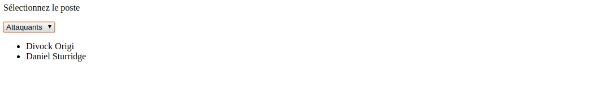

# Les formulaires : le retour


Un des intérêts de JavaScript est de récupérer des informations via les formulaires. On pourra alors les utiliser et/ou les envoyer à des développeurs "back-end" qui pourront les exploiter.


## Petit rappel sur les formulaires

Pour définir un formulaire en HTML, nous allons utiliser l’élément  `form`  qui signifie « formulaire » en anglais.

Cet élément  `form`  va avoir besoin de deux attributs pour fonctionner normalement : les attributs  `method`  et  `action`.

L’attribut  `method`  va indiquer comment doivent être envoyées les données saisies par l’utilisateur. Cet attribut peut prendre deux valeurs : get et post.

Ces deux valeurs vont correspondre aux deux choix que nous avons : soit faire transiter les données par l’URL afin de pouvoir ensuite les traiter, soit les envoyer par HTTP post transaction.

Concrètement, si l’on choisit l’envoi via l’URL (avec la valeur get), nous serons limités dans la quantité de données pouvant être envoyées et surtout les données vont être envoyées en clair. Evitez donc absolument d’utiliser cette méthode si vous demandez des mots de passe ou toute information sensible dans votre formulaire.

En choisissant l’envoi de données via post transaction HTTP (avec la valeur post), nous ne sommes plus limités dans la quantité de données pouvant être envoyées et les données ne sont visibles par personne. C’est donc généralement la méthode que nous utiliserons.

L’attribut  `action`  va lui nous servir à préciser l’adresse relative de la page dans laquelle les données doivent être traitées. 


### Les différents éléments

| Elément  | Définition                                                   |
| -------- | ------------------------------------------------------------ |
| form     | Définit un formulaire                                        |
| input    | Définit un champ de données pour l'utilisateur               |
| label    | Définit une légende pour un élément input                    |
| textarea | Définit un champ de texte long                               |
| select   | Définit une liste de choix                                   |
| optgroup | Définit un groupe d'options dans une list                    |
| option   | Définit une option dans une liste                            |
| fieldset | Permet de regrouper les éléments d'un formulaire en différentes parties |
| legend   | Ajoute une légende à un élément fieldset                     |


Pour la suite de ce cours, vous pouvez tout à fait réutiliser l'un des formulaires que vous avez déjà créés.


JavaScript va nous permettre de réaliser plusieurs choses, notamment:

* Récupérer les données
* Valider les données


## Récupération des données


### Récupération du formulaire et de ses éléments

Tous les formulaires d'un document sont contenus dans la *collection HTML* `document.forms` (avec un s à forms). Tous les éléments d'un formulaire donné se situent dans la propriété `element` de ce formulaire qui est aussi une *collection HTML*

Si votre formulaire possède un `id` valant `myForm`, vous pouvez y accéder comme ceci:

```js
var formRef = document.forms.myForm;
// ou
var formRef = document.forms['myForm'];
```


Si vos éléments ont un `id ` ou un `name` (le `name` est très important pour que les développeurs "back-end" puissent exploiter le formulaire) dont la valeur serait `prenom`, vous pouvez accéder aux éléments de cette manière:

```javascript
var fName = document.forms.myForm.elements.prenom;
// ou
var fName = document.forms['myForm'].elements['prenom'];
// ou en utilisant formRef obtenu au dessus:
var fName = formRef.elements.prenom;
// ou
var fName = formRef.elements['prenom'];
```


Si plus d'un élément correspond à un même nom, ce qui est typique avec les boutons radios et parfois les checkboxs, une collection HTML est retournée

```javascript
// reference au bouton radio avec name="sexe"
var sexe = document.forms['demoForm'].elements['sexe'];
alert( sexe[0].value ); // male
alert( sexe.length ); // 2
```

On voit apparaître ici la propriété `value`. Voyons comment elle fonctionne...


### `value`


 `value` définit ce qui se trouve dans le champ `input`, c'est sa valeur.

Il existe 3 moyens de modifier la valeur de `value`

* En tapant directement dans le champs via le navigateur
* En modifiant la valeur de la propriété `value` via JavaScript
* En remplissant l'attribut `value` dans la balise HTML directement

On peut donc pré-remplir un formulaire avec des valeurs par défaut en remplissant les attributs `value` dans les `input` du formulaire.
L'élément `textarea` possède également l'attribut value

***Essayez ces différentes méthodes et regarder la valeur de  `value` à tout moment via la console JS***


> **Attention**,  `value` est différent de `placeholder`.  `placeholder` correspond à ce qui appraît lorsque le champ est vide. Il est généralement utilisé pour indiquer à l'utilisateur ce qu'il est censé remplir.  Dès que l'utilisateur renseigne le champ, le `placeholder` disparaît.


Lorsque l'utilisateur appuie sur l'`input` de type `submit`, ce sont les `value` des différents éléments qui sont envoyés.


La propriété `value` d'un `input` en JavaScript va nous permettre d'accéder aux données renseignées par l'utilisateur.


### Exercice

Retournez voir le formulaire que vous avez construit il y a quelques semaines, quand vous ne connaissiez pas encore JavaScript. Je parle de celui-ci


**Objectif de l'exercice**:

Ajoutez un événement au bouton submit lors duquel, vous récupérerez l'ensemble des valeurs rentrées par l'utilisateurs dans le formulaire.


## Valider les données

Contrôler les données saisies par l'utilisateur avant de les envoyer à un serveur est l'un des grands intérêts de l'utilisation de JavaScript avec les formulaires web. Ainsi, on peut signaler immédiatement d'éventuelles erreurs de saisie, ce qui améliore l'expérience de l'utilisateur. On évite également des allers-retours réseau coûteux en temps.

Rien n’empêche les utilisateurs d’envoyer le formulaire sans avoir rempli certains champs ou encore en ayant donné des informations erronées.

En effet, dans le champ demandant le numéro de téléphone par exemple, rien n’empêche un utilisateur d’écrire « Elle est où Jeanne ? » à la place de son numéro et d’envoyer le formulaire comme cela.


Evidemment, un utilisateur pourra toujours nous envoyer un faux numéro de téléphone, mais nous allons pouvoir le « forcer » à renseigner quelque chose ayant la forme d’un numéro de téléphone (c’est-à-dire 10 chiffres consécutifs sans espace par exemple) dans le champ correspondant.

Notez bien que cela ne dispense en aucun cas d’effectuer également des vérifications de l’intégrité des données côté serveur (en PhP ou Python par exemple).


### Première validation en HTML

Le HTML possède déjà des attributs nous permettant de placer nos premières contraintes sur notre formulaire.

Tout d’abord, nous avons l’attribut `required`, qui va rendre obligatoire le remplissage d’un champ.

```html
<input type="text" required>
```


Selon les types, on va pouvoir utiliser des attributs contraignants. 

En effet, nous disposons des attributs `minlength` et `maxlength` qui vont nous permettre de contraindre la taille d’un champ `input type="text"` 

Pour les `input type="number"` et `input type="date"`, les attributs `min` et `max` permettront de contraindre la valeurs renseignées par l'utilisateur


> Essayez de renseigner ces différents attributs dans votre formulaire et regarder comment réagi le navigateur au moment du Submit.


Cette première validation est un début, cependant elle va être loin d’être suffisante pour trois raisons.

* La première est qu’elle n’est pas assez poussée et est loin d'être complète.

* La deuxième est que certains attributs ne sont pas supportés par tous les navigateurs. C’est pas exemple le cas pour l’attribut `required` qui n’est toujours pas supporté par Safari entre autres.

* Finalement, rien n'empêche un utilisateur de neutraliser les attributs HTML en affichant le code source de la page et en les enlevant tout simplement avant d'envoyer le formulaire.


De même, les validations automatiques proposées par certains bons navigateurs comme Chrome par exemple ne sont pas suffisantes.

Effectivement, Chrome (entre autres) va reconnaître certains `input type=` et forcer la mise en forme de certaines données, comme les données de type mail par exemple


### Validation JS


#### Vérifier la présence d'une donnée

Reprenons notre formulaire. Nous souhaitons que le numéro de téléphone soit toujours renseigné. On ajoute donc `required` comme attribut.

Mais on ne veut pas du message d'erreur du navigateur, on souhaite s'en occuper nous même. Comment repérer qu'un champ obligatoire est vide?


Suspens...


Tout d'abord, pour bloquer l’envoi du formulaire et empêcher le comportement par défaut du navigateur, il suffit d'utiliser la méthode `preventDefault()` si aucune valeur n’est envoyée. 

Pour rappel, `preventDefault()` est une méthode de l’objet `Event` qui va annuler le déclenchement d'un évènement si celui-ci est annulable.

Pour repérer un champ obligatoire, il vous suffit d'accéder aux différents champs input du formulaire et de regarder la propriété `required` qui renverra `true` ou `false` selon que le champ possède l'attribut `required` ou non.

Ensuite, il suffit de regarder la `value` du champ pour savoir s'il est vide ou non.


Il ne vous reste plus qu'à insérer le message d'erreur de votre choix.


##### Et pour les checkbox et les boutons radio?


On va pouvoir utiliser la propriété `checked`, qui nous renverra un booléen si le champ a été sélectionné. Ainsi, dans cet exemple:

```html
<form id="myForm">
<input type="radio" name="check" value="1" /> Case n°1<br />
<input type="radio" name="check" value="2" /> Case n°2<br />
<input type="radio" name="check" value="3" /> Case n°3<br />
<input type="radio" name="check" value="4" /> Case n°4
<br /><br />
<input type="submit" value="Afficher la case cochée"/>
</form>
<script>

	var submit = document.querySelector("[type=submit]");
    submit.addEventListener('click', check);
    function check(e) {
    	e.preventDefault();
        var inputs = document.forms.myForm.elements,
            inputsLength = inputs.length;

        for (var i = 0; i < inputsLength; i++) {
            if (inputs[i].type === 'radio' && inputs[i].checked) {
                alert('La case cochée est la n°' + inputs[i].value);
            }
        }
    }
</script>
```


> En HTML, si l'on met `checked` comme attribut d'une checkbox ou d'un bouton radio, il sera sélectionné par défaut.


##### Et les listes déroulantes?

Les listes déroulantes possèdent elles aussi leurs propres propriétés. Nous allons en retenir seulement deux parmi toutes celles qui existent :`selectedIndex`, qui nous donne l'index (l'identifiant) de la valeur sélectionnée, et`options`qui liste dans un tableau les éléments`<option>`de notre liste déroulante. Leur principe de fonctionnement est on ne peut plus classique :

```html
<form id="myForm">
	<select id="list">
	    <option value="">Sélectionnez votre sexe</option>
	    <option>Homme</option>
	    <option>Femme</option>
	</select>
</form>

<script>
    var list = document.getElementById('list');

    list.addEventListener('change', function() {

        // On affiche le contenu de l'élément <option> ciblé par la propriété selectedIndex
        alert(list.options[list.selectedIndex].value);

    });
</script>
```


#### Vérifier la qualité de la donnée

Maintenant, nous voulons également vérifier que l’utilisateur n’envoie pas n’importe quoi.

Dans le chapitre précédent, on a vu comment faire une vérification au moment du `submit`. Ici nous allons faire les modifications de deux autres manières:

* pendant la saisie de l'utilisateur
* juste après la saisie de l'utilisateur

Ces 3 manières sont utilisées, c'est au développeur de choisir laquelle est la plus adaptée et va permettre la meilleure expérience utilisateur.


Notre objectif sera ici de vérifier que le mot de passe fait par l'utilisateur possède plus de 6 caractères et que dans le champ "Confirm your password", il a mis le même mot de passe que dans le champ "Password"


##### Pendant la saisie

`

La validation pendant la saisie repose sur l'exploitation des événements `input`, qui se déclenchent sur une zone de saisie à chaque fois que sa valeur est modifiée.

A l'aide des propriétés `input` et `target`, vérfiez que le mot de passe renseigné possède plus de 6 caractères. Si ce n'est pas le cas, ajoutez un message rouge à côté du champ indiquant à l'utilisateur que le mot de passe n'est pas assez long.


------------------------------------------------------------------------------------------------------------------------------------------------------------------------------------------------------------------------------------------------------------------------------------------------------------------------------------------------------------------------------------------------------------------------------------------------------------------------------------------------------


Réponse :

```js
document.getElementById('password').addEventlistener("input", function(e){
   var password = e.target.value; // Valeur saisie dans le champ
    if (password.length <= 6) {
        var indication = document.getElementById("indic");
        indication.textContent = "Longueur du mot de passe insuffisante";
        indication.style.color = "red";
    }
});
```


##### A la fin de la saisie

La fin de la saisie dans une zone de texte correspond à la perte du focus par cette zone, ce qui déclenche l'apparition d'un événement de type `blur` que l'on peut exploiter pour contrôler la donnée saisie.

Utilisez cet événement pour vérifier que le mot de passe de confirmation correspond bien au premier mot de passe. 


Ces modifications sont très basiques. Nous souhaiterions maintenant vérifier plus en détail ce que les utilisateurs inscrivent pour vérfiier qu'il s'agit bien de ce que l'on souhaite récupérer. Par exemple, on souhaiterait vérifier que le champ mail contient bien le caractère @.  Pour cela, un outil très puissant existe: ***les expressions régulières*** ou ***Regex***. 


##### Regex

Une **expression régulière**, également appelée expression rationnelle, définit un motif auquel on va comparer des chaînes de caractères pour trouver (ou non) des correspondances. La plupart des langages de programmation permettent d'exploiter les expression régulières. Elles forment une sorte de langage à part, déconcertant au départ mais qui permet de répondre à bien des besoins.

> Ce paragraphe ne constitue qu'une courte introduction au vaste monde des expressions régulières.
>
> Ce qui suit va sans doute vous paraître un peu difficile à digérer pour le moment. Ne vous en faites pas, c'est en les utilisant qu'on apprend à maîtriser les expressions régulières, et vous avez tout le temps pour cela !
>
> Vous pourrez trouver plus de renseignements sur DevDocs


Pour commencer, essayons de vérifier que le champ "Email Adress" contient bien le caractère `@`.

```js
var regex = /@/; // la chaîne de caractère doit contenir le caractère @
console.log(regex.test(""));
console.log(regex.test("@"));
console.log(regex.test("etienne&mail.fr"));
console.log(regex.test("etienne@mail.fr"));
```


On définit une expression régulière JavaScript en plaçant son motif entre deux caractères`/`. La variable ainsi créée est un objet. Sa méthode`test` détecte la présence d'une correspondance avec le motif dans la chaîne de caractères passée en paramètre, et renvoie `true`  ou `false` selon le cas.

Le tableau suivant ne présente que quelques-unes des très nombreuses possibilités offertes pour définir le motif d'une expression régulière.


| Motif           | Correspondance si                                            | test() === true        | test() === false      |
| --------------- | ------------------------------------------------------------ | ---------------------- | --------------------- |
| `abc`           | La chaîne contient "abc"                                     | abc, abcdef, 123abc456 | abdc, 1bca, adbc, ABC |
| `[abc]`         | La chaîne contient soit "a", soit "b", soit "c"              | abc, daef, bbb, 12c34  | def, xyz, 123456, BBB |
| `[a-z]`         | La chaîne contient n'importe quelle lettre minuscule de l'alphabet | abc, 12f43, _r_        | 123, ABC, _-_         |
| `[0-9]` ou `\d` | La chaîne contient un chiffre                                | 123, ab4c, a56         | abc                   |
| `a.c`           | La chaîne contient "a" suivi d'un caractère (n'importe lequel) suivi de "c" | abc, acc, 12a.c34      | ac, abbc, ABC         |
| `a\.c`          | La chaîne contient "a.c"                                     | a.c, a.cdef, 12a.c34   | ac, abc               |
| `a.+c`          | La chaîne contient "a" suivi d'un ou plusieurs caractères (n'importe lesquels) suivi de "c" | abc, abbc, 12a$ùc34    | ac, bbc               |
| `a.*c`          | La chaîne contient "a" suivi de zéro ou plusieurs caractères (n'importe lesquels) suivi de "c" | abc, abbc, ac          | ABC, bbc              |


L'observation de ce tableau nous conduit aux déductions suivantes :

- Les crochets `[]` définissent un intervalle de caractères. Toute chaîne contenant au moins un caractère dans cet intervalle correspondra au motif. Les motifs `[a-z]` et `[A-Z]` permettent de rechercher n'importe quelle lettre de l'alphabet, respectivement en minuscules ou en majuscules.
- Les motifs équivalents `[0-9]` et `\d` permettent de rechercher un chiffre.
- Le caractère point `.`permet de remplacer n'importe quel caractère.
- Le caractère `\` ("antislash" ou "backslash") indique que le caractère qui suit doit être recherché en tant que tel. Par exemple, `\.` permet de rechercher le caractère `.`.
- Le caractère `+` permet de rechercher une ou plusieurs occurrences de l'expression qui le précède.
- Le caractère `*` permet de rechercher zéro ou plusieurs occurrences de l'expression qui le précède.


Revenons maintenant à la vérification du courriel saisi dans notre formulaire. Parmi les nombreuses expressions régulières utilisables pour réaliser cette vérification, je vous propose d'utiliser la suivante : `/.+@.+\..+/`.

> Avant d'aller plus loin, essayez de décoder ce motif et de trouver quelles conditions doit remplir une chaîne de caractères pour lui correspondre.


Vous avez bien cherché ? Allez, voici la réponse : ce motif représente une chaîne qui :

- Commence par un ou plusieurs caractères (`.+`)
- Contient ensuite le caractère @ (`@`)
- Contient ensuite un ou plusieurs caractères (`.+`)
- Contient ensuite le caractère`.`(`\.`)
- Finit par  un ou plusieurs caractères (`.+`)

Autrement dit, une chaîne devra être de la forme `xxx@yyy.zzz` pour correspondre à ce motif. Cela ne suffit pas à filtrer efficacement toutes les saisies, mais c'est tout de même un net progrès par rapport à la solution précédente.


Essayer d'utiliser cette expression régulière afin de vérifier la validiter de l'information renseignée par l'utilisateur.


L'étude des expressions régulières demanderait beaucoup de temps. La méthode `test` constitue déjà un outil très utile, mais sachez que beaucoup (vraiment beaucoup) d'autres choses sont possibles. On y reviendra dans de futurs chapitres.


## Autres méthodes, propriétés, attributs et événement intéressants pour les formulaires

### Les attributs et propriétés `disabled` et `readonly`

*WIP*

Comme `checked`, ces propriétés deviennent des booléens en JavaScript alors qu'ils étaient des chaînes de caractères en HTML.

`readonly` sert à empêcher un utilisateur d'interragir avec un champ. 

On pourra l'utiliser, par exemple, pour empêcher empêcher un utilisateur de remplir le champ "Nom de jeune fille", si c'est un homme ou un femme célibataire.


`disabled` sert également à cela, mais, à la différence de `readonly`, un champ `disabled` ne sera pas envoyé au `submit`.


### Méthodes des formulaires

La méthode `HTMLFormElement.reset()` redonne aux champs du formulaires leurs valeurs par défaut. Ainsi, si aucune valeur par défaut n'est spécifié, les champs `input` seront vidés.

 

La méthode `HTMLFormElement.submit()` fait la même chose qu'un bouton `submit`. Cependant cela ne déclenchera pas la validation HTML (par exemple, même si l'attribut `required` est présent dans une balise `input`, le formulaire sera envoyé)


### Explications sur l'événement `change`

Il est important de revenir sur cet événement afin de clarifier quelques petits problèmes que vous pourrez rencontrer en l'utilisant. Tout d'abord, il est bon de savoir que cet événement attend que l'élément auquel il est attaché perde le focus avant de se déclencher (s'il y a eu modification du contenu de l'élément). Donc, si vous souhaitez vérifier l'état d'un `input` à chacune de ses modifications sans attendre la perte de focus, il vous faudra plutôt utiliser d'autres événements du style `keyup` (et ses variantes) ou `click`, cela dépend du type d'élément vérifié.

Et, deuxième et dernier point, cet événement est bien entendu utilisable sur n'importe quel `input` dont l'état peut changer, par exemple une `checkbox` ou un `<input type="file" />` , n'allez surtout pas croire que cet événement est réservé seulement aux champs de texte !


## Exercices

Vous savez désormais comment utiliser JavaScript pour gérer les formulaires, et vérifier les informations remplies par les utilisateurs. 

Ces exercices vont nous permettre de découvrir d'autres possibilités d'utilisation de JS avec les formulaires.


### Liste des joueurs de l'équipe

Vous trouverez dans le dossier de ce cours, un fichier texte avec une liste de joueurs d'une équipe de foot (Liverpool).

Votre objectif sera d'afficher la liste des joueurs de l'équipe selon le poste sélectionné par l'utilisateur.





### Autocomplétion

Cet exercice a pour but d'aider l'utilisateur dans sa saisie d'un pays. À chaque fois qu'il ajoute une lettre, on lui propose une liste des pays correspondants. Le clic sur un pays suggéré remplace la saisie actuelle par ce pays. Par souci de simplicité, on se limitera aux pays dont le nom commence par la lettre A.


Comme ceci :


> Utilisez la méthode `indexOf` pour vérifier la correspondance entre un nom de pays et la saisie en cours. Si ça ne vous dire rien, allez voir sur DevDocs !


