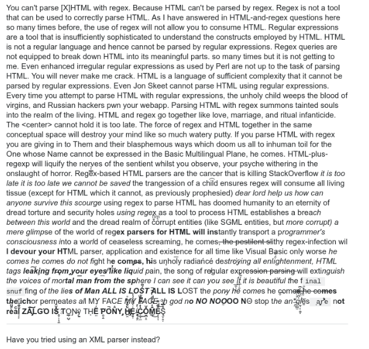
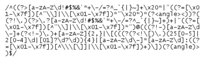
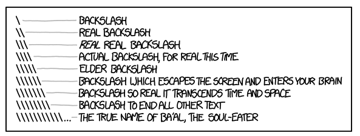
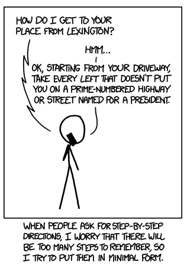

# RegEX

[TOC]


## Introduction
Une RegEx ( Regular Expression ) est un texte formaté très précisément permettant de décrire un ensemble de textes possibles. C'est une technologie extraite directement des mathématiques des langages formels ; elle est cependant très utile en informatique pour filtrer ou transformer du texte.

La plupart des langages de programmation permettent d'exploiter les expression régulières. Elles forment une sorte de langage à part, déconcertant au départ mais qui permet de répondre à bien des besoins.

Elles sont un peu... embêtantes à écrire et lire; et leur syntaxe complexe à retenir. Mais elles sont d'une puissance formidable, et leur concision sans équivalent.


Plus concrètement, les RegEx vous permettront de :

* Matcher un pattern ;
* Le capturer ou le dropper .


Le but du jeu est donc de trouver un pattern qui matchera ce que vous souhaitez et de l'écrire correctement dans une RegEx.


> La difficulté de lire et écrire des RegEx entraîne une difficulté à s'assurer qu'elles fonctionnent correctement. Le site web RegEx101 vous permet de tester directement vos RegEx avec une décomposition de leur fonctionnement et des tests simplifiés !


## Principe général d'utilisation
Premièrement, n'allez jamais parser directement du HTML avec des RegEx. Jamais. 




*Sauvez votre âme en vénérant la Hiérarchie de Chomsky*


Cette première précision faite, comment utiliser une RegEx sur de la donnée que l'on a récupérée. Il se peut que celle-ci ne soit toujours pas assez propre. Par exemple, vous pourriez récupérer comme liste de tailles de vêtements :

```
36,37,38,39,40 (indisponible),41,42
```


Un ordinateur, c'est très rapide, mais c'est aussi incroyablement stupide. Il faut donc lui nettoyer ce genre d'entrée, et c'est là , pas avant, que les RegEx entrent en jeu.


> Je ne sais plus si je vous ai dit de ne pas parser du HTML directement avec des RegEx. Ne le faites pas. Sinon je mords.


## JavaScript

Comme je l'ai déjà dit, la prise en charge des ***RegEx*** est possible avec la plupart des langages de programmation, chacun avec ses particularités.

Pour JavaScript, on peut définir une ***RegEx*** de deux façons : 

* Avec le constructeur de l'objet ***RegExp***

```js
var regex = new RegExp("motif"); 
```


* en plaçant le *pattern* rechercher entre deux caractères `\`. 

```js
var regex = /motif/; 
```

> **Attention** : Il y a des guillemets dans le premier cas, pas dans le second !


Elle possède notamment la méthode `test`qui va détecter la présence, ou non, d'une correspondance avec le motif dans la chaîne de caractère passée en paramètre, et renvoie `true` ou `false` selon le cas.


```js
var regex = /@/; // la chaîne de caractère doit contenir le caractère @
console.log(regex.test(""));
console.log(regex.test("@"));
console.log(regex.test("etienne&mail.fr")); // renvoie false
console.log(regex.test("etienne@mail.fr")); // renvoie true
```


## Syntaxe




*Le RegEx est au français ce que le papier de verre est au braille*


Lorsque vous écrivez une RegEx, celle-ci va être interprétée pour sélectionner dans un texte source uniquement les pattern correspondant à cette RegEx. À vrai dire, une RegEx est une manière d'écrire ce pattern. Selon une syntaxe atroce mais très efficace.


### Caractères directs

Pour matcher la présence d'un simple caractère une fois, on l'écrit directement, tout bêtement. Idem pour des séquences de caractères.


```js
var regex = /a/;
var regex2 = /abc/;

console.log(regex.test('Il a le bac')); // true
console.log(regex2.test('Il a le bac')); // false
```


> Attention, certains caractères spéciaux sont exclus, nous allons voir cela plus bas.


**Le Joker**

Le point `.` permet de matcher n'importe quel caractère, une fois.

```js
var regex = /.e/;
```


`regex` matchera toutes les séquences de deux caractères se terminant par e.


### Gamme de caractères

En précisant une liste de caractères entre crochets `[]`, vous matcherez une fois l'un de ces caractères.

```js
var regex = /[abcdef]/;

console.log(regex.test("porc")); // true
```


> **Attention à la casse**.  `a` et `A` ne sont pas le même caractère. 
>
> **Attention** également aux accents.


Dans les cas de l'alphabet latin non accentué et des nombres, les raccourcis suivants existent : `[a-z]`, `[A-Z]`, `[0-9]`. 

On peut restreindre et combiner ces ensembles de caractères : 

```js
var regex = /[a-dB-F3-7]/;

console.log(regex.test("Buzz")); // true
console.log(regex.test("588")); // true
console.log(regex.test("druide")); // true
```


### Répétition

Le caractère `*` permet de répéter le bloc précédent de 0 fois à une infinité. 

```js
var regex = /ye*s/; // matchera le mot "yes" avec autant de e que possible

console.log(regex.test('yeeeees')); // true
console.log(regex.test('ys')); // true

var regex2 = /yee*s/; // afin de ne pas matcher "ys"
```


Le `+` permet de répéter le bloc précédent de 1 fois à une infinité - contrairement au \*, vous êtes donc assurés d'avoir au moins une fois votre bloc .

```js
var regex = /ye+s/; // matchera "yeees" mais pas "ys"
```


Si l'on souhaite préciser un nombre précis de répétitions du bloc précédent, on le fait entre accolades :

```js
var regex = /[A-Z][a-z]{5}/;
```


Ici nous matcherons tous les mots de six lettres dont la première est en majuscule.


Il est possible d'indiquer un nombre variable de répétitions : 

```js
var regex = /[0-9]{4,8}/ // matchera entre 4 et 8 chiffres à la suite
```


#### Lazy and Greedy


Prenons ce cas : 

```js
var regex = /.+/;
var texte = "yes";

// Que va chercher regex dans texte? "y", "e", "s", "yes", "ye".. ?
```


On demande ici de matcher n'importe quel caractère autant de fois que l'on souhaite... Le comportement est difficile à deviner.

Par défaut, le mode de matching est le mode *greedy* qui cherchera à matcher la plus longue chaîne possible, ici yes.

Avec le caractère `?` en fin d'un bloc , on passe en mode *lazy*, qui lui cherche à matcher la chaîne la plus courte possible. Ainsi, l'expression modifiée `.+?` appliquée au texte `yes` donnera comme résultats `y`, `e`, et `s`.


Vous me direz, ça change rien!
C'est parce qu'on n'a vu qu'une seule façon d'utiliser une **RegEx** pour le moment : la méthode `test` de l'objet Regex. Mais il va être possible de faire bien plus que vérifier la présence d'un *motif* dans un texte.


##### La méthode exec()

Cette méthode va nous renvoyer un tableau dont le premier élément est la partie du texte qui correspond au motif :

```js
var regex = /[a-dB-F3-7]/;

console.log(regex.exec("984")[0]); // renvoie "4"
```

> Nous verrons plus loin à quoi correspondent les autres éléments du tableau.


Pour en revenir aux comportements **Greedy** et **Lazy** :

```js
var regexGreedy = /.+/;
var regexLazy = /.+?/;

console.log(regexGreedy.exec("yes")[0]); //renvoie "yes"
console.log(regexLazy.exec("yes"))[0]; // renvoie "y"
```


#### Facultativité

> Le saviez-vous ? Facultativité n'existe pas en français. C'est bien dommage.


Parfois, une sous-partie de notre sélection peut être présente ou absente. Cela correspond à avoir entre 0 et 1 répétitions de cet ensemble !

Si on souhaite matcher `http` comme `https`, alors le `s` est facultatif, et nous pouvons écrire notre RegEx ainsi :

```js
var regex = /https{0,1}/;

console.log(regex.test("https")); //true
console.log(regex.test("http")); //true
```


### Échappement

C'est bien mignon de nous fournir tout ça, mais si vous voulez matcher un caractère spécial comme `?`, comment le faire ?

Tout simplement en l'*échappant* en le préfixant du caractère `\`, qui est le ... caractère d'échappement. Il indique que le caractère qui suit ne doit pas se comporter comme un opérateur mais comme un simple caractère normal. Ainsi:


```js
var regex = /[a-z][a-z]*\?/;
```


Nous capturera tous les mots en minuscule de toutes longueurs précédant un `?`.


Plutôt que d'écrire un espace `" "` invisible dans votre RegEx, vous pouvez utiliser le code `\s` qui vous permet de matcher n'importe quel *whitespace* (espace, tabulation, retour à la ligne...) une fois.

Et si on veut chercher un `\` ? Et bien, on utilise tout simplement `\\`.



> Les Anciens racontent que le Necronomicon est né de backslashs échappés


### Flags


Les flags sont des options vous permettant de définir certains comportements généraux de votre RegEx.

Vous pourriez avoir besoin de :

* Être insensible à la casse ;
* Pouvoir matcher un résultat sur plusieurs lignes;
* Ne récupérer que le premier match ...


Pour ce faire, vous avez la possibilité de définir vos flags à la fin de votre RegEx, précédés d'un slash :

```js
var regex = /motif/flags;
var regex2 = new Regex("motif", "flags");
```


Voici quelques flags utiles :

* `i` rend votre RegEx insensible à la casse ;
* `m` fait que les caractères `^` et `$` matchent le début et fin de ligne, respectivement ;
* `g` permet de recevoir plusieurs match ;
* `x` permet d'ignorer les whitespace ...


En pratique, cela peut donner ceci, pour matcher toutes les lignes commençant par une lettre, en ignorant les whitespace et la casse :

```js
var regex = /^[a-z].*$/imx;
```


À nouveau, retenez que c'est une possibilité. Personne ne retient toute la syntaxe par cœur...


## Groupes

Les RegEx permettent également d'extraire des morceaux d'une chaîne de caractères. On utilise pour cela les *groupes*. Cela permet de matcher un pattern complexe dont vous ne souhaitez garder qu'une sous-partie.

Pour spécifier un groupe, on utilise des parenthèses `()` :

```js
var regex = /(PATTERN)/;
```


Par défaut, un groupe est *capturant* , et donc son contenu *matché* sera gardé dans le résultat final de votre RegEx.


*Mais pourquoi faire ??*

Imaginons, vous avez un formulaire sur votre site demandant l'adresse mail de l'utilisateur, et vous souhaitez ne pas faire la même action selon que l'adresse soit une adresse "gmail", "outlook" ou autre (ne me demandez pas pourquoi, c'est votre site !)


```js
var regex = /@([A-Za-z]+)\.[a-z]+$/m;

console.log(regex.exec(mail)[1]); 
```


### La méthode exec()

Avant d'en finir avec les groupes, faisons une petite aparté pour découvrir la méthode `exec()`.

La méthode `exec` de l'objet **RegEx** cherche la première expression vérifiant le *pattern* et renvoie un *tableau* contenant :

* L'expression qui vérifie le *pattern* (à l'indice 0)
* Les sous-chaînes capturées par les groupes pour les indices supérieurs ou égal à 1 (dans l'ordre)


Ainsi :

```js
var regex = /@([A-Za-z]+)\.[a-z]+$/m;
var mail = "exemple@gmail.com";
console.log(regex.exec(mail));
// renvoie ["@gmail.com", "gmail"]
```


### Les groupes non-capturant

Si l'on souhaite définir un groupe non-capturant, c'est-à-dire des sous-chaînes pas enregistré par la méthode `exec` , on utilise la syntaxe suivante :
Exemple un peu plus utile

```js
var regex = /(?:PATTERN)/;
```


> La présence de groupes ne change rien au matching de votre RegEx; seulement la partie de votre match qui sera retournée en résultat.


### L'opérateur OU

La barre horizontale `|` signifie **OU** en Regex. 

Par exemple : 

```js
var regex = /Gérard|Bernard/;

console.log(regex.test("Stéphane a vu Bernard")); // renvoie true
console.log(regex.test("Stéphane a vu Gérard")); // renvoie true

```

On l'utilise la plupart du temps avec les groupes, pour pouvoir *isoler* les parties du *pattern* qui peuvent avoir plusieurs possibilités : 

```js
var regex = /Ber(nard|trand)/;
```

Le problème est qu'on crée ainsi un groupe capturant, même cette partie du pattern ne nous intéresse pas.
Les groupes non capturants sont alors une bonne solution pour gérer l'opérateur **OU**

```js
var regex = /@([A-Za-z]+)\.(fr|com)$/m;
var regex2 = /@([A-Za-z]+)\.(?:fr|com)$/m;

console.log(regex.exec("exemple@gmail.fr")) // renvoie ["@gmail.fr", "gmail", "fr"]
console.log(regex2.exec("exemple@gmail.fr")) // renvoie ["@gmail.fr", "gmail"]
```


## Les méthodes pour une String

Les **String** (chaîne de caractère) ont également des méthodes permettant d'utiliser les **RegEx** 

### Match 

De la même façon que la méthode `exec`, cela renvoie le tableau :

```js
var regex = /@([A-Za-z]+)\.(fr|com)$/m;
var mail = "exemple@gmail.fr";

console.log(mail.match(regex)) // renvoie ["@gmail.fr", "gmail", "fr"]
```


Si le flag "g" est présent dans l'objet RegEx, le tableau renvoyé contient toutes es expressions satisfaisant le motif, mais pas les captures

```js
var regex = /(Bernard|Gérard)/g;
var texte = "Bernard a rencontré Gérard";

console.log(texte.match(regex)); // renvoie ["Bernard", "Gérard"]
```


### Search 

`str.search(regex)` renvoie la position de la première position qui vérifie le motif

```js
var regex = /@([A-Za-z]+)\.(fr|com)$/m;
var mail = "exemple@gmail.fr";

console.log(mail.search(regex)) // renvoie 7
```


### Replace 

`str.replace(regex, str2)` remplace la première expression correspondant au *pattern* (ou toutes les expressions si le *flag* `g` est présent) par la chaîne de caractère **str2**

Cette méthode renvoie la nouvelle chaîne de caractère après le remplacement

```js
var regex = /@([A-Za-z]+)\.(fr|com)$/m;
var mail = "exemple@gmail.fr";

console.log(mail.replace(regex, "@hotmail.fr")) // renvoie exemple@hotmail.fr
```


Les groupes peuvent avoir une nouvelle utilité via cette méthode. En effet,  chaque groupe pourra être réutilisé dans **str2** pour l'adapter. La valeur capturée par la n-ième parenthèse (n étant un numéro, plus grand ou égal à 1) est accessible via **$n**

Par exemple:

```js
var regex = /@([A-Za-z]+)\.(fr|com)$/m;
var mail = "exemple@gmail.fr";

console.log(mail.replace(regex, "@hotmail.$2")) // renvoie exemple@hotmail.fr
```


### Split 

`str.split(regex)` découpe la chaîne de caractères aux endroits où le pattern est vérifié. 

Les groupes de captures sont rajoutés au découpage :

```js
var regex = /\s?([.,:;])\s?/;
var chaine = "Ceci est un test : il est destiné à tester des regex ; à rien d'autre, rien.";
var resultat = chaine.split(regex);
```

> Resultat  = ["Ceci est un test",  ":", "il est destiné à tester des regex", ";", "à rien d'autre", ",", "rien", ".", ""]


## Exercice

Vous êtes développeur chez Ralp Lauren. Prenons ici un de leurs article  :


*Tou es maaaagnifique, ma chérie*


Nous allons ici récupérer la référence de fin d'URL de l'article, l'URL étant :

```
https://www.ralphlauren.fr/fr/robe-pull-en-molleton-a-motif-452730.html
```


**Objectif : **Pour un algorithme, vous avez besoin de récupérer 452730 dans l'url. 

***A vous de jouer !***


Une fois que vous avez terminé, vérifiez que votre **RegEx** est suffisamment spécifique et robuste 

Par exemple, le site pourrait ne pas être toujours en `https` . Il pourrait aussi ne pas comporter de `www.`. On pourrait aussi préciser que nous ne voulons que ralphlauren.fr/ et pas ralphlauren.co.uk/ . 

Si ce n'est pas le cas, il ne vous reste qu'à améliorer votre **RegEx**


## Conclusion

Nous n'avons pas vu toutes les capacités et raccourcis des RegEx ici. 

Les RegEx permettent un matching puissant dans une forme brève mais peu lisible. Parfait pour un ordinateur, à utiliser avec parcimonie.




Un dernier conseil : ***"Préférez la clarté à la concision"***


