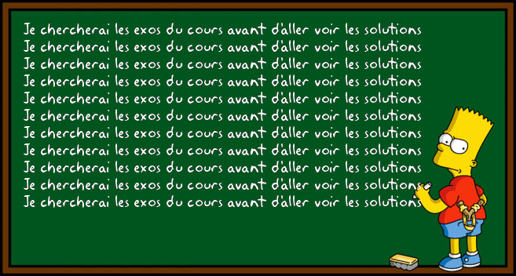
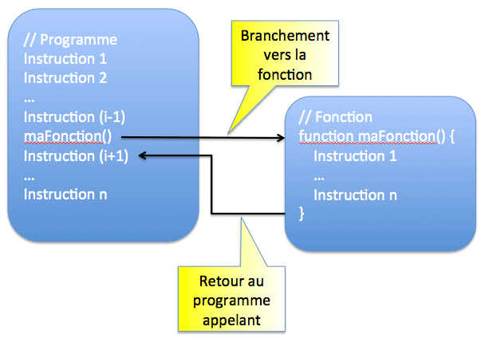

# Les bases de l'algorithmie pour JavaScript
JavaScript est un langage incontournable dans le développement web complémentaire au HTML et au CSS. La ou le HTML permet de coder ce que contient une page web, le CSS comment la page s'affoche, le JavaScriptvaScript permet de controler comment la page se comporte.
C'est donc le langage qui sera derrière les comportement dynamiques conditionnels "faire ci si il y a ça", les actions "ce qui se passe quand je fais ça"...

Mais le JavaScript est un langage à part entière ! Le but de ce tutorial et d'introduire les concepts de l'algorithmie au travers de ce langage. C'est à dire :
- Les **variables** qui permette de manipuler avec des noms les données que l'on manipule
- Les **statements** commes les conditions, les boucles qui permettent de faire la manipulation
- Les **fonctions** qui permette de regrouper un certains nombre de manipulation sur une _entrée_ pour donner une _sortie_
- Les types de données **data type** classque comme les string, les liste, les chiffres, les dates et les manipulation qui leur sont propre
- Des exemples d'**algorithmes classique** sur ces types. C'est à dire l'utilisation de manipulation sur nos types pour un but précis : rechercher dans une liste, renversement d'une liste...
- La notion d'**objet** et d'attruibu qui permet de regrouper ensemble plusieurs caractéristique de type classique (nombre, chaine de caractére) autour d'une meme eentité qui peut à son tour etre manipulé


[TOC]


## Introduction
Le Javascript est un langage de script incorporé dans un document HTML. Historiquement il s'agit même du premier langage de script pour le Web. Ce langage est un langage de programmation qui permet d'apporter des améliorations au langage HTML en permettant d'exécuter des commandes du côté client, c'est-à-dire au niveau du navigateur et non du serveur web.

Ainsi le langage Javascript est fortement dépendant du navigateur appelant la page web dans laquelle le script est incorporé, mais en contrepartie il ne nécessite pas de compilateur, contrairement au langage Java, avec lequel il a longtemps été confondu. 

Pour tester et faire nos exercices en JavaScript on va donc devoir "interpreter" le code qu'on écrit. Pour cela on écrira les morceaux de codes dans des fichiers `.js` et on pourra les interpreter directement avec **SublimeText** dans un terminal ou alors directement interagir avec une console Javascript d'un navigateur web.

### Dans sublime text
#### Configuration
On va configurer un systeme de build pour interpreter notre javascript. Pour créer ce système :
* `Tools > Build System > New Build System...`
* Copier le code suivant :
```json
{
"cmd": ["node", "$file"],
"selector": "source.js"
}
```
* Enregistrer le fichier dans la localisation par défault avec le nom `node.sublime-build`

Il suffira ensuite d'ouvrir le fichier `XXXX.js` avec le code JavaScript à tester puis faire `Ctrl` + `B` 

#### Tester proprement son code
Dans un nouveau fichier que l'on va enregistrer au nom de `test.js`, copier puis enregistrez le code suivant :
```js
var a;
a=6;
```
`Ctrl` + `B` devrait simplement ouvrir un bandeau précisant que le code à bien tourné et en combien de temps :

Ce qui est assez peut pratique pour vérifier que tout c'est bien passé. Pour controler ce que l'on fait, on va utiliser le "logging" de la console. ajouter la ligne suivante et relancez le build
```js
var a;  // Ceci est un commentaire
a=6;
console.log(a);
```
Et voilà ! Il suffira d'utiliser `console.log()` sur toutes les varaibles dont on voudra vérifier la valeur dans les exercices.
> On peut noter ici que les commentaire au sein d'une ligne s'écrivent à l'aide de `//` en JavaScript !


### Dans le terminal
Dans le terminal, le principe est le meme, il faut enregistrer le code javascripte dans un fichier `.js` puis l'exeecuter à l'aide de la commande `node`


### Dans un navigateur web
Comme on l'a vu pour le Html et le Css, le role d'un navigateur web est de transformer le code en une page web utilisable. Etant donné que le JavaScript est une des composantes du code des pages web, les navigateur dispose d'une console JavaScript.
C'est ici que l'on pourra observer les `console.log()` des morceaux de JavaScript de la page web qui seront executé lors du chargement ou des interactions de la page web.

Cependant, la Console du Navigateur affiche les messages venant du :
* Contenu web contenu dans tous les onglets du navigateur
* Code du navigateur
* Contenu des modules complémentaires.

Pour acceder à la console sur un navigateur il existe le raccourcis `Ctrl` + `Maj` + `J`.

Alors pour tester du code javascript avec cette console il existe deux options :

**Ligne à ligne**
On écrit ligne par ligne les commandes que l'on veut executer. Celle-ci sont interprété en temps réel au moment on l'on fait entréer par la console.


**Lecture d'un fichier html contenant le code**
Le navigateur a pour role d'executer le code javascript des pages web. Or il existe une balise pour fournir du code JavaScript que le navigateur doit executer au chargement de la page : `<script type="text/javascript">`

Creez un fichier `test.html` contenant le code suivant :
```html
<!DOCTYPE html>
<html>
  <script type="text/javascript">
    console.log("Hello JavaScript console");
    var a;
    a=6;
    console.log(a);
  </script>
</html>
```
Ouvrez le fichier avec votre navigateur puis ouvrez la console. Vous pouvez voire les logs de l'execution de votre code JavaScript !


> Vous avez choisi la méthode qui vous convient le mieux ? Allez c'est parti !

## Variables et littéral

### Fonctionnement
La syntax de JavaScript defini deux types de valeur :
* Les valeurs fixe appelé *literal* comme les nombres `6` et `6.4` ou les chaines de caractères comme `'hello world'`
* Les *variables* qui se manipule grâce à leur nom.

En informatique, les variables sont des symboles qui associent un nom (l'identifiant) à une valeur. Le nom est unique.

Il existe deux types de variables en JavaScript. Celles qui peuvent changer de valeur au cours du temps (dynamique) et celles qui restent constante à toute épreuve (statique).

Pour dire qu'un nom va servir pour l'un ou l'autre des types de variable, il faut le *déclarer* en précédant le mot clef `var` ou `const` avant le nom.

Apres sa declaration, une variable n'a pas encore de valeur. Il faut d'abord lui en assigner une à l'aide du sign `=` (qui est le symbole pour assigner et non pour parler d'égalité) et de la syntaxe `nom=valeur`.

La valeur peut provenir d'une autre variable indiqué par son nom ou d'un *litéral*. Les literal sont les valeurs directement écrite dans le code :

```js
var x, y, z;              // Declaration des variables
const c;                  // Declaration d'une constante
x = 6; y='Hello world';   // On assigne un littéral à x et y
c = 4                     // On assigne un littéral à c
z = x;                    // On assigne la valeur de x à la variable z
console.log(c, x, y, z)
```

> Dans la dernière ligne que c'est la valeur de x qui est associé à z. On aurait le meme résultat avec `z=6`. Et si x est amené à changer de valeur, ce n'est pas le cas de z.

> Les noms utilisés pour les variables sont sensible aux majuscules. Ils doivent toujours ccommencer par une lettre ou `_`

> La déclaration et l'assignement de variable peut se faire en une ligne : `var carName = "Volvo";`

> Une variable peut etre déclarer une deuxième fois, cela n'affectera pas sa valeur si elle a été assignée

Dans la console, ajoutez la ligne `c=3` pour constater l'erreur lorsque l'on essaye d'assigner de nouveau une variable constante.

### Les différents litéraux
Les litéraux correspondent au *types* "simple" (on verra les type plus compliqué par la suite).
* Les entier comme `6`
* Les nombre réels `6.4`
* Les chaines de caractères `'Hello world'`
* Les booléans qui sont `true` et `false` qui nous permette de faire de la logique.

> Les chaines de charactères peuvent etre declarer avec `"` ou `'`
> Par exemple `'` est lui même un caractère. Il peut etre saisi dans une chaine entre `"` ou précédé de `\` entre `'`

Une variable peut changer de type au cours du temps comme elle peut changer de valeur au cours du temps ! Ca peut venir d'un re-assignement ou du resultat d'une opération qui a changer le type.

```js
var x;           // x n'est as défini
x = 5;           // x est un entier
x = "John";      // x est une chaine de charactère
```


### Les opérateurs
#### Opérations
L'interet des variables est qu'ils peuvent etre manipulés pour creer la valeur de nouvelles variables. Les opérateurs sont les suivants :

| Operateur |          Description |
| --------- | -------------------: |
| +         |             Addition |
| -         |          Subtraction |
| *         |       Multiplication |
| **        |          Exponentiel |
| /         |             Division |
| %         | Reste de la division |

Ces opérateur concerne les valeur de *type* chiffre (litteraux entier ou réel ou variable ayant reçu comme valeur un chiffre).
Cependant l'opérateur `+` sert également pour les chaines de caractères. Il correspond à la concatenation (il crée une chaine de caractère des chaines mises bout à bout)


```js
var nb1 = 3;
var nb2 = 2;
var nb3 = nb1 + nb2 - 1;

var txt1 = "John";
var txt2 = "Doe";
var txt3 = txt1 + " " + txt2;
```

Javascript autorise parfois les opérations entre différent type, essayez les codes suivant :
```js
var a = "Hello" + 5;
var b = "5" + 5;
var c = b + 4;
var d = c + "Stop";
var e = 16 + 4 + "Volvo";
console.log(typeof a)
console.log(typeof b)
console.log(typeof d)
console.log(typeof e)
```

> `typeof` permet d'afficher le type de valeur qu'est un littera ou une variable

> Les chaines de characteres de chiffres sont transformé en chiffre

> L'ajout de n'importe quoi à une chaine de charactère contenant au moins une lettre donne une chaine de charactère

> Les réels donne leur type aux entiers dans les opérations

> Exercice : Faites afficher à la console une phrase disant que "Le résultat de la multiplication de 1265 par 246 est : XXX" avec XXX le bon résultat


#### Comparaisons
Une autre famille d'opérateurs important sont les opérateurs de comparaison. Il comparent deux valeur (litterale ou variable) et crée une nouvelle valeur booléenne qui dit si la comparaison est vrai ou fausse.

| Operateur |                                               Description |
| --------- | --------------------------------------------------------: |
| ==        |                                    Les valeurs sont égale |
| ===       |             Les valeurs sont égales et c'est le meme type |
| !=        |                              Les valeurs sont différentes |
| !==       | Les valeurs sont différentes ou ce n'est pas le même type |
| >         |                                               Supérieur à |
| <         |                                               Inférieur à |
| >=        |                                      Supérieur ou égale à |
| <=        |                                      Inférieur ou égale à |

Les 4 premiers opérateurs marche pour tous les types puisqu'il ne s'agit que de dire si les valeurs sont les mêmes ou non. Il marche même parfois entre plusieurs type comme par exemple : `var a = '5'==5` qui donnera `true`.

> ATTENTION, les relations d'ordre pour les chaines de caractère se font lettre à lettre en partant du début ! Ainsi `'abc' < 'b'`. La nuane est importante surtout dans le cas des chiffres puis qu'on a `5 < 12` qui vaut `true` mais `'5' < '12'` qui vaut `false`.

#### Logique
Enfin, `true` et `false` et donc toute expression de comparaison comme celles que l'on a vu au dessus possèdent elles mêmes des opérations de comparaisons :

| Operateur |                                                  Description |
| --------- | -----------------------------------------------------------: |
| a && b    |  Qui verifie si a est vrai (vaut true) ET b aussi (les deux) |
| a \|\| b  | Qui verifie si a est vrai (vaut true) OU b l'est (un des deux) |
| ! a       |                                  Qui donne le contraire de a |

Nous verrons que les comparaisons seront très utile pour géré des boucles et des programmes conditionels !

```js
var a = 3;
var b = 3*a > 6;
var c = false;
var d = b && c;
console.log(d);
```
> Exercice : Que va valoir d ?

### Reassignement
Comme on a vu, le but des variables non-constance est de varier au cours du temps, au cours de l'execution du programme.
Dans le code simple suivant, après une manipulation sur `b`, on change la valeur de `a`. On parle d'update
```js
var a = 2;
var b = 3*a;
a = b;
```
Très souvent, l'update des variable a lieu en fonction de leur ancienne valeure. Et donc JavaScript a developper une palette de raccourcis pour l'update de variables :


| Expression |     Effet |
| ---------- | --------: |
| x++        | x = x + 1 |
| x--        | x = x - 1 |
| x += y     | x = x + y |
| x -= y     | x = x - y |
| x \*= y    | x = x * y |
| x /= y     | x = x / y |
| x %= y     | x = x % y |

```js
var x = 2;
var y;
x += 3;
y = x*3;
x -= y;
y++;
console.log(x)
```
> Exercice : Que va valoir x ?

```js
var x, y;
x = 5;
y = 3;
y += '2';
x += y;
```
> Exercice : Quel est le type de x ?


## Statements
On appelle statement les mots clés réservé du langage qui servent à donner des instructions particulière à l'ordinateur dans le déroulement du programme.
Il s'agit de série d'instructions comme celles que l'on a déjà vu (déclaration, assignation, opérations) mais utilisé dans un contexte particulier :
* De façon conditionnelle, c'est à dire en fonction du vrai ou faux d'autres variables (booléenne)
* De façon répétée, soit un nombre de fois convenu, soit tant qu'une condition (sur des variables) est ou n'est pas vérifié

### Conditions
L'idée est de ne réaliser des instructions que si une variable booléenne, une comparaison ou n'importe quelle combinaison de variable donnant un booléen est vrai. Si c'est faut, l'instruction n'a pas lieu

#### assignement conditionnel
```js
var text, age;
text = "old" ; age = 15;
if (age < 18) text = "Too young";
```
Ici la variable text ne change de valeur que dans le cas ou l'age respecte une certaine condition.

#### Expression ternaire
Ici on a un groupe de de la forme `(condition) ? valeur_si_oui : valeur_si_non` qui est donc une valeur qui vaut la valeur avant les deux points si la condition est vérifié et celle apres sinon.

```js
var voteable = (age < 18) ? "Too young":"Old enough";
```
> Exercice : Demandez un nombre a votre voisin et mettez le dans une variable a, créer une variable b qui vaut "gagné si" a est un multiple de 7 et "perdu" sinon.

#### If ... else
Ici, on a directement le test d'une condition bouléenne puis l'ensemble d'instructions dans le cas ou la condition est validée :
```js
if (condition1) {
  //  block of code to be executed if condition1 is true
}
```
Auquel on peut ajouter les instructions dans le cas contraire
```js
if (condition1) {
  //  block of code to be executed if condition1 is true
} else {
  //  block of code to be executed if the condition1 is false and condition3 is false
}
```
Et meme d'autre condition avant le "dernier cas" qui est donc celui regroupé dans `else`
```js
if (condition1) {
  //  block of code to be executed if condition1 is true
} else if (condition2) {
  //  block of code to be executed if the condition1 is false and condition2 is true
} else if (condition3) {
  //  block of code to be executed if the condition1 is false and condition3 is true
} else {
  //  block of code to be executed if the condition1 is false and condition3 is false
}
```
Comme par exemple :
```js
age = Number(age);
if (isNaN(age)) {
  voteable = "Input is not a number";
} else {
  voteable = (age < 18) ? "Too young" : "Old enough";
}
```
ou :
```
if (time < 10) {
  greeting = "Good morning";
} else if (time < 20) {
  greeting = "Good day";
} else {
  greeting = "Good evening";
}
```
> Exercice : Vous avez une variable `gender` qui vaut "homme" ou "femme", une variable `birth_year` qui est l'année de naissance, une variable `birth_month` qui est le mois de naissance en toute lettre et une variable `zipcode` du code postale. Créer une variable `sécu` qui prévoit les 7 premiers chiffres de la carte vitale.

#### switch

### Boucles

Essayons d'écrire un programme qui affiche tous les nombres entre 1 et 5. Voici ce que nous pouvons écrire avec nos connaissances actuelles.

```javascript
console.log(1);
console.log(2);
console.log(3);
console.log(4);
console.log(5);
```


Même s'il reste relativement court, ce programme est très répétitif. Que se passerait-il si nous devions afficher non pas 5, mais 100 ou même 1000 nombres ? On doit pouvoir faire mieux !

Pour cela, le langage JavaScript offre la possibilité de répéter l'exécution d'un ensemble d'instructions en plaçant ces instructions à l'intérieur d'une **boucle**. Le nombre de répétitions peut être connu à l'avance ou dépendre de l'évaluation d'une condition. A chaque répétition, les instructions contenues dans la boucle sont exécutées. C'est ce qu'on appelle un **tour de boucle** ou encore une **itération**.




#### La boucle while

La boucle `while` permet de répéter des instructions **tant qu'une condition est vérifiée**.

**Exemple d'utilisation**

Voici notre programme d'exemple réécrit avec une boucle`while`.

```javascript
console.log("Début du programme");
var nombre = 1;
while (nombre <= 5) {
  console.log(nombre);
  nombre++;
}
console.log("Fin du programme");
```


**Fonctionnement**

La syntaxe de l'instruction `while` est la suivante.

```javascript
while (condition) {
  // instructions exécutées tant que la condition est vérifiée
}
```

Avant chaque tour de boucle, la condition associée au `while` est évaluée.

- Si elle est vraie, les instructions du bloc de code associé au `while` sont exécutées. Ensuite, l'exécution revient au niveau du `while` et la condition est à nouveau vérifiée.
- Si elle est fausse, les instructions du bloc ne sont pas exécutées et le programme continue juste après le bloc `while`.

Le bloc d'instructions associé à une boucle est appelé le **corps de la boucle**.


#### La boucle for

On a fréquemment besoin d'écrire des boucles dont la condition est basée sur la valeur d'une variable qui est modifiée dans le corps de la boucle, comme dans notre exemple. Pour répondre à ce besoin, JavaScript et la plupart des autres langages disposent d'un autre type de boucle : le `for`.

**Exemple d'utilisation**

Voici notre programme d'exemple réécrit avec une boucle`for`.

```javascript
var compteur;
for (compteur = 1; compteur <= 5; compteur++) {
  console.log(compteur);
}
```


**Fonctionnement**

La syntaxe de l'instruction for est la suivante.

```javascript
for (initialisation; condition; étape) {

    // instructions exécutées tant que la condition est vérifiée

}
```


Son fonctionnement est un peu plus complexe que celui d'un `while`. Lisez attentivement ce qui suit :

- **L'initialisation** se produit une seule fois, au début de l'exécution.
- La **condition** est évaluée *avant* chaque tour de boucle. Si elle est vraie, un nouveau tour de boucle est effectué. Sinon, la boucle est terminée.
- **L'étape**  est réalisée *après* chaque tour de boucle.

Le plus souvent, on utilise l'initialisation pour définir la valeur initiale d'une variable qui sera impliquée dans la condition de la boucle. L'étape sert à modifier la valeur de cette variable.


**Compteur de boucle**

La variable utilisée dans l'initialisation, la condition et l'étape d'une boucle for est appelée le compteur de la boucle.

Par convention, la variable compteur d'une boucle `for` est souvent nommée `i`.

Très souvent,  on n'a pas besoin d'utiliser la variable compteur en dehors du corps de la boucle. Dans ce cas, on peut la déclarer en même temps qu'on l'initialise dans la boucle. Notre programme d'exemple peut être réécrit ainsi :


```javascript
for (var i = 1; i <= 5; i++) {
    console.log(i); // OK
}
console.log(i); // Erreur : la variable i n'est pas visible ici
```


#### Erreurs fréquentes

**Boucle while infinie**

Le principal risque lié à la boucle `while` est la "boucle infinie". Il s'agit d'une erreur de programmation très facile à commettre, donc dangereuse.

Modifiez l'exemple de boucle `while` en oubliant volontairement la ligne qui incrémente la variable `nombre`.

```javascript
var nombre = 1;
while (nombre <= 5) {
    console.log(nombre);
    // La variable n'est plus modifiée : la condition sera toujours vraie
}
```

Lors de l'exécution de ce programme, on effectue un premier tour de boucle puisque la condition`nombre <= 5` est initialement vérifiée. Mais comme on ne modifie plus la variable`nombre` dans le corps de la boucle, la condition est indéfiniment vraie : il s'agit d'une **boucle infinie**.


***Conseil***: *Pour éviter d'écrire par mégarde une boucle infinie, il faut s'assurer que la variable impliquée dans la condition puisse être modifiée dans le corps de la boucle.*


**Manipulation du compteur d'une boucle for**

Imaginons qu'un accès de folie temporaire vous conduise à modifier le compteur d'une boucle`for` dans le corps de la boucle, comme dans l'exemple suivant.

```javascript
for (var compteur = 1; compteur <= 5; compteur++) {
    console.log(compteur);
    compteur++; // La variable est modifiée dans le corps de la boucle
}
```


A chaque tour de boucle, la variable`compteur` est incrémentée deux fois : dans le corps de la boucle, puis dans l'étape exécutée à la fin de chaque tour.

***Attention***: *Quand on emploie une boucle`for`, la modification du compteur de boucle (le plus souvent une incrémentation) est réalisée à la fin de chaque tour de boucle. Sauf exception rarissime, Il ne faut surtout pas modifier le compteur dans le corps de la boucle.*


#### Choix entre un while et un for

Comment choisir le type de boucle à utiliser lorsqu'on doit répéter des instructions dans un programme ?

La boucle `for` a l'avantage d'intégrer la modification du compteur dans sa syntaxe, ce qui élimine le problème des boucles infinies. En revanche, son utilisation implique que le nombre de tours de boucle soit connu à l'avance. Les scénarios où le nombre de tours ne peut pas être prévu à l'avance seront plus simples à écrire avec un `while`. C'est notamment le cas lorsque la boucle sert à contrôler une donnée saisie par l'utilisateur, comme dans cet exemple.

```javascript
var lettre = "";
while (lettre !== "X") {
  lettre = prompt("Tapez une lettre ou X pour sortir : ");
}
```

Le nombre de tours de boucle dépend des valeurs saisies par l'utilisateur : il est imprévisible.

En conclusion, le choix entre un `while` et un `for` dépend du contexte. Toutes les boucles peuvent s'écrire avec un `while`. Si on peut prévoir à l'avance le nombre de tours de boucles à effectuer, la boucle `for` est le meilleur choix. Sinon, il vaut mieux utiliser le `while`.


#### Exercices

**Table de multiplication**

Créez un programme pour afficher la table de multiplication d'un nombre choisi


**Puissance**

Créer un programme qui permet de calculer les puissances d'un nombre choisi

*Rappel*: *a puissance 3 = a x a x a*


**FizzBuzz**

Ecrivez un programme qui affiche tous les nombres entre 1 et 100 avec les exceptions suivantes :

- Il affiche "Fizz" à la place du nombre si celui-ci est divisible par 3.
- Il affiche "Buzz" à la place du nombre si celui-ci est divisible par 5 et non par 3.
- Il affiche "FizzBuzz" à la place du nombre si celui-ci est divisible à la fois par 3 et par 5.

Vous pouvez utiliser l'opérateur modulo `%` qui renvoie le reste de la division d'un entier par un autre.

Par exemple

```javascript
console.log(10 % 2); // 0
console.log(10 % 3); // 1
console.log(11 % 3); // 1
```


## Types de variables

Dans les variables, on peut stocker autre chose que des nombres et des mots. On peut y stocker différents types de valeurs.

Les types de valeurs vont avoir une influence sur notre code, puisqu’on ne stockera pas de la même façon un chiffre ou une chaîne de caractères (un texte) par exemple dans une variable.

Nous ne pourrons pas non plus effectuer les mêmes opérations sur les variables selon le type de valeurs qu’elles stockent.


### Number

Ce premier type de valeur, on l'a déjà vu, ce sont tous les nombres ou chiffres, qu’il soit positif, négatif, entier ou à virgule.

Pour affecter une valeur de type Number à une variable, on n’utilise ni guillemet ni apostrophe.

***Faites attention*** : *lorsque nous codons nous utilisons toujours des notations anglo-saxonnes, ce qui signifie qu’il faut remplacer nos virgules par des points pour les nombres décimaux.*

```javascript
var x = 25;
var y = -75;
var z = 3.14;
```


### String
Le type de valeurs String va représenter les chaînes de caractères, c’est-à-dire les textes.

Si l’on veut stocker une chaîne de caractères dans une variable, il faut entourer notre chaîne par des apostrophes ou des guillemets.

Ce sont justement ces apostrophes ou guillemets qui vont indiquer au JavaScript que l’on stocke une valeur de type String.

```javascript
var prenom = "Jacques";
var nom = "Martin";
var sexe = "Homme";
```

Au niveau des apostrophes / guillemets, vous pouvez choisir les uns ou les autres selon votre préférence.

Cependant, si la valeur stockée contient elle même des apostrophes ou des guillemets, il faudra les échapper au moyen d’un antislash selon ce que vous aurez choisi pour entourer la valeur comme ceci :

```javascript
var prenom = "Je m'appelle Pierre";
var nom = 'On me surnomme "Pierrot"';
```


Même un nombre sera considéré comme étant de type String, c’est-à-dire comme une chaîne de caractères si on l’entoure de guillemets ou d’apostrophes.

Faites bien attention à cela, car ça va avoir une grande influence sur les manipulations que l’on va pouvoir faire sur telle ou telle variable !

```javascript
var x = 25;
var y = "25";
// x  et y n'ont pas le même type
```


**Opérations sur les chaînes de caractères**

***La concaténation***

Concaténer signifie tout simplement mettre bout à bout deux chaînes de caractères afin d’en former une troisième, nouvelle.

Concaténer, c’est donc « additionner » des chaînes de caractères.

En JavaScript, on va pouvoir concaténer grâce à l’opérateur « + ».

Evidemment, nous allons pouvoir appliquer cet opérateur directement à nos variables afin de concaténer leurs contenus respectifs.


Par exemple,

```javascript
var prenom = "Pierre", espace = ' ', nom = "Dupont";
var moi = prenom + espace + nom;
// moi est égal à "Pierre Dupont"

var sport = "courir";
var hobbie = "J'aime " + sport;
// hobbie est égal à "J'aime courir"
```


***Attention***: *Si l’on tente « d’additionner » un nombre et une chaîne de caractères, tout ce qu’il y a derrière la chaîne de caractères sera également considéré comme une chaine de caractères par le JavaScript.*

```javascript
var x = 4 + 2 + "1"; //61
var y = "1" + 2 + 4; //124
var z = 2 + "un" + 4; // 2un4
```


*WIP*

substr et autre méthodes

```js
var browser = 'Mozilla';

console.log(browser.substr(1, 2));
// expected output: "oz"
```


#### Boolean

Une variable en JavaScript peut encore stocker une valer de type Boolean, c’est-à-dire un booléen.

Un booléen, en algèbre, est une valeur binaire (soit 0, soit 1). En informatique, un booléen va être soit la valeur true (vrai), soit la valeur false (faux).

Ce type de valeur peut sembler plus compliqué à appréhender à première vue. Pas d’inquiétude, nous allons souvent l’utiliser par la suite car il va nous être très utile pour effectuer des tests et vérifier si une condition est vérifiée (true) ou non (false).

Une nouvelle fois, faites bien attention : pour qu’une variable stocke bien un booléen, il faut lui faire stocker la valeur true ou false, sans guillemets ou apostrophes.

Si vous rajoutez des guillemets ou des apostrophes, la variables stockera alors la chaîne de caractères true ou la chaîne de caractères false.


```javascript
var a = true;
var b = false;

var c = "true";
// c n'est pas un booléen mais une chaîne de caractère
```


### Date

manipulation et lien avec les str

### Liste
```js
var cars = ["Saab", "Volvo", "BMW"];
```
et les méthodes.

### Objet

```js
var person = {firstName:"John", lastName:"Doe", age:50, eyeColor:"blue"};
```
Avec le concept de méthode : this
```js
var person = {
  firstName: "John",
  lastName : "Doe",
  id       : 5566,
  fullName : function() {
    return this.firstName + " " + this.lastName;
  }
};
```

### null et undefined
```js
typeof undefined           // undefined
typeof null                // object

null === undefined         // false
null == undefined          // true
```


## Fonctions

### Introduction

Pour comprendre l'intérêt des fonctions, regardons cet algorithme qui décrit la préparation d'un plat de pâtes.

```
Début
    Sortir une casserole
    Mettre de l'eau dans la casserole
    Mettre la casserole sur le feu
    Tant que l'eau ne bout pas
      Attendre
    Verser les pâtes dans la casserole
    Tant que les pâtes ne sont pas cuites
        Attendre
    Verser les pâtes dans une passoire
    Remuer la passoire pour faire couler l'eau
    Remettre les pâtes dans la casserole
    Goûter
    Tant que les pâtes sont trop fades
        Ajouter du sel
        Goûter
    Si on préfère le beurre à l'huile
        Ajouter du beurre
    Sinon
        Ajouter de l'huile
Fin
```


Voici le même algorithme, écrit d'une manière différente.

```
Début
    Faire bouillir de l'eau
    Cuire les pâtes dans l'eau
    Egoutter les pâtes
    Assaisonner les pâtes
Fin
```


La première version détaille toutes les actions individuelles à réaliser. La seconde décompose la recette en sous-étapes regroupant plusieurs actions individuelles. Cette version est plus concise et plus facile à interpréter, mais elle introduit des concepts relatifs au domaine de la cuisine comme *cuire*, *égoutter*, ou *assaisonner*. On peut envisager de réutiliser ces concepts pour réaliser d'autres recettes, par exemple la préparation d'un plat de riz.

Jusqu'à présent, vos programmes étaient écrits sur le modèle du premier algorithme : des actions individuelles qui s'enchaînent. Vous allez maintenant apprendre à les concevoir sous la forme d'un ensemble de sous-étapes. En JavaScript, ces sous-étapes sont appelées des fonctions.


### Découverte des fonctions

Une **fonction** est un regroupement d'instructions qui réalise une tâche donnée.

Testez cet exemple utilisant une fonction.

```javascript
function direBonjour() {
  console.log("Bonjour !");
}

console.log("Début du programme");
direBonjour();
console.log("Fin du programme");
```


Décomposons ce morceau de code!

**Déclaration d'une fonction**

Observons la première partie du programme d'exemple.

```javascript
function direBonjour() {

  console.log("Bonjour !");

}
```

Cet extrait permet de créer une fonction nommée `direBonjour()`. Elle n'est constituée que d'une seule instruction qui affiche sur la console le message "Bonjour !".

L'opération de création d'une fonction s'appelle la **déclaration**. Voici sa syntaxe.

```javascript
// Déclaration d'une fonction nommée maFonction

function maFonction() {

  // Instructions de la fonction

}
```

La déclaration d'une fonction s'effectue à l'aide du mot-clé JavaScript `function` suivi du nom de la fonction et d'une paire de parenthèses. Les instructions qui composent la fonction constituent le **corps** de la fonction. Ces instructions sont placées entre accolades et indentées.


**Appel d'une fonction**

Voici la seconde partie de notre programme d'exemple.

```javascript
console.log("Début du programme");

direBonjour();

console.log("Fin du programme");
```

La première et la troisième instructions affichent des messages dans la console.  La deuxième effectue un appel à la fonction `direBonjour()` déclarée plus haut.

**L'appel** d'une fonction s'effectue en écrivant le nom de la fonction suivi d'une paire de parenthèses. 

```javascript
// ...

maFonction(); // Appel de la fonction maFonction

// ...
```

L'appel d'une fonction déclenche l'exécution des instructions qui la constituent, puis l'exécution reprend à l'endroit où la fonction a été appelée. Ce fonctionnement est illustré par le schéma ci-dessous.



**Avantages des fonctions**

Lorsqu'on cherche à résoudre un problème complexe, il est généralement efficace de le décomposer en sous-problèmes plus simples.

Les fonctions permettent d'appliquer ce principe à la création de logiciels : on va décomposer le programme en écrivant plusieurs fonctions, chacune dédiée à un objectif particulier. Le programme fera appel aux fonctions au fur et à mesure de son exécution.

Ecrit sous la forme d'une combinaison de fonctions, le programme sera plus lisible et plus facile à faire évoluer qu'un programme écrit de manière monobloc. De plus, il sera parfois possible de réutiliser certaines fonctions dans d'autres programmes.

Enfin, la création d'une fonction permet de lutter contre la duplication de code : plutôt que de dupliquer le même code dans un programme, on centralise ce code sous la forme d'une fonction et on y fait appel depuis tous les endroits où c'est nécessaire. C'est le même principe que d'externaliser les fichiers CSS


#### Que faire avec les fonctions ?

**Valeur de retour**

Voici une variante de notre programme d'exemple.

```javascript
function direBonjour() {
  return "Bonjour !";
}

console.log("Début du programme");
const resultat = direBonjour();
console.log(resultat); // "Bonjour !"
console.log("Fin du programme");
```


Ce programme produit exactement le même résultat que le précédent.

Dans cet exemple, le corps de la fonction `direBonjour()` a été modifié : l'instruction `console.log("Bonjour !")` a été remplacée par la ligne `return "Bonjour !"`.

L'utilisation du mot-clé `return` dans une fonction permet de lui donner une **valeur de retour**. Son appel produit un résultat qui correspond à la valeur placée juste après le `return` dans la fonction. Ce résultat peut être récupéré par le programme appelant. Ici, la fonction `direBonjour()` renvoie la valeur chaîne`"Bonjour !"`. Cette valeur est stockée par le programme dans la variable `resultat`, qui est ensuite affichée.


Une fonction incluant une instruction `return` renvoie une **valeur de retour** lorsqu'elle est appelée : cette valeur résulte de l'évaluation de l'expression située immédiatement après le `return`.

Cette valeur de retour peut être de n'importe quel type (nombre, chaîne, etc). En revanche, une fonction ne peut renvoyer qu'une seule valeur.

Rien n'oblige à récupérer la valeur de retour d'une fonction, mais dans ce cas, cette valeur est "oubliée" par le programme qui appelle la fonction !


***Conseil***: *Si on essaie de récupérer la valeur de retour d'une fonction qui n'inclut pas d'instruction`return`, on obtient la valeur JavaScript`undefined`.*

```javascript
function maFonction() {
  // Pas d'instruction return
}

var resultat = maFonction();
console.log(resultat); // undefined
```

*Une fonction qui ne renvoie pas de valeur est parfois appelée une **procédure**.*


***Remarque***: *L'exécution de l'instruction`return` renvoie immédiatement vers le programme appelant. Il ne faut jamais ajouter d'instructions après un`return` dans une fonction : elles ne seraient jamais exécutées.*


On peut simplifier un peu notre exemple en affichant directement le résultat de l'appel à la fonction`direBonjour()` sans utiliser de variable. Ici, la valeur de retour de`direBonjour()` est directement affichée dans la console.

```javascript
function direBonjour() {
  return "Bonjour !";
}

console.log(direBonjour()); // "Bonjour !"
```


### Recursivité

## Algorithmes et Exercices
### Exercices
_EXERCICE 1_
Ecrire une fonction qui prend deux réels a et b et résout l' équation aX+b=0 et renvoie b. Il faut traiter tous les cas particuliers (notamment les cas "tout x est solution" et "pas de solution").

_EXERCICE 2_

_EXERCICE 3_
Ecrire une fonction qui recoit un nombre X et qui affiche la valeur absolue de X (c'est à dire le nombre sans son signe)

_EXERCICE 4_
Ecrire une fonction qui prends 3 nombres A, B et C et qui indique si C est compris entre A et B.

_EXERCICE 5_
Ecrire une fonction qui prends 4 entiers A, B, C et D, puis qui renvoit les entiers E et F pour que [E, F] soit l'intersection de [A, B] et [C, D]. Comme sur le schéma suivant

_EXERCICE 6_
Ecrire une fonction qui demande à l’utilisateur de saisir un entier A puis qui affiche "ERREUR" si A n'est pas un nombre impair compris entre 83 et 101 bornes incluses. Dans le cas contraire, on affiche "PAS D'ERREUR".

_EXERCICE 7_
Ecrire une fonction qui prends une liste et renvoie le plus grand élément de la liste
La fonction ne doit utiliser qu'une seule variable

_EXERCICE 8_
Ecrire une fonction qui prends une liste et renvoie une liste inversée

### Trier une liste


## Syntaxe et bonnes pratiques
### Syntaxe
### Naming
### Commentaires
Mettre des commentaires !!!

```js
/*
Ceci est
un commentaire
multi ligne
*/
document.getElementById("myH").innerHTML = "My First Page"; // Commentaire sur la ligne
document.getElementById("myP").innerHTML = "My first paragraph.";
```

## Fonctions avancées
### Regex
### Aléatoire
### Conversion de type
### Erreurs
### Scopes
let a la place de var en déclaration