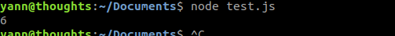
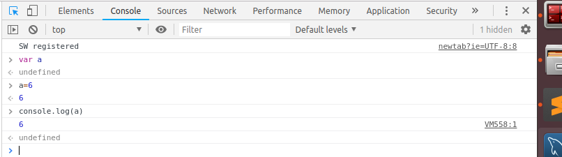
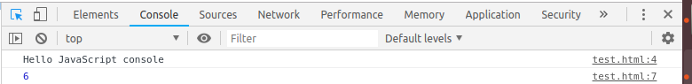

# Les bases de l'algorithmie pour JavaScript
JavaScript est un langage incontournable dans le développement web complémentaire au HTML et au CSS. La ou le HTML permet de coder ce que contient une page web, le CSS comment la page s'affoche, le JavaScriptvaScript permet de controler comment la page se comporte.
C'est donc le langage qui sera derrière les comportement dynamiques conditionnels "faire ci si il y a ça", les actions "ce qui se passe quand je fais ça"...

Mais le JavaScript est un langage à part entière ! Le but de ce tutorial et d'introduire les concepts de l'algorithmie au travers de ce langage. C'est à dire :
- Les **variables** qui permette de manipuler avec des noms les données que l'on manipule
- Les **statements** commes les conditions, les boucles qui permettent de faire la manipulation
- Les **fonctions** qui permette de regrouper un certains nombre de manipulation sur une _entrée_ pour donner une _sortie_
- Les types de données **data type** classque comme les string, les liste, les chiffres, les dates et les manipulation qui leur sont propre
- Des exemples d'**algorithmes classique** sur ces types. C'est à dire l'utilisation de manipulation sur nos types pour un but précis : rechercher dans une liste, renversement d'une liste...
- La notion d'**objet** et d'attruibu qui permet de regrouper ensemble plusieurs caractéristique de type classique (nombre, chaine de caractére) autour d'une meme eentité qui peut à son tour etre manipulé

## Introduction
Le Javascript est un langage de script incorporé dans un document HTML. Historiquement il s'agit même du premier langage de script pour le Web. Ce langage est un langage de programmation qui permet d'apporter des améliorations au langage HTML en permettant d'exécuter des commandes du côté client, c'est-à-dire au niveau du navigateur et non du serveur web.

Ainsi le langage Javascript est fortement dépendant du navigateur appelant la page web dans laquelle le script est incorporé, mais en contrepartie il ne nécessite pas de compilateur, contrairement au langage Java, avec lequel il a longtemps été confondu. 

Pour tester et faire nos exercices en JavaScript on va donc devoir "interpreter" le code qu'on écrit. Pour cela on écrira les morceaux de codes dans des fichiers `.js` et on pourra les interpreter directement avec **SublimeText** dans un terminal ou alors directement interagir avec une console Javascript d'un navigateur web.

### Dans sublime text
#### Configuration
On va configurer un systeme de build pour interpreter notre javascript. Pour créer ce système :
* `Tools > Build System > New Build System...`
* Copier le code suivant :
```json
{
"cmd": ["node", "$file"],
"selector": "source.js"
}
```
* Enregistrer le fichier dans la localisation par défault avec le nom `node.sublime-build`

Il suffira ensuite d'ouvrir le fichier `XXXX.js` avec le code JavaScript à tester puis faire `Ctrl` + `B` 

#### Tester proprement son code
Dans un nouveau fichier que l'on va enregistrer au nom de `test.js`, copier puis enregistrez le code suivant :
```js
var a;
a=6;
```
`Ctrl` + `B` devrait simplement ouvrir un bandeau précisant que le code à bien tourné et en combien de temps :

Ce qui est assez peut pratique pour vérifier que tout c'est bien passé. Pour controler ce que l'on fait, on va utiliser le "logging" de la console. ajouter la ligne suivante et relancez le build
```js
var a;  // Ceci est un commentaire
a=6;
console.log(a);
```
Et voilà ! Il suffira d'utiliser `console.log()` sur toutes les varaibles dont on voudra vérifier la valeur dans les exercices.
> On peut noter ici que les commentaire s'écrivent à l'aide de `//` en JavaScript !


### Dans le terminal
Dans le terminal, le principe est le meme, il faut enregistrer le code javascripte dans un fichier `.js` puis l'exeecuter à l'aide de la commande `node`



### Dans un navigateur web
Comme on l'a vu pour le Html et le Css, le role d'un navigateur web est de transformer le code en une page web utilisable. Etant donné que le JavaScript est une des composantes du code des pages web, les navigateur dispose d'une console JavaScript.
C'est ici que l'on pourra observer les `console.log()` des morceaux de JavaScript de la page web qui seront executé lors du chargement ou des interactions de la page web.

Cependant, la Console du Navigateur affiche les messages venant du :
* Contenu web contenu dans tous les onglets du navigateur
* Code du navigateur
* Contenu des modules complémentaires.

Pour acceder à la console sur un navigateur il existe le raccourcis `Ctrl` + `Maj` + `J`.

Alors pour tester du code javascript avec cette console il existe deux options :

**Ligne à ligne**
On écrit ligne par ligne les commandes que l'on veut executer. Celle-ci sont interprété en temps réel au moment on l'on fait entréer par la console.


**Lecture d'un fichier html contenant le code**
Le navigateur a pour role d'executer le code javascript des pages web. Or il existe une balise pour fournir du code JavaScript que le navigateur doit executer au chargement de la page : `<script type="text/javascript">`

Creez un fichier `test.html` contenant le code suivant :
```html
<!DOCTYPE html>
<html>
  <script type="text/javascript">
    console.log("Hello JavaScript console");
    var a;
    a=6;
    console.log(a);
  </script>
</html>
```
Ouvrez le fichier avec votre navigateur puis ouvrez la console. Vous pouvez voire les logs de l'execution de votre code JavaScript !


> Vous avez choisi la méthode qui vous convient le mieux ? Allez c'est parti !

## Variables et littéral

### Fonctionnement
La syntax de JavaScript defini deux types de valeur :
* Les valeurs fixe appelé *literal* comme les nombres `6` et `6.4` ou les chaines de caractères comme `'hello world'`
* Les *variables* qui se manipule grâce à leur nom.

En informatique, les variables sont des symboles qui associent un nom (l'identifiant) à une valeur. Le nom est unique.

Il existe deux types de variables en JavaScript. Celles qui peuvent changer de valeur au cours du temps (dynamique) et celles qui restent constante à toute épreuve (statique).

Pour dire qu'un nom va servir pour l'un ou l'autre des types de variable, il faut le *déclarer* en précédant le mot clef `var` ou `const` avant le nom.

Apres sa declaration, une variable n'a pas encore de valeur. Il faut d'abord lui en assigner une à l'aide du sign `=` (qui est le symbole pour assigner et non pour parler d'égalité) et de la syntaxe `nom=valeur`.

La valeur peut provenir d'une autre variable indiqué par son nom ou d'un *litéral*. Les literal sont les valeurs directement écrite dans le code :

```js
var x, y, z               // Declaration des variables
const c                   // Declaration d'une constante
x = 6; y='Hello world'    // On assigne un littéral à x et y
c = 4                     // On assigne un littéral à c
z = x;                    // On assigne la valeur de x à la variable z
console.log(c, x, y, z)
```

> Dans la dernière ligne que c'est la valeur de x qui est associé à z. On aurait le meme résultat avec `z=6`. Et si x est amené à changer de valeur, ce n'est pas le cas de z.

> Les noms utilisés pour les variables sont sensible aux majuscules.

> La déclaration et l'assignement de variable peut se faire en une ligne : `var carName = "Volvo";`

> Une variable peut etre déclarer une deuxième fois, cela n'affectera pas sa valeur si elle a été assignée

### Les différents litéraux
Les litéraux correspondent au *types* "simple" (on verra les type plus compliqué par la suite).
* Les entier comme `6`
* Les nombre réels `6.4`
* Les chaines de caractères `'Hello world'`
* Les booléans qui sont `true` et `false` qui nous permette de faire de la logique.

### Les opérateurs
#### Opérations
L'interet des variables est qu'ils peuvent etre manipulés pour creer la valeur de nouvelles variables. Les opérateurs sont les suivants :

| Operateur     | Description                    |
| ------------- | -----------------------------: |
| +             | Addition                       |
| -             | Subtraction                    |
| *             | Multiplication                 |
| **            | Exponentiel                    |
| /             | Division                       |
| %             | Reste de la division           |

Ces opérateur concerne les valeur de *type* chiffre (litteraux entier ou réel ou variable ayant reçu comme valeur un chiffre).
Cependant l'opérateur `+` sert également pour les chaines de caractères. Il correspond à la concatenation (il crée une chaine de caractère des chaines mises bout à bout)


```js
var nb1 = 3;
var nb2 = 2;
var nb3 = nb1 + nb2 - 1;

var txt1 = "John";
var txt2 = "Doe";
var txt3 = txt1 + " " + txt2;
```

Javascript autorise parfois les opérations entre différent type, essayez les codes suivant :
```js
var a = "Hello" + 5;
var b = "5" + 5;
var c = b + 4;
var d = c + "Stop";
```

> Exercice : Faites afficher à la console une phrase disant que "Le résultat de la multiplication de 1265 par 246 est : XXX" avec XXX le bon résultat


#### Comparaisons
Une autre famille d'opérateurs important sont les opérateurs de comparaison. Il comparent deux valeur (litterale ou variable) et crée une nouvelle valeur booléenne qui dit si la comparaison est vrai ou fausse.

| Operateur     | Description                                               |
| ------------- | --------------------------------------------------------: |
| ==            | Les valeurs sont égale                                    |
| ===           | Les valeurs sont égales et c'est le meme type             |
| !=            | Les valeurs sont différentes                              |
| !==           | Les valeurs sont différentes ou ce n'est pas le même type |
| >             | Supérieur à                                               |
| <             | Inférieur à                                               |
| >=            | Supérieur ou égale à                                      |
| <=            | Inférieur ou égale à                                      |

Les 4 premiers opérateurs marche pour tous les types puisqu'il ne s'agit que de dire si les valeurs sont les mêmes ou non. Il marche même parfois entre plusieurs type comme par exmple : `var a = '5'==5`

Enfin, `true` et `false` et donc toute expression de comparaison comme celles que l'on a vu au dessus possèdent elles mêmes des opérations de comparaisons :

| Operateur     | Description                                                    |
| ------------- | -------------------------------------------------------------: |
| a && b        | Qui verifie si a est vrai (vaut true) ET b aussi (les deux)    |
| a `||` b      | Qui verifie si a est vrai (vaut true) OU b l'est (un des deux) |
| ! a           | Qui donne le contraire de a                                    |

Nous verrons que les comparaisons seront très utile pour géré des boucles et des programmes conditionels !

```js
var a = 3;
var b = 3*a > 6;
var c = false;
var d = a && b;
console.log(d);
```
> Exercice : Que va valoir d ?

## Statements
### Conditions et comparaisons
### Boucle while
### Boucle for

## Types
### Array
### String
### Date

## Fonctions
### Généralitées
### Recursivité

## Algorithmes
Des exemples d'algo simple sur les listes
Tri et divisé pour regner ?

## Objets
### Definition
### Manipulation
