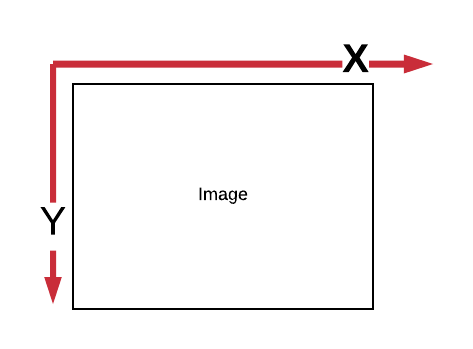

# Le CSS3 : le présent du web

## Récapitulons un peu 

A l'heure où vous lisez ce cours, cela fait quelques jours que vous avez mis les mains dans le cambouis et commencé à prendre en main deux élements fondamentaux du web à savoir les languages HTML et CSS. 

Pour se rafraichir la mémoire, la grande distinction entre le HTML et le CSS, outre la manière de l'écrire, est la destination de chacun de ces languages.

D'un côté, nous avons le HTML dont le but est de structurer la page et d'apporter de la _sémantique_ , de faire un travail de fond (ce bout de texte est mon titre principal, celui là est juste un paragraphe standard, ce mot est un lien etc). De l'autre côté, nous avons le CSS dont le but est de mettre tout ceci en page, d'apporter de la forme et par exemple dire :  je veux que ce titre ait une police de 22 px et soit rose licorne - je vous laisse trouver le code hexadécimal correspondant :-) 

Globalement, tout navigateur digne de ce nom devrait être capable de comprendre ces deux languages. Cependant, encore aujourd'hui et même si cela s'améliore fortement avec le temps, chaque navigateur va avoir une manière un peu différente d'interpréter  le CSS ou le HTML (ici comprenez le mot `interprété` dans le sens d'afficher, montrer, ...). 

Par exemple, il est possible que pour une même règle CSS comprenant les mêmes propriétés tout se passe bien sur Firefox tandis que sur Internet Explorer ou Safari le rendu de la page web ne soient pas exactement le même ou pire encore : que la règle css ne fonctionne tout simplement pas !

**Pourquoi donc ?**

Simplement pour de sombres questions d'histoire et de concurrence entre les entreprises ayant développé à l'origine ces navigateurs. Pour mieux comprendre, faisons un tout petit point d'histoire du web et plus spécifiquement d'histoire du CSS.

## Le point histoire

Le HTML est né en 1991 et le CSS un peu plus tard en 1996. Durant cette décennie, le marché du WEB était partagé entre des entreprises telles que Nestcape ou Microsoft. Chacune de ces entreprises développait leur navigateur en mettant en avant ses fonctionnalité dans le but d'attirer le plus grand nombre d'utilisateurs. 

Le problème, c'est qu'à cette époque, personne ne se souciait réellement d'uniformiser le comportement de ces fonctionnalités

En 1994, un organisme appelé le `World Wide Web Consortium` (en abbrégé `W3C`) a été créé dans de faire un peu de ménage là-dedans en essayant de standardiser le comportement de fonctionnalités similaire entre navigateurs . Par exemple, un des objectifs du W3C serait que  pour une page possédant le même marquage HTML et les mêmes règles CSS, cette page soit affichée de la même manière peu importe le navigateur.

Pour ce faire, le W3C édite régulièrement de nouveaux standards et permet donc d'engendrer de nouvelles versions du HTML et du CSS.

 A l'heure actuelle, nous sommes à la 5ème version du HTML (`HTML5`).

Quant au CSS nous en somme à la version 3 (`CSS3`) dont nous allons explorer quelques possibilités dans la suite du cours.

_Pourquoi raconter tout cela ?_

Simplement, pour vous mettre au courrant que même si un grand travail d'uniformisation à été entrepri, le web actuel conserve encore quelques traces liées à son historique. 

Ne soyez donc pas étonné si au cours de votre carrière de développeur et de vos experimentations , vous découvrez qu'une règle CSS ne possède pas  un comportement identique sur tous les navigateurs. 

## CSS3 ?

Comme je le disais plus haut, la version actuelle du CSS est la version 3. 

Personellement, c'est une version que j'aime particulièrement. 

En effet grâce à elle, nous pouvons apporter du dynamisme à notre page Web en changeant dynamiquement la couleur d'un titre quand la souris passe dessus ou encore modifier facilement la taille d'une image et tout cela sans utiliser aucun autre language que le CSS et le HTML.

Ici le but de cette leçon est de voir ensemble des notions plus avancées introduites en CSS  par la version 3. 

Ces notions sont :

- les transformations 2D : comment agrandir, faire tourner, déplacer un objet de la page tel qu'une image.
- les transitions et animations CSS : comment animer ou appliquer une transformation à un élement de la page (l'agrandir ou le rétrécir progressivement, le faire disparaître)


### Les transformations 2D 

#### Mise en place des exercices

Pour ces exercices vous aurez besoin de créer un dossier nommé `css3-101` (vous vous rappelez pourquoi `101`  ;-) ?)

Ouvrez ce dossier avec votre éditeur de texte favori et créez le fichier `index.html`

Copiez-collez la structure HTML suivante :

```html
<!DOCTYPE html>

<html>
    <head>
    <meta charset="utf-8" />
        <title>Transformations</title>
        <link rel="stylesheet" href="style.css" />
    </head>
    <body>
        <div class="container"></div>
    </body>

</html>
```
Au même niveau que le fichier HTML, nous allons ajouter le fichier nommé `image1.jpg`

A coté du fichier HTML et de l'image, rajoutons une feuille de style css que nous allons nommer `style.css` et nous allons rajouter à l'intérieur cette règle CSS :

```css
.container {
  display: flex;
  justify-content: center;
}
```

Cette règle a juste pour but d'aligner au centre tous les éléments contenus dans la `div` ayant une class nomée `container`. Cela permettra d'avoir un peu plus de confort visuel pour la suite de nos experimentations.

A ce stade-ci ouvrons notre fichier `index.html` dans notre navigateur pour vérifier que l'image s'affiche bien.

Nous devrions avoir quelque chose comme ceci :


A la suite rajoutez aussi cette règle :

```css
#photo
{
    transform: rotate(10deg);
}
```

Ouvrez votre navigateur et admirez le résulat de la magie surpuissante du CSS3 !

***Décortiquons un peu cette règle***

Ici nous avons juste demandé au navigateur d'appliquer une transformation (`transform`) de type rotation (`rotate`) de 10° à l'élement HTML ayant pour id `#photo`. En  bref, nous avons appliqué une rotation de 10 degrés à notre photo. Simple, efficace, propre. :-) 

N'hésitez pas à changer la valeur `deg` pour voir comment l'image évolue. Par exemple, modifions la valeur par `180deg` que se passe-t-il ?

***Petit bémol :***

Si vous travaillez le navigateur  `Safari` ou `Internet Explorer`, il se peut que le code ci-dessus ne fonctionne pas entièrement faute à des problèmes de compatibilité (vous vous souvenez l'histoire du web, tout ça tout ça ...). En effet, le CSS3 n'est pas encore totalement standarisé et il est nécessaire de recourir parfois à des astuces de chaman pour bien expliquer au navigateur ce qu'il doit faire. Cette astuce consiste à rajouter une règle supplémentaire quasiment identique à la précédente mais ayant un préfixe particulier : `-webkit-`

Ce préfix va permettre aux navigateurs de type 'webkit' dont fait partie `Safari` de comprendre notre règle.

Ainsi nous pouvons écrire nos règles comme ceci :

```css
#photo
{
    -webkit-transform: rotate(10deg); /* Safari */
    transform: rotate(10deg); /* Tous les autres navigateurs */
}
```

Il existe 4 préfixes différents dépendant du navigateur sur lequel on souhaite augmenter la compatibilié :

- ` -webkit-` que nous avons vu précédement
- `-moz-` pour les navigateurs de la famille de Firefox
- `-ms-` pour Internet Explorer
- `-o-` pour Opéra

Dans la suite de la leçon, pour des questions de lisibilité je ne préfixerai pas les règles css. Je ne vous oblige pas non plus à le faire. 

Gardez seulement à l'esprit que parfois si une de vos règles CSS3  ne fonctionne pas, il faudra peut-être recourrir à ces préfixes.


#### L'agrandisement 

De la même manière que nous avons fait tourner notre image nous pouvons l'agrandir.

Pour ce faire nous pouvons écrire cette règle :

```css
#photo
{
    transform: scale(1.3);
}
```

***Décortiquons un peu cette règle***

Ici nous avons demandé au navigateur d'appliquer une transformation (`transform`) de type agrandissement (`scale`) de 1.3 fois par rapport à la taille intitiale de l'élement HTML ayant pour id `#photo`. En  bref, nous avons agrandi la photo de 1.3 fois par rapport à sa valeur initiale.

Vous avez remarqué que l'aggrandissement et la rotation s'écrive sensiblement de la même manière avec la règle `transform`. 

Seul change l'argument après la règle (`scale`, pour l'agrandissement, `rotate` pour la rotation ). Cet argument est appelé une `fonction` css et la valeur entre les parenthèses est appelée un `paramètre` de  fonction.

***Le petit challenge***

A ce stade-ci, nous savons que si nous passons la valeur `1.3` comme paramètre de la fonction `scale`. L'image va être 1.3 fois plus grande que ça taille initiale. Et si je remplace `1.3` par `1` que se passe-t-il ?

Vous le voyez, l'image revient à sa taille initiale. Donc nous pouvons imaginer que si nous mettons `2` comme paramètre l'image va être agrandie 2 fois par rapport à sa valeur initiale.

Avec `3`, l'image sera 3 fois plus grande et ainsi de suite.

Maintenant, j'aimerai que vous réduisiez l'image pour qu'elle soit `0.5` fois plus petite que sa taille initiale. Quelle règle allez vous écrire ?

---- Barrière anti-spoil ----

Ma solution est :

```css
#photo
{
    transform: scale(0.5);
}
```

Pour continuer dans cette approche, maintenant j'aimerais que vous fassiez pivoter l'image de `270°` et qu'en même temps vous l'agrandissiez de `2.1` fois par raport à sa taille initiale. 

Quelle serait la règle ?

---- Barrière anti-spoil ----
```css
#photo
{
    transform: scale(2.1);
    transform: rotate(270deg);
}
```

Tout ceci pour vous montrer que vous pouvez combiner les transformations! 

**Un ajout** :

Ici nous travaillons avec une image (balise ``) mais il est techniquement possible d'appliquer ce genre de modification à n'importe quel type de balise tel que `<p>`, `<h1>` etc ...

#### Agrandir séparément la hauteur et la largeur d'une image

**Le point math**

Ici nous avons besoin de nous rappeler une notion fondamentale en géométrie à savoir :  la notion de `repère orthonormé`.

Voici une définition officielle :

`Un plan orthonormé est un plan possédant deux axes,nommés par convention X et Y, perpendiculaire et ayant la même origine`.

Ici nous pouvons considérer notre image comme un plan orthonormé où l'axe X serait la largeur de l'image tandis que l'axe Y serait la hauteur.

Pour se le représenter, voici un schéma :



Pour le moment nous avons utilisé la fonction css `scale` en lui passant seulement 1 seul paramètre. En fait, il est aussi possible de passer 2 paramètres à la fonction `scale` et nous pourrions donc l'utiliser de cette manière

```css
    transform: scale(valeurEnX.ValeurEnY);
```

où `valeurEnX` serait la valeur de modification de la taille en X tandis que `valeurEnY` serait la même chose mais pour la taille en Y.

Ainsi si nous souhaitons faire évoluer la taille de notre image pour qu'elle ait une hauteur `2` fois plus grande que sa valeur initiale mais que sa largeur soit réduite de `0.5` nous pouvons écrire cette règle :

```css
#photo
{
    transform: scale(2, 0.5);
}
```

Je vous laisse essayer par vous même.

#### Le déplacement (translation)

En plus de faire tourner l'image sur elle même ou de l'agrandir, nous pouvons aussi la faire se déplacer par rapport à sa position initiale.

Pour ce faire nous devons utiliser la fonction css `translate` 

_Attention :_ `translate`, en anglais veut aussi dire `traduire`, comme traduire un texte par exemple.  Ici nous utilisons translate pour exprimer l'idée de "déplacer".

`translate` a pour signature de fonction `translate(valeurEnX, valeurEnY)`

Donc si nous souhaitons faire bouger notre image de `35px` en X (en largeur) et `2px` en Y (en hauteur) nous pouvons écire cette règle :

```css
#photo
{
    transform: translate(35px,2px)
}
```
Je vous inviter à tester.

Que remarquez vous ?

Avec la valeur 35px pour l'axe X , l'image se déplace de `35px` sur la droite de l'écran. De même pour l'axe Y, avec `2px` comme valeur l'image est descendue de `2px`.

Maintenant, je souhaiterais que l'image se déplace de `50px` vers la `gauche` de l'écran et qu'elle `remonte` (se déplace vers le `haut`) de `8px` A votre avis comment je peux faire ?

Petit indice, il est possible de donner des valeur négatives comme paramètre de la fonction `translate`.

A vous de jouer !

--- Barrière anti-spoil ---

```css
#photo
{
    transform: translate(-50px,-8px)
}
```

Voilà à ce stade-ci vous connaissez les principales manières d'appliquer une transformation basique à des éléments HTML.


### Les transitions et animations

#### Préparons les exercices

Pour cette leçon nous devons remplacer le contenu de notre `index.html` par ceci

```html
<!DOCTYPE html>
<html>
  <head>
    <meta charset="utf-8" />
    <title>Transitions et animations</title>
    <link rel="stylesheet" href="style.css" />
  </head>

  <body>
    <div></div>
  </body>
</html>

```

et pour le `CSS`, remplaçons le contenu de notre `style.css` par ceci

```css
div{
    width: 200px;
    height: 150px;
    background-color: red;
}

div:hover
{
    background-color: cyan;
}
```

***Décortiquons un peu cette règle***

Ici nous faisons deux choses :

1. Nous stylisons notre div pour qu'elle ait une largeur de 200px et une hauteur de 150px. Aussi nous souhaitons que sa couleur de fond soit rouge.

2. Dans la second temps, nous souhaitons que quand la souris passe au dessus de la div  (à l'aide de la `pseudo-classe` hover - survol, en anglais) la couleur de fond devienne cyan (un bleu-vert)

Essayez par vous même en rafraichissant votre navigateur.

#### Transition ? Animation ??

Depuis l'arrivée du CSS3, il est possible de faire avec un seul language (le CSS) ce qui avant devait se faire en recourrant à un autre language : le `javascript`. Ce qui veut dire qu'en CSS, nous pouvons décider de modifier l'aspect d'un élement HTML quand un évenement se passe (par exemple : changer progressivement  la couleur de fond d'une `div` au survol de la souris).

Je vous le prouverai d'ici peu.

_Mais quelle est la différence entre une transition et une animation ?_

Une `transition` c'est une animation basique qui fait passer un objet d'un état A à un état B. Par exemple, on peut dire : "Déplace cet objet de la gauche vers la droite de l'écran tout en changeant sa couleur".

Tandis qu'une `animation` est une combinaison de transitions les unes à la suite des autres. Par exemple, on peut dire : "Déplace cet objet de la gauche vers la droite de l'écran puis déplace-le vers le bas de l'écran puis change sa couleur de fond vers le bleu."

#### Les transitions

Depuis que vous faites du CSS, vous avez rencontrez beaucoup de propriétés qui permettent de modifier l'apparence d'un élement HTML comme `background-color`, `color`, `width`, `height`

Toutes ces propriétés peuvent être la base pour créer une transition CSS.

Pour ceci, nous devons déclarer sur quelle propriété nous souhaitons appliquer notre transition. Nous pouvons le faire en utilisant la propriété CSS `transition-property`.

En plus nous pouvoir choisir sur combien de temps doit se dérouler la transition. Pour ce faire, nous pouvons utiliser ici la propriété `transition-duration` (`duration` veut dire durée en anglais)

**Mettons ces éléments ensemble**

Dans la règle CSS pour la `div`, rajoutons ceci 

```
   transition-property: background-color;
    transition-duration: 3s;
```

ainsi nous obtenons la règle css suivante :

```css
div {
  width: 200px;
  height: 150px;
  background-color: red;
  transition-property: background-color;
  transition-duration: 3s;
}
```

***Décortiquons un peu cette règle***

Par rapport à la précédente version de la règle css nous avons ajouté 2 choses :

- `transition-property: background-color;` qui nous permet de dire au navigateur d'appliquer une transition sur la propriété `background-color`
-  `transition-duration: 3s;` qui nous permet de faire durer la transition durant 3 secondes

Admirez comme la transition est plus fluide par rapport à la version avec un `:hover` simple !

Il est aussi possible d'appliquer une transition à plusieurs propriétés en même temps. Pour ce faire il suffit de les énumérer en les espacant par une virgule.

Comme ceci :`transition-property: background-color, width, height;`

Ici nous souhaitons aussi appliquer une transition à la largeur et à la hauteur de la div.

N'oubliez pas que pour que la transition fonctionne il faut aussi définir quel sera l'`état` de la div à la fin de la transition.

Pour ce faire nous devons aussi modifier la règle css pour `div:hover` par exemple comme ceci :

```css
div:hover {
  background-color: cyan;
  width: 300px;
  height: 30px;
}
```

et donc  notre fichier `style.css` ressemblera à cela :

```css
div {
  width: 200px;
  height: 150px;
  background-color: red;
  transition-property: background-color, width, height; /* Active la transition sur background-color */
  transition-duration: 3s; /* La transition dure 1s */
}

div:hover {
  background-color: cyan;
  width: 300px;
  height: 30px;
}

```

Rafraîchissez votre navigateur et admirons avec nos yeux ébahis cette transition. Du grand art, n'est-ce pas ?

##### Un peu plus de maitrise sur notre transition

Il est aussi possible de décider de retarder l'éxécution d'une transition. Pour atteindre notre objectif, nous n'avons qu'à utiliser la propriété css `transition-delay`

Nous pouvons donc enrichir notre règle CSS pour la `div` comme ça :
```css
div {
  width: 200px;
  height: 150px;
  background-color: red;
  transition-property: background-color, width, height; /* Active la transition sur background-color */
  transition-duration: 3s; /* La transition dure 1s */
  transition-delay: 2sec;
}
```
Ici nous souhaitons que la transition que nous avons créée précédement se déclenche avec un délai (`delay`, en anglais) de deux secondes.

***Le challenge***

A ce stade-ci, vous avez eu un aperçu des possibilités des transitions CSS3. 

Pour ce challenge, nous allons essayer de mettre ensemble toutes les notions vues depuis le début de cette leçon.

Voici ce que j'aimerais faire :

Je souhaiterais qu'au passage de la souris sur la div (`hover`), cet élement :

- tourne elle même de `15deg`
- change sa couleur `rouge` initiale pour la couleur ayant pour code hexadécimal `#ff6600`
- ait une largeur de `600px`
-  avec un délai de `1sec`
- et une durée de `2sec` aussi 

Pour vous aider, n'oubliez pas que `transform` est une propriété css sur laquelle nous pouvons aussi appliquer une transition.

Si vous ne vous rappelez plus comment fonctionne cette propriété je vous invite à relire la partie sur les [Transformations 2D](#les-transformations-2-d) avant de commencer le challenge.
  
--- Barrière anti-spoil  ---

Ma solution

```css
div {
  width: 200px;
  height: 150px;
  background-color: red;
  transition-property: background-color, width, transform; /* Active la transition sur background-color, width et transform */
  transition-duration: 2s; /* La transition  dure 2sec */
  transition-delay: 1s; /* La transition est retardée 1s */
}

div:hover {
  background-color: #ff6600;
  width: 600px;
  transform: rotate(15deg);
}

```

#### Les animations CSS3

Comme je le disait plus haut, on peut considérer qu'une transition permet de passer progressivement d'un état A à un état B tandis qu'une animation permet de définir une succession d'états par lequel va passer notre élément HTML.

Par exemple, il est possible de dire au navigateur :

"Je souhaite qu'au début ma `div` change de couleur pour devenir verte kaki, PUIS qu'elle tourne sur elle même, PUIS qu'elle se déplace sur la droite, PUIS qu'elle change de hauteur pour devenir plus petite,...". Vous le comprenez, dans une animation css on peut définir autant d'étapes `successive` que l'on souhaite.

##### Les bases de l'animation

Créer une animation CSS3 se fait en deux étapes :

1. Il faut définir l'animation que l'on souhaite 
2. Il faut appliquer l'animation à un élément (virtuellement, il est possible d'animer tout élément HTML)

###### Définir une animation

Pour définir une animation nous devons utiliser une `directive CSS` nommée `@keyframes` que nous pouvons écrire au début de chaque fichier `css`. 

Cette directive CSS possède une syntaxe un peu particulière  :

```css
@keyframes  leNomDeMonAnimation {

    0% {
        ...
    }

    50% {
        ...
    }

    100% {
      ...
    }

}

```
***Decortiquons un peu cette directive***

La directive commence donc par le mot clé `@keyframes` auquel un ajoute le nom de l'animation que l'on souhaite créer (ici `leNomDeMonAnimation`). 

Ensuite entre les `{}`, il y a une succession d'instructions commençant par `0%`, `50%` ou `100%`.

Ces instructions permettent de décrire la manière dont notre animation va se comporter au fil du temps (`0%`au tout début de l'animation, `50%` à la moitiée, `100%` à la fin). 

Il est aussi possible de rajouter des étapes intermédiaires si on souhaite qu'il se passe quelque chose à `75%` ou encore à `30%` par exemple.

C'est donc à l'intérieur de cette directive que nous pouvons écrire quelque chose qui dirait:

 "Je souhaite qu'au début de mon animation la `div` tourne sur elle même de 10 deg, qu'à 50% de l'animation elle change de couleur pour devenir verte et à 100% , la div se déplace de 150 pixels sur la droite"

Cette même instruction en code donnerait quelque-chose comme ceci :
```css
@keyframes monAnimation {
  0% {
    transform: rotate(10deg);
  }
  50% {
    background-color: green;
  }
  100% {
    transform: translate(150px);
  }
```

Avant de vous lancer dans la création d'animations les plus folles, attendez deux secondes. 

Actuellement, si vous collez cette directive dans votre fichier css, je dois vous dire rien ne se passera dans votre navigateur.

Oh tristesse mais pourquoi ?

Simplement car nous n'avons pas appliqué cette directive à notre élément (cf le point 2 [Les bases de l'animation](#les-bases-de-l-animation)).

Pour se faire il suffi de remplacer la règle css pour la `div:hover` par ceci :

```css
div:hover {
   animation-name: : monAnimation
  animation-duration: 2sec
}

```

***Decortiquons un peu cette directive***

ici nous disons simplement  qu'au passage de la souris au dessus de la div (`hover`, toujours) je veux que l'animation nommée `monAnimation` ( déclarée au dessus) se déclenche et dure 2sec.

Allez à votre tour d'essayer ! 

Pour tester, nous devons modifier notre fichier `style.css` en remplaçant le contenu par ceci 

```css
@keyframes monAnimation {
  0% {
    transform: rotate(10deg);
  }
  50% {
    background-color: green;
  }
  100% {
    transform: translate(150px);
  }
}

div {
  width: 200px;
  height: 150px;
  background-color: red;
}

div:hover {
  animation-name: : monAnimation
  animation-duration: 2sec
}


```
Et là ça devient presque un spectacle ! 

***Une autre astuce de chaman*** :

Vous n'avez besoin que de définir un état de départ et d'arrivée pour votre animation ? 

Vous avez deux possibilités 

1. Définir une directive de ce genre 

```css
@keyframes monAnimation {
  0% {
    transform: rotate(10deg);
  }
  100% {
    transform: translate(150px);
  }
}
```

2. Ou prendre un raccourci et juste écrire ceci :

```css
@keyframes monAnimation {
  from {
    transform: rotate(10deg);
  }
 to {
    transform: translate(150px);
  }
}
```

où `from` est l'état de départ de votre animation et `to` est l'état d'arrivée. Ici les deux bouts de code ont strictement le même résultat.

***Les autres propriétées à connaitre :***

- `animation-name`  : le nom de l’animation à utiliser.

 - `animation-duration`  : la durée de l’animation. Ex : 2s, 350ms...

  - `animation-delay` : délai avant le démarrage de l'animation. Ex : 2s, 350ms... Notez que ce délai peut être négatif pour qu'on ait l'impression que l'animation a déjà démarré depuis un certain temps.

  - `animation-iteration-count` : nombre de répétitions de l’animation. Avec "infinite", l'animation sera jouée en continu. Par défaut, la valeur est 1 (l'animation n'est jouée qu'une fois).

  - `animation-direction` : permet de faire revenir l'animation en sens inverse avec la valeur "alternate", ou juste une fois à l'envers avec "reverse". Par défaut avec "normal", une fois l'animation arrivée au bout, l'objet revient d'un coup à sa position initiale (ce qui peut être un peu surprenant).


**Une nouvelle astuce de chaman**

C'est assez long de déclarer chaque propriété liée à notre animation vous ne trouvez pas ? 

Ca serait assez cool si il y avait une propriété raccourcie (un genre de `super-propriété`) qui nous permettrait de définir en une seule ligne la durée de notre animation, son nom, le nombre d'itération etc. 

Ce qui est super cool c'est qu'en effet cette propriété existe et elle s'appelle simplement `animation`

et elle s'utilise comme ceci :

```css
animation : nomDeLAnimation duréeAnimation nombreIteration
```
Donc comme **petit challenge**, je souhaiterais créer une animation qui dure `2sec` et qui fasse que ma div change de couleur pour passer de `cyan` à `purple` (mauve en anglais) et ce à l'infini ! (tant que ma souris est positionée sur la div)

Pensez au `from` et `to` et à la propriété raccourcie `animation`

--- Barrière anti-spoil ---

Ma version du code :
```css
@keyframes monAnimation {
  from {
    background-color: cyan;
  }

  to {
    background-color: purple;
  }
}

div {
  width: 200px;
  height: 150px;
  background-color: red;
}

div:hover {
  animation: monAnimation 2s;
}

```

Et voici qui termine cette introduction aux animations CSS3. 

Ce sujet est aussi un sujet très large et vaste. Tous les aspects n'ont pas été abordés mais je pense que vous avez suffisament d'outils pour experimenter par vous même.

Comme je vous le disais, ici nous avons travaillé principalement avec des `div` mais tout élement HTML peut être la base pour créer une animation. 

**Pour aller plus loin : **

L'experimentation est une composante essentielle dans le métier de développeur. Parfois c'est en combinant de toutes petites choses qu'on arrive à créer des animations ou des sites web intéressants, créatifs ou juste pour lesquels nous avons pris du plaisir à construire.

Pour continuer sur cette route de l'experimentation, je vous propose  de reprendre votre projet d'introduction au CSS (`CSS101`) et d'expérimenter en créantt des animations pour les éléments HTML présents dans le projet.

Comme on dit ici la seule limite c'est votre imagination.

Amusez-vous bien ! 