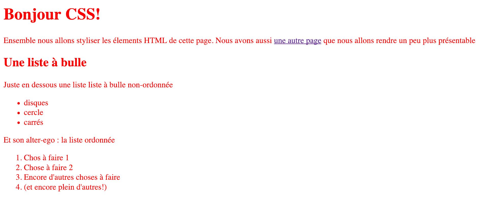
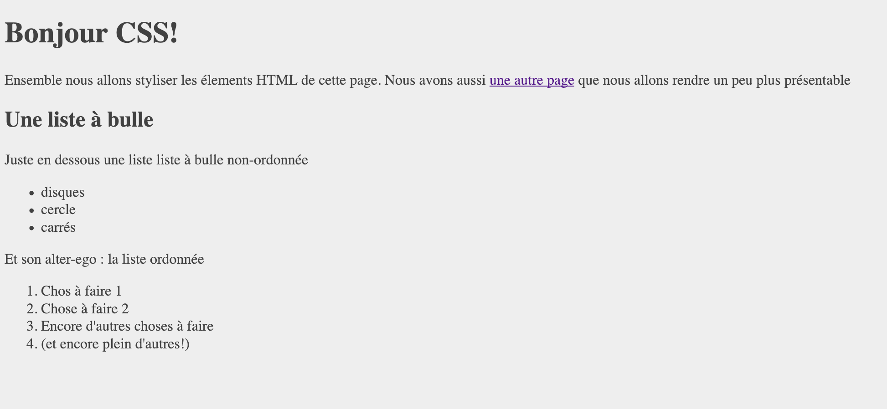
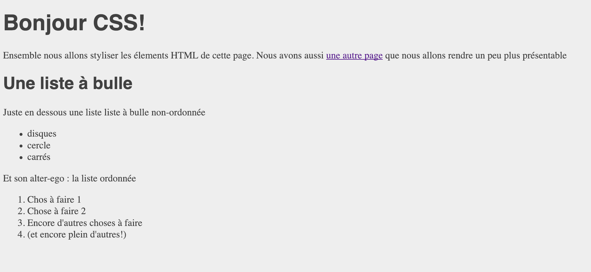
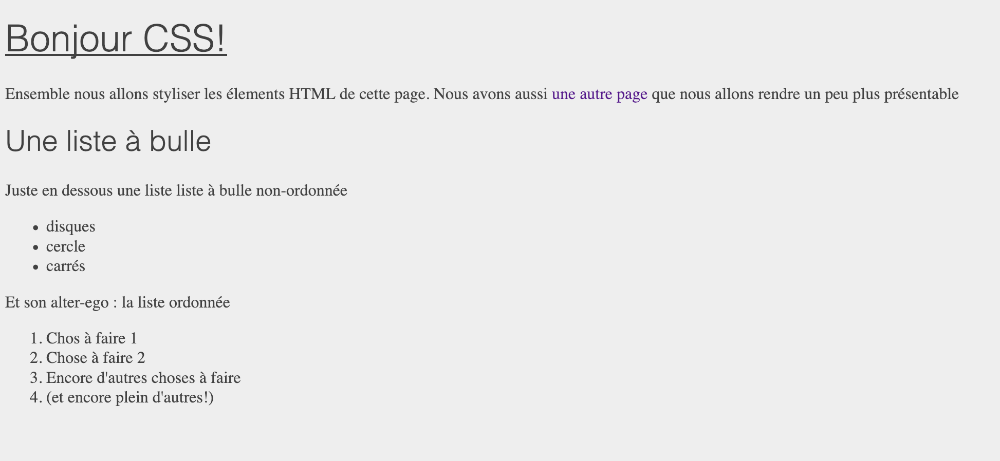

# Premiers pas avec les feuilles de styles (CSS)

Dans le cours sur le HTML, vous avez vu comment il était possible d'utiliser des balises pour aider le navigateur à comprendre quelle était la structure de votre page web. Vous l'avez certainement remarqué mais en ouvrant un fichier ne contenant que du `HTML` dans un navigateur, le résultat n'est pas vraiment joli et attractif.

En effet, le but du `HTML` est d'apporter de la structure sémantique à la page, mais nous avons besoin d'un autre language pour y apporter plus de style et de couleur.

Ce language est appelé le `Cascading Style Sheet` (en abbrégé : `CSS`) que l'on pourrait traduire littéralement par _Feuille de style en cascade_.

## Pourquoi un second language ?

Le HTML et le CSS ont deux objectifs bien distincts. Le HTML va structurer le contenu de la page ( _le fond_ ) tandis que le CSS va nous permettre de définir la manière dont la page va être présentée aux utilisateurs ( _la forme_ ) navigant sur le site web. Cette disctinction entre le fond et la forme est un concept central dans le web actuel.

Le but du css est, par exemple, de dire au navigateur : " Je voudrais que mon titre `H1` ait une taille de 16px et soit vert kaki" (les goûts et les couleurs, vous savez ... :-) ) ou encore "Je souhaite que mon menu de navigation reste tout le temps en haut de la page".

Le CSS est un vrai language, avec son lot de mot-clés à retenir et ses particularités. Le but de la leçon n'est pas de vous faire retenir par coeur toutes les propriétés du CSS, mais plutôt de vous montrer comment le CSS et le HTML intéragissent entre eux et aussi de vous aider à comprendre quel est le rôle de chacun.

### Mise en place de l'exercice

Pour commencer, nous allons créer un nouveau dossier sur votre ordinateur que nous allons nommer `CSS-101`.

**CSS 101 ?**

_Sur le web anglophone, beaucoup de tutoriels aidant à faire ses premiers pas avec un language, une technique, ... terminent par le chiffre `101` que l'on prononce "one O one". Ici, nous allons faire nos premiers pas avec le CSS donc ce sera notre permier tutoriel 101_

Une fois que le dossier `CSS-101` est créé, ouvrez-le avec votre éditeur de texte préféré. Ici que ce soit `VsCode`, `Sublime Text`, ou un autre éditeur exotique, cela a peu d'importance. Le principal c'est de travailler dans un environnement avec lequel vous serez le plus à l'aise.

Ensuite, à la racine du dossier nous allons créer un fichier `index.html`.

En web, le fichier `index.html` possède une importance toute particulière car il correspond à la `racine` du site web. En effet, tout serveur web par défaut partira à la recherche de ce fichier pour pouvoir afficher votre site.

Donc dans ce fichier `index.html`, nous allons copier-coller cettre structure HTML :

```html
<!DOCTYPE html>
<html lang="fr">
  <head>
    <meta charset="UTF-8" />
    <title>CSS 101</title>
    <link rel="stylesheet" href="styles.css" />
  </head>
  <body>
    <h1 id="titre-principal">Bonjour CSS!</h1>

    <p class="paragraphe">
      Ensemble nous allons styliser les élements HTML de cette page. Nous avons
      aussi <a href="page1.html">une autre page</a> que nous allons rendre un
      peu plus présentable
    </p>

    <h2>Une liste à bulle</h2>

    <p class="paragraphe">
      Juste en-dessous une liste liste à bulle non-ordonnée
    </p>

    <ul>
      <li>disques</li>
      <li>cercles</li>
      <li>carrés</li>
    </ul>

    <p>Et son alter-ego : la liste ordonnée</p>

    <ol>
      <li>Chose à faire 1</li>
      <li>Chose à faire 2</li>
      <li>Encore d'autres choses à faire</li>
      <li>(et encore plein d'autres!)</li>
    </ol>
  </body>
</html>
```

En plus de notre `index.html` nous allons avoir besoin d'une seconde page afin de bien comprendre comment nous pouvons styliser plusieurs pages HTML **avec la même feuille de style**

Pour ce faire, nous allons créer un second fichier appelé `page1.html` juste à côté (dans le même dossier `CSS101`, au même niveau que le fichier `index.html`) et y coller cette autre structure HTML.

```html
<!DOCTYPE html>
<html lang="fr">
  <head>
    <link rel="stylesheet" href="styles.css" />
    <meta charset="UTF-8" />
    <title>Deuxième Page</title>
  </head>
  <body>
    <h1>Ma deuxième page HTML</h1>

    <p>
      Cette page avec pas grand-chose permet juste de démontrer comment nous
      pouvons styliser une seconde page avec la même feuille de style
      <a href="index.html">Go back</a>.
    </p>

    <p>
      Oups <a id="lien-desactive" href="nowhere.html">ce lien</a> est
      obsolète. Ce serait bien de le désactiver
    </p>
  </body>
</html>
```

### But du jeu

Maintenant que nous avons la structure de notre site web, nous allons pouvoir commencer à le styliser. Ici la seule règle sera d'essayer de modifier l'apparence du site en ne modifiant pas la structure du HTML.

## La feuille de style

Une feuille de style est en réalité un simple document texte (comme le fichier HTML) mais ayant une extension particulière: `.css`. Pour commencer, à côté des fichiers HTML créés précedemment, nous allons créer un fichier `styles.css`. C'est dans ce fichier que nous allons écrire tout le css dont nous allons avoir besoin dans ce chapitre.

Donc à l'intérieur de ce fichier, allons-y pour créer nos premières lignes de CSS. Dans le jargon, nous appelons ça une "_règle CSS_" .

Copiez-collez cette règle dans le fichier `styles.css` :

```css
body {
  color: #ff0000;
}
```

#### Décortiquons cette règle

Une règle CSS possède à chaque fois la même structure :

```css
selecteur {
  propriété-css: valeur;
}
```

Pour la règle css, le `selecteur` est la balise HTML `body`, la `propriété-css` est `color` et la `valeur` est `#FF0000` qui est le code hexadecimal permettant d'avoir un rouge vif.

**Revenons deux secondes à la propriété css `color` :**

`color` est une propriété `built-in` du language CSS, c'est-à-dire qu'elle est reconnue naturellement par le CSS. Ici cette propriété permet de dire : "Je veux que tous les textes contenus dans la balise `body` aient la couleur rouge ayant comme code hexadecimal`#FF0000`"

Des propriétés `built-in`, le css en possède énormement. Pas de panique, je vous expliquerais au fur et à mesure à quoi servent les autres propriétés que nous rencontrerons.

### Créer le lien avec une feuille de style

Actuellement, même en ayant ajouté à votre feuille de style la règle css, les textes sont toujours impeccablement noir. Tristesse ... Mais pourquoi ?

En réalité, ce comportement est tout à fait normal. Pour le moment, le HTML n'a aucune conscience de l'existence d'une feuille de style ajoutée par nos soins. De ce fait, le HTML continue à être rendu en prenant en compte la **feuille de style par défaut** fournie par votre navigateur. Nous reviendrons sur cette feuille de style à la fin du cours.

Alors comment dire à mon fichier HTML qu'il doit utiliser notre feuille de style ?

Pour ce faire, nous devons `lier` (to link, en anglais) notre fichier css au HTML en utilisant la balise `<link>`.

Dans votre fichier `index.html`, remplacez la balise `head` et son contenu par

```html
<head>
  <meta charset="UTF-8" />
  <title>CSS 101</title>
  <link rel="stylesheet" href="styles.css" />
</head>
```

Rafraichissez la page de votre navigateur et vous devriez avoir ce rendu :



#### Décortiquons cette balise `<link>`

`<link>` fonctionne comme la balise HTML `<a>` car elle permet de lier deux fichiers entre eux. Cependant, `<link>` ne peut être utilisé qu'à l'intérieur des balises `<head> </head>`.

Remarquez que `<link>` est une balise dite orpheline car il n'est pas possible de mettre du contenu à l'intérieur et nous n'avons donc pas besoin de balise de fermeture (à l'inverse de `<a>` qui fonctionne par paire avec `</a>`)

`<link>` prend deux attributs :

- `rel` qui défini la relation (ici ce sera une relation avec une stylesheet - rappellez-vous, CSS vient de cascading _style sheet_). `rel` peut prendre d'autres valeurs mais `stylesheet` est de loin la plus commune.

- `href`, quant à lui, indique le _chemin _ pour accéder à la feuille de style depuis le fichier `index.html`. En lisant le chemin, on se rend compte que c'est un chemin `relatif` et que le fichier CSS se trouve à côté du fichier `index.html`. Parfait car c'est exactement de cette manière que nous avons organisé notre site web. Elle est pas belle la vie ? :-D

**Petite note:**

Il n'y a pas de connection directe entre le `CSS` et le navigateur. Tout comme pour les images ou même les fichiers `javascript`, nous devons référencer nos fichiers CSS dans un fichier HTML pour que le navigateur les prenne en compte.

### Le navigateur, un outil pour vous aider à mieux développer

Le navigateur est l'outil principal pour afficher une page web, mais en réalité, un navigateur c'est bien plus que cela. Il renferme des outils qui peuvent vraiment faciliter la vie du développeur en cas de bug ou même pour directement tester des nouvelles choses sans devoir passer par un éditeur de texte.

Ces outils sont appelé les `developer tools` et sont assez semblables que l'on utilise Firefox ou Chrome.

Par exemple, avec ses outils nous pouvons directement modifier le css de notre site web.

Pour ce faire et pour commencer avec les `developpeur tools`, ouvrez votre navigateur préféré, faites un clic-droit sur un élément de la page (par exemple, le titre _Bonjour CSS!_ ). Un menu contextuel devrait apparaitre. Ensuite, cliquez sur `inspecter l'élement`

Pour la suite du cours, n'hésitez pas à bricoler avec ces outils, mais n'oubliez pas que ces changements ne sont que temporaire. Si vous rafraîchissez votre page, les changements disparaîtront donc une fois que vous êtes satisfait du résultat, n'hésitez pas à les reporter dans votre feuille de style.

Voici un petit exemple:


### Commenter son code

Comme pour le HTML, un fichier CSS peut contenir des commentaires. Ce qui est assez pratique pour mieux aider à la compréhension d'une feuille de style contenant des centaines de règles (généralement on essaye de l'éviter, mais cela peut arriver).

La syntaxe du commentaire est différente de celle utilisée en HTML.

Les commentaires s'écrivent entre `/*` et `*/.`

Par exemple :

```css
body {
  color: #414141; /* Ceci est un commentaire sur une ligne  */
}

/* Ceci est 
  un commentaire
  sur plusieures lignes
*/
```

### Modifier plusieurs propriétés

Dans un fichier `.css`, on peut écrire autant de propriétés que l'on souhaite à l'intérieur d'un bloc de déclaration.

Prenons un exemple :

Maintenant que nous avons réussi à changer la couleur de tout le texte contenu dans la balise `<body>`, nous souhaitons que l'arrière plan de tout notre site web soit de couleur `#eeeeee` (gris clair neutre).

Pour ce faire, retournons dans notre fichier `style.css` à l'endroit où nous avons défini notre première règle css pour le `body`.

Dans le même bloc de déclaration, en-dessous de la propriété `color`, nous pouvons rajouter une nouvelle propriété `background-color` et lui donner comme valeur `#eeeeee`. Nous obtenons :

```css
body {
  color: #ff0000;
  background-color: #eeeeee;
}
```

Avec ce rajout de propriété, tout le fond du site web a changé de couleur en plus de la modification de la couleur de la police.

Remarquez que chaque déclaration de propriété se termine par un `;`. C'est très important de ne jamais l'oublier, sinon le navigateur ne comprendra pas votre règle. Donc faites vraiment attention aux point-virgules !

Pour résumer, ici nous avons utilisé la propriété css `background-color` qui permet de définir la couleur d'arrière-plan d'une balise HTML (ici la totalité du `body`) et comme couleur nous lui avons assigné la couleur ayant comme code hexadécimal `#eeeeee`

Tant qu'à faire, rendons notre site web un tout petit peu plus plaisant au regard et changeons ce rouge flashy par quelque chose de plus sobre et de plus regardable.

Pour ce faire, je vous laisse changer la couleur actuelle du texte par la couleur ayant pour code hexadecimal : `#414141`.

Rappellez-vous, ici la propriété css qui nous intéresse est `color`

A ce stade-ci notre site web devrait ressembler à ceci :



**Pourquoi ne pas juste avoir laisser le site en noir et blanc?**

Quand nous construisons un site, nous devons aussi penser au confort de l'utilisateur. Si nous avions gardé le texte en noir et le fond du site en blanc, les contrastes entre le texte et le fond seraient trop importants et fatigueraient à la longue l'oeil de la personne lisant votre site web. Utiliser des nuances de gris permet donc de réduire les contrastes et offrir un meilleur confort de lecture.

Cependant, attention à ne pas chosir des couleurs qui soient trop rapprochées car il deviendrait difficile de distinguer vos textes par rapport au fond.

Ces problématiques de contrastes, de couleurs etc ... font partie d'un domaine en développement web que l'on appelle _l'accessibilité_ (accessibility en anglais). Ce domaine est un sujet à part entière que nous ne pouvons pas couvrir dans ce cours-ci.

A ce stade-ci, nous devons juste retenir qu'il est toujours important de fournir le plus possible de confort à l'utiliseur parcourant notre site.

### Sélectionner différents éléments

Evidemment, le CSS nous permet bien plus que simplement styliser le body. En réalité, il est techniquement possible de styliser individuellement quasiment chaque balise HTML pouvant s'écrire dans le `body` de la page.

Par exemple, tentons maintenant de modifier la taille de la police de chaque titre `h1` présent sur la page.

Pour ce faire nous pouvons rajouter une nouvelle règle à notre fichier css.

Juste après la règle pour le `body`, nous allons ajouter :

```css
h1 {
  font-size: 36px;
}
```

#### Décortiquons cette règle

Ici nous demandons au navigateur : "Je souhaite que chaque balise `h1` ait une taille de police (font-size, en anglais) de `36px`".

Ajoutez cette règle et n'oubliez pas de sauvegarder. Rafraîchissez votre page et admirez le résulat.

Normalement vous devriez constater que le texte `Bonjour CSS!`doit être significativement plus grand.

**Premier petit challenge :**

Après avoir stylisé les `h1`,nous souhaitons que tous les titres `h2` aient une taille de police de `28px`.

Pour ce faire, je vous laisse essayer tout seul. En cas de besoin, n'hésitez pas à relire les quelques lignes juste au-dessus car le principe reste globalement le même.

.... on attend 3 minutes que vous finissiez ....

Je ne vous ai pas menti la solution est assez simple et très similaire au cas du `h1` car nous devions juste rajouter dans notre fichier css cette règle :

```css
h2 {
  font-size: 28px;
}
```

**Petite note:**

Je pense que vous le remarquez, en CSS il est tout à fait possible de faire en sorte que les titres `h1` paraissent plus petits que les titres `h2`. C'est tout à fait possible mais ce n'est pas une bonne pratique car visuellement ce serait donner plus d'importante à un titre `h2` alors que sémantiquement au niveau du HTML c'est le `h1` le plus important. Cela créera donc une incohérence entre le fond (le HTML) et la forme (le CSS), ce que nous souhaitons éviter.

### Les unités de mesure

Beaucoup de propriétés en CSS (telles que `font-size`) requièrent l'utilisation d'unité de mesure. En CSS, il y en a beaucoup mais nous utilisons généralement souvent les mêmes à savoir le pixel (`px`) et le `em` (à prononcer comme la lettre `m`).

La différence entre le `px` et le `em` est que `px` correspond globalement au pixel de notre écran tandis que le `em` est une unité de mesure qui est relative à la taille de police par défaut de notre navigateur.

Ainsi si notre navigateur à `12px` comme taille de police par défaut alors `1em` équivaudra à `12px` , `2em` à `24px` , ...

De la même manière si le navigateur à comme taille de police par défaut `16px` alors `1em` équivaudra à `16px` , `2em` à `32px` , ...

L'avantage du `em` par rapport au `px` est qu'il laisse plus d'autonomie à l'utilisateur de choisir comment il souhaite visionner notre site web.

Imaginez un utilisateur ayant des problèmes de vision, si vous utilisez des `em` comme unité de mesure, il lui suffira de changer les paramètres de son navigateur pour augmenter la taille de la police par défaut et ainsi tout le texte de notre site s'affichera plus grand.

Encore une fois, cette problématique est liée à l'accessibilité d'un site web.

### Séléctionner plusieurs éléments

Ok, maintenant nous savons comment styliser individuellement chaque balise HTML mais imaginons que nous souhaitons modifier la police de caractère de tous nos titres.

A priori, on pourrait rajouter cette ligne `font-family: "Helvetica", "Arial", sans-serif;` à nos règles pour les `h2` et `h1`

ainsi on obtiendrait quelque chose comme ceci :

```css
h1 {
  font-size: 36px;
  font-family: "Helvetica", "Arial", sans-serif;
}

h2 {
  font-size: 28px;
  font-family: "Helvetica", "Arial", sans-serif;
}
```

Ici ça pourrait aller car nous n'avons que 2 type de titres (`h1`, `h2`) mais imaginons que la structure de notre HTML soit plus complexe que nous ayons aussi des `h3`, `h4`, `h5`, ...

Alors dans ce cas nous devrions rajouter toutes ces lignes en plus à notre fichier css :

```css
h3 {
  font-family: "Helvetica", "Arial", sans-serif;
}

h4 {
  font-family: "Helvetica", "Arial", sans-serif;
}

/* etc etc etc */
```

Pas très pratique, surtout si au fil du temps on nous demande de modifier la police ce qui impliquerait que l'on doive parcourir tout le fichier css pour modifier la police pour chaque type de balise.

La qualité première d'un développeur c'est de trouver des astuces pour se rendre la vie plus facile. Donc peut-être qu'il serait possible de trouver une astuce pour dire : _Je veux que tous les titres utilisent la police `Helvetica`_

Pour ce faire le CSS prévoit une astuce, il est possible de définir une même règle qui ira s'applique à plusieurs types de balise.

Comme ça, il suffit donc d'écrire :

```css
h1,
h2,
h3,
h4 {
  font-family: "Helvetica", "Arial", sans-serif;
}
```

Cela permet de _factoriser_ (rassembler ce qui est commun à plusieurs choses) du code et donc de faire la même chose en moins de lignes. Cette envie de factoriser, est quelque chose de très important en informatique. A tenter de faire sans modération donc ;-)

#### Décortiquons cette règle

Avec ceci :

```css
h1,
h2,
h3,
h4 {
  font-family: "Helvetica", "Arial", sans-serif;
}
```

Nous avons donc demandé en utilisant la propriété `font-family` (police de caractère, en français) que chaque titre de `h1` à `h4` utilise la police `Helvetica`.

_Pourquoi rajouter Arial et sans-serif après Helvetica ?_

Helvetica et Arial sont des noms de police (_font_ en anglais) et en lisant l'instruction `font-family` le navigateur va partir à la recherche du fichier contenant cette police sur le disque dur. Il va prioritairement partir à la recherche du fichier contenant `Helvetica` s'il le trouve, alors génial il va l'utiliser et donc bien afficher les textes en `Helvetica`.

Si malheureusement, le fichier `Helvetica`n'est pas présent, il va faire le même travail et partir à la recherche d'`Arial`. Pareil, si `Arial` est présent sur le disque dur, le navigateur va l'utiliser.

Maintenant imaginons que ni `Helvetica` ni `Arial` soient présents, dans ce cas nous avons indiqué au navigateur d'utiliser n'importe quelle police de type `sans-serif` disponible sur le disque dur de l'utilisateur.

**En résumé :**

Le navigateur va tenter de trouver la police en suivant un ordre de priorité : d'abord la première déclarée et puis, au besoin, ira chercher les autres pour enfin finir, si nécessaire, par une police par défaut (ici une police de type `sans-serif`)

Tout comme pour l'accessibilité, la typographie en web est un sujet vaste et dense qui mériterait un cours à part entière.

Pour en revenir à notre feuille de style, à l'heure actuelle, elle devrait ressembler à ceci :

```css
body {
  color: #414141;
  background-color: #eeeeee;
}

h1 {
  font-size: 36px;
}

h2 {
  font-size: 28px;
}

h1,
h2,
h3,
h4 {
  font-family: "Helvetica", "Arial", sans-serif;
}
```

Et notre site devrait ressembler quant à lui à ceci :



### Réutiliser une feuille de style pour plusieurs pages HTML

Jusqu'ici nous avons travaillé avec une seule page HTML mais beaucoup de sites web ne sont pas constitués d'une seule page mais peut-être de centaines et de centaines et de centaines de pages (houla je m'emballe). Cela voudrait dire que nous devrions créer pour chaque page une feuille de style ? Que nenni !

Rappelez-vous en tant que développeur votre grande ambition est de vous rendre la vie plus facile. Alors imaginons : ça serait peut-être sympa si tous les fichiers HTML étaient liés à la même feuille de style. Ça serait génial car comme ça tous nos `h1` auraient le même style peu importe sur quelle page nous nous trouvons.

Pour rien vous cacher, ce doux souhait c'est exactement ce que nous pouvons faire en CSS.

Vous vous rappelez du ficher `page1.html` que nous avons aussi rajouté dans le dossier de notre site web ?

Ouvrez-le et je vous demanderai de rajouter cette ligne dans le `head` de ce fichier :

```html
<link rel="stylesheet" href="styles.css" />
```

Si vous ne vous souvenez plus de cette balise `link` n'hésitez pas à relire la partie [Créer le lien avec une feuille de style](#creer-le-lien-avec-une-feuille-de-style)

Ici nous souhaitons simplement que notre fichier `page1.html` soit lié à la feuille de style nommée `styles.css`

Pour tester, sauvegardons le fichier et rafraîchissons notre page. Maintenant, cliquez sur le lien présent sur la page.

Voilà que votre autre page est aussi aux couleurs de la première !

### Un peu plus de style

Dans cette partie, nous allons voir plus en détails comment nous pouvons styliser tout le contenu textuel (les `<p>`, les `<a>`) de notre site web.

#### Les soulignés

Jusqu'à présent nos liens (balise `<a>`) possède le style par défaut : couleur de police bleu et un léger soulignement.

Ce qui serait bien c'est que tous nos liens n'aient plus ce soulignement.

Pour ce faire, nous pouvons créer une règle css pour la balise `<a>` qui utilisera la propriété `text-decoration`.

Comme ceci

```css
a {
  text-decoration: none;
}
```

#### Décortiquons cette règle :

Ici nous demandons que tous les `<a>` aient pour décoration (soulignement) la valeur `none` c'est-à-dire rien. Donc si on réécrit ceci en un français plus compréhensible, nous voulons que tous les `<a>` du site n'aient pas de soulignement.

`text-decoration` peut prendre plusieurs valeurs telles que `overline` , `line-through` et `underline` .

N'hésitez pas à tester les différentes valeurs pour avoir un aperçu du rendu.

**Petit challenge :**

Et si je vous disais que `text-decoration` est aussi une propriété valable pour les règles css s'appliquant au `h1` ?

Et bien je ne vous mens pas !

Le challenge, si vous l'acceptez, serait de faire en sorte que tous les `<h1>` du site web soient soulignés. Pour ce faire, vous aurez besoin d'utiliser la valeur `underline`.

Vous avez réussi ?

Je suis certain que oui ! :-)

Voici ma solution :

J'ai juste rajouté à la règle css pour le `h1` qui existe déja dans le fichier `styles.css` : `text-decoration : underline;`

Ce qui nous donne :

```css
h1 {
  font-size: 36px;
  text-decoration: underline;
}
```

### Le poids de la police et les styles

Un peu plus haut dans la partie où l'on a vu comment sélectionner plusieurs éléments, je vous ai montré comment définir une police pour tous les titres (h1,h2,h3, ...). Maintenant, ce qu'il me plairait beaucoup c'est d'enlever cet aspect gras des titres. Bref qu'ils aient un poids de police (`font-weight`) plus faible.

Pour ce faire, nous pouvons rajouter à cette règle déjà existante :

```css
h1,
h2,
h3,
h4 {
  font-family: "Helvetica", "Arial", sans-serif;
  font-weight: lighter;
```

En rajoutant ceci, notre site web devrait ressembler à ça :



#### Décortiquons cette règle :

La propriété `font-weight` définit le poids de la police, ce qui permet d'indiquer si la police doit être plus mise en gras ou le contraire à savoir plus légère.

`font-weight` peut prendre plusieurs valeurs dont les plus communément utilisées sont : `bold` (gras), `bolder` (plus gras), `light` (lègère) , `lighter` (plus légère)

Il est aussi possible de définir si la police doit être italique ou non. Pour se faire dans la même idée nous pouvons utiliser la propriété `font-style` qui prendra comme valeur `normal`, `italic` ou `oblique`

### D'autres manières de sélectionner les éléments

Jusqu'à présent, nous avons vu qu'il était possible de sélectionner un élement en faisant directement appel à son nom de balise, ainsi pour styliser les `<p>`, nous pouvons créer une règle css

```css
p {
  font-size: 12px;
}
```

et cette règle s'appliquera pour tous les `<p>` de notre site web.

Et si maintenant nous souhaitons styliser d'une manière particulière seulement un ou plusieurs`<p>` spécifique(s). Comment pourrions-nous faire ?

Pour se faire le CSS prévoit aussi de pouvoir sélectionner des élements HTML via leur propriété `class` ou `id`.

Parcourons nos fichiers HTML présents dans le projet `CSS-101` que remarquons-nous?

Certaines balises `<p>` possèdent l'attribut `class="paragraphe"` tandis que d'autres non.

Je parle notamment du paragraphe

```html
<p class="paragraphe">
  Ensemble nous allons styliser les élements HTML de cette page. Nous avons
  aussi <a href="page1.html">une autre page</a> que nous allons rendre plus
  présentable
</p>
```

Ici ce que nous voulons faire c'est que tous les paragraphes ayant pour attribut `class="paragraphe"` aient pour couleur `#FF6600` (un orange bien orange) et une taille de `2em`.

Pour ce faire nous pouvont directement écrire une règle en utilisant le nom de la `class`.

C'est a dire une règle qui commencerait comme ceci :

```css
.paragraphe {
  /* les propriétées iront ici */
}
```

Remarquez ceci : nous avons préfixé le nom de la class par un `.` ce qui est super important pour indiquer au navigateur que nous allons écrire une règle pour une class et non pour une balise HTML standard.

Comme **Petit challenge**, je vous laisse compléter la règle css. On se retrouve quelques lignes plus loin.

Pour réusssir ceci, je vous invite à relire la partie sur les unités de mesure en css et sur comment définir la couleur d'un texte.

--- Barrière anti-spoil ---

Ma solution :

```css
.paragraphe {
  color: #ff6600;
  font-size: 2em;
}
```

Et le résultat en image :


Il y a quelques minutes, je vous parlais de la possibilité de sélectionner une ou plusieurs balises HTML en utilisant l'attribut `class` et bien nous pouvons aussi le faire en utilisant l'attribut `id`.

Pour rappel, la différence entre `class` et `id` réside dans le fait qu'un id doit être unique. Par exemple: si j'ai une balise ayant comme attribut `id="toto"`. Nulle part ailleurs dans le code, je ne pourrai avoir une balise ayant cet `id="toto"` comme attribut.

Une autre différence par rapport à la class est que nous devons utiliser un préfixe `#`.

Sachant tout cela, voici le **dernier petit challenge** pour cette partie.

Dans le fichier HTML `page1.html`, il y a un lien '<a>' ayant pour attribut `id="lien-desactive"` . Je souhaiterais que nous arrivions à indiquer visuellement à l'utilisateur que ce lien ne fonctionne plus et est donc désactivé. Une technique assez commune pour montrer qu'un élement est désactivé est de le barrer et de le griser.

Donc, je souhaiterais que l'on barre ce lien et que l'on change sa couleur pour un gris assez sombre (`#333333`).

Pour ce faire nous aurons besoin de créer une règle ayant cette forme :

```css
#lien-desactive {
  /*nos propriétées iront ici*/
}
```


Nous aurons aussi besoin d'utiliser la propriété `text-decoration`. Pour la valeur à donner à cette propriété, je vous laisse chercher autour de la partie : [Un peu de style](#un-peu-plus-de-style)

--- Barrière anti-spoil ---

Voici ma solution :

```css
#lien-desactive {
  text-decoration: line-through;
  color: #333333;
}
```

### La cascade

Au tout début du cours, nous avons vu que CSS pouvait être traduit en français par `feuille de style en cascade`. Je pense que vous aurez compris la partie `feuille de style` mais pourquoi parle-t-on aussi de `cascade` ?

Et bien depuis le début de ce cours, nous écrivons notre css dans un fichier bien séparé du HTML. Ecrire son CSS dans un fichier externe est généralement la meilleure solution mais en réalité ce n'est pas le seul endroit où l'on peut écrire du css.

Le rendu du site web que nous avons actuellement est en fait le résultat d'une succession de règles css écrites à différents endroits et qui définissent la manière dont la page est affichée.

Pour être plus précis, il existe une hiérarchie dans les feuilles de style et nous avons la main sur uniquement certaines d'entre-elles.

Voici cette hiérarchie :

- Au départ, il y a la `feuille de style par défaut` du navigateur. Celle qui donne un aspect par défaut aux éléments par exemple : les liens en bleu, les titres et le texte en noir, le fond de la page en blanc. C'est cette feuille de style qui donne l'aspect par défaut du site web. En tant que développeur, nous ne pouvons pas directement agir sur cette feuille

- Les feuilles de style externes (le fichier css que nous avons écrit par exemple)

- Le style que nous pouvons écrire dans la balise `head` de chaque page HTML

- Le style dit `inline` que nous pouvons directement écrire dans chaque balise.

Afin d'afficher la page, le navigateur va d'abord lire la feuille de style par défaut puis les feuilles de styles externes etc.

Maintenant imaginons que dans la feuille de style par défaut il y ait cette règle :

```css
p {
  color: #00000; /*noir */
}
```

et que dans une feuille de style externe nous avons aussi cette règle :

```css
p {
  color: #ff6600; /*orange */
}
```

Le navigateur prendra en compte uniquement la règle écrite dans le fichier externe. Il réécrira donc la règle contenue dans la feuille de style par défaut. Ce mécanisme de réécriture est appellé en anglais `override`

#### Style spécifique à une page

Si nous souhaitons écrire du style spécifique à une page, nous pouvons créer une feuille de style spécifique et la référencer via la balise `<link>` (souvent la meilleure approche) mais il nous est aussi possible d'écrire le css directement dans la balise `head` du HTML.

Par exemple nous pouvons modifier notre `index.html` de cette manière :

```html
  <head>
    <meta charset="UTF-8" />
    <title>CSS 101</title>
    <link rel="stylesheet" href="styles.css" />
    <style>
    body {
      background-color: #0000ff;    /* Un beau bleu */
    }

    </style>
  </head>
```

Remplacer le head de votre fichier et rafraîchissez votre page, la couleur de fond est devenue bleue.

La raison est simple : dans la hierachie des feuilles de style, le css contenu dans une page HTML est considéré comme plus important que celui contenu dans une feuille de style externe.

Je le répète encore une fois, écrire son css directement dans un fichier CSS n'est pas la solution par défaut si d'autres solutions existent.

#### Style inline

Un peu dans le même esprit, nous pouvons directement ajouter du style à une balise HTML.

Par exemple, nous pouvons styliser notre lien ayant l'attribut `id=lien-desactive` de cette manière :

```html
<p>
  Oups
  <a
    style="color: #990000; text-decoration: line-through;"
    id="lien-desactive"
    href="nowhere.html"
    >
      ce lien
  </a>
  est obsolète. Ca serait bien de le désactiver
</p>
```

Encore une fois, l'utilisation du style inline ne doit jamais être la solution par défaut et doit se limiter à des cas d'utilisation bien spécifiques.

#### Feuille de style externe VS Style Inline et CSS spécifique à une page

En tant que développeur, notre objectif est de construire un projet qui doit pouvoir évoluer et être maintenu dans le temps. Utiliser des feuilles de style externes nous permet de rassembler le style dans un minimum d'endroit différent. Imaginons que nous ayons 1000 fichiers HTML, certains contenant du style dans le `header` et d'autres avec du style `inline`. Ce serait un véritable casse-tête pour arriver à trouver où se trouve la règle css que je dois modifier ou supprimer. Vous ne trouvez pas ?

Et voici que se termine ce cours sur les bases du CSS. Un petit peu plus tard dans votre parcours, vous serez amené à approfondir les techniques qui permettent de mettre en page de manière plus précise un site web.

Pour le moment, comme activité, je vous propose d'enrichir votre site web avec d'autres balises HTML que vous avez précedemment vues. Essayez de les sélectionner via le CSS et d'ajouter des règles pour les styliser.
