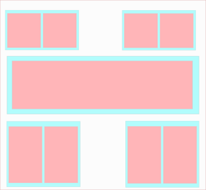
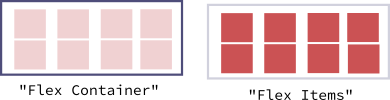
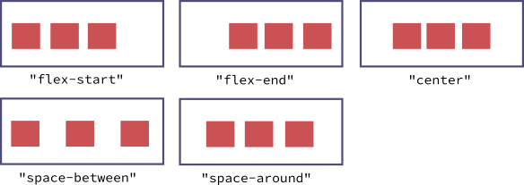
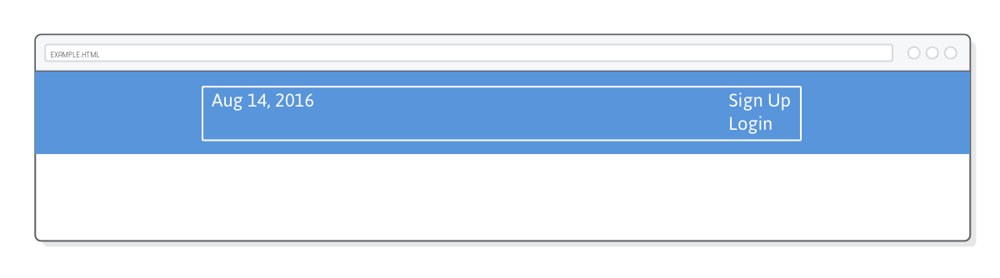

# Flex Box : Reprendre le contrôle

Il y a peu durant votre parcours avec le CSS et le HTML vous avez vu le `modèle de boîte`.

Pour un peu se rappeler, le modèle de boîte défini la manière dont les éléments HTML vont naturellement se positionner sur la page sans que l'on ne rajoute une ligne de CSS.

Dans le modèle de boîte, il va y avoir deux types d'élements : ceux de type
`block` (un `<p>`, une `<div>`, par exemple). Ces éléments vont agir comme des briques lego et venir naturellement s'empiler les uns sur les autres.

_Comme sur ce schéma :_


En plus des éléments de type bloc, nous avons les éléments de type inline (`<em>`, ``, `<span>`) qui eux par défaut se placeront dans le flux des éléments c'est à dire qu'ils se placeront à coté et non en dessous des autres éléments.

Ce comportement est une bonne base mais il va être assez difficile de créer des mises en page un tant soit peu recherchées en se basant uniquement sur ce positionement "naturel" des élements.

Nous ce que nous souhaitons c'est avoir la maitrise sur le positionement de nos élements. Par exemple, nous voulons décider que tel `<p>` devrait être `à coté` d'un autre pour fomer deux collonnes.

Dans cet optique, en plus de fournir des proporiétés pour styliser nos éléments, le CSS possède tout un attirail de possibilitées ayant pour but de nous aider à reprendre la maitrise sur le positionement de nos éléments.

Aujourd'hui, nous allons voir la technique le plus moderne qui se nomme `CSS Flexible Box Layout Module` ou en abbrégé `Flex Box` (comment traduire ceci ... hum... "Module de mise en page à l'aide de boîtes flexibles" ? 😑 ).

Avant de rentrer dans le vif du sujet, il va être important que nous fassions ensemble un petit point d'histoire du web (cela vous a manqué hein ? :-) ) car `Flex Box` n'est qu'une évolution des techniques ancestrales de positionement êtant venues au fur et à mesure de l'évolution du CSS.

## Le point culture de l'internet :

`FlexBox`et son ensemble de propriétées nous aidant à mettre en page notre site web est arrivé aux alentours de 2006 dans le paysage du web actuel. 2006 cela parraît assez vieux dans l'histoire agitée des internets mais en fait cela reste somme toute assez récent.

Mais alors comment faisait-il pour mettre en page dans les temps immémoriaux à la préhistoire du web ?

Et bien, il faut dire que cela à toujours été un peu de bidouille avec les outils dont on disposaient à l'époque.

### La mise en page avec un tableau

Une des premières technique de mise en page recensée par les archéologues du web (dont vous faites peut-être parti ? ;-) ) était appellée la technique du tableau.

Cette technique se basait sur les balises HTML que l'on utilisent encore pour mettre en page des données au sein de tableaux (un peu comme avec le logiciel `Excel`).

Ces balises pour rappel sont les, sans toutes les nommées, `table`, `th` , `td`, etc ...

Ainsi si l'on voulait faire une mise en page en deux colonnes l'on pouvait recourrir à ce type de structure HTML :

```html
<table>
  <TABLE BORDER="1">
    <TR>
      <td>
          <h3> Ma première colonne</h1>
          <p> Le contenu ...</p>
      </td>
      <td>
          <h3> Ma seconde colonne</h1>
          <p> Le contenu ...</p>
      </td>
    </TR>
  </TABLE>
</table>
```

Comme vous le remarquez, recourrir à cette technique "pollue" rapidement notre code HTML (prenez le mot `polluer`, dans le sens qui rajoute des éléments HTML peu utiles à la sémantique de notre page web en construction ).

Ici nous avons une mise en page avec deux colonne mais si notre site web necéssite une mise en page plus complexe, nous nous retrouverons vite avec des balises `td` (pour les colonnes) dans tous les sens.

Juste pour avoir un aperçu essayez d'imaginer la structure HTML en tableau qu'il faudrait pour faire une mise en page de ce type :



Où chaque carré rouge représente une zone de contenu textuel, contenu dans une balise `<p>` par example.

Nous n'allons pas écrire la structure HTML correspondante. Le but était simplement de vous faire imaginer la complexité au niveau HTML que cela pourrait engendrer.

En dehors du coté "polluant", un autre problème lié à l' utilisation de la technique de mise en page grâce aux tabeaux et qu'elle n'est plus adéquate par rapport au web actuel. En effet, le besoin actuel est que nous devons pouvoir afficher un même site aussi bien sur un écran géant que sur un écran de smartphone.

En d'autres terme, la mise en page en tableau ne permet pas de faire du web responsive (ou `responsive web design`).

Cette notion de web responsive nous aurons le temps d'en reparler plus tard dans un cours dédié car c'est un élement fondamental à prendre en compte lors de la création d'un site web.

Pour terminer avec les tableaux, sachez que cela n'a pas encore tout à fait disparu. En effet, cette technique est encore fortement répandue si l'on souhaite créer des emails avec une mise en page un peu recherchée (email marketing, promotionnel, newsletter, ..).

Ceci pour une raison simple : c'est une des seule technique de mise en page supportée à coup sûr par les clients mails les plus utilisés ( Microsoft Outlook, principalement). Donc il se peut que durant votre vie de développeur web vous ayez encore à faire à ce genre de technique venues des ages sombres.

### La mis en page avec `float`

Quelques temps après l'âge d'or de la mise en page avec les tableaux est venu une autre alternative pour la mise en page. Cette techniquer recourrait massivement à la propriété de positionement `float`.

L'utilisation de float est un peu complexe à prendre en main mais permet d'avoir un contrôle plus simple sur le positionement `horizontal` des éléments.

`float` est une technique de mise encore utilsée actuellement car bien supportée par les versions de navigateur les plus répendues dans les entreprises (`Internet Explorer 7/8`) notamment.

Outre ça complexité apparente, l'utilisation de `float` peut aussi limiter la créativité en matière de mise en page de site internet.

Cette technique était fortement utilisée pour des sites web ayant une mise en page se rapprochant de la celle des journaux ou magasines papier. Par la suite, la volonté était de créer des design web plus créatifs et plus dynamiques. De ce fait l'utilisation de `float` est devenue moins adéquate.

Actuellement, l'utilisation de `float` tend à disparaître et reste cantonnée à des besoins spécifiques de mise en page.

Voici que clôture notre point culture web, ici le but était de vous montrer que le CSS et le HTML actuel (... et aussi l'informatique dans son ensemble) est une succession de modifications et d'introductions de nouveaux élements qui font évoluer la manière dont nous devons construire nos projets.

Un des grand défi en tant que développeur est de toujours rester à l'affût des languages ou techniques faisant leur apparition car certaines peuvent rapidement et drastiquement chambouler notre manière de travailler. Ceci s'appelle faire de la `veille technologique`

## La mise en page avec Flexbox

Pour revenir à nos moutons, nous disions donc qu'outre le modèle de boîte qui permet naturellement de gérer la mise en page verticale de notre page, nous avons besoin de quelque chose qui puisse nous aider à travailler `facilement` (par rapport aux autres techniques vues précédement, j'insiste ) sur l'horizontalité.

Justement c'est là (mais pas que !) que `FlexBox` s'illustre vraiment bien.

### Préparation du projet.

Au cours de cette leçon, nous allons construire quelque chose qui va ressembler à ceci:

.

Pour commencer, nous allons créer un dossier que l'on va nommer `css-flexbox`.

Dans ce dossier nous allons ajouter le dossier `assets`. Si vous ne l'avez pas sous la main ( non ne regardez pas :-), bon ok elle était facile ), n'héistez pas à le demander à votre formateur.

Généralement dans un projet web plus complexe, on aime bien structurer aussi l'organisation des dossiers pour rassembler ce qui va ensemble. Ici `assets` est le dossier qui contient toutes les images dont nous aurons besoin pour ce projet.

En plus du dossier `assets`, nous allons créer fichier nommer `index.html` qui contiendra cette structure :

```html
<!DOCTYPE html>
<html lang="fr">
  <head>
    <meta charset="UTF-8" />
    <title>Flexbox, les bases</title>
    <link rel="stylesheet" href="styles.css" />
  </head>
  <body>
    <div class="menu-container">
      <div class="menu">
        <div class="date">14 Janvier 2019</div>
        <div class="signup">S'inscrire</div>
        <div class="login">Se connecter</div>
      </div>
    </div>
  </body>
</html>
```

A coté du dossier `assets` et du fichier `index.html`, nous allons créer notre fichier `styles.css` qui va contenir ces quelques lignes :

```css
* {
  margin: 0;
  padding: 0;
  box-sizing: border-box;
}

.menu-container {
  color: #fff;
  background-color: #5995da; /* Bleu */
  padding: 20px 0;
}

.menu {
  border: 1px solid #fff; /* Pour débugger */
  width: 900px;
}
```

Je pense qu'à l'heure actuelle vous êtes capable de décortiquer tout seul ces quelques lignes de CSS.

Nous allons juste un peu nous attarder sur ceci :

```css
* {
  margin: 0;
  padding: 0;
}
```

Le but de ce bloc est de supprimer le `margin` et le `padding` qui part défaut s'applique sur tous les éléments HTML (vous vous souvenez de la `Feuille de style par défaut` dont nous avons parlé dans le cour CSS 101 ?`).

Ici `*` permet de sélectionner TOUS les éléments de la page web.

A ce stade-ci votre projet devrait avoir cette structure :

.

### Un aperçu de Flexbox

Pour bien comprendre `Flexbox`, il va être nécessaire de bien comprendre deux concepts fondamentaux dont nous n'avons jamais parlé précédement : les notions de `flex-container` et de `flex-item`.

Le rôle d'un `flex-container` et de regrouper un paquet d'élements (`flex-item`) et de définir la manière dont ces éléments vont
être positionés.

Vous pouvez voir ce containeur comme un enclos qui encèrcle un troupeau de mouton indisciplinés (les `flex-items`).



Chaque enfant direct d'un `flex-container` est considéré comme une item.

Il en va de la responsabilité du `flex-container` de défnir la manière dont seront disposé les `items`. De cette manière, les `item` ne `sont pas` responsable de leur positionement.

### Les `flex-containers`

La première chose que nous devons faire ici pour utilisr les `FlexBox` est de modifié la caractéristiques d'un containeur (une `div`, par exemple) pour qu'il devienne un `flex-container`.

Pour ce faire nous pouvons ajouter cette propriété css : `display : flex` à l'un des éléments que nous souhaitons transformer en `flex-container`.

Dans notrs fichier HTML remarquez la `<div>` ayant comme class le nom `menu-container`. C'est dans un premier temps, ce containeur là que nous souhaitons rendre `flex`.

Pour ce faire dans notre fichier `styles.css`, nous pouvons ajouter la propriété `display : flex` à la règle déja existante pour le `.menu-containeur`.

Ainsi nous obtenons, cette règle :

```css
.menu-container {
  color: #fff;
  background-color: #5995da; /* Bleu */
  padding: 20px 0;
  display: flex;
}
```

Bon pour le moment l'effet visuel de la modification de la règle n'est pas flagrant... La raison est simple : nous avons juste dit à notre `menu-container` "maintenant je veux que tu devienne un `flex-container`" mais nous n'avons pas encore péciser comment il devait organiser ses élements enfants.

### Aligner les élements

Maintenant que nous avons fait un tour de passe-passe pour changer la nature de notre `menu-container`, nous allons essayer de travailler sur l'alignement horizontal de nos élements (les `flex-item` contenue dans le `menu-container`).

Pour ce faire pas besoin de modifier la nature de ces items, nous avons juste à rajouter la propriété `justify : center` à la règle pour le `menu-container`.

Pour regarder l'effet, sauvegardons et rafraichissons notre page.

Regardez, notre menu en construction se positionne parfaitement au centre de son parent (le `menu-container`).

#### L'astuce de Chaman

Avant de continuer, ayons le bon réflexe et ouvrons les `developpeur tools` de notre navigateur.

Si si rappelez vous ce sont les outils que met à disposition tout navigateur digne de ce nom pour nous aider développer/ débugger notre projet.

Vous ne nous rappelez vraiment pas ?

Dans ce cas, je vous invite à relire la section du cours `CSS-101` dédiée a ces outils.

Maintenant que vous avez les `developpeur tools` (dev tools, dans la jargon) ouverts vous devriez pouvoir retrouver facilement un écran ressemblant à ceci :


Ici j'utilise comme navigateur `Firefox Developpeur Edition` mais comme je vous le disais dans le secion consacrée aux dev tools, chaque navigateur possède les mêmes fonctionalitées de base. Le choix de votre navigateur de travail relève plus d'un choix et d'un confort personnel.

Tout cela pour vous dire que dans cet écran, il vous est possible d'activer ou non certaines propriété css pour directement voir l'effet.

Fin de transmission. Bip.

Pour en revenir à notre propriété `justify-content`. Celle-ci peut prendre plusieures valeurs dont notamment :

- `center`
- `flex-start`
- `flex-end`

Comme le disait un grand sage, un beau dessin vaut mieux qu'un long discour. Donc en voici un qui illustre l'effet de ces valeurs.

.

A la différence de la valeur `center`, `flex-start` et `flex-end` permettent respectivement de placer les items au début ou la à la fin de leur `flex-containeur` (l'encadré bleu).

N'hésitez pas modifier la valeur de `justify-content` dans les dev-tools pour vérifier que je ne vous dit pas des sottises. :-)

### Distribuer plusieures items

Bon aligner à la fin ou au début des élements à l'intérieur d'une div c'est bien sympatique mais cela ne démontre pas vraiment tout le pouvoir de `FlexBox` par rapport au positionement avec `float` par exemple.

Là où `FlexBox` montre tout son pouvoir c'est en nous permettant d'espacer (de distribuer) équitablement nos items au sein de leur containeur.

**Petite démonstration** :

Au sein de notre fichier `styles.css`, nous allons remplacer la règle déja éxistante pour le `.menu` par cette règle :

```css
.menu {
  border: 1px solid #fff;
  width: 900px;
  display: flex;
  justify-content: space-around;
}
```

Sauvegardons et rafraichissons notre navigateur et admirons le paysage.

Que ce passe-t-il ?

Tout les élements contenu dans notre `.menu` ce sont alignés horizontalement et se sont espacés équitablement à l'intérieur du menu.

**_Décortiquons cette règle_**

Bon passons, les propriétés `border` et `width` que vous connaissez déjà.

Ici nous avons tranformé notre `.menu` en `flex-container` comme nous l'avions fait pour notre `menu-container` et en plus nous avons fait en sorte que tout les éléments inclus dans le `.menu` soient espacés équitablement.

Ceci grâce à la propriété : `justify-content: space-around`

Donc en plus de `center`, `flex-start`, `flex-end` la propriété `justify-content` peut prendre une autre valeur : `space-around`.

En réalité, `justify-content` peut aussi prendre une autre valeur : `space-between`.

Pour découvrir son effet je vous laisse essayer.

Vous le remarquez, maintenant il y a plus d'espace entre nos éléments dans le menu. Cela tombe bien c'est exactement ce que nous voulons.

Alors allons y changeons la valeur pour le `justify-content` et utilisons `space-between`

Nous allons aussi en profiter pour enlever la moche bordure blanche autour du menu que nous servait à nous repéré.

Donc votre fichier css devrait actuellement ressembler à ceci :

```css
* {
  margin: 0;
  padding: 0;
}

.menu-container {
  color: #fff;
  background-color: #5995da; /* Bleu */
  padding: 20px 0;
  display: flex;
  justify-content: center;
}

.menu {
  width: 900px;
  display: flex;
  justify-content: space-between;
}
```

Un petit résumé en image pour la propriété `justify-content`

.

### Regrouper des éléments

Pour la suite de la leçon, notre grande ambition serait de pouvoir avoir la date d'un coté de notre menu et de l'autre nous souhaitons regrouper les `<div>` contenant nos liens pour s'inscire ou se connecter au site (les `<div>` ayant pour class `signup` et `login`).

Un peu comme le montre ce schéma :

.

Pour ce faire, nous devons retenir un principe de base de `FlexBox` :

un `flex-container` ne peut agir que sur ses éléments enfants mais ne peut pas agir sur les éléments contenu dans ses élements enfants. (Les petits enfants du `flex-container`).

Pour illustrer ceci, entourons nos éléments

```html
<div class="signup">S'inscrire</div>
<div class="login">Se connecter</div>
```

contenu dans notre `index.html` par une div supplémentaire à laquelle nous allons ajouter la class `links` (liens en anglais)

Ainsi la structure HTML de notre menu ressemblera à ceci :

```html
<div class="menu">
  <div class="date">14 Janvier 2019</div>
  <div class="links">
    <div class="signup">S'inscrire</div>
    <div class="login">Se connecter</div>
  </div>
</div>
```

Véirifions le résultat dans notre navigateur.

Super jusque'ici nous avons le rendu que nous avons espéré. Cependant, le rendu n'est est pas très joli car les `div` contenues dans la `div` avec la e class `links` ne sont plus soumises à l'autorité de leur grand parent (le `.menu`).

Elles ont donc retrouvées leur état naturel d'élement de type `bloc` et s'empilent les unes sur les autres.

Nous ce que nous souhaiterons c'est que le `signup` et le `login` soient aussi alignés horizontalement dans leur `div` parent.

Comment pouvons nous faire ceci ?

La solution est simple : nous pouvons aussi transormer la `<div>` avec la class `links` en `flex-containeur`.

Je vous laisse rajouter la règle CSS correspondante dans le fichier `style.css`. Par la suite nous la complèterons ensemble.

--- Barrière anti-spoil ---

Voici la règle :

```css
.links {
  display: flex;
}
```

Grâce à cette règle, les `<div>` signup et login sont devenues des `flex-items` dont l'organisation dépend de leur parent la div `links`

Cette règle nous pouvons un peu l'améliorée car vous le remarquez le `login` et le `signup` sont collés les uns aux autres. Srtout, ils sont rammassés vers la gauche de la `div` parente alors que nous souhaitons qu'ils se placent à droite de cette même div.

Pour ce faire nous pouvons modifier notre règle comme ceci :

```css
.links {
  display: flex;
  justify-content: flex-end;
}
```

et rajouter un peu d'espacement entre le login et le signup en écrivant cette règle :

```css
.login {
  margin-left: 20px;
}
```

### L'alignement vertical

Jusqu'à présent nous manipulions nos éléments en modifiant leur position sur l'axe horizontal.

Avec `FlexBox` nous pouvons aussi les manipuler sur l'axe vertical.

Pour débuter nous allons enrichir notre html et rajouter ce bout de code dans le fichier `index.html` de notre projet.

```html
<div class="header-container">
  <div class="header">
    <div class="subscribe">Souscrire &#9662;</div>
    <div class="logo"></div>
    <div class="social"></div>
  </div>
</div>
```

et notre fichier HTML prendra donc cette forme :

```html
<!DOCTYPE html>
<html lang="fr">
  <head>
    <meta charset="UTF-8" />
    <title>Flexbox, les bases</title>
    <link rel="stylesheet" href="styles.css" />
  </head>
  <body>
    <div class="menu-container">
      <div class="menu">
        <div class="date">14 Janvier 2019</div>
        <div class="links">
          <div class="signup">S'inscrire</div>
          <div class="login">Se connecter</div>
        </div>
      </div>
    </div>
    <div class="header-container">
      <div class="header">
        <div class="subscribe">Souscrire &#9662;</div>
        <div class="logo"></div>
        <div class="social"></div>
      </div>
    </div>
  </body>
</html>
```

Ici nous voulons que tous les élements contenus `header-container` soient centrés dans notre page un peu comme le menu que nous avions créé plus haut.

Ici je vous laisse écrire la règle css pour atteindre cet objectif.

Un indice : vous allez avoir besoin de la propriété `justify-content`.

Pour rappel vous avez seulement besoin de toucher à la div `header-container` et non directement à la div `header`.

N'oubliez pas que vous pouvez utiliser les `dev tools` pour vous aider.

--- Barrière anti-spoil ---

Nous pouvons écrire la règle comme ceci :

```css
.header-container {
  display: flex;
  justify-content: center;
}
```

Maintenant rajoutons un peu de couleur en complétant notre règle css pour le `header-container` avec ceci :

```css
color: #5995da;
background-color: #d6e9fe;
```

et non obtenons donc cette règle css :

```css
.header-container {
  color: #5995da;
  background-color: #d6e9fe;
  display: flex;
  justify-content: center;
}
```

Regardez le résultat ça commence à avoir un peu plus de chien. Vous ne trouvez pas ?

Maintenant que nous avons organisé à la louche le `header` (l'en-tête, en français) de notre page. Nous allons pouvoir positionner plus finement les élements qui le compose.

A savoir ceux qui sont situés dans la div avec la class `.header`.

Notre objectif serait d'obtenir quelque chose ce rapprochant de ceci :


**_Petit défi :_**

Je pense qu'à l'heure actuelle vous avez toutes les clés en mains pour obtenur le rendu indiqué un peu plus haut.

Ici n'oubliez pas vous avez juste besoin de travailler avec la balise ayant pour class `.header`

---Barrière anti-spoil ---

La règle css correspondante pourrait être ceci :

```css
.header {
  display: flex;
  justify-content: space-between;
}
```

Vous le constatez notre header est un peu ramassé sur lui même. Nous pouvons lui donner de la hauteur en ajoutant ceci à notre règle css :

```css
width: 900px;
height: 300px;
```

ainsi notre règle pour le `.header` devient :

```css
.header {
  display: flex;
  justify-content: space-between;
  width: 900px;
  height: 300px;
}
```

Voilà qui est déja mieux. Cependant, tout le header reste collé au menu. Ce qui est pas réellement esthétique.

Ce qui serait plus chouette ce serait d'avoir plus d'espace en haut et en bas pour un peu décrocher ce contenu du menu. Aérer un peu tout ceci en somme.

Pour effectuer ceci, nous allons avoir besoin d'introduire une nouvelle propriété issue de l'univers de `Flexbox` à savoir : `align-items`.

Là où `justify-content` s'occupe de l'alignement `horizontal` des éléments `align-items` lui s'occupera donc de l'alignement `vertical`

`align-items` peut prendre les valeurs suivantes :

- `flex-start`
- `flex-end`
- `baseline`
- `stretch`
- `center`

Voici l'effet de ces propriété en image :


Je vous laisse devnier la valeur que nous devons donner à notre header pour que ces élements soient `centrés` verticalement.

--- Minute de réflexion ---

Et la valeur est `center`. Bravo vous avez gagnez un chocolat. Je vous laisse le demander auprès de votre formateur. ;-)

Donc nous aurons la propriété `align-itemps : center` à rajouter à là règle css pour le `.header`.

Je vous laisse la modifier dans votre fichier `styles.css`

Maintenant, je pense qu'il serait chouette si vous preniez le temps d'experimenter un peu avec les propriété de positionement que nous avons vu jusqu'à présent.

N'hésitez pas à modifier la structure du HTML pour obtenir une nouvelle mise en page.

Avant de continuer et après avoir experimenter, n'oubliez pas de remettre votre fichier `index.html` dans cet état :

```html
<!DOCTYPE html>
<html lang="fr">
  <head>
    <meta charset="UTF-8" />
    <title>Flexbox, les bases</title>
    <link rel="stylesheet" href="styles.css" />
  </head>
  <body>
    <div class="menu-container">
      <div class="menu">
        <div class="date">14 Janvier 2019</div>
        <div class="links">
          <div class="signup">S'inscrire</div>
          <div class="login">Se connecter</div>
        </div>
      </div>
    </div>
    <div class="header-container">
      <div class="header">
        <div class="subscribe">Souscire &#9662;</div>
        <div class="logo"></div>
        <div class="social"></div>
      </div>
    </div>
  </body>
</html>
```

et le fichier `styles.css` comme ceci :

```css
* {
  margin: 0;
  padding: 0;
}

.menu-container {
  color: #fff;
  background-color: #5995da; /* Bleu */
  padding: 20px 0;
  display: flex;
  justify-content: center;
}

.menu {
  width: 900px;
  display: flex;
  justify-content: space-between;
}

.links {
  display: flex;
  justify-content: flex-end;
}

.login {
  margin-left: 20px;
}

.header-container {
  color: #5995da;
  background-color: #d6e9fe;
  display: flex;
  justify-content: center;
}

.header {
  display: flex;
  justify-content: space-between;
  width: 900px;
  height: 300px;
  align-items: center;
}
```

### Erubanner les élements

Bon on va tout de suite arrêter les bétises et au lieu d'utiliser ce mot désuet `enrubanner` nous allons utiliser sa traduction anglaise qui est `wrapping` (emballer, enrubanner, englober, ...).

Quoique j'aime assez bien ce mot `enrubanner`...

Allez non, restons international.

Donc dans cette partie nous allons voir comment nous pouvons `wrapper` nos `flex-items`.

#### Tou d'abord à quoi cela sert-il ?

Je ne sais pas si durant vos experimentations vous avez déja eu à faire face à une situation où vous souhaitiez afficher plus d'élements dans une `<div>` que la taille de celle-ci pouvait afficher.

Que ce passe t'il ?

Et bien il est possilble que ces éléments sortent complètement de la `<div>` un peu comme sur ce schéma :


Généralement ce n'est pas un résultat que l'on souhaite obtenir.

Afin d'éviter ceci `FlexBox` dispose d'une propriété nommée `flex-wrap` et qui prend deux valeurs :

- `nowrap`
- `wrap`

Pour expirimenter avec cela, nous allons encore un peu enrichir notre HTML et ajouter cette structure en dessous du `.header-container` :

```html
<div class="photo-grid-container">
  <div class="photo-grid">
    <div class="photo-grid-item first-item"></div>
    <div class="photo-grid-item"></div>
    <div class="photo-grid-item"></div>
  </div>
</div>
```

et nous allons aussi enrichir le fichier `sytles.css` pour y ajouter le style correspondant au HTML que nous venons d'ajouter.

```css
.photo-grid-container {
  display: flex;
  justify-content: center;
}

.photo-grid {
  width: 910px;
  display: flex;
  justify-content: flex-start;
}

.photo-grid-item {
  border: 1px solid #fff;
  width: 300px;
  height: 300px;
}
```

Ici je pense que vous êtes capable de décortiquer les règles css par vous même.

Rafraîchissez votre page web et regardez le résultat.

Toutes les images s'alignent correctement sur l'axe horizontal.

Maintenant nous allons rajouter quelques images.

Pour ceci rajouter DANS la `<div>` ayant pour class `photo-grid` ces quelques élement HTML

```html
<div class="photo-grid-item"></div>
<div class="photo-grid-item last-item"></div>
```

Ainsi notre `.photo-grid-container` aura cette structure :

```html
<div class="photo-grid-container">
  <div class="photo-grid">
    <div class="photo-grid-item first-item"></div>
    <div class="photo-grid-item"></div>
    <div class="photo-grid-item"></div>
    <div class="photo-grid-item"></div>
    <div class="photo-grid-item last-item"></div>
  </div>
</div>
```

Regardons le résultat à l'écran.

Orage ô désespoir, ô viellesse ennemie. Notre mise en page est complêtement cassée.

Rassurons-nous, c'est ici que nous pouvons utiliser la "pâte à (hot) fix" du CSS nommée `flex-wrap`.

#### Petit point culture web

Juste pour que vous compreniez ma vanne un peu bancale `pâte à (hot) fix`, dans le jargon du développement informatique un `hot fix` est un bout de code qui va permettre de réparer un bug rapidement mais la solution proposée au problème n'est généralement pas élégante et à vocation à être retravaillée et améliorée par la suite.

Et faire des `hot fixes` c'ést généralement maaaaaaaaal car tant qu'à faire il vaut mieux autant que possible privillégié une réparation (un `fix`) durable.

Bon ici c'était juste pour faire la blague, dans notre cas `flex-wrap` est réellement la bonne solution.

Donc utilisons la sans apréhention aucune.

Pour se faire nous allons devoir `wrapper` notre `.photo-grid`.

De cette manière nous pouvons réecrire la règle css correspondante comme ceci :

```css
.photo-grid {
  width: 910px;
  display: flex;
  justify-content: flex-start;
  flex-wrap: wrap;
}
```

Cool problème résolu.

Oui enfin presque... Nous devons juste recentrer notre `.photo-grid` pour avoir un résultat convaincant.

Modifions donc le `justify-content` en remplaçant `flex-start` par `center`.

Voilà qui est mieux ! Maintenant nous avons une jolie grille d'images.

### Changeons de direction !

Un peu plus haut je vous touchais un mot à propos du `responsive design` en vous disant que le but de cette technique visait à faire en sorte que notre site web puisse être affiché aussi bien sur des grands écrans, des écrans normaux mais surtout sur des tablettes et mobiles.

Sans trop rentrer dans les détails (car cela fera l'objet d'un cours à part entière), nous pouvons essayer quelque chose.

Je vous propose d'ouvrir et de rétraicir la fenêtre de votre navigateur et de regarder comment le site évolue. Notamment la grille d'images.

Vous remarquez la grille se transforme en colonne dès que l'écran devient trop petit. C'est une des choses géniale avec `FlexBox`, cette technique nous permet de construire de sites s'adaptant à leur contexte d'affichage.

Une des grandes contraintes que nous avons actuellement c'est que pour l'affichage `desktop` (sur ordinateur en français), les web design actuels privillégient une structuration des élements `en grille` (comme pour les images par exemple) tandis que le design mobile prévillégie l'affichage en colonne (question de place disponible).

`FlexBox` est ici un réel allié qui va nous aider à faire en sorte que notre site web soit toujours affiché dans les meilleures conditions.

Et si maintenant nous voulions cassez le codes actuels et toujours afficher notre grille d'images en colonne peut-importe si l'on est sur un ordinateur ou sur mobile. Comment pourrions nous faire ?

Pour répondre à ce besoin, il est possible d'indiquer dans quelle direction (en grille ou en colonne) les élements contenus dans un `flex-container` vont être affichés.

Pour ce faire nous pouvons ajouter la propriété suivante `flex-direction: column;` à notre règle pour l'élement `.photo-grid`.

Je vous laisse essayer.

Normalement vous devriez voir les images sous forme de colonne.

#### Une petite considération concernant l'alignement.

A force de vouloir casser les codes, nous avons obtenu une mise en page beaucoup moins jolie qu'initialement (selon mes goûts extraordinaires, je précise :-D).

Remarquez qu'avant nos élements étaient bien centrés sur la page et que maintenant notre colonne d'images se retrouve complètement écrasée sur la gauche.

Mais pourquoi ?

Et bien en changeant la `flex-direction` nous sommes passés dans une autre dimension.

Comme je vous l'avais dit plus haut, dans le monde dont nous venons :

- `align-items` va s'occuper de l'alignement `vertical` des élements
- `justify-content` va quant à lui s'occuper de l'alignement `horizontal`

Et bien dans la dimension `flex-direction:column` c'est juste ... le contraire !

C'est `justify-content` qui va s'occuper du vertical tandis que l'horizontal va être pris en charge par `align-items`.

Donc pour centrer notre colonne d'image nous pouvons remplacer le `justify-content` par un `align-items` (tout en gardant la valeur `center`) au sein de notre règle css pour `.photo-grid`

Donc nous obtenons cette règle css :

```css
.photo-grid {
  width: 910px;
  display: flex;
  align-items: center;
  flex-wrap: wrap;
  flex-direction: column;
}
```

### Un peu de passe-passe

Pour finir ce cours sur `flex-box`, nous allons faire un peu de magie. Et si je vous disais qu'il était possible de modifier l'ordre dans lequel les élémens de la grille d'image vont s'afficher et ceci sans toucher au HTML ?

Ce serai un tour plutôt culoté n'est-ce pas ?

Et bien tentons le coup.

Ce que nous voulons faire c'est :

1. Revenir à un affichage en forme de grille (c'est tout de même plus présentable pour un affichage sur ordinateur)

2. Afficher les images dans cet ordre :


Et tout ça, je le répète, sans toucher une ligne d'HTML !

Et bien je ne vais pas faire durer plus longtemps le suspense. Nous pouvons simplement modifier la `flex-direction` en lui donnant la valeur `row-reverse`

Essayez ce tour de magie par vous même, je vous en prie.

Etant donné que nous sommes revenu dans la dimension `flex-direction:row` (dont fait partie `row-reverse`) si nous voulons centrer nos élements que devons-nous faire ?

Je vous laisse trouver tout seul.

--- Barrière anti-spoil ---

Oui c'est bien ça, nous devons remplacer dans la règle pour `.photo-grid`, `align-items` par `justify-content`

De la même manière `flex-direction:column` possède sont pendant `flex-direction:column-reverse`.

Pour revenir à l'état naturel des choses deux options:

- remettre la valeur de `flex-direction` à `row`
- juste supprimer la propriété `flex-direction` car par défaut le navigateur considère que tout `flex-container`possède la propriété `flex-direction` avec une valeur de `row`.

Voilà qui clotûre cette partie sur la mise en page avec `Flexbox`.

A ce stade-ci vous devriez être capable de mettre en page des sites web en décidant comment les éléments doivent être organisés entre eux.

`FlexBox` est un outil massivement utilisé actuellement, je vous encourage donc à prendre le temps d'experimenté en essayant de créer des variations autour du design que nous avons construit ensemble.

A très vite pour de nouvelles aventures autour du CSS !
