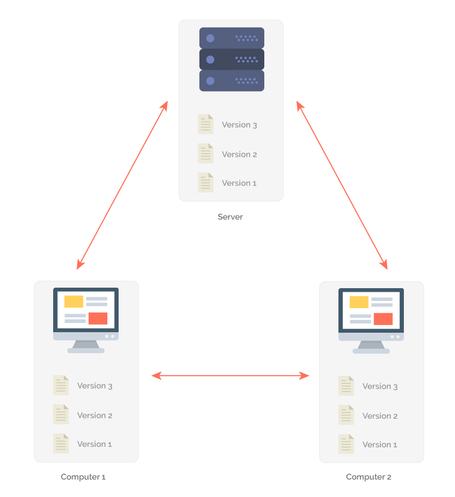
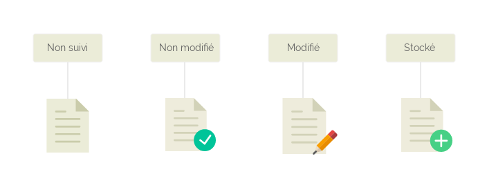

# Apprendre à utiliser Git

[TOC]


## 1. Git, c'est quoi ?


Git est ce qu'on appelle un logiciel de gestion de versions. Ses objectifs :

- conserver un historique des modifications du projet
- conserver les anciennes versions du projet
- savoir qui modifié quoi tout au long de la vie du projet
- travailler à plusieurs sur le projet sans écraser les modifications des autres

Il existe de nombreux logiciels de gestion de version (SVN, par exemple), mais Git est un des plus puissants et des plus utilisés dans le monde informatique. Et pour cause : il a été créé par Linus Torvald, qui a également créé... le noyau Linux.

Son but est de gérer l'évolution du contenu sous la forme d'une arborescence, tout en restant simple d'utilisation.

Sur internet, un des outils les plus utilisés vient d'ailleurs de l'utilisation de Git : il s'agit de Github, un site sur lequel vous pouvez héberger gratuitement vos projets, et où tout le monde peut apporter sa contribution. Github est devenu une gigantesque librairie de projets, dont certains très connus : React, VueJS, Bootstrap...

### 1.1. Comment ça marche ?

Git va conserver la source du projet sur un serveur, et chacun va récupérer le projet en local. Lorsque vous allez passer vos modifications sur le serveur, Git va vérifier que vos fichiers modifiés n'ont pas été modifiés par quelqu'un d'autre en parallèle et vous prévenir si c'est le cas.

En cas de conflit (si quelqu'un a modifié les mêmes fichiers que vous), Git vous indiquera exactement où le code pose problème.




## 2. Installer Git


Sur Linux, il suffit de taper dans le terminal :

```bash
sudo apt install git-all
```

Git s'utilise très très bien avec le terminal, et il est vraiment conseillé de commencer à le prendre en main par ce biais. 

Si vous préférez avoir quelque chose de visuel, une appli comme GiKraken vous permettra de gérer votre projet facilement.

### 2.1 Configurer Git

La première chose à faire, une fois Git installé, c'est de le configurer.

Tout d'abord, il faut lui indiquer qui vous êtes : à chaque modification que vous ferez, votre nom et adresse mail apparaîtront pour toutes les personnes qui font partie du projet. C'est ce qui permettra de savoir qui a fait quoi.

Bien sûr, rien ne vous oblige à mettre votre vrai nom ou email...

Pour configurer votre identité, allez dans le terminal et tapez :

```bash
git config --global user.name "Batman"
git config --global user.email alfred@batman.com
```

Notez que toutes les commandes git commencent par `git`.

La commande `config` est un outil va vous permettre de configurer Git en local. Le paramètre `--global` signifie que ces paramètres seront automatiquement utilisés sur tous les projets que vous aurez sur votre machine.

Cette config va être enregistrée dans un fichier `.gitconfig`, que vous pouvez retrouver à la racine de votre dossier utilisateur : dans votre explorateur de fichiers, dans `Dossier personnel`, affichez les dossiers et fichiers cachés avec le raccourci clavier `ctrl + h`. Et là, vous devriez le voir apparaître !

Si vous l'ouvrez avec un éditeur de texte, vous devriez voir quelque chose qui ressemble à ça :

```
# Ceci est le fichier de configuration personnel de Git.
[user]
# Veuillez adapter et décommenter les lignes suivantes :
	name = votreNom
	email = votreadressemail@exemple.fr
```

Sachez que vous pouvez modifier vos paramètres ici, ça fonctionnera aussi bien qu'en ligne de commande.

La deuxième chose à configurer sont les couleurs dans le terminal Git. Vous le verrez très vite, les différentes couleurs sont très importantes !

Dans le terminal, il suffit de taper :

```bash
git config --global color.ui true
```

Et voilà pour la partie configuration !

------

**Important**

Si vous avez un doute sur une commande, vous pouvez faire, à tout moment :

```bash
git help <command>
```

Ici, `<command>` est simplement le nom de la commande pour laquelle vous avez besoin d'aide. Par exemple :

```bash
git help config
```

Vous pouvez également le faire de façon raccourcie :

```bash
git <command> -h
```

Ce qui donnera en pratique :

```bash
git config -h
```

Vous n'êtes pas obligé de mettre un nom de commande à la fin ! Faites juste un `git help`, et vous aurez la liste des commandes disponibles pour Git.

------


## 3. C'est parti ! Premiers pas avec Git

Il existe deux façons de mettre un projet sous Git :

- Soit vous prenez un dossier déjà existant, et vous le passez sous Git
- Soit vous clonez un projet Git depuis un autre serveur

**À noter** Les dossiers sont aussi appelés "répertoires" (`repository` en anglais). Quand on parle d'un projet sur Git, on va généralement parler d'un `repo Git`.

### 3.1. Créer un repo Git

Un petit exercice de rappel des commandes du terminal ! Dans votre terminal, naviguez jusqu'au dossier ProjetGit.

Et tapez la commande suivante :

```bash
git init
```

Vous devriez voir ceci sur le terminal:

```bash
Dépôt Git vide initialisé dans Contenu/content/git/ProjetGit/.git/
```

Cette commande va créer un dossier caché `.git` à la racine de votre dossier, que vous pouvez aller voir dans l'explorateur.

Ce dossier va contenir toutes les informations nécessaires à Git pour versionner votre projet. Vous pourrez le constater tout au long de votre projet : ce dossier garde une taille assez légère et prend donc peu de place, et c'est une des grandes forces de Git.

Voilà ! Votre repo Git est initialisé, prêt à suivre l'avancement de votre projet.

### 3.2. Cloner un repo Git

Cloner un repo signifie qu'on va récupérer le projet sur un serveur, et en faire **une copie** en local.

Pour cloner un repo, il suffit de récupérer son URL et d'entrer la commande suivante :

```bash
git clone URL_DU_PROJET
```

Et c'est tout !

## 4. Enregistrer des modifications

Git est configuré, et nous avons un repo Git qui est prêt. Allons-y pour les modifications !

### 4.1. Le statut des fichiers

Tout d'abord, naviguez dans le dossier ProjetGit avec le terminal.

Tapez la commande :

```bash
git status
```

Cette commande est très utile, et vous pouvez la faire à tout moment : elle vous permet de savoir les fichiers correctement suivis, modifiés, envoyés etc.

Ici, vous devriez avoir ceci qui s'affiche sur le terminal :

```bash
Sur la branche master

Validation initiale

Fichiers non suivis:
  (utilisez "git add <fichier>..." pour inclure dans ce qui sera validé)

	images/
	index.html
	style.css

aucune modification ajoutée à la validation mais des fichiers non suivis sont présents (utilisez "git add" pour les suivre
```

Mais qu'est-ce que ça signifie ?

Par défaut, Git ne suit pas l'état d'avancement des fichiers. Il faut lui indiquer quels fichiers il doit suivre, pour qu'il puisse tenir compte de leurs modifications. C'est ce qu'il indique ici !

Pour gérer les différentes versions des fichiers, Git leur donne différents statuts :



- **Untracked** (non suivi) : le fichier existe en local, mais n'est pas suivi par Git. Ça signifie qu'en cas de modification de ce fichier, Git n'en tiendra pas compte et fera comme s'il n'existait pas.
- **Unmodified** (non modifié) : le fichier est suivi par Git, et n'a pas été modifié en local.
- **Modified** (modifié) : le fichier a été modifié en local. Git est capable de dire qu'il y a eu des modifications, mais il ne les enverra pas sur le serveur.
- **Staged** (enregistré) : Git a une "mémoire" interne, qu'on appelle *staged area*. Il y conserve les fichiers modifiés qu'il doit envoyer sur le serveur. Nous y reviendrons un peu plus tard.


### 4.2. Ajouter des fichiers au suivi Git

Actuellement, tous les fichiers de notre projet sont en statut "untracked". Ajoutons-les pour voir ce qu'il se passe !

Pour ajouter un document au suivi de Git, il suffit d'utiliser la commande `git add`

Allez dans le terminal, et tapez :

```bash
git add index.html
```

Comment savoir ce qu'il s'est passé ? Avec la commande git que nous avons vu plus haut, `git status` ! Allez-y, tapez-la dans le terminal.

Vous devriez voir ceci :

```bash
Sur la branche master

Validation initiale

Modifications qui seront validées :
  (utilisez "git rm --cached <fichier>..." pour désindexer)

	nouveau fichier : index.html

Fichiers non suivis:
  (utilisez "git add <fichier>..." pour inclure dans ce qui sera validé)

	fonts/
	images/
	style.css
```

Git vous indique bien qu'il a repéré le nouveau fichier `index.html`, et qu'il va le suivre.

Maintenant, vous n'avez plus qu'à ajouter tous les autres. Comment feriez-vous ?

||
||
||
||
||
||
Réponse !

```bash
git add fonts/
git add images/
git add style.css
```

Ou même plus simplement :

```bas
git add fonts/ images/ style.css
```

Et vous obtenez :

```bash
Sur la branche master

Validation initiale

Modifications qui seront validées :
  (utilisez "git rm --cached <fichier>..." pour désindexer)

	nouveau fichier : fonts/Roboto-Regular.ttf
	nouveau fichier : fonts/fonts.css
	nouveau fichier : images/pluton.jpg
	nouveau fichier : index.html
	nouveau fichier : style.css
```


C'est bon, tous vos fichiers sont suivis par Git !

### 4.3. Suivre des modifications


Ouvrez le document `index.html` avec votre éditeur de texte, et regardez le résultat sur votre navigateur.

Comme vous pouvez le voir, il y a un texte étrange, qui ressemble à du latin : c'est du Lorem Ipsum. C'est un faux langage, totalement inventé, qui permet simplement de faire le design d'un site sans avoir à réfléchir à la rédaction de textes ou de titres.

Dans `index.html`, modifiez le texte entre les balises `h1`.