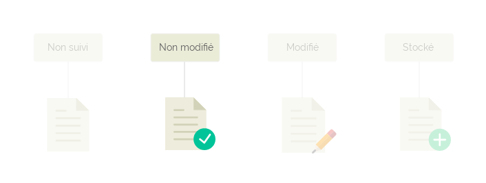
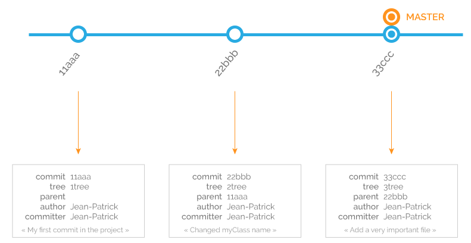
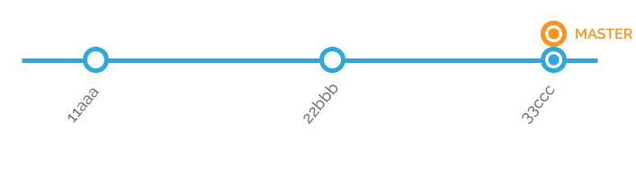
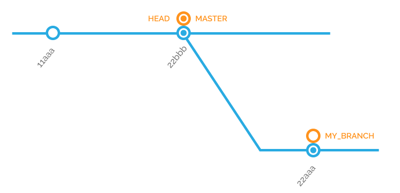
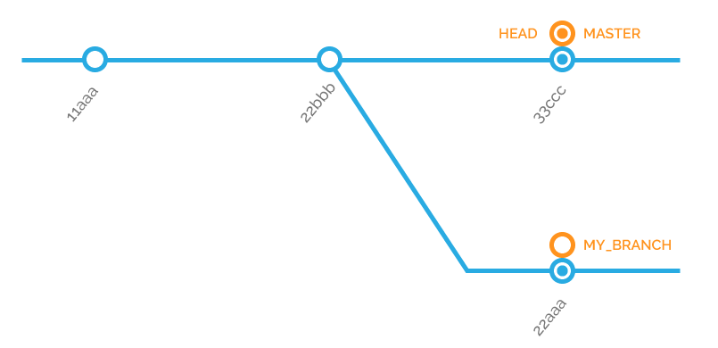

# Apprendre à utiliser Git


**Table des matières**

[TOC]

## Git, c'est quoi ?


Git est ce qu'on appelle un logiciel de gestion de versions. Ses objectifs :

- conserver un historique des modifications du projet
- conserver les anciennes versions du projet
- savoir qui modifié quoi tout au long de la vie du projet
- travailler à plusieurs sur le projet sans écraser les modifications des autres

Il existe de nombreux logiciels de gestion de version (SVN, par exemple), mais Git est un des plus puissants et des plus utilisés dans le monde informatique. Et pour cause : il a été créé par Linus Torvald, qui a également créé... le noyau Linux.

Son but est de gérer l'évolution du contenu sous la forme d'une arborescence, tout en restant simple d'utilisation.

Sur internet, un des outils les plus utilisés vient d'ailleurs de l'utilisation de Git : il s'agit de Github, un site sur lequel vous pouvez héberger gratuitement vos projets, et où tout le monde peut apporter sa contribution. Github est devenu une gigantesque librairie de projets, dont certains très connus : React, VueJS, Bootstrap...


### Comment ça marche ?

Git va conserver la source du projet sur un serveur, et chacun va récupérer le projet en local. Lorsque vous allez passer vos modifications sur le serveur, Git va vérifier que vos fichiers modifiés n'ont pas été modifiés par quelqu'un d'autre en parallèle et vous prévenir si c'est le cas.

En cas de conflit (si quelqu'un a modifié les mêmes fichiers que vous), Git vous indiquera exactement où le code pose problème.


## Installation et configuration


Sur Linux, il suffit de taper dans le terminal :

```bash
sudo apt install git-all
```

Git s'utilise très très bien avec le terminal, et il est vraiment conseillé de commencer à le prendre en main par ce biais. 

Si vous préférez avoir quelque chose de visuel, une appli comme GiKraken vous permettra de gérer votre projet facilement.


### Configurer Git

La première chose à faire, une fois Git installé, c'est de le configurer.

Tout d'abord, il faut lui indiquer qui vous êtes : à chaque modification que vous ferez, votre nom et adresse mail apparaîtront pour toutes les personnes qui font partie du projet. C'est ce qui permettra de savoir qui a fait quoi.

Bien sûr, rien ne vous oblige à mettre votre vrai nom ou email...

Pour configurer votre identité, allez dans le terminal et tapez :

```bash
git config --global user.name "Batman"
git config --global user.email alfred@batman.com
```

Notez que toutes les commandes git commencent par `git`.

La commande `config` est un outil va vous permettre de configurer Git en local. Le paramètre `--global` signifie que ces paramètres seront automatiquement utilisés sur tous les projets que vous aurez sur votre machine.

Cette config va être enregistrée dans un fichier `.gitconfig`, que vous pouvez retrouver à la racine de votre dossier utilisateur : dans votre explorateur de fichiers, dans `Dossier personnel`, affichez les dossiers et fichiers cachés avec le raccourci clavier `ctrl + h`. Et là, vous devriez le voir apparaître !

Si vous l'ouvrez avec un éditeur de texte, vous devriez voir quelque chose qui ressemble à ça :

```
# Ceci est le fichier de configuration personnel de Git.
[user]
# Veuillez adapter et décommenter les lignes suivantes :
	name = votreNom
	email = votreadressemail@exemple.fr
```

Sachez que vous pouvez modifier vos paramètres ici, ça fonctionnera aussi bien qu'en ligne de commande.

La deuxième chose à configurer sont les couleurs dans le terminal Git. Vous le verrez très vite, les différentes couleurs sont très importantes !

Dans le terminal, il suffit de taper :

```bash
git config --global color.ui true
```

Et voilà pour la partie configuration !


------

**Important**

Si vous avez un doute sur une commande, vous pouvez faire, à tout moment :

```bash
git help <command>
```

Ici, `<command>` est simplement le nom de la commande pour laquelle vous avez besoin d'aide. Par exemple :

```bash
git help config
```

Vous pouvez également le faire de façon raccourcie :

```bash
git <command> -h
```

Ce qui donnera en pratique :

```bash
git config -h
```

Vous n'êtes pas obligé de mettre un nom de commande à la fin ! Faites juste un `git help`, et vous aurez la liste des commandes disponibles pour Git.

------


## C'est parti ! Premiers pas avec Git


Il existe deux façons de mettre un projet sous Git :

- Soit vous prenez un dossier déjà existant, et vous le passez sous Git
- Soit vous clonez un projet Git depuis un autre serveur

**À noter** Les dossiers sont aussi appelés "répertoires" (`repository` en anglais). Quand on parle d'un projet sur Git, on va généralement parler d'un `repo Git`.


### Créer un repo Git

Un petit exercice de rappel des commandes du terminal ! Dans votre terminal, naviguez jusqu'au dossier ProjetGit.

Et tapez la commande suivante :

```bash
git init
```

Vous devriez voir ceci sur le terminal:

```bash
Dépôt Git vide initialisé dans Contenu/content/git/ProjetGit/.git/
```

Cette commande va créer un dossier caché `.git` à la racine de votre dossier, que vous pouvez aller voir dans l'explorateur.

Ce dossier va contenir toutes les informations nécessaires à Git pour versionner votre projet. Vous pourrez le constater tout au long de votre projet : ce dossier garde une taille assez légère et prend donc peu de place, et c'est une des grandes forces de Git.

Voilà ! Votre repo Git est initialisé, prêt à suivre l'avancement de votre projet.


### Cloner un repo Git

Cloner un repo signifie qu'on va récupérer le projet sur un serveur, et en faire **une copie** en local.

Pour cloner un repo, il suffit de récupérer son URL et d'entrer la commande suivante :

```bash
git clone URL_DU_PROJET
```

Et c'est tout !


## Enregistrer des modifications


Git est configuré, et nous avons un repo Git qui est prêt. Allons-y pour les modifications !


### Le statut des fichiers

Tout d'abord, naviguez dans le dossier ProjetGit avec le terminal.

Tapez la commande :

```bash
git status
```

Cette commande est très utile, et vous pouvez la faire à tout moment : elle vous permet de savoir les fichiers correctement suivis, modifiés, envoyés etc.

Ici, vous devriez avoir ceci qui s'affiche sur le terminal :

```bash
Sur la branche master

Validation initiale

Fichiers non suivis:
  (utilisez "git add <fichier>..." pour inclure dans ce qui sera validé)

	images/
	index.html
	style.css

aucune modification ajoutée à la validation mais des fichiers non suivis sont présents (utilisez "git add" pour les suivre
```

Mais qu'est-ce que ça signifie ?

Par défaut, Git ne suit pas l'état d'avancement des fichiers. Il faut lui indiquer quels fichiers il doit suivre, pour qu'il puisse tenir compte de leurs modifications. C'est ce qu'il indique ici.

Voilà comment ça fonctionne :

- Git a un historique de modification des fichiers du projet. Si l'historique et le fichier actuel sont identiques, Git ne fait rien.
- Vous modifiez un ou des fichiers.
- Git va vous résumer quels fichiers ont été modifiés, par rapport à l'historique.
- Vous allez lui indiquer, parmi tous ces fichiers, lesquels vous souhaitez inscrire dans l'historique.
- Git va les stocker séparément.
- Quand vous êtes prêts, vous pouvez lui dire d'écrire l'historique avec les fichiers que vous lui avez fait stocker.
- Git va écrire l'historique.


Pour gérer ce cycle de vie, les fichiers vont passer par différents statuts :


- **Non suivi** : le fichier existe en local, mais n'est pas suivi par Git. Ça signifie qu'en cas de modification de ce fichier, Git n'en tiendra pas compte et fera comme s'il n'existait pas.
- **Non modifié** : le fichier est suivi par Git, et n'a pas été modifié en local. Il ne se passe rien.
- **Modifié** : le fichier a été modifié en local. Git est capable de dire qu'il y a eu des modifications, mais il ne les a pas stockées pour la prochaine écriture de l'historique.
- **Stocké** : le fichier est "stocké" à part, et ses modifications seront incluses dans la prochaine écriture de l'historique.

Techniquement, le terme "stocké" n'est pas exact : Git ne duplique pas le fichier pour le mettre ailleurs. Quand il "stocke" des modifications, il écrit quelques lignes dans un fichier texte pour indiquer quel fichier a été modifié. Par ex : Tel fichier, ligne XX, caractère XX remplacé par YY


### Ajouter des fichiers au suivi Git

Actuellement, tous les fichiers de notre projet sont en statut "non suivis". Ajoutons-les pour voir ce qu'il se passe !

Pour ajouter un document au suivi de Git, il suffit d'utiliser la commande `git add`

Allez dans le terminal, et tapez :

```bash
git add index.html
```

Comment savoir ce qu'il s'est passé ? Avec la commande git que nous avons vu plus haut, `git status`. Allez-y, tapez-la dans le terminal !

Vous devriez voir ceci :

```bash
Sur la branche master

Validation initiale

Modifications qui seront validées :
  (utilisez "git rm --cached <fichier>..." pour désindexer)

	nouveau fichier : index.html

Fichiers non suivis:
  (utilisez "git add <fichier>..." pour inclure dans ce qui sera validé)

	fonts/
	images/
	style.css
```

Git vous indique bien qu'il a repéré le nouveau fichier `index.html`, et qu'il va le suivre.

Vous vous souvenez des différents statuts d'un fichier ? Notre fichier `index.html` est passé de `non suivi` à `stocké`. Pourquoi ? C'est simple : quand on demande à Git de suivre un fichier, il le met directement dans la zone de stockage, prêt à être inscrit dans l'historique. Il n'a pas été modifié, puisqu'il n'existait pas jusqu'ici.

Ça signifie que, si on prend l'historique du projet vu par Git, il s'est passé deux choses :

- vous avez instancié un nouveau projet vide
- vous avez créé un fichier `index.html`

Si là, tout de suite, vous faisiez passer ce projet sur un serveur via Git, les personnes qui récupéreraient le projet ne récupèrerait que le fichier `index.html`. 


Maintenant, vous n'avez plus qu'à ajouter tous les autres. Comment feriez-vous ?

||  
||  
||  
||  
||  
||  
Réponse !

```bash
git add fonts/
git add images/
git add style.css
```

Ou même plus simplement :

```bas
git add fonts/ images/ style.css
```

Et vous obtenez :

```bash
Sur la branche master

Validation initiale

Modifications qui seront validées :
  (utilisez "git rm --cached <fichier>..." pour désindexer)

	nouveau fichier : fonts/Roboto-Regular.ttf
	nouveau fichier : fonts/fonts.css
	nouveau fichier : images/pluton.jpg
	nouveau fichier : index.html
	nouveau fichier : style.css
```


C'est bon, tous vos fichiers sont suivis par Git !


### Faire un commit

Pour le moment, vos fichiers en sont là dans Git :


Vos fichiers ont été ajoutés, et Git a stocké cette information. Ça signifie qu'à la prochaine écriture de l'historique, il notera que ces fichiers ont été ajoutés.

Pour écrire dans l'historique, il faut que vous fassiez ce qu'on appelle un `commit`. 

Un commit est une section dans l'historique, qui va contenir différentes données :

- un identifiant unique, qui vous permettra de retrouver le commit quand le projet sera plus avancé
- le pseudo et l'adresse mail de la personne qui a écrit le commit
- un message écrit par la personne qui a fait le commit
- et surtout : les modifications qui ont été ajoutées

Allons-y, créons notre premier commit !

Dans le terminal, tapez la commande suivante :

```bash
git commit
```

Et là, surprise ! Git va vous ouvrir un éditeur de texte par défaut, avec un fichier COMMIT_EDITMSG

Dans ce fichier, il va vous rappeler les modifications qui seront inscrites dans l'historique, et vous demander de saisir un message (le fameux message de commit).

Vous pouvez tout à fait passer par ce système à chaque fois que vous faites un commit, mais soyons honnêtes : utiliser un éditeur de texte dans un terminal ne plaît pas à tout le monde.

En plus, il paraîtrait que les développeurs sont des feignasses... Alors quand ils peuvent faire les choses plus vite...

```bash
git commit -m "Mon premier commit"
```

Tadaaaa ! L'argument `-m` vous permet d'écrire directement le message de commit, sans passer par la case éditeur.

Votre terminal va vous afficher :

```bash
[master (commit racine) ef853e5] Mon premier commit
 5 files changed, 69 insertions(+)

(+ les fichiers modifiés)
```

Vous retrouvez bien votre message de commit, le nombre de fichiers modifiés et le nombre de lignes ajoutés (`69 insertions(+)`).

Mais... et l'historique, il est où ?

Juste ici :

```bash
git log
```

Et là, vous devriez voir apparaître tout l'historique Git du projet !

```bash
commit ef853e52cdbc7a64de2a099c6e1c28f488e6f94f
Author: Batman <alfred@batman.com>
Date:   Thu Feb 7 14:19:02 2019 +0100

    Mon premier commit
```

Pour sortir de l'historique, il vous suffit de taper la lettre *q* (comme `quit`)

Félicitations, vous avez fait votre premier commit !

Vos fichiers ont désormais ce statut :




**À savoir**

Les dev aiment les standards, parce... ce sont des feignasses, souvenez-vous ! Alors si c'est possible de moins réfléchir sur les à-côtés pour pouvoir se concentrer sur la tech pure, ils adorent.

Du coup, il existe des standards pour à peu près tout et n'importe quoi. 

Le standard d'un message de commit, par exemple, est celui-ci : 

```bash
<type de tâche>(<périmètre>): message court

Description complémentaire/complète

Référence/action sur un ticket définissant cette tâche
```

La plupart du temps, la première partie `<type de tâche>(<périmètre>): message court` suffit.

Ça permet d'avoir un historique beaucoup plus facile à lire !

Quand au `type de tâche`, vous pouvez avoir `fix` pour le fix de bugs, `feat` pour l'ajout ou l'amélioration d'élements dans l'appli, `doc` pour de l'écriture de documentation, `test` pour de l'écriture de test...


### Suivre des modifications

Ouvrez le document `index.html` avec votre éditeur de texte, et regardez le résultat sur votre navigateur.

Comme vous pouvez le voir, il y a un texte étrange, qui ressemble à du latin : c'est du *Lorem Ipsum*. C'est un faux langage, totalement inventé, qui permet simplement de faire le design d'un site sans avoir à réfléchir à la rédaction de textes ou de titres.

Dans `index.html`, modifiez le texte entre les balises `h1` (par ex, "Je suis une licorne") et sauvegardez.

Vérifiez le statut...

Normalement, vous devriez voir apparaître ceci :

```bash
Sur la branche master

Modifications qui ne seront pas validées :
  (utilisez "git add <fichier>..." pour mettre à jour ce qui sera validé)
  (utilisez "git checkout -- <fichier>..." pour annuler les modifications dans la copie de travail)

	modifié :         index.html

aucune modification n'a été ajoutée à la validation (utilisez "git add" ou "git commit -a")

```


Que vous dit Git ? Qu'il a bien repéré que vous avez effectué des modifications, qu'il ne les a pas stockés pour le prochain commit, et que vous pouvez le stocker avec `git add`

*"Git add ? C'est pas pour suivre un fichier, normalement ?"*

Si vous vous souvenez bien, pour ajouter des fichiers au suivi Git, on a fait la commande `git add`. Et effectivement, cette commande ne servait *que* pour mettre en place le suivi, les fichiers n'étaient pas ajouté à l'historique.

Mais ça ne fonctionne que si les fichiers n'ont jamais été suivi par Git ! Si vos fichiers sont déjà suivis, et qu'ils ont été modifiés, `git add` va permettre d'ajouter les modifications au stockage pour le prochain commit.

Si c'est un peu compliqué à digérer, c'est normal !

Si je résume :

Fichier non suivi => git add => fichier suivi, dans la zone de stockage => git commit

Fichier suivi => modification => git add => modification dans la zone de stockage => git commit


C'est parti pour l'ajout de la modification !

Faites un

```bash
git add index.html
```

et si vous faites un `git status`:

```bash
Sur la branche master
Modifications qui seront validées :
  (utilisez "git reset HEAD <fichier>..." pour désindexer)

	modifié :         index.html

```


La modification a bien été stockée !

Vous n'avez plus qu'à faire un commit, et vérifier qu'il apparaît dans les logs.

**Et si j'ai d'autres modifications avant le commit ?**

Aucun problème !

Remodifiez le fichier `index.html`, et faites un `git status`.

Vous allez obtenir :

```bash
Sur la branche master
Modifications qui seront validées :
  (utilisez "git reset HEAD <fichier>..." pour désindexer)

	modifié :         index.html

Modifications qui ne seront pas validées :
  (utilisez "git add <fichier>..." pour mettre à jour ce qui sera validé)
  (utilisez "git checkout -- <fichier>..." pour annuler les modifications dans la copie de travail)

	modifié :         index.html

```

Et oui, Git vous précise quelles modifications il a en stockage, et lesquels ne seront pas dans le prochain commit ! Vous pouvez faire un `git add`, qui viendra automatiquement ajouter les nouvelles modifications à celles que vous avez déjà stockées.

Au prochain commit, elles seront toutes envoyées en même temps dans l'historique.


Amusez-vous à faire différentes modifications et commits, et regardez l'historique se remplir ! Vous pouvez même passer vos autres projets sur Git, si vous êtes motivés.


### Voir les modifications d'un fichier avant l'ajout au stockage, ou avant un commit

Voilà une petite commande très pratique ! Vous avez un fichier modifié, qui n'est pas encore dans le stockage, et vous ne savez plus ce que vous avez modifié ?

Ou bien il est stocké, mais vous voulez vérifier les modifications avant de faire un commit ?

Faites simplement la commande :

```bash
git diff monfichier.html
```

Et vous aurez la liste des ajouts et suppressions dans le fichier !


### Gitignore

Parfois, il peut arriver que vous ayez des fichiers ou des dossiers que vous souhaitez garder sur votre ordinateur, mais que vous ne voulez pas partager, ni suivre. Attention, il faut que ces fichiers ne soient pas dans le fichier Git !

Pour éviter que Git vous dise à chaque fois "Hé, tu as un fichier que je ne connais pas, veux-tu l'ajouter ?", il suffit de créer, à la racine du projet, un fichier qui s'appellera `.gitignore`. Dans ce fichier, vous mettrez simplement le chemin vers le fichier / dossier que vous souhaitez laisser en paix, et Git fera comme s'il n'existait pas.


## Au secours, je me suis trompé !

Se tromper, ça arrive tout le temps, ça fait même partie de la culture du développeur (se tromper, réparer, recommencer...). Et heureusement, Git a pas mal de méthodes pour revenir en arrière.

Généralement, il vous indique ces méthodes quand vous faites un `git status`.

### Se tromper à l'ajout d'un fichier au suivi, ou à l'ajout d'une modification au stockage

Vous avez demandé à Git de suivre un fichier que vous ne souhaitiez pas suivre ?

Vous avez ajouté au stockage une modification que vous ne souhaitiez pas ajouter ?

La commande pour annuler est la même ! Après le `git add`, il vous suffira de faire :

```bash
git reset HEAD monfichier.html
```

Je vous expliquerais à quoi correspond exactement le reset HEAD un peu plus tard, sachez simplement que ça enlèvera le fichier concerné du suivi, si vous venez tout juste de l'y ajouter, ou la dernière modification du stockage.

### Modifier un fichier par erreur

Au détour d'un `git status`, vous vous rendez compte qu'un fichier a été modifié et qu'il n'aurait pas dû l'être. Heureusement, les modifications ne sont pas stockées...

Vous pouvez bien sûr annuler les modifications directement dans votre éditeur de texte, mais sinon, vous pouvez aussi taper :

```bash
git checkout monfichier.html
```

Et les modifications seront annulées sur le fichier.

### Changer le message d'un commit, ou ajouter une modification dans un commit

Alors, deux situations possibles :

- Vous avez fait un commit (par ex, `git commit -m "Mon supr commit"`) et vous vous rendez compte qu'il y a une faute de frappe
- Vous avez fait un commit, et vous vous rendez compte qu'il y a des modifications que vous aimeriez ajouter à ce commit


Il suffit de taper la commande :

```bash
git commit --amend
```


Il va vous afficher le commit dans un éditeur, et vous pourrez modifier le message. Si vous avez ajouté des modifications dans le stockage, il les prendra automatiquement en compte.

### Effacer plusieurs commits

Vous voulez revenir un ou plusieurs commits en arrière .

**/!\ Attention !** Cette opération réécrit l'historique en effaçant vos derniers commits, et ce ne sera pas possible de les récupérer. 

Il vous suffit de faire la commande :

```bash
git reset HEAD~1
```

Le 1 signifie que vous allez revenir 1 commit en arrière. Vous pouvez mettre 2,3,4... pour revenir 2,3,4... commits en arrière.

### Ne plus suivre un fichier

Si vous souhaitez que Git ne suive plus un fichier, ce sera cette commande :

```bash
git rm index.html
```


## Le système de branches


Les branches sont généralement au coeur des systèmes de versionning. Elles permettent de travailler à plusieurs en parallèle sur le même projet, sans se marcher sur les pieds.

Par défaut, la branche principale sur laquelle vous vous trouvez au début s'appelle `master`. C'est une convention, et tous les projets que vous aurez sur Git auront une branche principale `master`. 

Généralement, on fait en sorte que cette branche soit toujours fonctionnelle : on va faire nos développements sur une autre branche, et une fois qu'on est sûrs que nos développements fonctionnent correctement, on les passe sur la branche `master`.


### C'est quoi, une branche ?

Visuellement, on pourrait la représenter comme une ligne de métro, où chaque arrêt serait un commit.


Comme vous pouvez le voir ici, nous avons trois commits sur la branche `master`

En orange, c'est ce qu'on appelle le `pointeur` de la branche `master` : il indique à quel commit on se situe sur la branche. 

Quand vous souhaitez revenir un ou plusieurs commits en arrière, vous faites la commande `git reset HEAD~1` : cette commande va supprimer le ou les commits, et déplacer ce fameux pointeur, appelé `HEAD`.

Par exemple, votre branche master contient 3 commits :



En revenant un commit en arrière, la branche ressemblera à ça :


Cette notion de pointeur `HEAD` n'est pas évidente, mais elle est importante pour la suite. 


### Créer une branche

Revenons à notre ProjetGit. Dans le terminal, tapez la commande suivante :

```bash
git branch --all
```

Cette commande permet tout simplement d'afficher toutes les branches de votre projet, en indiquant avec une astérisque celle sur laquelle vous vous trouvez.

Vous devriez donc voir s'afficher :

```bash
* master
```


Imaginons que, sur notre ProjetGit, on nous a demandé d'ajouter des liens dans le menu. On pourrait les ajouter directement sur la branche `master`. Mais une des bonnes pratiques du dev (surtout quand on travaille en équipe), est de faire chaque `feature` dans une branche à part (une feature est une amélioration de l'appli, comme par ex l'ajout de liens dans le menu). 

L'avantage de faire comme ça, c'est que ça limitera les problèmes si vous êtes plusieurs à modifier les mêmes fichiers, et à vouloir les faire passer sur `master`. 

Ça permet également de s'arrêter sur cette tâche et de la reprendre plus tard. Si vous commencez le développement d'une feature directement sur `master`, que vous devez vous arrêter pendant plusieurs heures pour une raison X ou Y (au hasard : un bug super urgent), vous allez devoir laisser sur `master` du travail qui n'est pas terminé. Et quand vous le reprendrez, peut être que quelqu'un sera passé par là et aura modifié du code. Bref, un beau bazar !

Si vous avez votre propre branche, vous savez qu'elle sera dans l'état dans lequel vous l'avez laissé en partant.

Bonne pratique, donc : une branche, une feature.

**À savoir** 

Il existe différentes conventions pour le nommage des branches, qui peuvent dépendre des projets. Un des standards s'appelle le `conventionnal Changelog`, et c'est celui que nous allons utiliser. Il propose une écriture des branches de cette façon : `<contexte>/<fonction>`

Ici, nous faisons commencer le nom de la branche avec `feat` parce que nous créons une feature. On pourrait mettre `fix` si on réparait un bug, par exemple.

Attention à ne pas mettre d'espace, qui ne seront pas pris en compte.

Une dernière chose, importante : l'anglais est omniprésent dans le dev. Parler anglais n'est pas indispensable, mais le lire et l'écrire (de façon simple, inutile d'être un crack en grammaire) vous sera très, très, très utile au quotidien. Généralement, la documentation et les forums sont écrits en anglais, les noms des branches sont en anglais, les commits sont en anglais...

Prenez l'habitude dès maintenant !

------


C'est parti ! Nous allons créer une branche qu'on appellera `feat/menu-add-new-links`

Tapez la commande suivante dans le terminal :

```bash
git branch feat/menu-add-new-links
```


Affichez toutes les branches. Vous vous souvenez de la commande ? Elle est un peu plus haut !

Vous devriez avoir :

```bash
  feat/menu-add-new-links
* master
```


Nous avons bien créé une branche, mais nous sommes encore sur la branche `master`. Concrètement, nous en sommes là :


Le pointeur `HEAD` est encore sur le dernier commit de `master`.

Maintenant, passons sur notre nouvelle branche :

```bash
git checkout feat/menu-add-new-links
```

La commande `checkout`, que vous avez déjà croisé plus haut, sert ici à passer d'une branche à l'autre.

Voilà où nous en sommes :


Lorsqu'on créé une branche, elle va automatiquement contenir tout l'historique de la branche à partir de laquelle on la créée. Ici, notre branche contient tout l'historique de master. 

Notre pointeur `HEAD` est bien passé de `master` à `feat/menu-add-new-links`. Désormais, les modifications que nous allons faire dans cette branche n'impacterons pas `master`.

Pour vérifier que vous êtes bien sur la bonne branche, deux solutions !

Soit afficher toutes les branches, qui devrait vous indiquer ceci :

```bash
* feat/menu-add-new-links
  master
```

Sinon, faire un `git status` qui devrait vous indiquer cela :

```bash
Sur la branche feat/menu-add-new-links
rien à valider, la copie de travail est propre
```


Il existe une commande qui permet de faire en une seule fois ce que nous avons fait en deux commandes, `branch` et `checkout` :

```bash
git checkout -b feat/menu-add-new-links
```

Cette commande va créer une branche sur laquelle on va directement se rendre. Plutôt pratique !


### Faire des commits sur une autre branche

Maintenant que nous avons créé la branche, nous allons pouvoir faire des commits dessus !

Et comme vous maîtrisez les commits, je ne vous dirais rien :)

Dans le projet, ajoutez des éléments dans le menu et faites un commit.

Concrètement, que s'est-il passé au niveau des branches ? 


Tout à l'heure, à la création de la branche, le pointeur `HEAD` se trouvait au niveau du même commit, sur `master` et sur `feat/menu-add-new-links`. Nous avons fait des modifications sur la branche `feat/menu-add-new-links`, et la branche `master` ne peut pas être impactée. Les deux branches ont donc divergé !

Techniquement, la branche `feat/menu-add-new-links` a un commit d'avance sur `master`.

Faites un `git log` : vous verrez bien vos nouveaux commits.

Et si on revenait sur `master`, pour voir ? Faites un `git checkout master`, puis un `git log` : vous êtes revenu sur `master`, et comme vous pouvez le constater, vos nouveaux commits n'y sont pas. C'est normal, puisque ce n'est pas la même branche !




Tant que vous êtes sur `master`, faites une petite modification (changez le paragraphe, par exemple), et faites un commit.

Si vous faites un `git log`, vous verrez bien votre nouveau commit. Mais où en est master par rapport à l'autre branche ? Eh bien, elle fait simplement sa vie en parallèle : 




Désormais, vous allez pouvoir travailler sur les deux branches de façon indépendante !