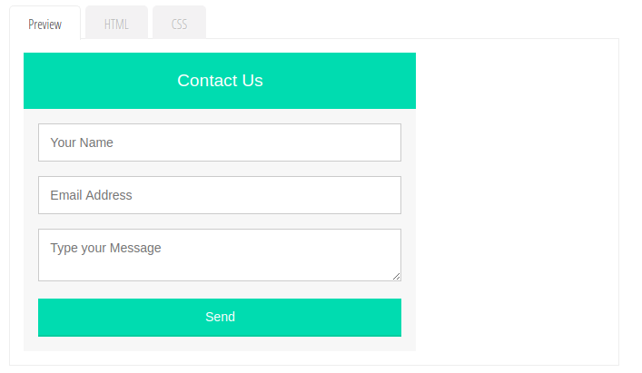
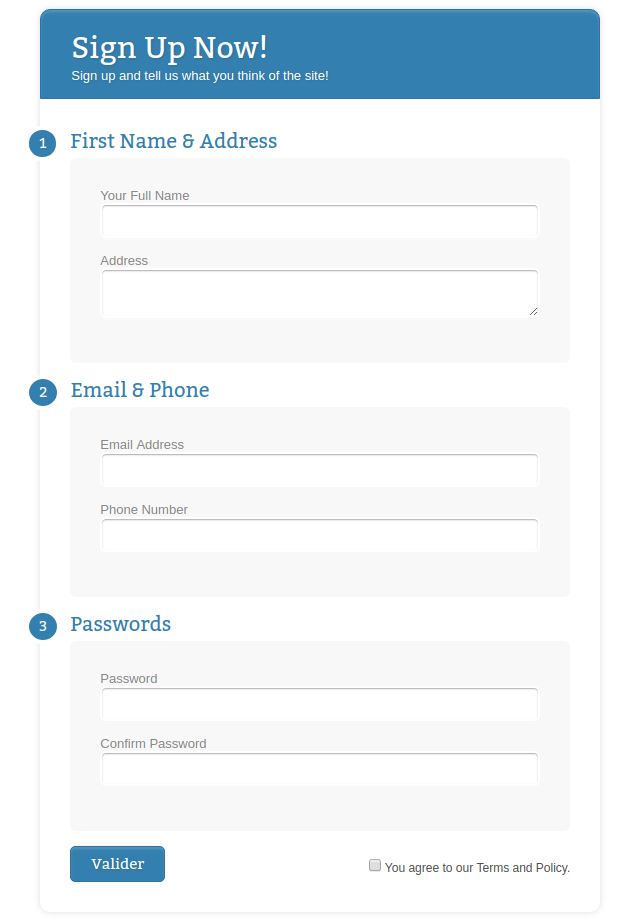

# Les Formulaires

Les formulaires vont nous permettre de recueillir des données envoyées par nos utilisateurs.

Nous allons par exemple utiliser des **formulaires HTML** pour créer des formulaires d’inscription, des formulaires de contact, etc.

## Création et traitement d'un formulaire

Vous devez bien comprendre que nous touchons, avec les formulaires, aux limites du HTML.

En effet, le HTML va nous permettre de créer notre formulaire sans problème. Cependant, nous n’allons ni pouvoir traiter les données envoyées par les utilisateurs, ni pouvoir les stocker.

Pour effectuer ces opérations, nous allons avoir besoin de connaître de nouveaux langages informatiques qui vont traiter les informations envoyées côté serveur, comme le PHP par exemple et pouvoir enregistrer les données efficacement comme c’est le cas du système de gestion de bases de données MySQL, entre autres.

Comme l’apprentissage de ces langages n’est pas l’objet de ce cours, nous nous contenterons dans les parties suivantes de créer notre formulaire en HTML, tout simplement, sans se préoccuper du traitement et de l’enregistrement des données.


## Mise en garde: les données utilisateurs

Si vous ne connaissez que le HTML et le CSS pour le moment, cette mise en garde va peut être vous paraître abstraite. Cependant, je préfère la faire dès maintenant car elle vous sera très précieuse par la suite.

Lorsque l’on crée des formulaires, on va demander aux utilisateurs de nous envoyer des données.

Vous devez **TOUJOURS** vous méfier des données envoyées par l’utilisateur et sécuriser vos formulaires avant d’effectuer toute autre opération sur ces données.

En effet, même s’ils sont peu nombreux, soyez sûr qu’un jour ou l’autre un utilisateur malveillant essaiera de profiter d’un formulaire pour envoyer des données non souhaitées et tenter de faire buguer votre site ou encore de récupérer des informations sensibles.

Une nouvelle fois, nous n’allons pas pouvoir sécuriser nos formulaires en HTML, nous aurons besoin de l’aide d’autres langages comme le PHP ou le JavaScript pour faire cela.

Cependant, retenez bien cette mise en garde si vous devez un jour demander des données à vos utilisateurs.

## Les éléments de formulaire

Le HTML met à notre disposition une série d'éléments qui vont nous permettre de créer nos formulaires.

Ces différents éléments vont nous permettre de définir le formulaire en soi, de créer des zones de saisie de texte courtes ou longues, de proposer des zones d'options à nos utilisateurs, etc.

Les formulaires vont être l’occasion pour nous de découvrir de nombreux éléments. Voici la liste des éléments que nous allons étudier dans les parties suivantes :

|Elément| Définition |
|--|--|
| form | Définit un formulaire |
| input | Définit un champ de données pour l'utilisateur |
| label | Définit une légende pour un élément input |
| textarea | Définit un champ de texte long |
| select | Définit une liste de choix |
| optgroup | Définit un groupe d'options dans une list |
| option | Définit une option dans une liste |
| fieldset | Permet de regrouper les éléments d'un formulaire en différentes parties |
| legend | Ajoute une légende à un élément fieldset |

## L'élément form

Pour définir un formulaire en HTML, nous allons utiliser l’élément  `form`  qui signifie « formulaire » en anglais.

Cet élément  `form`  va avoir besoin de deux attributs pour fonctionner normalement : les attributs  `method`  et  `action`.

L’attribut  `method`  va indiquer comment doivent être envoyées les données saisies par l’utilisateur. Cet attribut peut prendre deux valeurs : get et post.

Ces deux valeurs vont correspondre aux deux choix que nous avons : soit faire transiter les données par l’URL afin de pouvoir ensuite les traiter, soit les envoyer par HTTP post transaction.

Concrètement, si l’on choisit l’envoi via l’URL (avec la valeur get), nous serons limités dans la quantité de données pouvant être envoyées et surtout les données vont être envoyées en clair. Evitez donc absolument d’utiliser cette méthode si vous demandez des mots de passe ou toute information sensible dans votre formulaire.

En choisissant l’envoi de données via post transaction HTTP (avec la valeur post), nous ne sommes plus limités dans la quantité de données pouvant être envoyées et les données ne sont visibles par personne. C’est donc généralement la méthode que nous utiliserons.

L’attribut  `action`  va lui nous servir à préciser l’adresse relative de la page dans laquelle les données doivent être traitées. Ce sera généralement un fichier PHP. Nous n’allons pas créer ce fichier dans ce cours, mais je vous propose pour les exemples suivants de faire comme si ce fichier existait et de l’appeler « traitement.php ».

Voici le squelette d'un formulaire HTML:
```html
<!DOCTYPE html>
<html>
	<head>
		<title>Formulaire HTML</title>
		<meta charset="utf-8">
		<link rel="stylesheet" href="styles.css">
	</head>
	
	<body>
		<h1>Les formulaires HTML</h1>
		
		<form method="post" action="traitement.php">
			//Ici, nous allons créer notre formulaire
		</form>
	</body>
</html>
```


## Les éléments HTML input, text area et label

L’élément  `input`  est l’élément le plus utilisé dans les formulaires HTML. Il va nous permettre de créer la majorité des champs de notre formulaire.

L’élément  `input`  se présente sous la forme d’une balise orpheline et possède un attribut`type`  auquel on va pouvoir donner de nombreuses valeurs.

En changeant la valeur de l’attribut  `type`, nous allons changer le type de données qui vont pouvoir être envoyées via notre élément  `input`  et allons ainsi par exemple pouvoir créer un champ de saisie de texte mono-ligne, un champ contenant des zones d’options ou encore le bouton permettant l’envoi des données du formulaire rentrées par l’utilisateur.

L’élément  `textarea`  va nous permettre de créer un champ de texte multi-lignes, pouvant accueillir par exemple un commentaire ou une présentation d’un utilisateur. Cet élément est également communément utilisé au sein des formulaires HTML.

Finalement, nous allons utiliser l’élément  `label`  pour décrire à l’utilisateur ce qu’il doit rentrer dans chaque champ du formulaire. Nous allons lier un label à un élément de formulaire grâce aux attributs  `for`  (pour le label) et  `id`  (pour l’élément de formulaire).

Il faudra donner strictement la même valeur aux attributs  `for`  et  `id`  afin de « lier » entre eux un label et un élément de formulaire. Vous pouvez donner la valeur que vous voulez, mais essayez de rester cohérent et logique dans la mesure du possible.


## L'attribut name
Nous allons également devoir préciser un attribut  `name`  pour chaque élément de notre formulaire demandant des informations à un utilisateur.

Cet attribut  `name`  va nous permettre, par la suite, de reconnaître le contexte de chaque donnée envoyée par l’utilisateur afin de pouvoir les traiter efficacement.

En effet, sans attribut  `name`, nous recevrions des données mais ne saurions pas quoi en faire, ne sachant pas à quel champ elles appartiennent.

Cet attribut est donc indispensable. Vous pouvez une nouvelle fois lui attribuer la valeur souhaitée. Seule restriction : cette valeur doit être unique afin de bien pouvoir identifier chaque champ.

## Créer un formulaire HTML Simple

Nous allons créer notre premier formulaire en HTML. Dans ce formulaire, nous allons demander :

*  Un pseudonyme à l’utilisateur, avec un  `input`  de type « text » ;
*   Une présentation, avec un élément  `textarea`.

Nous penserons également à créer un  `label`  pour chaque information demandée ainsi qu’un bouton d’envoi des données du formulaire.

Voici comment on va procéder :

```html
<!DOCTYPE html>
<html>
	<head>
		<title>Formulaire HTML</title>
		<meta charset="utf-8">
		<link rel="stylesheet" href="styles.css">
	</head>
	
	<body>
		<h1>Les formulaires HTML</h1>
		
		<form method="post" action="traitement.php">
			<label for="pseudo">Entrez un pseudo : </label>
			<input type="text" name="pseudo" id="pseudo"><br><br>
		
			<label for="presentation">Présentation : </label>
			<textarea name="prez" id="presentation"></textarea><br><br>
		
			<input type="submit" value="Envoyer">
		</form>
	</body>
</html>
```


Analysons et décortiquons le code ci-dessus. Tout d’abord, on définit un élément  `form`  avec ses deux attributs  `method`  et  `action`.

Comme méthode d’envoi de données, nous choisissons « post » et nous précisons la page de traitement en valeur de l’attribut  `action`. Evidemment, nous ne savons pas pour le moment créer la page « traitement.php », n’essayez donc pas d’appuyer sur le bouton d’envoi du formulaire, vous aurez une erreur.

A l’intérieur du formulaire, on utilise un premier élément  `input type="text"`pour créer le champ de soumission du pseudo. On pense bien à préciser un attribut  `name`  pour cet élément avec une valeur unique par rapport aux autres  `name`  des autres éléments.

Ensuite, on crée un premier élément  `label`  pour indiquer à l’utilisateur ce qu’il doit remplir dans le champ. Une nouvelle fois, on pense à lier notre  `label`  à notre  `input`  en utilisant deux attributs  `for`  et  `id`  et en leur donnant la même valeur.

Pour le champ de présentation, on utilise un élément  `textarea`  qui nous permet de gérer des textes longs. Là encore, nous devons préciser un attribut  `name`  car le champ va recevoir des données de l’utilisateur et nous créons également un  `label`allant avec notre  `texarea`.

Finalement, nous devons créer le bouton d’envoi de notre formulaire. Pour cela, on utilise  `input type="submit"`. On n’utilise pas d’attribut  `name`  ici car il n’y a aucune entrée de données par l’utilisateur (ce n’est pas un champ mais un bouton).

Nous n’avons pas besoin non plus de  `label`  pour notre bouton d’envoi : nous préférerons indiquer un attribut  `value`  et préciser une valeur qui s’affichera dans le bouton même.

Voilà, nous venons de créer notre premier formulaire ensemble. Pour le moment, vous remarquerez que c’est un peu rudimentaire. Pas d’inquiétude, nous allons enrichir ce formulaire au fur et à mesure et finalement le styliser en CSS.

## L'élément HTML input

L’élément HTML  `input`  va nous permettre de créer toutes sortes de champs de formulaire en changeant la valeur de son attribut  `type`.

Nous allons voir ensemble quelques unes des valeurs les plus courantes de l’attribut  `type`.

### Input type="text"

La valeur text va tout simplement nous permettre de créer un champ de saisie mono-ligne dans lequel l’utilisateur entrera des données.

Nous avons déjà vu cette valeur en action lors de la partie précédente.

### Input type="password"
La valeur password va nous permettre de créer un champ de saisie « sécurisé » pour par exemple demander un mot de passe à nos utilisateurs.

Lorsque l’utilisateur écrit dans le champ, ce qu’il écrit n’est pas affiché en clair mais est remplacé par des astérisques ou des points.

```html
<!DOCTYPE html>
<html>
	<head>
		<title>Formulaire HTML</title>
		<meta charset="utf-8">
		<link rel="stylesheet" href="styles.css">
	</head>
	
	<body>
		<h1>Les formulaires HTML</h1>
		
		<form method="post" action="traitement.php">
			<label for="pseudo">Entrez un pseudo : </label>
			<input type="text" name="pseudo" id="pseudo"><br><br>
		
			<label for="pswd">Choisissez un mot de passe : </label>
			<input type="password" name="pswd" id="pswd"></input><br><br>
		</form>
	</body>
</html>
```


### Input type="date"

La valeur date va être utilisée pour créer des champs de formulaire devant recevoir une date, comme une date de naissance par exemple.

Selon le navigateur utilisé par vos visiteurs, ceux-ci verront peut être une liste de dates à choisir dans le champ  `input type="date"`.

```html
<!DOCTYPE html>
<html>
	<head>
		<title>Formulaire HTML</title>
		<meta charset="utf-8">
		<link rel="stylesheet" href="styles.css">
	</head>
	
	<body>
		<h1>Les formulaires HTML</h1>
		
		<form method="post" action="traitement.php">
			<label for="pseudo">Entrez un pseudo : </label>
			<input type="text" name="pseudo" id="pseudo"><br><br>
		
			<label for="pswd">Choisissez un mot de passe : </label>
			<input type="password" name="pswd" id="pswd"></input><br><br>
		</form>
	</body>
</html>
```


### Input type="email"

La valeur email de l'attribut  `type`  va nous permettre de créer un champ de formulaire devant recevoir une adresse email.

Ainsi, certains navigateurs récents vont tester la valeur rentrée dans le champ par l’utilisateur afin de s’assurer que celle-ci a bien la forme d’un email (présence d’un @ par exemple).

Sur les smartphones, le clavier tactile va changer pour ce champ et afficher des touches comme « .com » ou « @ » par exemple.

### Input type="url"

La valeur url de l'attribut  `type`  va nous permettre de créer une zone de saisie acceptant une URL.

Cela va être utile si l’on souhaite demander l’adresse de son site web à un utilisateur par exemple.

Tout comme pour la valeur email de  `type`, une validation des données pourra être faîte lors de la soumission du formulaire selon le navigateur utilisé.

De plus, là encore, si un utilisateur utilise un smartphone pour remplir le formulaire, son clavier tactile changera pour ce champ en affichant des touches comme « .com » par exemple.

### Input type="number"
La valeur number de l'attribut  `type`  va nous permettre de créer une zone de saisie n’acceptant que les nombres.

Selon le navigateur utilisé, une barre de défilement de nombres va apparaître à droite du champ créé.

### Input type="radio"
La valeur radio va nous permettre de créer des boutons de type « radio », c’est-à-dire de demander à l’utilisateur de choisir une option et une seulement dans une liste proposée.

Pour chaque choix possible, il nous faudra utiliser un nouvel  `input type="radio"`.

Attention en revanche, dans ce cas et dans ce cas seulement, chacune des options disponibles au sein d’une même zone de choix doit posséder le même attribut  `name`afin que l’on sache qu’il s’agit de la même zone de choix.

Nous distinguerons donc les différents choix possibles au moyen d’un autre attribut : l’attribut  `value`.

Pour plus d’esthétique, nous allons cette fois-ci placer le  `label`  après l’élément  `input`  (afin d’avoir nos boutons radio alignés avant le texte descriptif).

```html
<!DOCTYPE html>
<html>
	<head>
		<title>Formulaire HTML</title>
		<meta charset="utf-8">
		<link rel="stylesheet" href="styles.css">
	</head>
	
	<body>
		<h1>Les formulaires HTML</h1>
		
		<form method="post" action="traitement.php">
			Homme ou femme ? <br>
			<input type="radio" name="sexe" value="homme" id="homme">
			<label for="homme"> Un homme </label><br>
			<input type="radio" name="sexe" value="femme" id="femme">
			<label for="femme"> Une femme </label><br><br>		
		</form>
	</body>
</html>
```


### Input type="checkbox"

La valeur checkbox de attribut HTML  `type`  ressemble à la valeur radio : elle va également nous permettre de créer des options à choisir par nos visiteurs.

Cependant, cette valeur est moins restrictive que radio : en effet, avec radio, l’utilisateur devait absolument choisir une et une seule option.

Avec checkbox, en revanche, l’utilisateur peut ne choisir aucun choix, un choix ou même plusieurs choix.

Tout comme pour les boutons radio, nous allons devoir utiliser le même attribut  `name`  pour chaque groupe d’options et différencier les options en soi avec un attribut  `value`.

```html
<!DOCTYPE html>
<html>
	<head>
		<title>Formulaire HTML</title>
		<meta charset="utf-8">
		<link rel="stylesheet" href="styles.css">
	</head>
	
	<body>
		<h1>Les formulaires HTML</h1>
		
		<form method="post" action="traitement.php">
			Quel(s) sport(s) pratiquez vous? <br>
			<input type="checkbox" name="sport" value="natation" id="natation">
			<label for="natation"> Natation </label><br>
			<input type="checkbox" name="sport" value="boxe" id="boxe">
			<label for="boxe"> Boxe </label><br>		
			<input type="checkbox" name="sport" value="football" id="football">
			<label for="football"> Football </label><br>
		</form>
	</body>
</html>
```


### Input type="submit"
Un élément  `input type="submit"`  va nous permettre de créer un bouton d’envoi des données du formulaire.

Les données seront envoyées via la méthode précisée dans l’attribut  `method`  de l’élément  `form`  à l'adresse précisée en valeur de l’attribut  `action`  de ce même élément.

Un élément  `input type="submit"`  ne va pas nécessiter de  `name`  car ce n’est pas un champ de saisie de données utilisateur. Nous allons utiliser un attribut  `value`  contenant en valeur le texte qui sera affiché au sein de notre bouton.

```html
<!DOCTYPE html>
<html>
	<head>
		<title>Formulaire HTML</title>
		<meta charset="utf-8">
		<link rel="stylesheet" href="styles.css">
	</head>
	
	<body>
		<h1>Les formulaires HTML</h1>
		
		<form method="post" action="traitement.php">
			Quel(s) sport(s) pratiquez vous? <br>
			<input type="checkbox" name="sport" value="natation" id="natation">
			<label for="natation"> Natation </label><br>
			<input type="checkbox" name="sport" value="boxe" id="boxe">
			<label for="boxe"> Boxe </label><br>		
			<input type="checkbox" name="sport" value="football" id="football">
			<label for="football"> Football </label><br>

			<input type="submit" value="Envoyer le formulaire !">
		</form>
	</body>
</html>
```


### Les listes d'options des formulaires HTML

Les listes vont permettre à un utilisateur de choisir une valeur dans une liste d’options déroulante.

Pour créer une liste d’options, nous allons cette fois-ci utiliser l’élément HTML  `select`  pour définir notre liste en soi, et des éléments  `option`  pour définir chaque élément de notre liste.

Nous devrons préciser un attribut  `name`  pour notre élément  `select`  puis des attributs  `value`  pour chaque élément  `option`.


```html
<!DOCTYPE html>
<html>
	<head>
		<title>Formulaire HTML</title>
		<meta charset="utf-8">
		<link rel="stylesheet" href="styles.css">
	</head>
	
	<body>
		<h1>Les formulaires HTML</h1>
		
		<form method="post" action="traitement.php">
			Où habitez vous ? <br>
			<select name="pays">
				<option value="france">France</option>
				<option value="italie">Italie</option>
				<option value="belgique">Belgique</option>
				<option value="allemagne">Allemagne</option>
			</select>

			<input type="submit" value="Envoyer le formulaire !">
		</form>
	</body>
</html>
```


Nous allons encore pouvoir grouper différentes options entre elles au sein d’une liste grâce à l’élément  `optgroup`  (pour « option group », ou « groupe d’options »).

Pour chaque groupe d’options, nous préciserons un attribut  `label`  (à ne pas confondre avec l’élément  `label`  utilisé précédemment). Celui-ci va tenir le même rôle que l’élément  `label`.

```html
<!DOCTYPE html>
<html>
	<head>
		<title>Formulaire HTML</title>
		<meta charset="utf-8">
		<link rel="stylesheet" href="styles.css">
	</head>
	
	<body>
		<h1>Les formulaires HTML</h1>
		
		<form method="post" action="traitement.php">
			Où habitez vous ? <br>
			<select name="pays">
				<optgroup label="Europe">
					<option value="france">France</option>
					<option value="italie">Italie</option>
				</optgroup>
				<optgroup label="Amérique">
					<option value="mexique">Mexique</option>
					<option value="canada">Canada</option>
				</optgroup>
			</select>

			<input type="submit" value="Envoyer le formulaire !">
		</form>
	</body>
</html>
```


## Améliorer les formulaires avec les attributs HTML

#### De nouveaux attributs pour notre formulaire

Nous avons vu dans les parties précédentes quelques attributs indispensables pour les éléments de formulaire comme par exemple l’attribut  `name`.

Cependant, il existe de nombreux autres attributs HTML disponibles qui vont nous permettre d’améliorer notre formulaire.

Je vous propose de découvrir les attributs suivants :

|Attribut| Rôle |
|--|--|
| Autocomplete | Permet l'autocomplétion d'un champ |
| Autofocus | Force le focus sur un champ |
| Min et Max | Permettent de définir une valeur minimale et maximale pour un champ |
| Placeholder | Donne des indications sur les données attendues |
| Checked | Pré-coche une case |
| Selected | Pré-sélectionne une option dans une liste |
| Required | Force le remplissage du champ |


### L'attribut HTML autocomplete

L’attribut  `autocomplete`  va nous permettre de finir automatiquement le remplissage d’un champ en se basant sur les informations entrées précédemment dans d’autres formulaires par l’utilisateur.

Cet  `attribut`  peut prendre deux valeurs : on (le champ va s’auto compléter) et off.

### L'attribut autofocus

L’attribut HTML  `autofocus`  va nous permettre d’attribuer automatiquement le focus sur un élément lors du chargement de la page.

Le « focus » correspond au fait d’avoir sa barre d’écriture (le "curseur" de la souris) automatiquement présente dans le champ en question.

Il n’est pas obligatoire de préciser une valeur pour cet attribut, puisqu'il n'en possède qu'une qui est "autofocus". Cependant, une nouvelle fois, je vous conseille de toujours écrire un attribut avec sa valeur afin de bien se rappeler qu'un attribut possède toujours une valeur.

### Les attributs HTML min et max

Les attributs HTML `min` et `max` vont nous permettre de préciser les valeurs minimale et maximale attendues pour un champ. Ces attributs seront généralement utilisés avec un élément `input type="number"`.


### L'attribut HTML placeholder

L’attribut HTML  `placeholder`  va nous permettre de donner un exemple de remplissage d’un champ dans le champ lui même.

La valeur donnée au  `placeholder`  apparaitra sous forme de valeur grise, à moitié transparente.

Dès que l’utilisateur cliquera dans le champ, la valeur du placeholder disparaitra.

### Les attributs HTML checked et selected

L’attribut HTML  `checked`  va nous permettre respectivement de pré-cocher une ou plusieurs zones d’option selon le type d’élément  `input`  utilisé.

L’attribut HTML  `selected`  va lui occuper le même rôle pour l’élément  `select`, c’est-à-dire pour les listes d’option de nos formulaires.

### L'attribut HTML required

L’attribut HTML  `required`  va nous permettre de rendre un champ de formulaire obligatoire : si l’utilisateur n’a pas rempli ce champ, le formulaire ne pourra pas être envoyé.

Une nouvelle fois, il n’est pas strictement nécessaire de préciser de valeur pour cet attribut (comme il n'en possède qu'une, elle est dite implicite).

Attention cependant, cet attribut n’est pas supporté ni par les vieilles version d’Internet Explorer (<9), ni par Safari. 


## Organiser et mettre en forme un formulaire

### Organiser un formulaire: l'élément HTML fieldset

L’élément HTML  `fieldset`  va nous permettre de regrouper certains éléments d’un formulaire HTML entre eux, afin de créer différentes « sections » pour notre formulaire et de le structurer.

Pour donner un nom à chaque section, nous allons utiliser l’élément HTML  `legend`  à l’intérieur de  `fieldset`.

```html
<!DOCTYPE html>
<html>
	<head>
		<title>Formulaire HTML</title>
		<meta charset="utf-8">
		<link rel="stylesheet" href="styles.css">
	</head>
	
	<body>
		<h1>Les formulaires HTML</h1>
		
		<form method="post" action="traitement.php">
			<fieldset>
				<legend>Où habitez vous ? </legend>
				<select name="pays">
					<optgroup label="Europe">
						<option value="france">France</option>
						<option value="italie">Italie</option>
					</optgroup>
					<optgroup label="Amérique">
						<option value="mexique">Mexique</option>
						<option value="canada">Canada</option>
					</optgroup>
				</select>
			</fieldset>
			<fieldset>
				<legend>Quel sport pratiques vous?</legend>
				<input type="checkbox" name="sport" value="natation" id="natation">
				<label for="natation"> Natation </label><br>
				<input type="checkbox" name="sport" value="boxe" id="boxe">
				<label for="boxe"> Boxe </label><br>		
				<input type="checkbox" name="sport" value="football" id="football">
				<label for="football"> Football </label><br>
			</fieldset>

			<input type="submit" value="Envoyer le formulaire !">
		</form>
	</body>
</html>
```


### Mettre en forme un formulaire grâce au CSS

Maintenant que nous avons fait le tour des éléments et des attributs indispensables aux formulaires, et que nous savons créer des formulaires assez complets en HTML, nous allons pouvoir mettre en forme nos formulaires avec le CSS.

Pour cela, nous allons commencer par harmoniser nos lignes grâce aux propriétés  `width`  et  `height`.

Ensuite, nous allons rajouter des  `padding`  et  `margin`  pour aérer nos formulaires et nous allons mettre en forme nos textes.

Nous allons également modifier la couleur de fond de nos différentes sections afin de bien les différencier.

Je vous propose donc pour conclure ce cours sur le formulaire de reproduire les deux formulaires suivants





et 




