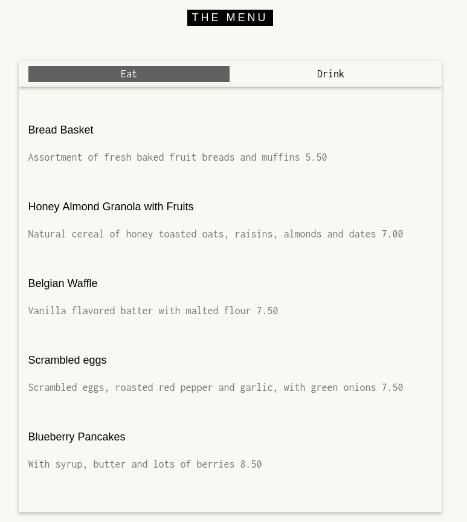
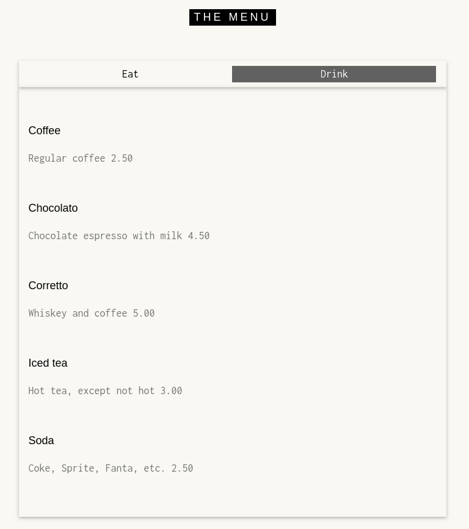
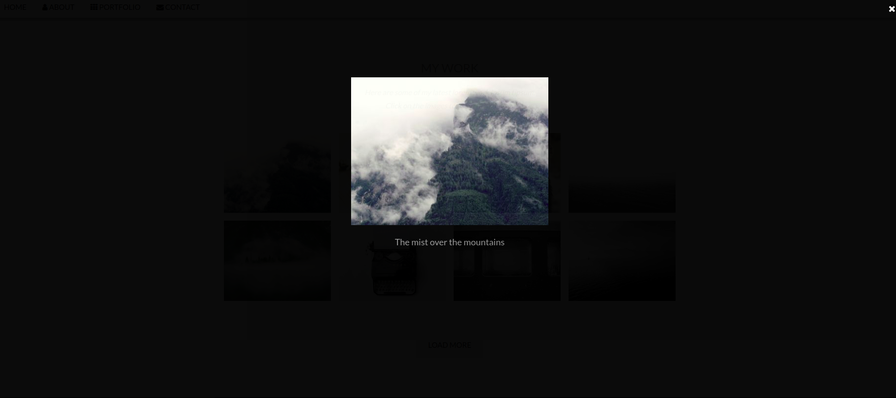

# Réagir à un événement

Voici venu le chapitre qui va rendre vraiment intéressant JavaScript pour vos page web


Les évènements correspondent à des actions effectuées soit par un utilisateur, soit par le navigateur lui-même.

Par exemple, lorsqu’un utilisateur clique sur un bouton HTML ou lorsque le navigateur va finir de charger une page web, on va parler d’événement.

Les événements permettent de déclencher une fonction selon qu'une action s'est produite ou non. Par exemple, on peut faire apparaître une fenêtre `alert()` lorsque l'utilisateur survole une zone d'une page Web.

« Zone » est un terme un peu vague, il vaut mieux parler d'élément (HTML dans la plupart des cas). Ainsi, vous pouvez très bien ajouter un événement à un élément de votre page Web (par exemple, une balise `<div>`) pour faire en sorte de déclencher un code JavaScript lorsque l'utilisateur fera une action sur l'élément en question.


## Liste des événements

Il existe de nombreux événements, tous plus ou moins utiles. Sachez qu'il en existe des spécifiques pour les plateformes mobiles (smartphones, tablettes, etc...).

Voici la liste des événements principaux, ainsi que les actions à effectuer pour qu'ils se déclenchent :

| Nom de l'événement | Action pour le déclencher                                    |
| ------------------ | ------------------------------------------------------------ |
| `click`            | Cliquer (appuyer puis relâcher) sur l'élément                |
| `dblclick`         | Double-cliquer sur l'élément                                 |
| `mouseover`        | Faire entrer le curseur sur l'élément                        |
| `mouseout`         | Faire sortir le curseur de l'élément                         |
| `mousedown`        | Appuyer (sans relâcher) sur le bouton gauche de la souris sur l'élément |
| `mouseup`          | Relâcher le bouton gauche de la souris sur l'élément         |
| `mousemove`        | Faire déplacer le curseur sur l'élément                      |
| `keydown`          | Appuyer (sans relâcher) sur une touche de clavier sur l'élément |
| `keyup`            | Relâcher une touche de clavier sur l'élément                 |
| `keypress`         | Frapper (appuyer puis relâcher) une touche de clavier sur l'élément |
| `focus`            | « Cibler » l'élément                                         |
| `blur`             | Annuler le « ciblage » de l'élément                          |
| `change`           | Changer la valeur d'un élément spécifique aux formulaires (`input`, `checkbox`, etc.) |
| `input`            | Taper un caractère dans un champ de texte                    |
| `select`           | Sélectionner le contenu d'un champ de texte (`input`, `textarea`, etc.) |


Il existe également deux autres événements spécifiques à l'élément `<form>`:

| Nom de l'événement | Action pour le déclencher   |
| ------------------ | --------------------------- |
| `submit`           | Envoyer le formulaire       |
| `reset`            | Réinitialiser le formulaire |


## Les attributs événements HTML

### Un premier exemple

Voyons immédiatement un premier exemple. Imaginons que l’on souhaite afficher une boîte de dialogue de type `alert()` lorsqu’un utilisateur clique sur un paragraphe dans notre page web.

Pour faire cela, on va utiliser évidemment `onclick` en HTML sur notre paragraphe puis on va créer notre `alert()` en JavaScript.

```html
<!DOCTYPE html>
<html>
    <head>
        <title>Les événements</title>
        <meta charset="utf-8">
    </head>
    <body>
        <h1 id="gros_titre">
            Les événements
        </h1>
        <p onclick="alert('Bravo !');">
            Cliquez-moi, cliquez-moi!
        </p>
        <p>
            Un deuxième <strong>paragraphe</strong></p>
        </p>
    </body>
</html>
```


Comme on peut le remarquer, le HTML nous autorise à placer du code JavaScript directement en valeur de l’attribut `onclick`.

Ici, on procède de cette manière car l’exemple est très simple. Cependant, dans la suite, nous utiliserons le DOM qui nous offrira bien plus de possibilités.


### Mot-clé `this`

Pour rappel, en JavaScript, le mot clef `this` nous sert de référence à différents objets selon le contexte.

Dans le contexte de la gestion d’événements, `this` va faire référence à l’objet (représentant l’élément HTML) qui est le sujet de l’événement.

Par exemple, si on reprend l’exemple de notre paragraphe, ce paragraphe est le sujet de l’événement car c’est lui qui possède l’attribut d’évènement et le code associé qui va déclencher une action lors du clic.

En utilisant `this` dans notre code JavaScript dans ce cas, on va donc travailler sur l’élément `p` en soi.

On peut ainsi par exemple très simplement changer le contenu de notre paragraphe lors du clic d’un utilisateur.

```html
<!DOCTYPE html>
<html>
    <head>
        <title>Les événements</title>
        <meta charset="utf-8">
    </head>
    <body>
        <h1 id="gros_titre">
            Les événements
        </h1>
        <p onclick="this.textContent='Merci !';">
            Cliquez-moi, cliquez-moi!
        </p>
        <p>
            Un deuxième <strong>paragraphe</strong></p>
        </p>
    </body>
</html>
```


En pratique, cependant, nous utiliserons peu ce genre de code (car nous allons voir par la suite que nous sommes limités lorsque nous n’utilisons pas le DOM), mais il est bien de l’avoir vu au moins une fois pour bien le comprendre et comprendre ce qu’on va faire ensuite.


## Les événements et le DOM

La gestion des évènements va devenir véritablement intéressante lorsqu’on va réagir aux évènements via le DOM HTML.

Le DOM HTML va nous permettre d’assigner des gestionnaires d’évènements spécifiques à des éléments HTML en utilisant le JavaScript.

Cette fois-ci, nous n’allons donc plus utiliser des attributs HTML mais du code JavaScript à proprement parler pour construire nos évènements.

Nous avons deux manières de réagir aux évènements avec le JavaScript : on peut soit utiliser des propriétés qui vont assigner un gestionnaire d’événement à un élément spécifique en HTML, soit utiliser la méthode `addEventListener()`.


### Les propriétés

La première méthode, à savoir l’utilisation de propriétés est une ancienne méthode et vous ne devriez plus l’utiliser aujourd’hui car elle possède des limitations.

L’une des plus importantes d’entre elles est que l’on ne peut pas assigner plusieurs fois le même gestionnaire d’événement à un élément HTML.

Afin que vous voyiez tout de même comment on procède avec cette méthode, nous allons voir un exemple rapide avec la propriété onclick. Notez que les propriétés possèdent souvent des noms analogues aux attributs HTML (l’attribut HTML `onclick` devient la propriété JavaScript `onclick` par exemple).


```html
<!DOCTYPE html>
<html>
    <head>
        <title>Les événements</title>
        <meta charset="utf-8">
    </head>
    <body>
        <h1 id="gros_titre">
            Les événements
        </h1>
        <p>
            Cliquez-moi, cliquez-moi!
        </p>
        <p>
            Un deuxième <strong>paragraphe</strong></p>
        </p>
    
    	<script>
    		//On accède à notre premier paragraphe
            var p1 = document.querySelector('p');
            
            /*Création d'un gestionnaire d'événements pour 
            l'événement "onclick" */
            p1.onclick = function() {
                this.innerHTML = '<strong>Bravo !</strong>';
                this.style.color = 'orange';
            };
    	</script>
    </body>
</html>
```


Comme vous pouvez le constater, on commence à réutiliser des outils que nous avons déjà vus précédemment, comme les fonctions anonymes par exemple.

C’est en effet maintenant que vous possédez de bonnes connaissances en JavaScript que celui-ci va se révéler véritablement intéressant, donc restez attentif !

Dans l’exemple ci-dessus, on commence par accéder à notre premier paragraphe puis on lui attache un évènement de type `onclick`.

Vous pouvez remarquer que nous attachons ensuite une fonction anonyme à notre évènement. Ici, nous utilisons une fonction anonyme afin que celle-ci ne s’exécute pas immédiatement.

En effet, il y a 3 façons pour exécuter une fonction anonyme

* la transformer en fonction auto invoquée
* l’enfermer dans une variable puis appeler cette variable avec un couple de parenthèses
* l’assigner à un évènement.

Dans l’exemple ci-dessus, notre fonction va en effet s’exécuter dès que l’évènement sera déclenché, c’est-à-dire dès que l’utilisateur cliquera sur notre paragraphe.

Si nous avions exécuté la fonction immédiatement, seule la valeur retournée par celle-ci aurait été attachée à notre évènement, ce qui n’est pas du tout le comportement souhaité.

Notez que nous aurions tout aussi bien pu créer une fonction avec un nom puis n’assigner que le nom de la fonction à notre évènement (sans les parenthèses qui feraient qu’elle s’exécuterait immédiatement).

Dans ce cas, cela aurait donné

```html
<script>
	//On accède à notre premier paragraphe
    var p1 = document.querySelector('p');
            
    /*Création d'un gestionnaire d'événements pour 
    l'événement "onclick" */
    p1.onclick = bravo;
    
    function bravo() {
        this.innerHTML = '<strong>Bravo !</strong>';
        this.style.color = 'orange';
    };
</script>
```


Une nouvelle fois, il est important que vous compreniez bien ces exemples et façons de faire car de nombreux développeurs codent encore comme cela.

Cependant, je vous déconseille d’utiliser vous même ce genre d’écriture. A la place, nous préférerons utiliser la méthode `addEventListener()` qui est beaucoup moins limité et que nous allons étudier dans la prochaine partie.


### addEventListener()

Maintenant, nous n'utilisons plus une propriété mais une méthode nommée `addEventListener()`, qui va nous permettre de lier du code à un évènement. On parlera alors de gestionnaire d’évènements.

Le code sera alors exécuté dès le déclenchement de l’évènement.

Cette méthode appartient à l’objet `Element` et va avoir besoin de trois paramètres pour fonctionner : 

* Le nom de l'événement (sans les lettres "on")
* La fonction à exécuter
* Un booléen **optionnel** pour spécifier si l'on souhaite utiliser la phase de capture ou bien celle de bouillonnement. Nous expliquerons ce concept un peu plus tard.


Un petit exemple tout de suite

```html
<script>
	//On accède à notre premier paragraphe
    var p1 = document.querySelector('p');
            
    p1.addEventListener('click', function() {
        alert("Vous m'avez cliqué !");
    });
</script>
```


#### Pourquoi c'est mieux?

L’un des grands avantages de la méthode `addEventListener()` est de pouvoir lier plusieurs gestionnaires d’évènements de même type sur un élément HTML.

Par exemple, on va pouvoir afficher différents messages suite à un clic, ce qui aurait été impossible sans `addEventListener()`.


On peut donc faire cela

```html
<script>
	//On accède à notre premier paragraphe
    var p1 = document.querySelector('p');
            
    p1.addEventListener('click', function() {
        alert("Vous m'avez cliqué 1 fois !");
    });
    
    p1.addEventListener('click', function() {
        alert("Vous m'avez cliqué une 2ème fois !");
    });
</script>
```


#### Supprimer Event Listener

La suppression d'un événement s'opère avec la méthode `removeEventListener()` et se fait de manière très simple :

```js
element.addEventListener('click', myFunction); // On crée l'événement

element.removeEventListener('click', myFunction); // On supprime l'événement en lui repassant les mêmes paramètres
```


Toute suppression d'événement avec la méthode se fait avec les mêmes paramètres utilisés lors de sa création ! Cependant, cela ne fonctionne pas aussi facilement avec les fonctions anonymes ! Tout événement créé avec une fonction anonyme est particulièrement complexe à supprimer, car il faut posséder une référence vers la fonction concernée, ce qui n'est généralement pas le cas avec une fonction anonyme.


> Attention ! Les versions d'Internet Explorer antérieures à la version 9 ne supportent pas l'ajout d'évènements par la méthode `addEventListener`, tout du moins pas de la même manière que la version standardisée.


### Les phases de capture et de bouillonnement

#### Du côté de la théorie

Vous souvenez-vous que notre méthode `addEventListener()` prend trois paramètres ? Nous vous avions dit que nous allions revenir sur l'utilisation de son troisième paramètre plus tard. Eh bien ce « plus tard » est arrivé !

> Capture ? Bouillonnement ? De quoi parle-t-on ?


Avant d'expliquer, commençons par un exemple qui va mettre en évidence un problème:

```html
<div>
    <span>Du texte !</span>
</div>
```


Si nous attribuons une fonction à l'événement `click` de chacun de ces deux éléments et que l'on clique sur le texte, quel événement va se déclencher en premier à votre avis ? Bonne question n'est-ce pas ?

> Essayez de le faire ! 


Comme vous pouvez le voir, ici, c’est l’évènement du `span` qui se déclenche avant celui du `div`.


Un évènement va toujours partir de la racine de notre arbre DOM, c’est-à-dire de notre élément `html`, vers l’élément le plus profond comportant un gestionnaire de cet évènement.

Cette « descente » le long de l’arbre DOM est appelée **phase de « capture »** ((*capture* en anglais)).

Ensuite, une fois l’élément atteint, notez bien que l’évènement ne va pas s’arrêter mais va faire le chemin inverse et remonter le long de l’arbre jusqu’à l’élément `html`.

Cette deuxième phase de « remontée » est appelée la **phase de « bouillonnement »** (*bubbling* en anglais).


Si vous décidez d'utiliser la *capture*, alors l'événement du `<div>` se déclenchera en premier puis viendra ensuite l'événement du `<span>`. En revanche, si vous utilisez le *bouillonnement*, ce sera d'abord l'événement du `<span>` qui se déclenchera, puis viendra par la suite celui du `<div>`.

La phase de bouillonnement est celle définie par défaut et sera probablement celle que vous utiliserez la majorité du temps.

Voici un petit code qui met en pratique l'utilisation de ces deux phases :

```html
<div id="capt1">
    <span id="capt2">Cliquez-moi pour la phase de capture.</span>
</div>
<div id="boul1">
    <span id="boul2">Cliquez-moi pour la phase de bouillonnement.</span>
</div>
<script>
    var capt1 = document.getElementById('capt1'),
        capt2 = document.getElementById('capt2'),
        boul1 = document.getElementById('boul1'),
        boul2 = document.getElementById('boul2');

    capt1.addEventListener('click', function() {
        alert("L'événement du div vient de se déclencher.");
    }, true);

    capt2.addEventListener('click', function() {
        alert("L'événement du span vient de se déclencher.");
    }, true);

    boul1.addEventListener('click', function() {
        alert("L'événement du div vient de se déclencher.");
    }, false);

 
    boul2.addEventListener('click', function() {
        alert("L'événement du span vient de se déclencher.");
    }, false);
</script>
```


## Exercices

A ce stade, on va déjà pouvoir s'amuser un peu. Pour cela, vous aurez surtout besoin de la méthode `addEventListener`, de la liste des événements et du cours précédent qui portait sur la manipulation du DOM

### Exercice 1 : Les onglets

L'objectif de cet exercice va être de créer ce menu à deux onglets (ceux qui ont déjà fait la page The Cafe l'auront reconnu!)






### Exercice 2 : Fenêtre Modale

Sur le site John Doe, faites en sorte que lorsqu'une photo est cliquée, elle apparaissent en grand par dessus le site, comme ceci par exemple:




C'est ce qu'on appelle une fenêtre modale

**Attention**, n'oubliez pas la petite croix dans un coin pour pouvoir fermer cette fenêtre modale!


## L'objet Event

L’objet `Event` possède des propriétés et des méthodes nous informant sur le contexte de l’évènement déclenché ou qui vont impacter l’environnement. Par exemple, vous pouvez récupérer quelles sont les touches actuellement enfoncées, les coordonnées du curseur, l'élément qui a déclenché l'événement… Les possibilités sont nombreuses !

Notez que cet objet n’est accessible que durant le déclenchement d’un évènement. Il faut donc y accéder au sein de la fonction servant à exécuter une action lors du déclenchement de l’évènement.

Un exemple tout de suite :

```html
<!DOCTYPE html>
<html>
    <head>
        <title>Les événements</title>
        <meta charset="utf-8">
    </head>
    <body>
        <h1 id="gros_titre">
            Les événements
        </h1>
        <p>
            Cliquez-moi, cliquez-moi!
        </p>
        <p>
            Un deuxième <strong>paragraphe</strong></p>
        </p>
    
    	<script>
    		//On accède à notre premier paragraphe
            var p1 = document.querySelector('p');
            
            /*Création d'un gestionnaire d'événements pour 
            l'événement "onclick" */
            p1.addEventListener('click', function (event) {
                this.innerHTML = "Il s'agissait d'un événement de type " + event.type;
            });
    	</script>
    </body>
</html>
```


### Les propriétés de l'objet `Event`

#### `type`

On vient de la voir dans l'exemple précédent, cette propriété permet de savoir quel type d'événement s'est déclenché.


#### `target` et `currentTarget`

Une des plus importantes propriétés de notre objet se nomme `target`. Celle-ci permet de récupérer une référence vers l'élément qui a déclenché l'événement, ainsi vous pouvez très bien modifier le contenu d'un élément qui a été cliqué :

```html
<script>
    var p1 = document.querySelector('p');

    p1.addEventListener('click', function (event) {
        this.innerHTML = "L'élément déclencheur est " + event.target;
    });
</script>
```


La propriété `currentTarget` apporte une information légèrement différente. Elle indique quel élément porte le gestionnaire d'événement.

Pour mieux comprendre, rajoutons un `div` autour de notre paragraphe "Cliquez moi" et observons

```html
<!DOCTYPE html>
<html>
    <head>
        <title>Les événements</title>
        <meta charset="utf-8">
    </head>
    <body>
        <h1 id="gros_titre">
            Les événements
        </h1>
        <div>
            <p>
                Cliquez-moi, cliquez-moi!
            </p>
        </div>
        <p>
            Un deuxième <strong>paragraphe</strong></p>
        </p>
    
    	<script>
            var div1 = document.querySelector('div');

            div1.addEventListener('click', function (event) {
                this.innerHTML = "Elément déclencher : " + event.target + "<br/>Elément portant l'événement : " + event.currentTarget;
            });
    	</script>
    </body>
</html>
```


On peut voir ici que certains événements appliqués à un élément parent peuvent se propager d'eux-mêmes aux éléments enfants ; c'est le cas des événements`mouseover`,`mouseout`,`mousemove`,`click`… ainsi que d'autres événements moins utilisés.


#### La position du curseur

La position du curseur est une information très importante, beaucoup de monde s'en sert pour de nombreux scripts. Généralement, on récupère la position du curseur par rapport au coin supérieur gauche de la page Web, cela dit il est aussi possible de récupérer sa position par rapport au coin supérieur gauche de l'écran. Toutefois, dans ce tutoriel, nous allons nous limiter à la page Web.

Pour récupérer la position de notre curseur, il existe deux propriétés : `clientX` pour la position horizontale et `clientY` pour la position verticale. Étant donné que la position du curseur change à chaque déplacement de la souris, il est donc logique de dire que l'événement le plus adapté à la majorité des cas est `mousemove`.


> **Attention**, Il est très fortement déconseillé d'essayer d'exécuter la fonction `alert()` dans un événement `mousemove` ou bien vous allez rapidement être submergés de fenêtres !


Un petit script pour tester par vous-même:

```html
<div id="position"></div>

<script>
    var position = document.getElementById('position');
  
    document.addEventListener('mousemove', function(e) {
        position.innerHTML = 'Position X : ' + e.clientX + 'px<br />Position Y : ' + e.clientY + 'px';
    });
</script>
```


On remarquera qu'on met la méthode `addEventListener` directement sur l'objet `document`


#### Autres propriétés sur l'utilisation de la souris

Cette fois nous allons étudier une propriété un peu plus « exotique » assez peu utilisée mais qui peut pourtant se révéler très utile ! Il s'agit de `relatedTarget` et elle ne s'utilise qu'avec les événements `mouseover` et `mouseout`.
Cette propriété remplit deux fonctions différentes selon l'événement utilisé. Avec l'événement `mouseout`, elle vous fournira l'objet de l'élément sur lequel le curseur vient d'entrer ; avec l'événement `mouseover`, elle vous fournira l'objet de l'élément dont le curseur vient de sortir.

```html
<!DOCTYPE html>
<html>
    <head>
        <title>Les événements</title>
        <meta charset="utf-8">
        <style type="text/css">
            .parent {
                background-color: red;
                width: 200px;
                height: 200px; 
            }

            .child {
                background-color: blue;
                height: 100px;
                width: 100px;
            }
        </style>
    </head>

    <body>
        <h1 id="gros_titre">
            Les événements
        </h1>
        <div>
            <p>
                Cliquez-moi, cliquez-moi!
            </p>
        </div>
        <p>
            Un deuxième <strong>paragraphe</strong></p>
        </p>
    
        <div id="parent1" class="parent">
            Parent N°1<br /> Mouseover sur l'enfant
            <div id="child1" class="child">Enfant N°1</div>
        </div>

        <div id="parent2" class="parent">
            Parent N°2<br /> Mouseout sur l'enfant
            <div id="child2" class="child">Enfant N°2</div>
        </div>
    	
    	<div id="result"></div>
    
    	<script>
            var child1 = document.getElementById('child1'),
                child2 = document.getElementById('child2'),
                result = document.getElementById('result');
            
            child1.addEventListener('mouseover', function(event) {
                result.innerHTML = "L'élément quitté juste avant que le curseur n'entre sur le gros titre est : " + event.relatedTarget.id;
            });
            
            child2.addEventListener('mouseout', function (event) {
                result.innerHTML = "L'élément suvolé juste après que le curseur ait quitté le premier paragraphe est : " + event.relatedTarget.id;
            });
    	</script>
    </body>
</html>
```


#### Les touches frappées par l'utilisateur

La récupération des touches frappées se fait par le biais de trois événements différents. Dit comme ça, cela laisse sur un sentiment de complexité, mais vous allez voir qu'au final tout est beaucoup plus simple qu'il n'y paraît.

* Les événements `keyup` et `keydown` sont conçus pour capter toutes les frappes de touches. Ainsi, il est parfaitement possible de détecter l'appui sur la touche `A` voire même sur la touche `Ctrl`. La différence entre ces deux événements se situe dans l'ordre de déclenchement : `keyup` se déclenche lorsque vous relâchez une touche, tandis que `keydown` se déclenche au moment de l'appui sur la touche (comme `mousedown` ).
  Cependant, faites bien attention avec ces deux événements : toutes les touches retournant un caractère retourneront un caractère *majuscule*, que la touche Maj soit pressée ou non.

  

* L'événement `keypress`, lui, est d'une toute autre utilité : il sert uniquement à capter les touches qui écrivent un caractère, oubliez donc les `Ctrl`, `Alt` et autres touches de ce genre qui n'affichent pas de caractère. Alors, forcément, vous vous demandez probablement à quoi peut bien servir cet événement au final ? Eh bien son avantage réside dans sa capacité à détecter les combinaisons de touches ! Ainsi, si vous faites la combinaison Maj + A, l'événement `keypress` détectera bien un `A` majuscule là où les événements `keyup` et `keydown` se déclencheront deux fois, une fois pour la touche `Maj` et une deuxième fois pour la touche `A`.

Et j'utilise quelle propriété pour récupérer mon caractère, du coup ?

Si nous devions énumérer toutes les propriétés capables de vous fournir une valeur, il y en aurait trois : `keyCode`, `charCode` et `which`. Ces propriétés renvoient chacune un code ASCII correspondant à la touche pressée. 
Cependant, la propriété  `keyCode` est amplement suffisante dans tous les cas, comme vous pouvez le constater dans l'exemple qui suit :

```html
<p>
    <input id="field" type="text" />
</p>

<table>
    <tr>
        <td>keydown</td>
        <td id="down"></td>
    </tr>
    <tr>
        <td>keypress</td>
        <td id="press"></td>
    </tr>
    <tr>
        <td>keyup</td>
        <td id="up"></td>
    </tr>
</table>

<script>
    var field = document.getElementById('field'),
        down = document.getElementById('down'),
        press = document.getElementById('press'),
        up = document.getElementById('up');

    document.addEventListener('keydown', function(e) {
        down.innerHTML = e.keyCode;
    });

    document.addEventListener('keypress', function(e) {
        press.innerHTML = e.keyCode;
    });

    document.addEventListener('keyup', function(e) {
        up.innerHTML = e.keyCode;
    });
</script>
```


Je ne veux pas obtenir un code, mais le caractère !

Dans ce cas, il n'existe qu'une seule solution : la méthode `fromCharCode()`. Elle prend en paramètre une infinité d'arguments. Cependant, pour des raisons un peu particulières, sachez que cette méthode s'utilise avec le préfixe `String.`, comme suit :

```js
String.fromCharCode(/* valeur */);
```

Cette méthode est donc conçue pour convertir les valeurs ASCII vers des caractères lisibles. Faites donc bien attention à n'utiliser cette méthode qu'avec un événement `keypress` afin d'éviter d'afficher, par exemple, le caractère d'un code correspondant à la touche Ctrl, cela ne fonctionnera pas !

Pour terminer, voici un court exemple :

```js
String.fromCharCode(84, 101, 115, 116); // Affiche : Test
```


#### Empêcher l'exécution d'un gestionnaire d'événements

Pour certains évènements, on va également pouvoir empêcher tout simplement l’évènement en soi.

Pour cela, on va utiliser une autre méthode de l’objet `Event` : la méthode `preventDefault()`.

Attention cependant : cette méthode ne va fonctionner qu’avec les évènements dont on peut stopper l’action.

Notez également que `preventDefault()` ne va en revanche pas stopper la propagation d’un évènement.


```html
<!DOCTYPE html>
<html>
    <head>
        <title>Les événements</title>
        <meta charset="utf-8">
        <style type="text/css">
            div {
                border: 1px solid orange;
                background-color: #29B;
                padding: 20px;
                margin: 10px;
            }
        </style>
    </head>

    <body>
        <h1 id="gros_titre">
            Les événements
        </h1>
        <a id="a1" href="http://codephenix.com:2500">
        <div >
            <p>
                Cliquez-moi, cliquez-moi!
            </p>
        </div>
        </a>
    
    	<script>
            var a1 = document.getElementById('a1'),
                p1 = document.querySelector('p');
            
            a1.addEventListener("click", texteD);
            p1.addEventListener('click', texteP);
            
            function texteD(event) {
                event.preventDefault(); // on bloque l'action par défaut qui était d'ouvrir le lien
            }
            
            function texteP() {
                alert("preventDefault() n'empêche pas la propagation !")
            }
    	</script>
    </body>
</html>
```


Quelle utilisation me direz vous?

Cela pourra vous servir, par exemple, dans le cas de la validation d’un formulaire : si un utilisateur remplit mal un formulaire, vous pourrez empêcher l’envoi du formulaire et afficher un message.


## Héritage des événements et problèmes associés

*WIP*

En JavaScript, il existe un problème fréquent que nous vous proposons d'étudier et de résoudre afin de vous éviter bien des peines lorsque cela vous arrivera.

### Le problème

Plutôt que de vous expliquer le problème, nous allons vous le faire constater. Prenez donc ce code :

```html
<!DOCTYPE html>
<html>
    <head>
        <title>Les événements</title>
        <meta charset="utf-8">
        <style type="text/css">
            #myDiv, #results {
                margin: 50px;
            }

            #myDiv {
                padding: 10px;
                width: 200px;
                text-align: center;
                background-color: #000;
            }

            #myDiv div {
                margin: 10px;
                background-color: #555;
            }
        </style>
    </head>

    <body>
        <h1 id="gros_titre">
            Les événements
        </h1>
        <div id="myDiv">
            <div>Texte 1</div>
            <div>Texte 2</div>
            <div>Texte 3</div>
            <div>Texte 4</div>
        </div>

        <div id="results"></div>
    
    	<script>
            var myDiv = document.getElementById('myDiv'),
                results = document.getElementById('results');

            myDiv.addEventListener('mouseover', function() {
                results.innerHTML += "Le curseur vient d'entrer.<br />";
            });

            myDiv.addEventListener('mouseout', function() {
                results.innerHTML += "Le curseur vient de sortir.<br />";
            });            
    	</script>
    </body>
</html>
```


Notre but ici est de faire en sorte de détecter quand le curseur entre sur notre élément `#myDiv` et quand il en ressort. A priori cela semble assez simple et ce code devrait bien fonctionner.

En essayant, vous vous rendrez compte rapidement qu'il y a quelques lignes en trop qui s'affichent dans nos résultats!

Voici **notre problème** : les enfants héritent des propriétés des événements susnommés appliqués aux éléments parents. Ainsi, lorsque vous déplacez votre curseur depuis le `<div>` `#myDiv` jusqu'à un `<div>` enfant, vous allez déclencher l'événement `mouseout` sur `#myDiv` et l'événement `mouseover` sur le `<div>` enfant.


### La solution

Afin de pallier ce problème, il existe une solution assez tordue. Vous souvenez-vous de la propriété `relatedTarget` abordée dans ce chapitre ? Son but va être de détecter quel est l'élément vers lequel le curseur se dirige ou de quel élément il provient.

Ainsi, nous avons deux cas de figure :

- Dans le cas de l'événement `mouseover`, nous devons détecter la *provenance* du curseur. Si le curseur vient d'un enfant de `#myDiv` alors le code de l'événement ne devra pas être exécuté. S'il provient d'un élément extérieur à `#myDiv` alors l'exécution du code peut s'effectuer.
- Dans le cas de `mouseout`, le principe est similaire, si ce n'est que là nous devons détecter la *destination* du curseur. Dans le cas où la destination du curseur est un enfant de `#myDiv` alors le code de l'événement n'est pas exécuté, sinon il s'exécutera sans problème.

Mettons cela en pratique avec l'événement `mouseover` pour commencer. Voici le code d'origine :

```js
myDiv.addEventListener('mouseover', function() {
    results.innerHTML += "Le curseur vient d'entrer.";
});
```

Maintenant, il nous faut savoir si l'élément en question est un enfant direct de `myDiv` ou non. La solution consiste à remonter tout le long de ses éléments parents jusqu'à tomber soit sur `myDiv`, soit sur l'élément `<body>` qui désigne l'élément HTML le plus haut dans notre document. Il va donc nous falloir une boucle `while`:

```js
myDiv.addEventListener('mouseover', function(e) {

    var relatedTarget = e.relatedTarget;

    while (relatedTarget != myDiv && relatedTarget.nodeName != 'BODY') {
        relatedTarget = relatedTarget.parentNode;
    }

    results.innerHTML += "Le curseur vient d'entrer.";
});
```

Ainsi, nous retrouverons dans notre variable `relatedTarget` le premier élément trouvé qui correspond à nos critères, donc soit `myDiv`, soit `<body>`. Il nous suffit alors d'insérer une condition qui exécutera le code de notre événement uniquement dans le cas où la variable `relatedTarget` ne pointe pas sur l'élément `myDiv`:

```js
myDiv.addEventListener('mouseover', function(e) {
    var relatedTarget = e.relatedTarget;

	while (relatedTarget != myDiv && relatedTarget.nodeName != 'BODY') {
        relatedTarget = relatedTarget.parentNode;
    }

    if (relatedTarget != myDiv) {
        results.innerHTML += "Le curseur vient d'entrer.";
    }
});
```

Cependant, il reste encore un petit cas de figure qui n'a pas été géré et qui peut être source de problèmes ! Comme vous le savez, la balise `<body>` ne couvre pas forcément la page Web complète de votre navigateur, ce qui fait que votre curseur peut provenir d'un élément situé encore plus haut que la balise `<body>`. Cet élément correspond à la balise `<html>`— soit l'élément `document` en JavaScript —, il nous faut donc faire une petite modification afin de bien préciser que si le curseur provient de `document` il ne peut forcément pas provenir de `myDiv`:

```js
myDiv.addEventListener('mouseover', function(e) {
    var relatedTarget = e.relatedTarget;

    while (relatedTarget != myDiv && relatedTarget.nodeName != 'BODY' && relatedTarget != document) {
        relatedTarget = relatedTarget.parentNode;
    }

    if (relatedTarget != myDiv) {
        results.innerHTML += "Le curseur vient d'entrer.";
    }
});
```

Voilà ! Maintenant, notre événement  `mouseover`  fonctionne comme nous le souhaitions ! Rassurez-vous, vous avez fait le plus gros, il ne nous reste plus qu'à adapter un peu le code pour l'événement  `mouseout`. Cet événement va utiliser le même code que celui de  `mouseover` à deux choses près :

- Le texte à afficher n'est pas le même ;
- Nous n'utilisons plus  `mouseover`  mais  `mouseout`, car nous souhaitons l'élément de destination.

Ce qui nous donne donc ceci :

```js
myDiv.addEventListener('mouseout', function(e) {

    var relatedTarget = e.relatedTarget;

    while (relatedTarget != myDiv && relatedTarget.nodeName != 'BODY' && relatedTarget != document) {
        relatedTarget = relatedTarget.parentNode;
    }

    if (relatedTarget != myDiv) {
        results.innerHTML += "Le curseur vient de sortir.<br />";
    }
});
```

Enfin, nous avons terminé !

L'étude de ce problème était quelque peu avancée par rapport à vos connaissances actuelles, sachez que vous n'êtes pas obligés de retenir la solution. Retenez cependant qu'elle existe et que vous pouvez la trouver ici, dans ce chapitre, car ce genre de soucis peut être très embêtant dans certains cas, notamment quand il s'agit de faire des animations.


## Exercice (suite)

### Exercice 3: Drag & Drop

Faire une page web où il y aurait trois carrés que l'on pourrait bouger où bon nous semble avec la souris


Il s'agit d'un exercice plutôt difficile, donc ne paniquez pas, c'est normal si vous n'y arrivez pas directement.


Si on décompose les étapes d'un Drag & Drop, on obtient:

* L'utilisateur appuie sur la souris sur une boîte pour la sélectionner
* L'utilisateur déplace la souris pour indiquer où la boîte doit aller
* L'utilisateur relache la souris et peut déplacer sa souris sans que rien ne bouge


Il y a dont 3 événements à utiliser: `mousedown`, `mouvemove` et `mouseup`


*Conseils*

* Faites des dessins, surtout pour comprendre comment sont liés la position de la souris et le positionnement de votre boîte

  

* Utiliser une variable *globale*, c'est-à-dire définit en dehors d'une fonction, pour faire circuler l'information entre les fonctions