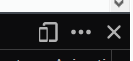

# Responsive Design

## I. Responsive design ?

Depuis la création du web, l'appareil le plus rependu servant à naviguer sur la toile a toujours été l'ordinateur. Cependant avec l'émergence de l'internet mobile, les habitudes de consommation ont changé. 

Les utilisateurs ont envie de pouvoir naviguer sur un site aussi bien sur leur smartphone, leur tablette que sur leur ordinateur. De ce fait un nouvel enjeu pour les développeurs et les designer est apparu : la nécessité de faire un site qui s'affiche correctement sur les différents appareils, ceci afin de pouvoir garantir une expérience utilisateur optimale peu importe les modes de consommation.

Pour répondre à ce besoin, il existe deux grandes solutions :

- Recréer une version du site qui s'affichera correctement sur chaque type d'appareil
- Créer un site dont l'affichage va s'adapter en fonction de l'appareil qui souhaite l'afficher


La première solution semble efficace mais elle est en réalité très coûteuse et énergivore sur le long terme.

Pour illustrer le problème, imaginez cette situation :

Bienvenu au début des années 2000. Vous créez un blog pour votre club de sport préféré. La particularité de ce blog est d'être un site statique, c'est-à-dire que l'on ne souhaite pas travailler avec des bases de données pour stocker de l'information.

En d'autres termes, notre blog sera une succession de page HTML avec du CSS et peut-être une pincée de JavaScript pour créer des animations.

Dans un premier temps, tout se passe bien : vous créez vos pages HTML avec votre contenu. Vous y ajoutez votre CSS  et vous mettez en ligne (_déployer_, dans le jargon du développement informatique) votre site web super optimisé pour les ordinateurs avec écran 4/3 (rappelez-vous ce sont les écrans au format carré).

Quelques années plus tard, on vous annonce qu'un nouveau type d'écran est sorti : le format 16/9 (format rectangulaire). Vous vous dites bien que ce serait génial de pouvoir utiliser le même HTML, mais la mise en page avec le CSS utilisée pour la version 4/3 ne fonctionne pas du tout sur le 16/9: les images débordent, les titres sortent de l'écran.

C'est un vrai carnage...

Donc, la mort dans l'âme, vous recréez un second site spécial 16/9 où juste le CSS différera de la première version du site web 4/3. 

Quelques semaines plus tard, un de vos collègues vous annonce qu'il y a un truc génial qui vient de sortir : il est maintenant possible d'aller sur internet depuis son téléphone. Ce serait génial si l'on pouvait accéder à votre blog depuis ce nouveau genre de terminal.

Scrupuleux comme vous êtes avant de dire quoi que ce soit vous allez vérifier si une des version précédemment créée (la version 4/3 ou 16/9) peut bien fonctionner sur téléphone. 

Bardaf (_équivalent belge du `patatra`_), vous avez bien fait de vérifier car aucune des deux versions n'est satisfaisante pour une utilisation sur téléphone.

Donc vous commencez à recréer une autre version du même blog...

Vous pensiez en avoir fini ? En fait non, le président de votre club préféré décide de laisser sa place à Mr Poulpe et Mr Poulpe aimerait vraiment, mais vraiment, que son nom remplace le nom de l'ancien président.

Vous êtes donc partis pour changer, sur ***TOUTES*** les versions du site, le nom du président. Que de boulot pour Mr Poulpe ...

Et là, astucieux et fénéant commme tous les développeurs doivent l'être, vous avez une illumination. Vous vous dites que peut-être il existe une autre solution : avoir un seul site internet qui s'adaptera à tous les écrans ou du moins aux formats d'écran les plus rependus (16/9, 4/3, smartphone paysage / portrait et tablette).

Ce qui voudrait dire qu'avec cette solution, en cas de changement de contenu, vous n'auriez besoin que de changer à un seul endroit le nom de Mr Poulpe. 

Gain de temps et d’énergie.

Cette seconde solution s'appelle le `Responsive design` . Ici plus de distinction entre la version mobile et la version ordinateur (`Desktop`)  au niveau du contenu. Le CSS se charge d'afficher correctement le même contenu sur tout les supports.

Dans le cadre de ce cours, nous allons approfondir un peu ce grand sujet qu'est le `Responsive Design`

## Mise en place du projet

Pour commencer, nous allons créer un nouveau dossier nommé `responsive design` et y ajouter notre `index.html` dans lequel nous allons copier-coller le contenu suivant  :

```html
<!DOCTYPE html>
<html lang='fr'>
  <head>
    <meta charset='UTF-8'/>
    <title>Responsive Design</title>
    <!-- il manque qqch ici -->
  </head>
  <body>
    <!-- C'est ici que tout va se jouer -->
  </body>
</html>

```
En plus, nous allons créer le fichier `styles.css`. Une fois ceci fait, nous allons connecter le fichier CSS au ficher HTML. Si vous ne vous souvenez plus de comment faire, je vous invite à relire le cours `CSS 101`.

Nous allons aussi ajouter à la même hauteur que le fichier HTML, le dossier `images` qui contiendra toutes nos images.

### Un petit détail de zoom.

Avant que le responsive ne devienne quelque chose de répandu, la seule astuce que possédait les téléphones mobiles pour afficher un site trop grand à afficher était de dézoomer un maximum afin que tout le site web puisse rentrer dans ce tout petit écran.  

Idée habile mais pas glorieuse car ce dézoom excessif rendait les textes trop petits pour être lu. La technique employée alors était d'autoriser le navigateur sur téléphone de zoomer à certains endroits pour permettre à l'utilisateur de lire des choses spécifiques.

En fait ici, ce comportement ne nous intéresse pas et nous allons le désactiver en rajoutant une balise à l'intérieur du `<head>` de notre fichier HTML.

Rajoutons donc ceci :

```HTML
<meta name='viewport'
      content='width=device-width, initial-scale=1.0, maximum-scale=1.0' />
```


## II. Une question de règle

**Tout d'abord un peu de vocabulaire :**

Pour atteindre notre objectif, nous allons avoir besoin de quelque chose portant le nom étrange de `Media Queries`. Ces `Media Queries` auront pour but de dire au CSS d'appliquer des règles différentes au même HTML en fonction de l'appareil sur lequel l’utilisateur va afficher le site web. 

Ainsi on pourra par exemple dire que "si l'écran du navigateur est inférieur à 300px, affiche le fond en rouge, tandis que si l'écran est supérieur ou égal à 300px alors le fond sera vert"

De cette manière, pas besoin d'avoir différentes versions du HTML pour chaque mode d'affichage (`mobile`, `tablette` ou `ordinateur`)

Ces `Media Queries` sont en réalité juste un petit ajout supplémentaire au CSS que l'on connaît déjà

### Plongeons dans une media query 

Au niveau syntaxe, une `Media Query` (le singulier de _Media Queries_) aura toujours la même structure

```css
@media TYPE_DE_MEDIA CONDITIONS {
    
    //CSS à appliquer
}
```

Par exemple :

```css
@media only screen and (max-width: 400px) {
  body {
    background-color: #F09A9D; /* Rouge */
  }
}
```
Cette règle indiquera au CSS d'afficher un fond rouge si le site web est affiché sur un écran et que la taille de l'écran est inférieure à 400px.

Voilà vous savez tout sur les ` Media Queries` ...

En réalité, je ne vous mens pas tant que ça, faire du responsive, ce n'est pas plus compliqué que d'écrire quelques  `Media Queries` pour indiquer le CSS qui est spécifique à chaque média. Ainsi l'on pourra apporter des modifications spécifiques au CSS en cas d'affichage sur tablette, sur smartphone et même sur écran géant si l'on a besoin. (Imaginez un site web sur un écran de cinéma ..... :-D)

Pour vous donner un aperçu ajouter ce code à notre fichier `styles.css`. 

```css
* {
  margin: 0;
  padding: 0;
  box-sizing: border-box;
}

/* Styles pour le mobile*/
@media only screen and (max-width: 400px) {
  body {
    background-color: #F09A9D; /* Rouge */
  }
}

/* Styles pour les tablettes */
@media only screen and (min-width: 401px) and (max-width: 960px) {
  body {
    background-color: #F5CF8E; /* Jaune */
  }
}

/* Styles pour ordinateur */
@media only screen and (min-width: 961px) {
  body {
    background-color: #B2D6FF; /* Bleu */
  }
}

```

Ouvrez votre navigateur, et amusez vous à redimensionner votre navigateur et regarder le fond du site changer de couleur en fonction de la taille du navigateur.

De la magie ? non des media queries !!!

## Quelques notes sur le design

Généralement, une équipe qui construit un site internet, ou plus largement une application, n'est pas composée uniquement de développeurs mais comprend d'autres métiers super importants. Parmi ceux-ci, l'on compte la présence d'un designer UI/UX .

Ici, on précise que notre designer à deux casquettes et doit s'occuper aussi bien de l'UX que de l'UI. 

Ces deux acronymes sont super importants et définissent deux éléments qui vont conditionner l'adoption de notre site web par l'utilisateur.

Quand on écrit `UX` ( `User Experience`, _expérience utilisateur en français_), on parle d'une science qui a pour but de réfléchir à créer une application qui sera facile à appréhender pour l'utilisateur. 

Une application qui sera intuitive et simple à utiliser. Pour ce faire le designer UX va réfléchir à où placer les menu, les boutons importants etc...


Le designer `UI` (`User Interface`, _Interface utilisateur_ en français) va plus réfléchir à rendre le site web joli et agréable à l’œil et va donc s’intéresser plus aux couleurs, à la police d'écriture etc...


__Pourquoi faire la distinction ?__

Et bien simplement car parfois l'UI et l'UX peuvent avoir des objectifs opposés. Il est tout à fait possible d'avoir un site moche mais hyper compréhensible par l'utilisateur et, de la même manière, il est possible d'avoir un site superbe mais où l'utilisateur n'arrive pas à trouver le lien lui permettant de contacter la secrétaire médicale. Ce qui est très bête pour un site de prise de rendez-vous médicaux ...


En tant que développeur, notre job c'est d'implémenter la vision de l'UI et de l'UX du designer

### Choisir le moment où ça casse 

"Dites, comment puis-je définir à quel moment je dois créer une `Media Query` ?"

Bonne question Johan !

En effet, il existe des centaines de différentes tailles d'écran. Nous, notre but n'est pas de céer une `Media Query`  pour garantir un affichage parfait au pixel près sur un modèle de smartphone précis mais de garantir qu'il s'affichera correctement pour un scope d'appareil dont l'écran sera compris entre tant de px et tant de px de largeur par exemple 

### Mobile first development

Actuellement, une pratique en vogue est de commencer par le design mobile avant de penser à la version ordinateur de bureau.  Cette pratique est surtout liée au fait que, selon les statistiques, un utilisateur aura plus tendance à consulter un site internet via son téléphone que sur son ordinateur. 

L'autre objectif est aussi de pouvoir maximiser la quantité de CSS qui pourra être réutiliser pour les différents layout (_mode d'affichage_, en français)


Pour faire la partie pratique en suivant cette règle, rajoutons ce code à l'intérieur de la balise `<body>` présente dans notre fichier `index.html`

```html
<div class='page'>
  <div class='section menu'></div>
  <div class='section header'>
    
  </div>
  <div class='section content'>
    
  </div>
  <div class='section sign-up'>
    
  </div>
  <div class='section feature-1'>
    
  </div>
  <div class='section feature-2'>
    
  </div>
  <div class='section feature-3'>
    
  </div>
</div>
```

Ajouter ceci au fichier `styles.css`. Faites attention de le placer entre les `media queries` créées et la règle du sélecteur universel `*`

```css
.page {
  display: flex;
  flex-wrap: wrap;
}

.section {
  width: 100%;
  height: 300px;
  display: flex;
  justify-content: center;
  align-items: center;
}

.menu {
  background-color: #5995DA;
  height: 80px;
}

.header {
  background-color: #B2D6FF;
}

.content {
  background-color: #EAEDF0;
  height: 600px;
}

.sign-up {
  background-color: #D6E9FE;
}

.feature-1 {
  background-color: #F5CF8E;
}

.feature-2 {
  background-color: #F09A9D;
}

.feature-3 {
  background-color: #C8C6FA;
}


```

Dans ce bout de code, on commence par définir les styles communs à toutes les versions pour n'avoir qu'à modifier des choses spécifiques à chaque autre version (ex : la couleur de fond). Ces modifications spécifiques se feront donc via les `Media Queries`

Au bout du compte, notre fichier `CSS` ressemble à ceci :

```css
* {
  margin: 0;
  padding: 0;
  box-sizing: border-box;
}
.page {
  display: flex;
  flex-wrap: wrap;
}

.section {
  width: 100%;
  height: 300px;
  display: flex;
  justify-content: center;
  align-items: center;
}

.menu {
  background-color: #5995DA;
  height: 80px;
}

.header {
  background-color: #B2D6FF;
}

.content {
  background-color: #EAEDF0;
  height: 600px;
}

.sign-up {
  background-color: #D6E9FE;
}

.feature-1 {
  background-color: #F5CF8E;
}

.feature-2 {
  background-color: #F09A9D;
}

.feature-3 {
  background-color: #C8C6FA;
}

/* Styles pour le mobile*/
@media only screen and (max-width: 400px) {
  body {
    background-color: #F09A9D; /* Rouge */
  }
}

/* Styles pour les tablettes */
@media only screen and (min-width: 401px) and (max-width: 960px) {
  body {
    background-color: #F5CF8E; /* Jaune */
  }
}

/* Styles pour ordinateur */
@media only screen and (min-width: 961px) {
  body {
    background-color: #B2D6FF; /* Bleu */
  }
}
```

Maintenant si vous réduisez votre navigateur à un moment l'affichage mobile devrait s'afficher correctement. Regardez cette mise en page tout en colonne !

### On passe à table(-ette) !

Pour le mode tablette, notre designer aimerait quelque chose de spécial. Au lieu d'avoir une mise en page toute en colonne, il aimerait que le bloc `signup` (_s'enregistrer_ , en français) et que les blocs `feature` (_fonctionnalités_, en français) ne forment plus une colonne avec un élément mais forment une grille de 2X2 éléments.

Pour ce faire, remplaçons le style existant `/* Styles pour les tablettes */` dans notre fichier CSS par ceci : 


```css
/* Styles tablette */
@media only screen and (min-width: 401px) and (max-width: 960px) {
  .sign-up,
  .feature-1,
  .feature-2,
  .feature-3 {
    width: 50%;
  }
}
```

Avec cette `media query`, on cible les écrans ayant une taille comprise entre 401px et 960px. Si un écran possède une taille inférieure à 401px, alors ce sera les règles "générales" (celle définies en haut du fichier) qui prendrons le relai.

Pour les écrans dont la largeur est supérieure à 960px, nous allons voir ça dans une minute.

### Et la version ordinateur de bureau _(marche aussi avec les ordinateur de chambre et de salon ....)_

Ici, ça va être un peu particulier car nous souhaitons qu'à partir de 960px, le site garde une taille fixe même si la taille de l'écran augmente. Notre objectif va donc être de définir une largeur maximale et de centrer notre site en utilisant la propriété `margin : 0 auto` (équivalent de `margin-left: auto` et `margin-right: auto`)

Pour ce faire,  dans le fichier `styles.css` remplacer les `/* Styles pour les ordinateur*/` par ceci :


````css
/* Desktop Styles */
@media only screen and (min-width: 961px) {
  .page {
    width: 960px;
    margin: 0 auto;
  }
  .feature-1,
  .feature-2,
  .feature-3 {
    width: 33.3%;
  }
  .header {
    height: 400px;
  }
}
````

Je vous propose de rafraîchir votre navigateur et d'admirer le résultat.

N'hésitez pas à redimensionner votre navigateur pour apprécier les différentes mises en page. 

Vous vous rendez compte : 3 mises en page différentes sans toucher une seule ligne de CSS !!

### Un point sur les outils.

Les navigateurs actuels possèdent une fonctionnalité qui permet de passer en vue `responsive` facilement pour inspecter les différentes mises en page du site internet.  Pour l'activer, ouvrez les `dev tools` ( clic droit sur le navigateur -> `inspecter l'élement`).

Une fois dans les `dev tools`, cliquer sur cette icône située en haut à gauche des dev tools :



Ou pour être un pro, sur Firefox, utiliser le raccourci clavier `Ctrl + Shift + M`


## Projets

Et voici qui clôture ce cours sur le `responsive`. 

Pour continuer à pratiquer, voici quelques exercices

1) Reprendre le projet réalisé dans le cours sur les `Flexbox` et de le rendre responsive !

2) Rendre responsive le site "John Doe"


## Sources : 

Cette leçon se base en partie  sur le cours  `responsive-design` disponible sur le site internet `internetingishard.com`. Merci à  son auteur ` Oliver James`