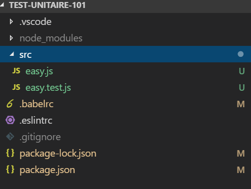
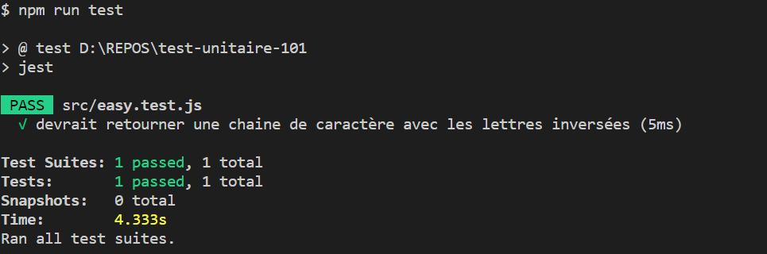
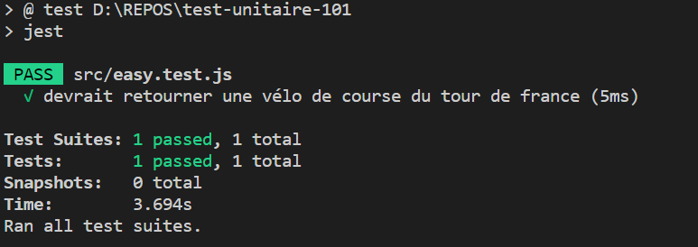
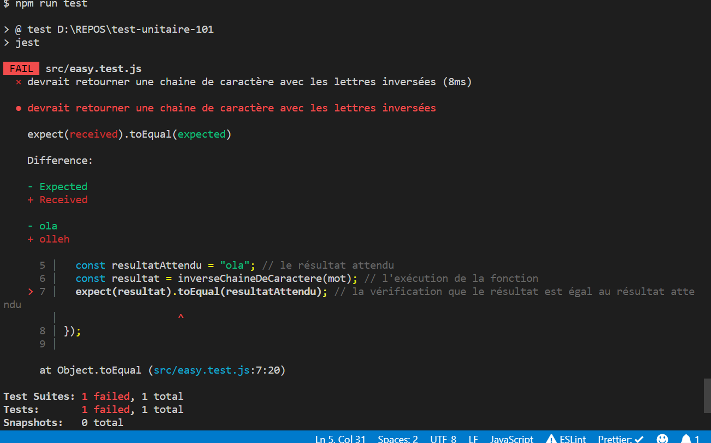
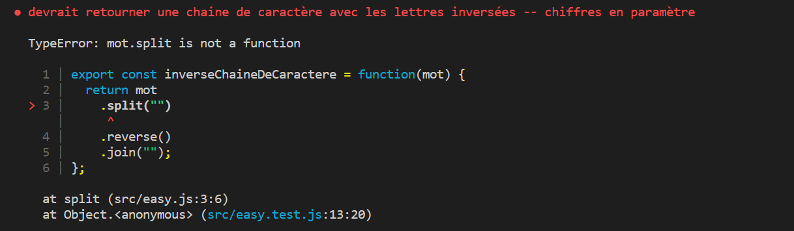

# Les tests unitaires 101

## De la fatalité du temps,

Bonjour jeune développeur!

Depuis quelques semaines, vous avez certainement déjà écrit un nombre significatif de ligne de code.

Avec ces lignes de codes vous avez formé des fonctions et ces fonctions ont peut-être déja formées des fonctionalitées entières et plus tard, je n'en doute pas, certaines de ces fonctionalitées formeront de réelles applications!

Cependant dans cette aventure nous avons un ennemi qui revient souvent dans nos vies : le temps.

En plus de nous donné des cheveux blanc, le temps à aussi tendance à détériorer, modifier, faire disparaître de choses.

Une loi immuable est aussi valable en informatique :

Ce qui fonctionne aujourd'hui ne fonctionnera pas nécessairement demain.

Ici rien de magique ou de dramatique :

Un logiciel évolue au fil du temps en lui ajoutant/ratirant du code et malheureusement il est fort probable que ces modifications peuvent engendrers des bugs et autres type de joyeusetés.

Evidement, nous le faisons jamais de manière volontaire mais parfois en touchant à un endroit, nous allons cassé quelque chose à l'autre bout du logiciel.
Ceci parfois même sans nous en rendre compte.

**Sapristi! Peut-être qu'il existe des moyens d'éviter au maximum cette fatalité ?**

Et oui tout à fait!

Aujourd'hui nous allons voir un moyen assez populaire dans le monde de l'informatique pour éviter ce scénario catastrophe: les test unitaire.

## Test unitaire, késako ?

Pour éviter que notre code ne fonctionne plus ou soit dégrardé au fil du temps, cela serait assez chouette d'avoir quelque chose qui nous garantisse régulièrement que celui-ci fonctionne.

Encore mieux, cela serait choutte que l'on soit averti que, en cas de modification de notre code, celui-ci risque de casser quelque chose ailleurs dans le logiciel.

Pour arriver à nos fins, une solution "humaine" est tout à fait possible : nous pouvons imaginer qu'à chaque fois que nous modifions une ligne de code, nous allons cliquer sur touts les boutons de chaque page de notre application pour tester que celle-ci fonctionne encore comme désiré.

Superbe idée vous trouvez pas?

....

Non en fait, ce n'est pas terrible comme idée car cette solution risque vite de montrer ces limites.

Pour un site internet d'une seule page et de 5 bouttons, c'est encore faisable mais imaginé faire ça pour un site comme `mozilla.org` ou encore `microsoft.com` qui comprennent chacun des centaines de pages contenant elles-mêmes des dizaines de fonctionnalitées chacunes, cela devient vite inconsevable.

Et c'est là que le magie des `tests unitaires` intervient.

Petite édtion expresse : **Un test unitaire c'est un bout de code qui va tester notre code.**

Hola, du calme, en réalité un test unitaire ne va pas tester à chaque fois toutes les lignes de notre code. Le but d'un test, est de tester une toute petite portion de notre code (une unité).

Et c'est grâce à la somme de tous ces tests unitaires que tout notre code sera entièrement testé.

## Objectifs d'un test unitaire :

Un test unitaire va avoir plusieures objectifs :

- nous aider à déterminer ce que l'on attend de notre unité de code
- executer notre code
- vérifier que le résultat obtenu correspond bien à ce que l'on attendait

Maintenant que vous avez la base théorique en matière de test un peu de pratique.

## La pratique :

### Prérequis :

Pour cette partie nous allons avoir besoin de plusieures choses :

- quelque chose qui nous permet d'écrire nos tests
- quelque chose qui nous permet de lancer nos test
- quelque chose qui nous permet de vérifier si notre test est correct

- du code à tester, évidement :-)

Des utilitaires ( ou bibliothèque de code -- `library`, en anglais) qui permettent de faire tout ceci, il en existe un bon nombre sur internet. Je pourrai citer `mocha`, `ava` , `jest`, ... par exemple.

A vrai dire, sauf quelques subtilitées, ces `library` répondent toutes à nos besoins.

Pour la suite de la leçon, nous allons utiliser une `library` développée par `Facebook` nommée `Jest`

Pour vous faciliter la vie, je ne vais pas vous demander de télécharger ou de récupérer quoi que ce soit car j'ai crée pour vous un petit projet qui contient déjà tout ce dont nous avons besoin dont cette fameuse librairie.

Si vous ne le trouvez pas, n'hésitez pas à le demander à votre formateur.

Donc ouvrons le projet `test-unitaire-101` et que voyons nous?

Normalement vous devriez voir une organisation de fichier qui devrait ressembler à ceci :



Concentrons nous sur le dossier nommé `src`.

Il contient 2 fichiers : `easy.js` et `easy.test.js`

`easy.js` a pour objectif de contenir tout le code que l'on souhaite tester.

Tandis que `easy.test.js` va contenir tout le code qui viendra tester toutes les fonctions que l'on souhaite tester.

Pour commencer ouvrons `easy.js` et qu'y voyons nous ?

A l'intérieur de ce fichier se trouve une fonction nommée `inverseChaineDeCaractere` .

Nous le voyons, cette fonction prend un `mot` en paramètre (probablement une `chaîne de caractère`, `string` en anglais) et retourne ce même `mot` après lui avoir appliqué un traitement.

Décortiquons ce traitement :

- on sépare chaque lettre de cette chaine de caractère en utilisant la fonction `split`
- on inverse (`reverse`, en anglais) l'ordre du tableau de lettres obtenu grâce à la chaîne de caractère `split`
- on recolle toutes les lettres inversées ensemble pour reconstituer la chaîne de caractère avec le fonction `join` (joindre).

```javascript
export const inverseChaineDeCaractere = function(mot) {
  return mot
    .split("")
    .reverse()
    .join("");
};
```

Maintenant ouvrons le fichier `easy.test.js` et décortiquons son contenu :

Ligne 1 : nous avons ceci

```javascript
import { inverseChaineDeCaractere } from "./easy";
```

Ici nous importons la fonction `inverseChaineDeCaractere` depuis la fichier `./easy` (il n'est pas nécessaire de mettre le `.js` lorsque l'on importe un fichier Javascript dans un autre fichier Javascript)

Ligne 3 : commence un bloc de fonction qui se termine à la ligne 8. Ce bloc de fonction est lié à la fonction `it`

`it` est une fonction super importante car c'est elle qui va indiquer à `jest` qu'il doit exécuter les fonctions comprise dans ce bloc de fonction.

Ici le `it` indique à `Jest` qu'il doit exécuter la fonction `inverseChaineDeCaractere` placée à la ligne 6;

Aussi `it`, a un autre rôle fondamentalle : il permet d'expliquer à quoi sert notre test.

Regardez le premier paramètre de la fonction `it`. Ce paramètre est la chaîne de caractère `"devrait retourner une chaine de caractère avec les lettres inversées"` qui exprime ce que l'on va trouver dans ce test.

Continuons notre exploration du fichier `easy.test.js`

En ligne 4 : nous avons le mot que l'on passera en paramètre de notre fonction (voir ligne 6).

En ligne 5 : nous avons le résultat que nous souhaitons obtenir de notre fonction

En ligne 6 : nous avons l'éxcution de la fonction que nous souhaitons tester.

En ligne 7 : nous vérifions (`expect`) que le `résultat` obtenu est `égal` (`equal`, en anglais) au résultat attendu.

Généralement, un teste unitaire va suivre ce même schéma :

- d'abord on défini le résultat que l'on souhaite obtenir
- on exécute la fonction
- on vérifie si le résultat obtenu correspond au résultat attendu.

Maintenant vérifions que nous nous sommes pas trompé en lançant notre test.

Pour ce faire ouvrez votre `terminal`, placez vous dans le dossier du projet `test-unitaire-101` et lancer cette commande :

`npm run test`

vous devriez obtenir cet écran dans votre terminal :


Cet écran signifie que `Jest` à bien lancer nos tests et plus spécifiquement celui nommé `devrait retourner une chaine de caractère avec les lettres inversées`.

Maintenant pour vérifier ce que je vous avais dis plus haut, faisons deux petites expériences :

### Experience 1

- Modifions la chaine de caractère `devrait retourner une chaine de caractère avec les lettres inversées` par `devrait retourner une vélo de course du tour de france`

et relançons les tests avec la commande
`npm run test`

et regardez le résultat :

.

La description du test à changée!

Bon revenons en arrière car maintenant le description du test ne nous aide pas du tout à comprendre ce que fait le test.

### Experience 2

A la ligne numéro 5 du fichier `easy.test.js`, modifier la valeur de la variable `resultatAttendu` de `olleh` à `ola`.

et relançons les tests avec la commande
`npm run test`

.

Ici `Jest` nous indique que le `résultat obtenu` (ola) ne correspond plus au `résultat attendu` (olleh)

Ici deux solutions : modifier le fonction dans le fichier `easy.js` pour qu'il retourne `ola` ou modifier le résultat attendu pour qu'il corresponde au résultat reçu.

Ici dans notre cas précis, la solution numéro 2 semble la meilleure.

Modifions donc le `ola` pour qu'il redevienne `olleh`

Super, nous avons donc un premier test qui fonctionne.

Cependant ce test ne vérifie qu' un cas particulier de notre fonction et ce cas est plutôt un cas "tout va bien".

En effet nous simulons, un cas où l'on passe comme paramètre à notre fonction une chaine de caractère, ce qu'à priori devons passer à notre fonction pour qu'elle fonctionne.

Maitenant imaginons qu'un développeur peu scrupuleux passe un nombre à notre fonction.

Que ce passerait-il ?

Pour tester ce cas, nous pouvons écrire un autre test juste en dessous du précédent.

Nous pouvons écrire un test ayant cette forme

```javascript
it("devrait retourner une chaine de caractère avec les lettres inversées -- chiffres en paramètre", () => {
  const mot = 968;
  const resultatAttendu = "869"; // le résultat attendu
  const resultat = inverseChaineDeCaractere(mot); // l'exécution de la fonction
  expect(resultat).toEqual(resultatAttendu); // la vérification que le résultat est égal au résultat attendu
});
```

Ici nous avons modifier la paramètre passé à la fonction ainsi que le résultat attendu pour que cela corresponde à notre cas.

Copiez-coller ce test à la suite de l'autre et lancer la commande `npm run test`

Et vous devriez obtenir cet écran d'erreur dans votre terminal :

.

Ici `Jest` nous indique que notre test à échoué et nous explique pourquoi : `mot.split is not a function`

En français, Jest nous dit qu'il ne peut pas appliquer la fonction `split` sur notre mot.

En effet, rappelez-vous dans notre test nous avons passer un nombre comme paramètre. Or, `split` est une fonction qui ne s'applique qu'uniquement aux chaînes de caractères. Comme notre paramètre est un nombre, Javascript net peut éxécuter la fonction sur le paramètre.

Comment pouvons nous corriger cette erreur?

Peut-être que nous pourrions modifier la fonction `inverseChaineDeCaractere` pour qu'elle puisse aussi gérer des chiffres en paramètres.

Cependant, nous devons rester cohérant.

Ici nous écrivons une fonction qui retourn une chaine de caractère.

Cela serait étrange qu'un coup elle retourne une chaîne de caractère et qu'un autre coup elle retourne un nombre.

Comme ceci par exemple :

```
nombre -> chaine de caractère | nombre // peu cohérant
```

Une autre solution serait p-e d'écrire une fonction dédiée qui prendre un nombre et retournerait un nombre. Un peu comme ceci.

```
nombre -> nombre
```

Cependant, cela nous ferait écrire une autre fonction. Nous préférons adapter la fonction existante.

Je pense que ici le mieux serait donc de faire en sorte que notre fonction puisse accepter un nombre ou une chaîne de caractère et retourne une chaîne de caractère.

Elle aurait donc cette signature :

```
nombre|chaine de caractère -> nombre
```

Donc l'idée serait de faire en sorte que la fonction `split` incluse dans notre fonction `inverseChaineDeCaractere` reçoive toujours une chaîne de caractère.

Ouvrons donc le fichier `easy.js` et regardons ce que l'on peut faire.

Notre objectif serait de convertir en début de fonction la paramètre `mot` en chaîne de caractère pour que dans TOUS les cas le reste du traitement puisse s'effectuer.

Pour ce faire nous pouvons utiliser la fonction `.toString()` fourni par le language JavaScript.

Allons y et modifions notre fonction pour qu'elle ressemble à ceci :

```javascript
export const inverseChaineDeCaractere = function(mot) {
  return mot
    .toString()
    .split("")
    .reverse()
    .join("");
};
```

Après avoir modifier cette fonction relancer les tests.

Normalement tout devrait fonctionner :-).

## Un peu plus de pratique.

Juste en bas de ce paragraphe, vous trouverez quelque fonctions assez simple. Le but pour vous serait d'écrire les tests correpondant aux fonctions.

Pour réaliser l'exercice, réecrivez les fonctions dans le fichier `easy.js` et les tests dans le fichier `easy.test.js`

Vous trouverez en bas de chaque fonction, un exemple de test pour vous aider.

```javascript
const motContientLettre = function(mot, lettreAchercher) {
  const tableauLettre = mot.split("");

  // la fonction indexOf va chercher la position d'un élément (index)
  // dans un tableau. Si l'élement n'existe pas, la fonction retourne -1, sinon
  // elle retoure la position de l'élement (un chiffre)
  return tableauLettre.indexOf(lettreAchercher) !== -1;
};
```

Un test possible :

```javascript
it("doit retourner true", function() {
  const mot = "hello";
  const resultat = motContientLettre(mot, "h");

  expect(resultat).toBe(true);
});
```

Ici vous pouvez écrire un test qui garanti que la fonction retourne `false` si la lettre que l'on recherche ne se trouve pas dans la mot passé en paramètre.

```javascript
// Cette fonction va compter le nombre de fois qu'un mot contient
// la lettre que l'on recherche
const compteLesLettres = function(mot, lettreACompter) {
  let nombreOccurence = 0;
  const tabelauLettres = mot.split("");

  for (let index = 0; index < tabelauLettres.length; index++) {
    if (tableauLettre[index] === lettreACompter) {
      nombreOccurence += 1;
    }

    return nombreOccurence;
  }
};
```

Exemple de test :

```javascript
it("doit retourner 2", function() {
  const mot = "papa";
  const resultat = compteLesLettres(mot, "a");

  expect(resultat).toEqual(2);
});
```

Ici vous pouvez écrire des tests pour

- vérifier que la fonction retourne bien 0 si le mot ne contient pas la lettre que l'on recherche

- compte bien le nombre d'espace si notre mot en contient (par exemple, avec "j'apprend les test", la fonction devrait retourner le chiffre 3)

## Conclusion

Voilà grâce à cette leçon, vous avez fait vos premiers pas dans le monde des test unitaire. Un test unitaire est donc un moyen de vérifier que notre code fonctionne aussi bien dans les cas "tout va bien" que dans les cas limites (passage d'un nombre à la place d'une chaîne de caractère en paramètre de fonction, par exemple).

Un test unitaire, permet aussi de detecter si un changement dans le code n'a pas d'impact caché.

En développement informatique, les tests sont primordiaux car il garantisse que le code fonctionne et à été pensé pour durer.

Il est donc réellement importante de se familiriser avec la rédaction de test unitaire en en écrivant pour vos fonctions dès que vous en avez l'occasion.

Les tests unitaires ne sont qu'un type de test ayant des objectifs précis. Il existe d'autres types de tests comme les test d'intégration ou des test dit `end to end` qui vont vérifié qu'un ensemble de fonctionalitées intéragissent entre elles.

Il serait trop long d'expliquer ces tests ici mais je ne doute pas que vous en entendrez parler d'ici peu de temps.

Dans tous les cas, dans peu de temps, nous allons appronfondire ce sujet dense que sont les tests !

A très vite donc !
