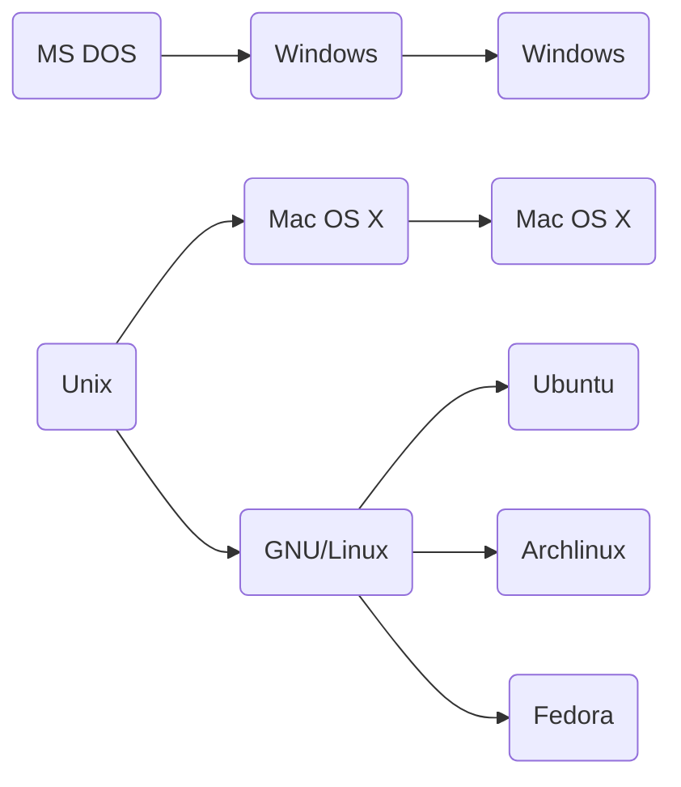

# Linux et son utilisation
Ce tutorial présente l'OS linux. Après une introduction sur son histoire et son ffonctionnement, il traite de ce qui en fait sa force !
* La console et les lignes de commandes
* La gestion des process et des ecutions sur l'ordinateur
* Les scripts pour l'automatisation de tache

## Linux
### Mais bon sang, c'est QUOI Linux ?
On oppose souvent linux a windows, comme son alternative. Mais que fait réellement windows sur un ordinateur ? On peut voire que c'est l'un des premier nom qui s'affiche au démarrage sur un ordinateur. C'est donc une étape nécessaire a toutes les autres utilisations de l'ordinateur (dans notre cas, le développement web) mais aussi les applications, les lectures de videos...

_Pourquoi y-a-t-il besoin de windows avant de pouvoir faire le reste ?_
Parce que… votre ordinateur a besoin d'une sorte de « superlogiciel » qui soit le chef d'orchestre. C'est lui qui doit gérer la mémoire de votre ordinateur, la répartir entre tous les programmes. Il fait le lien entre votre matériel (carte graphique, mémoire, imprimante) et vos logiciels. Et c'est un sacré boulot !
Ce « superlogiciel » s'appelle le  **système d'exploitation** (OS). Windows est donc un système d'exploitation.
Et Linux en est un autre ! Il est réputé entre autres pour sa sécurité et pour ses mises à jour plus fréquentes que Windows. On peut noter deux différences majeures entre windows et Linux :
* Contrairement à Windows, Linux est un OS open-source, c'est à dire que les lignes de codes de ce "super logiciel" sont publique, et que l'utilisation de celui-ci est gratuite. De plus les différentes mise a jour de celui-ci se font par une communauté, tout le monde peut contribuer et ce sont ensuite les contributeurs les plus fréquent qui valident les contributions.
* Linux se veut "plus proche de la machine". C'est à dire que le lien entre l'ordinateur (mémoire, process, ressources...) et les applications ayant réellement lieux (logiciel, browser, jeux, lecteurs videos) où mêmes les actions liées (installation,  déplacement de fichiers...) sont beaucoup plus encapsulé dans un OS comme windows. On dit parfois que Linux permet de reprendre le contrôle de son ordinateur.

### Un peu d'histoire

## La console et les command line
### La console
generalitées
### Saisir une commande
man idée de commande, le fonctionnement des options
### File system et manipulation
mv/cp/touch/ls/cd...
### Droit d'acces
Explication et comment les éditer
### Editeur texte de console
Nano et Vi
### Extraire et filtrer des données
grep/wc/find/cut et les idées qui vont avec
### Rediriger les flux
std et stdr et les chevrons

## Process programmes et executions
### L'activité du system
top etc...
### Processus et PID
kill un process...

## Le bash et le scripting
### Les inputs et les variables
### Les conditions
### Les boucles
### Les fonctions

## Cheatsheet
Il faut toujours faire `man` pour en savoir plus sur les commandes, notamment les options utilisable et les arguments qui peuvent etre fournis.
Les commandes peuvent avoir différenteqs utilisations selon les options utilisées et les arguments donnés. La commande `man` détaille les différentes utilisations.
