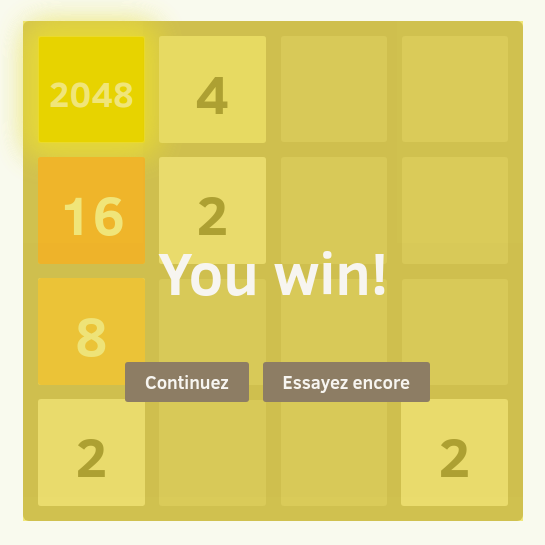
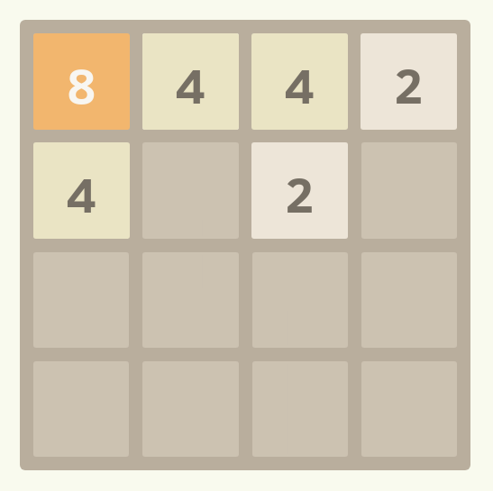
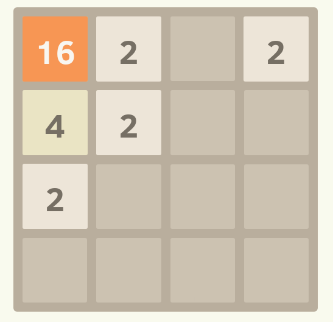

# Projet 2048

L'objectif de ce projet va être de créer un jeu qui a connu un grand succès il y a quelques temps

## Les règles du jeu

*2048* se joue sur une grille de 4 × 4 cases, avec des tuiles de couleurs et de valeurs variées (mais toujours des puissances de deux, c'est à dire 2, 4, 8, 16, 32, 64...) 

* Le jeu commence avec 2 tuiles "2" disposées aléatoirement sur la grille

* Chaque fois qu'une des flèches directionnelles est touchée, toutes les tuiles bougent dans le sens indiquée
* Chaque fois qu'une des flèches directionnelles est touchée, une tuile d'une valeur de 2 ou 4 apparaît sur une case vide
* Quand deux tuiles avec le même nombre se touchent, suite à un mouvement, elles **fusionnent**
* Le joueur gagne lorsqu'il crée une tuile "2048"

> Vous êtes encouragés à créer des animations pour les mouvements des tuiles, la création de nouvelles tuiles après les mouvements ainsi que pour les fusions de tuiles, ce sera bien plus sympatique!

Par exemple,

Si on appuie sur la flèche gauche du clavier, on obtient:

Puis, si on répète la même opération, on obtient:

