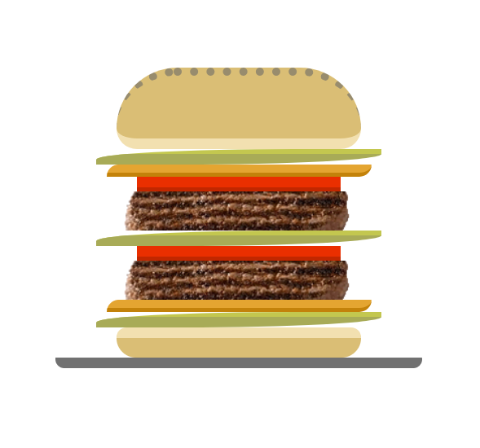
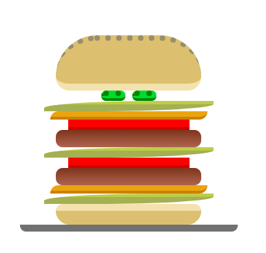
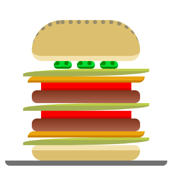

# Les Challenges du Burger !

## Challenge 1: le burger sans cornichon
Nous allons essayer de créer un burger en HTML et CSS

Voici à quoi cela doit ressembler:

Il comprend du pain, de la salade, du cheddar, de la viande et des tomates.

Pour la viande, n'hésitez pas à utiliser la photo de steak pour plus de réalisme!

## Challenge 2: les cornichons

Vous commencez à avoir un joli burger !

Mais jusqu’à maintenant vous avez toujours ajouté des éléments les uns en-dessous des autres. Maintenant essayez d’ajouter des cornichons, des oignons ou ce que vous voulez d’autre. La seule chose que je vous demande c’est qu’ils ne soient plus positionner les uns en-dessous des autres mais les uns à côté des autres !

Voici notre objectif:

Le truc qui serait VRAIMENT cool aussi c’est que, si jamais vous rajouter un troisième cornichon, il se mette bien à côté sans tout casser !

Du style :

