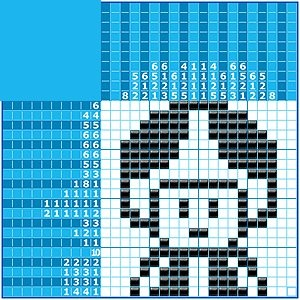
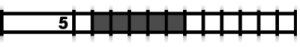
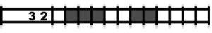

# Projet Hanjie

## Présentation

Le Hanjie est un jeu qui ressemble à cela

Le but d'un *hanjie* (ou *picross*) est de **noircir** les cases de la grille afin de faire apparaître une image, un dessin. Les nombres à gauche et au-dessus de la grille sont là pour vous aider à déduire les cases à noircir.

Les nombres présents à **gauche** de la grille indiquent le nombre de cases à noircir sur la **ligne** correspondante.
Les nombres présents en **haut** de la grille indiquent le nombre de cases à noircir sur la **colonne** correspondante.

Un nombre **5** devant une ligne (à gauche de la grille donc) indique que vous devez noircir cinq cases **à la suite** sur cette même ligne.

La séquence **3 2** signifie qu'il y a **au moins** une case vide entre une séquence de trois cases à noircir et une autre séquence de deux cases à noircir.

## Objectif

L'objectif de ce projet est de créer une page Web permettant à un utilisateur de résoudre un *hanjie*. 

Dans le même dossier que ce fichier, vous trouverez un dossier texte qui contient un objet JavaScript avec les nombres de chaque ligne et colonne. Cela correspond au *hanjie* à résoudre

La page web devra comprendre plusieurs fonctionnalités:

- Le clic gauche permettra de noircir la case
- Le clic droit permet de la griser légèrement ou d'y mettre une croix (lorsqu'on est sur qu'il n'y a pas de case noire)
- Un bouton permettant à l'utilisateur de valider sa réponse. et message lui indiquera si le *hanjie* est réussi

La page web peut être simple visuellement, mais n'hésitez pas à la rendre attrayante.

***Fonctionnalités bonus***

* Complétion des lignes résolues par des cases grisées ou avec une croix
* Vérification après chaque clic que la ligne ou la colonne est toujours résolvable 
* Chronomètre (on n'a pas encore vu la notion de temps, mais vous devriez pouvoir trouver des informations sur DevDocs)